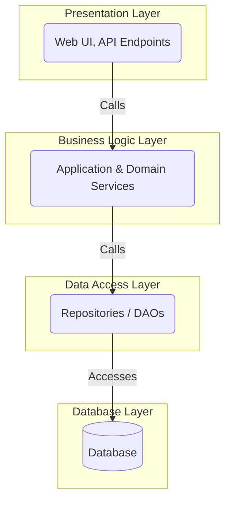

# Layered Architecture

The **Layered Architecture** is one of the most common and foundational [[software-architecture/architectural-styles/|architectural style]], serving as the default starting point for many applications. It organizes an application by grouping related functionality into stacked, horizontal layers. Each layer has a specific responsibility and should ideally only communicate with the layer directly below it.

* **Core Principles:**
    * **[[soc|Separation of Concerns]]:** Each layer is responsible for a specific concern (e.g., presentation, business logic, data access). This makes the system easier to understand and maintain.
    * **Unidirectional Dependency (The Dependency Rule):** Dependencies flow in a single direction, downwards. A higher layer can call services in a lower layer, but a lower layer must not have any knowledge of the layers above it.
    * **Abstraction:** Each layer hides its implementation details from the layers above it, communicating only through a well-defined interface.

---

## Key Components and Communication Flow

The most common model is the four-layer architecture, but there can be more or fewer layers.

1.  **Presentation Layer:** This is the highest layer. It handles the user interface and presentation logic. It's responsible for converting data into a displayable format for the user and managing user interactions (mouse clicks, form submissions, etc.). Examples: a web interface (HTML/CSS/JavaScript), a mobile app, or even a **REST** API for an external client.
2.  **Business Logic / Service Layer:** This layer contains the core of the application and the business rules. It orchestrates the various operations and processes requests from the presentation layer. This is where the application's intelligence resides. Examples: **Java Spring** services, **Node.js** controllers, or any logic that transforms data or manages transactions.
3.  **Data Access Layer (DAL) / Persistence Layer:** This layer is responsible for communication with databases or any other data source. It manages data persistence and retrieval. Objects in this layer are often called **Repositories** or **Data Access Objects (DAOs)**. Examples: **Spring Data**, **Hibernate**, **JPA** for Java, or ORMs like **Sequelize** for Node.js.
4.  **Database Layer:** The lowest layer. It is the physical implementation of the database. It has no knowledge of the higher layers. Examples: **PostgreSQL**, **MySQL**, **MongoDB**, **Redis**.

**Typical Data Flow:** 

- A user request starts at the **Presentation Layer**
- It is processed by the **Business Logic Layer** (which may interact with third-party services or other layers)
- Which in turn uses the **Data Access Layer** to interact with the **Database Layer**. The response follows the reverse path.

---

## Strict vs. Relaxed Layering (Closed vs. Open Layers)

A key architectural decision is whether to make the layers "closed" or "open":

*   **Closed Layers (Strict Layering):** This is the ideal. A layer can **only** communicate with the layer directly below it. For example, the Presentation Layer is not allowed to call the Data Access Layer directly; it must go through the Business Logic Layer. This enforces maximum [[soc|separation of concerns]] but can create the "sinkhole" anti-pattern if a layer provides no value.

*   **Open Layers (Relaxed Layering):** A layer is allowed to bypass the layer directly below it and communicate with any lower layer. For example, the Presentation Layer might be allowed to call a simple read service in the Data Access Layer directly if no business logic is required. This can improve performance and reduce boilerplate but weakens the architectural separation and can lead to a loss of control.

---

## Advantages and Technical Challenges

* **Advantages (Benefits):**
    * **Clear and Familiar Design:** It is a very common and easy-to-understand model for most developers, which accelerates onboarding.
    * **High Testability:** Each layer can be tested in isolation by mocking the dependencies of the lower layer. For example, you can test the **Service Layer** without having to connect to a real database.
    * **Ease of Maintenance:** Changes in one layer (for example, a database change in the **Data Access Layer**) have a minimal impact on other layers, as long as the layer's interface remains stable.
    * **Reusability:** Components in a layer can often be reused by different clients or other parts of the application.

* **Challenges:**
    * **The "Sinkhole" Anti-Pattern:** A common pitfall is when layers become mere pass-throughs that add no value (e.g., a Business Logic Layer that only calls the Data Access Layer without performing any logic). This adds unnecessary complexity and boilerplate without providing any benefit.
    * **Performance Overhead:** In a strictly layered architecture, each request must pass through multiple layers, which can introduce latency. This is a trade-off for maintainability.
    * **Monolithic Nature:** Traditionally, all layers are deployed as a single unit, which can lead to the challenges of a [[monolithic]] architecture (e.g., coarse-grained scaling, risky deployments).
    * **Risk of "Leaky" Abstractions:** It can be difficult to prevent details from lower layers (like database-specific exceptions) from "leaking" into higher layers, which violates the [[soc|separation of concerns]].

---

## Related Patterns, Concepts and Variations

* **2-Tier vs. N-Tier:** The basic 2-tier model (client and database) has evolved into the **N-Tier** model, which inserts intermediate layers (like the **Business Logic Layer**) to improve flexibility and scalability.
* **[[modular-monolith|Modular Monolith]]:** A layered architecture is often the foundation for a monolith. The [[modular-monolith|Modular Monolith]] pattern is an evolution of this, where the application is divided into independent modules, each with its own layers. This improves maintainability and prepares the ground for a potential future migration to [[microservices|microservices]].
* **[[hexagonal|Hexagonal Architecture (Ports and Adapters)]]:** Although not a direct derivation, the hexagonal architecture is inspired by the principle of [[soc|separation of concerns]]. It is often used to decouple the application's core (**Business Logic**) from external technologies (databases, user interfaces, etc.) by using **ports** and **adapters**.
* **[[microservices|Microservices]]:** While [[microservices|microservices]] are a distributed architecture, each individual microservice can be structured using a simple layered model to manage its own business logic and persistence. The **Layered Architecture** remains a very relevant internal [[software-architecture/design-patterns/|design pattern]] within a [[microservices|microservices]] context.

For a detailed comparison of how patterns like Hexagonal and Onion evolved from the layered model, see [[modern-application-architectures|Modern Application Architectures]].

## **Resources & links**

### **Articles**

1.  **[Understanding the Layered Architecture Pattern: A Comprehensive Guide](https://dev.to/yasmine_ddec94f4d4/understanding-the-layered-architecture-pattern-a-comprehensive-guide-1e2j)**

    This comprehensive guide explores the strengths and weaknesses of layered architecture. It covers common anti-patterns, use cases, and best practices to avoid pitfalls, which is very relevant for an architect.

2.  **[Revisiting 3-layer architecture for today's needs](https://medium.com/@albert.llousas/revisiting-3-layer-architecture-for-todays-needs-e190be8f49e5)**

    This Medium article offers a modern look at 3-layer architecture. It focuses on its relevance and challenges in the current development context, which is a very useful perspective for understanding how this architecture adapts to contemporary needs.

---

### **Videos**

1.  **[Lesson 158 - Layered Architecture](https://www.youtube.com/watch?v=Y9bKZCYxFuI)**

    This video focuses on layered architecture and discusses its strengths and weaknesses. It is particularly useful for architects as the author shares his perspective on the relevance of this architecture, explaining when to use it and when to avoid it.

2.  **[N Tier Architecture Tutorial - Software Design](https://www.youtube.com/watch?v=xJC7ItRoEbw)**

    This is a complete and very clear tutorial on N-Tier architecture, a variation of layered architecture. It is ideal for an experienced developer as it explains the principles, the roles of each layer, and provides concrete examples for designing scalable and maintainable applications.