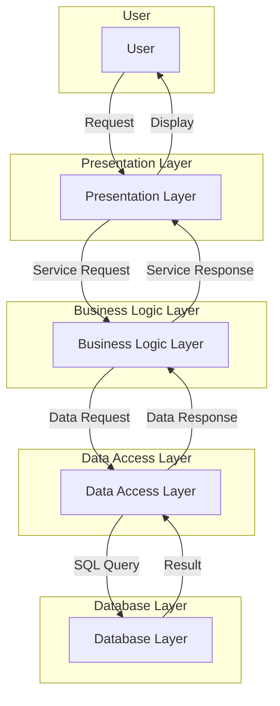

# Layered Architecture

The **Layered architecture** is an architectural pattern that structures an application by grouping components with similar functionalities into horizontal layers. Each layer has a specific responsibility and can only communicate with the layer directly beneath it. This clear separation of concerns is the main strength of this model.

* **Core Principles:**
    * **Separation of Concerns:** Each layer has a well-defined role, which makes the system easier to understand, maintain, and evolve.
    * **Unidirectional Dependency:** A higher layer can invoke the services of a lower layer, but the reverse is not allowed. This principle creates a strict and predictable hierarchy.
    * **Abstractions:** Each layer exposes a well-defined set of services (often via an API) to the layer above it, hiding the implementation complexities of the lower layer.

---

## Key Components and Communication Flow

The most common model is the four-layer architecture, but there can be more or fewer layers.

1.  **Presentation Layer:** This is the highest layer. It handles the user interface and presentation logic. It's responsible for converting data into a displayable format for the user and managing user interactions (mouse clicks, form submissions, etc.). Examples: a web interface (HTML/CSS/JavaScript), a mobile app, or even a **REST** API for an external client.
2.  **Business Logic / Service Layer:** This layer contains the core of the application and the business rules. It orchestrates the various operations and processes requests from the presentation layer. This is where the application's intelligence resides. Examples: **Java Spring** services, **Node.js** controllers, or any logic that transforms data or manages transactions.
3.  **Data Access Layer (DAL) / Persistence Layer:** This layer is responsible for communication with databases or any other data source. It manages data persistence and retrieval. Objects in this layer are often called **Repositories** or **Data Access Objects (DAOs)**. Examples: **Spring Data**, **Hibernate**, **JPA** for Java, or ORMs like **Sequelize** for Node.js.
4.  **Database Layer:** The lowest layer. It is the physical implementation of the database. It has no knowledge of the higher layers. Examples: **PostgreSQL**, **MySQL**, **MongoDB**, **Redis**.

**Typical Data Flow:** A user request starts at the **Presentation Layer**, is processed by the **Business Logic Layer** (which may interact with third-party services or other layers), which in turn uses the **Data Access Layer** to interact with the **Database Layer**. The response follows the reverse path.

---

## Advantages and Technical Challenges

* **Advantages (Benefits):**
    * **Clear and Familiar Design:** It is a very common and easy-to-understand model for most developers, which accelerates onboarding.
    * **High Testability:** Each layer can be tested in isolation by mocking the dependencies of the lower layer. For example, you can test the **Service Layer** without having to connect to a real database.
    * **Ease of Maintenance:** Changes in one layer (for example, a database change in the **Data Access Layer**) have a minimal impact on other layers, as long as the layer's interface remains stable.
    * **Reusability:** Components in a layer can often be reused by different clients or other parts of the application.

* **Challenges:**
    * **Monolithic Deployment:** Traditionally, all layers are deployed together, which can lead to typical [[monolithic|monolith]] problems: deployment complexity and difficulty in scaling each layer independently.
    * **Performance:** Each request must pass through multiple layers, which can introduce additional latency. Solutions like "layer skipping" can improve performance, but they compromise the strict separation and can create unexpected dependencies.
    * **Tightly Coupled Layers:** Although the architecture encourages separation, there can be strong coupling between adjacent layers if the design is not well-managed.
    * **Increasing Complexity:** While the model is simple at its core, adding new features can complicate the interactions between layers and make the architecture rigid.

---

## Variations and Derived Architectures

* **2-Tier vs. N-Tier:** The basic 2-tier model (client and database) has evolved into the **N-Tier** model, which inserts intermediate layers (like the **Business Logic Layer**) to improve flexibility and scalability.
* **Hexagonal Architecture (Ports and Adapters):** Although not a direct derivation, the hexagonal architecture is inspired by the principle of separation of concerns. It is often used to decouple the application's core (**Business Logic**) from external technologies (databases, user interfaces, etc.) by using **ports** and **adapters**.
* **[[microservices|Microservices]]:** While [[microservices|microservices]] are a distributed architecture, each individual microservice can be structured using a simple layered model to manage its own business logic and persistence. The **Layered Architecture** remains a very relevant internal design pattern within a [[microservices|microservices]] context.

## **Resources & links**

### **Articles**

1.  **[Understanding the Layered Architecture Pattern: A Comprehensive Guide](https://dev.to/yasmine_ddec94f4d4/understanding-the-layered-architecture-pattern-a-comprehensive-guide-1e2j)**

    This comprehensive guide explores the strengths and weaknesses of layered architecture. It covers common anti-patterns, use cases, and best practices to avoid pitfalls, which is very relevant for an architect.

2.  **[Revisiting 3-layer architecture for today's needs](https://medium.com/@albert.llousas/revisiting-3-layer-architecture-for-todays-needs-e190be8f49e5)**

    This Medium article offers a modern look at 3-layer architecture. It focuses on its relevance and challenges in the current development context, which is a very useful perspective for understanding how this architecture adapts to contemporary needs.

---

### **Videos**

1.  **[Lesson 158 - Layered Architecture](https://www.youtube.com/watch?v=Y9bKZCYxFuI)**

    This video focuses on layered architecture and discusses its strengths and weaknesses. It is particularly useful for architects as the author shares his perspective on the relevance of this architecture, explaining when to use it and when to avoid it.

2.  **[N Tier Architecture Tutorial - Software Design](https://www.youtube.com/watch?v=xJC7ItRoEbw)**

    This is a complete and very clear tutorial on N-Tier architecture, a variation of layered architecture. It is ideal for an experienced developer as it explains the principles, the roles of each layer, and provides concrete examples for designing scalable and maintainable applications.