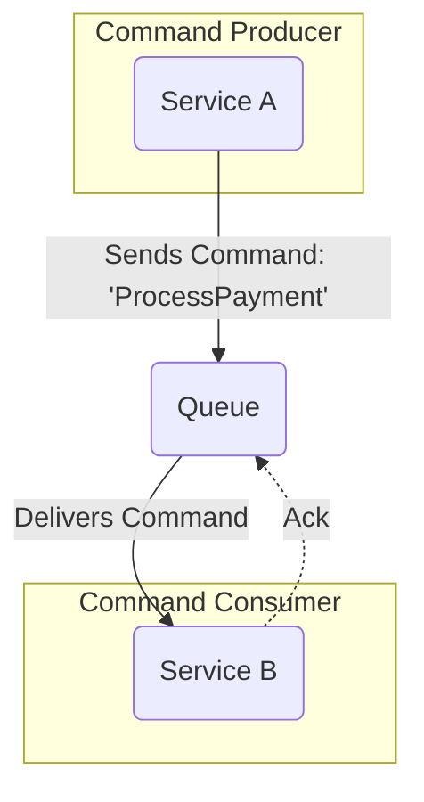

# Message-Driven Architecture (MDA)

**Message-Driven Architecture** (MDA) is a style of designing applications where components communicate by sending and receiving messages asynchronously. Instead of components calling each other directly (like in a [[client-server]] model), they interact through a **[[broker|message broker]]**, which acts as an intermediary.

This approach creates a system that is highly decoupled, resilient, and scalable, as components (or services) do not need to be available at the same time to communicate.

---

## Core Concept: The Message

A "message" is a self-contained package of data sent from one component to another. In MDA, messages are the sole means of communication. Their asynchronous nature is the defining characteristic of this style.

There are two primary types of messages, and the type used defines the architectural flavor:

1.  **Command:** A message that is an **[[imperative-programming|imperative]] instruction** telling a service to perform a specific action (e.g., `ProcessPayment`, `GenerateReport`). Commands are typically directed at a single receiver.

2.  **Event:** A message that is a **[[declarative-programming|declarative]] notification** that a significant state change has occurred (e.g., `OrderShipped`, `UserRegistered`). Events are facts about the past, broadcast to any component that might be interested.

This distinction is crucial, as it leads to the two main flavors of Message-Driven Architecture.

---

## Flavors of Message-Driven Architecture

### 1. Command-Driven Architecture

This model is organized around processing **commands**. It is ideal for distributing tasks, managing workflows, or offloading heavy processing from a primary application thread.

The communication is typically **one-to-one**, using the **[[message-queue|Point-to-Point (Queue)]]** messaging model. A producer sends a command to a queue, and a single consumer from a pool of workers picks it up and processes it.

*   **Description:** The diagram shows a `Producer` sending a `Command` message to a `Queue`. A single `Consumer` receives the command, executes the requested action, and sends an acknowledgment back to the queue.
*   **Typical Data Flow:**
    1.  A producer sends a specific command (e.g., `ProcessPayment`) to a queue.
    2.  The message broker ensures the command is delivered to exactly one consumer.
    3.  The consumer executes the action specified by the command.
    4.  After successful execution, the consumer sends an acknowledgment (`Ack`) to the queue, which then deletes the message.

> For a more in-depth look at this model, see the dedicated document on **[[point-to-point-messaging]]**.

### 2. Event-Driven Architecture (EDA)

This is the most well-known and powerful flavor of MDA. In this model, the system is organized around reacting to **events**. It is ideal for building highly decoupled, scalable, and responsive systems where multiple components need to react to a single occurrence.

The communication is typically **one-to-many**, using the **[[publish-subscribe|Publish-Subscribe (Topic)]]** model. A producer publishes an event to a topic, and it is broadcast to all interested subscribers.

> For a complete and detailed explanation of this style, its topologies (Choreography vs. Orchestration), and its specific challenges, please see the dedicated document on **[[event-driven|Event-Driven Architecture]]**.

---

## General Advantages of MDA

* **High Scalability:** The system can handle load spikes by adding more consumers without impacting producers. The broker acts as a buffer.
* **Improved Resilience:** If a consumer fails, the message is not lost and can be re-processed. The overall system continues to function.
* **Greater Flexibility:** Producers and consumers can be developed, deployed, and updated independently.

## General Challenges of MDA

* **Complexity:** Adding a message broker introduces a new layer of infrastructure and potential points of failure.
* **Debugging:** It can be more difficult to trace a message's flow through multiple asynchronous services.
* **Eventual Consistency:** Since communication is not instantaneous, the system is eventually consistent, which may not be suitable for all use cases.

---

## **Resources & links**

### **Articles**

1.  **[Event-Driven vs. Message-Driven](https://medium.com/@alexdorand/event-driven-vs-message-driven-5f476d5932b4)**
    This article on Medium provides an engaging exploration of the two architectures, illustrated with a futuristic use case. It offers a practical look at when to apply each approach, highlighting that both have unique strengths and can coexist in modern systems.

2.  **[An analysis of the basic concept of Message-Driven, Event-Driven and Streaming](https://www.alibabacloud.com/blog/an-analysis-of-the-basic-concept-of-message-driven-event-driven-and-streaming_599521)**
    This Alibaba Cloud article is a deep technical analysis that explains the fundamental concepts of all three models: Message-Driven, Event-Driven, and Streaming. It highlights the technical differences and appropriate use cases for each model.

### **Videos**

1.  **[Mastering Message Driven Systems - Types of Messages](https://www.youtube.com/watch?v=krSek1PMwAA)**
    This video discusses the different types of messages (commands, events, requests, and responses) and their roles in message-driven systems. It helps clarify the concepts that define this model.

2.  **[Message Driven Architecture to DECOUPLE a Monolith](https://www.youtube.com/watch?v=bxGkavGaEiM)**
    In this video, the author explores how message-driven architecture can be used to decouple a [[monolithic|monolith]]. It serves as a practical example that shows the implementation and benefits of this model in an architectural migration scenario.