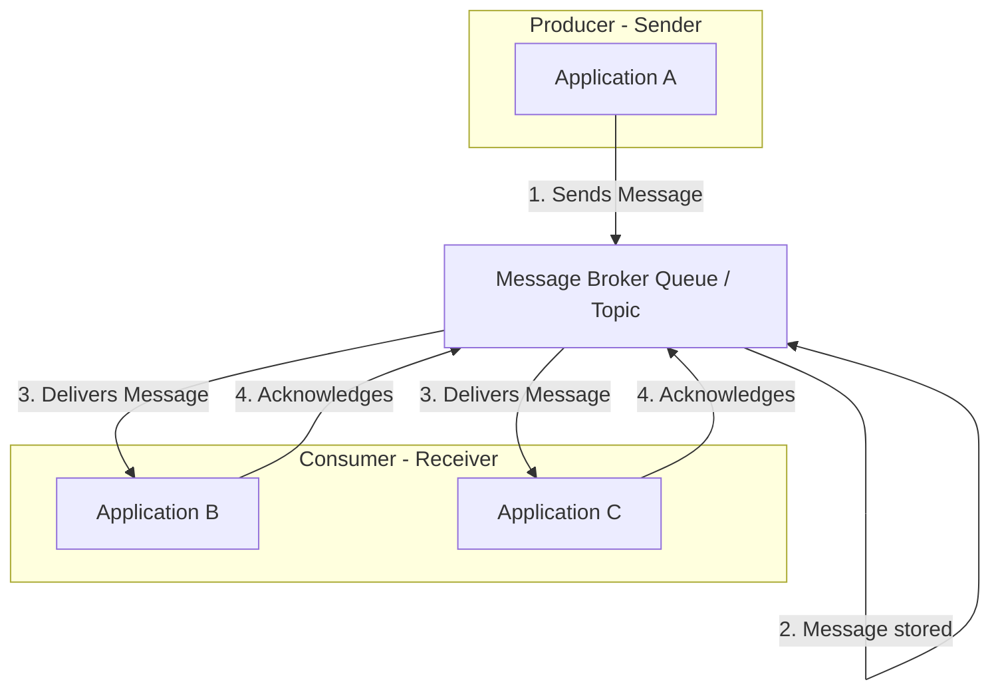

# Message-Driven Architecture

**Message-Driven Architecture** is an [[software-architecture/architectural-styles/|architectural style]] based on **asynchronous communication** between its components via messages. Unlike synchronous models like the [[client-server|Client-Server]] architecture where the caller waits for an immediate response, components in a message-driven system do not call each other directly. They exchange messages through an intermediary, a **message broker**. This temporal and spatial decoupling allows components to operate independently.

* **Core Principles:**
    * **Asynchronous Communication:** Components send messages and continue their work without waiting for a response. The receiver processes the message at its own pace.
    * **Decoupling:** Message producers (senders) and consumers (receivers) have no direct link. They only need to know the message format and the communication channel, which promotes flexibility and resilience.
    * **Scalability & Resilience:** The decoupling and asynchronous nature of the model allow for easy addition of new consumers to handle increased load (horizontal scalability). If a consumer fails, messages remain in the broker and can be processed by other available consumers, increasing resilience.
    * **Durability:** Messages are typically stored in the message broker until successfully processed, ensuring they are not lost in case of a failure.

---

## Key Components and Communication Flow

1.  **Producer:** The component that creates and sends a message. This could be a **web application**, a [[microservices|microservice]], an **IoT device**, or any other system.
2.  **Message Broker:** The central point of the architecture. It is a specialized service that stores, routes, and manages messages. Common examples include **RabbitMQ**, **Apache Kafka**, or cloud services like **Google Cloud Pub/Sub** and **AWS SQS/SNS**.
3.  **Channel (Queue/Topic):** The channel through which messages are exchanged. A **Queue** is for point-to-point communication, where only one consumer reads the message. A **Topic** is for the **Publish/Subscribe** model, where multiple consumers can receive a copy of the same message.
4.  **Consumer:** The component that receives and processes a message. It subscribes to one or more channels and acts on the message content.

**Typical Data Flow:**
* The producer publishes a message to a Queue or Topic in the message broker.
* The broker receives and durably stores the message.
* The consumer, listening to the channel, receives the message.
* The consumer processes the message and sends an **acknowledgement** to the broker to confirm processing.
* The broker deletes the message once it has been successfully processed by the consumer.

---

## Advantages and Technical Challenges

* **Advantages (Benefits):**
    * **High Scalability:** The system can handle load spikes by adding more consumers without impacting producers. The broker acts as a buffer.
    * **Improved Resilience:** If a consumer fails, the message is not lost and can be re-processed. The overall system continues to function.
    * **Greater Flexibility:** Producers and consumers can be developed, deployed, and updated independently, using different technologies, as long as the message format is respected.
    * **[[event-driven|Event-Driven]] Systems:** This model is ideal for building event-based systems, where an action in one part of the system (e.g., an order being placed) triggers actions in other parts (e.g., shipping notification, inventory update).

* **Challenges:**
    * **Complexity:** Adding a message broker introduces a new layer of infrastructure and potential points of failure. Monitoring and managing system consistency become more complex.
    * **Ordering and Duplicates:** Guaranteeing the exact order of messages and avoiding duplicate messages can be a technical challenge, especially in high-availability systems.
    * **Latency:** While the model is fast, asynchronous communication can introduce unpredictable latency between message sending and receiving. This model is not suitable for operations requiring an immediate response.
    * **Debugging:** It can be more difficult to trace a message's flow through multiple asynchronous services and diagnose a problem.

---

## Variations and Derived Architectures

**Message-Driven Architecture** is a fundamental concept that gives rise to several patterns:

* **Queue-Based:** The simplest model, where messages are sent to a **Queue** and consumed by only one of the available consumers. This is commonly used for **task processing** or **load balancing**.
* **Publish-Subscribe (Pub/Sub):** Messages are sent to a **Topic** and can be distributed to multiple consumers (subscribers) simultaneously. This is ideal for broadcasting events.
* **Event Sourcing:** An architectural pattern that uses an **Event Log** as the single source of truth. Every state change in the application is captured as an event (message) and stored in an ordered sequence. This log is then used to rebuild the state or trigger other actions.
* **[[microservices|Microservices]] with Event Bus:** Many **[[microservices|Microservices]]** architectures use an **Event Bus** (a type of message broker) to enable communication and decoupling between services.

This architectural style is a cornerstone of modern distributed systems and **Cloud-Native** architectures, providing the essential flexibility and resilience for large-scale applications.

---

## Differences and Relations with [[event-driven|Event-Driven Architecture]]

Although the terms are often used interchangeably, **[[event-driven|Event-Driven Architecture]]** is an **architectural style** or **design paradigm**, while **Message-Driven Architecture** is a **communication pattern** that serves as its foundation. An **event** is a specific type of **message**.

* **A Dependent Relationship:** **Message-Driven Architecture** is a **means** of implementing an **[[event-driven|Event-Driven Architecture]]**. Therefore, an **[[event-driven|Event-Driven]]** system is often **Message-Driven** for its asynchronous communication, but a **Message-Driven** system is not necessarily **[[event-driven|Event-Driven]]**.

### **Key Differences**

| Characteristic | Message-Driven Architecture | [[event-driven|Event-Driven Architecture]] |
| :--- | :--- | :--- |
| **Communication Purpose** | To execute a specific command or action by a known recipient. | To notify that a fact or state has occurred without caring about recipients. |
| **Message Nature** | Can be a **command** or an **event**. There's a clear intent. | Represents a past fact (`a fact about something that has occurred`). |
| **Coupling** | Less coupled than [[client-server|Client-Server]], but the producer may have some knowledge of the consumer (e.g., it knows it's sending a message for a specific task). | **Very loosely coupled**. Producers and consumers are completely decoupled and unaware of each other. |
| **Communication Model**| Based on **Queues** (message queues). A message is generally consumed by a single consumer. | Based on **Topics** (Pub/Sub model). An event can be consumed by multiple interested consumers. |
| **Use Case** | **Sequential task processing** and **transactional workflows** where reliability and order are critical. | **Real-time systems**, **IoT**, and **[[microservices|microservices]]** where multiple independent actions must be triggered by a single event. |

---

## **Links and Resources**

### **Articles**

1.  **[Event-Driven vs. Message-Driven](https://medium.com/@alexdorand/event-driven-vs-message-driven-5f476d5932b4)**
    This article on Medium provides an engaging exploration of the two architectures, illustrated with a futuristic use case. It offers a practical look at when to apply each approach, highlighting that both have unique strengths and can coexist in modern systems.

2.  **[An analysis of the basic concept of Message-Driven, Event-Driven and Streaming](https://www.alibabacloud.com/blog/an-analysis-of-the-basic-concept-of-message-driven-event-driven-and-streaming_599521)**
    This Alibaba Cloud article is a deep technical analysis that explains the fundamental concepts of all three models: Message-Driven, Event-Driven, and Streaming. It highlights the technical differences and appropriate use cases for each model.

### **Videos**

1.  **[Mastering Message Driven Systems - Types of Messages](https://www.youtube.com/watch?v=krSek1PMwAA)**
    This video discusses the different types of messages (commands, events, requests, and responses) and their roles in message-driven systems. It helps clarify the concepts that define this model.

2.  **[Message Driven Architecture to DECOUPLE a Monolith](https://www.youtube.com/watch?v=bxGkavGaEiM)**
    In this video, the author explores how message-driven architecture can be used to decouple a [[monolithic|monolith]]. It serves as a practical example that shows the implementation and benefits of this model in an architectural migration scenario.