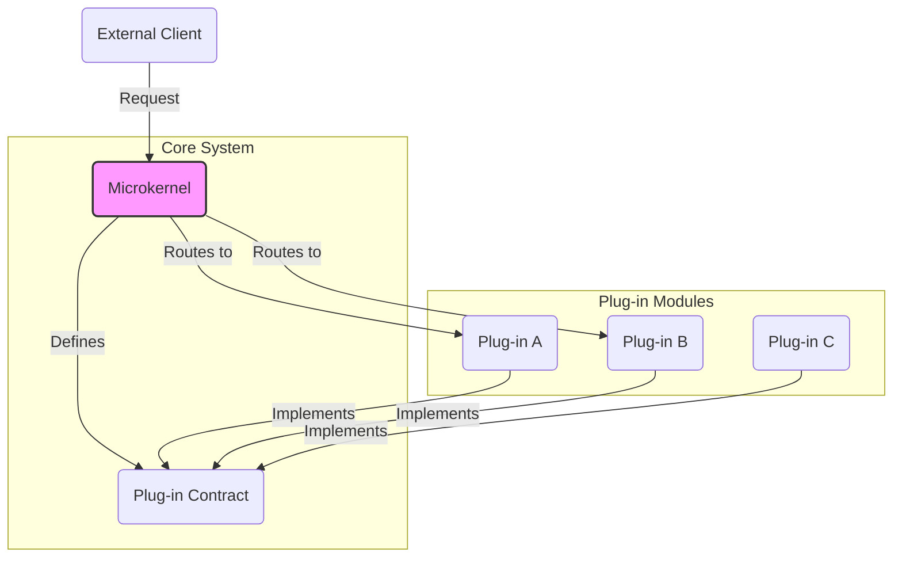

# Microkernel Architecture (Plug-in Architecture)

The **Microkernel** architecture (also known as the **Plug-in** architecture) is a powerful [[software-architecture/architectural-styles/|architectural style]] for building extensible and adaptable systems. It consists of two main parts: a minimal **core system** (the microkernel) and a set of stand-alone **plug-in modules**. The microkernel contains only the essential functionality required for the system to operate, while the plug-ins implement extended features and custom logic.

* **Core Principles:**
    * **Minimalist Core:** The microkernel is kept as small as possible. It typically handles tasks like plug-in lifecycle management, request routing, and providing a communication backbone.
    * **Extensibility through Plug-ins:** The system's functionality is extended by adding new plug-ins. These plug-ins can be added, removed, and updated independently, often at runtime.
    * **Strict Communication Contract:** Plug-ins communicate with the microkernel through a well-defined, standardized interface (a "plug-in contract"). They do not communicate directly with each other.

***

## Key Components and Communication Flow

1.  **Microkernel:** The absolute essential core of the system. Its primary jobs are to manage the plug-in lifecycle (registration, discovery) and to route requests from external clients or other plug-ins to the correct plug-in for processing.
2.  **Plug-in Modules:** Stand-alone, independent components that contain the specific application logic and features. They are completely decoupled from each other.
3.  **Plug-in Contract:** A set of standardized interfaces defined by the microkernel that all plug-ins must implement. This contract ensures that the microkernel can communicate with any plug-in in a uniform way.

***

## Advantages and Technical Challenges

* **Advantages:**
    * **Extensibility:** Easy to add new features without modifying the core system.
    * **Modularity:** Plug-ins are independent units, simplifying development, testing, and deployment.
    * **Maintainability:** The core system is minimal and stable, making maintenance easier and safer.
    * **Reliability:** Isolation of plug-ins increases the system's fault tolerance.

* **Challenges:**
    * **Complexity of Communication:** The indirect communication through the microkernel can add complexity to the design.
    * **Initial Design:** Defining the microkernel's boundaries and creating a robust plug-in API is a difficult but crucial task.
    * **Performance Overhead:** The communication layer can introduce latency compared to a [[monolithic|monolithic architecture]].

***

## Examples and Use Cases

*   **Operating Systems:** The classic example. The OS kernel provides basic services (process scheduling, memory management), while device drivers and file systems are loaded as plug-ins.
*   **Web Servers:** Servers like **Nginx** or **Apache** have a small core for handling HTTP requests, while modules (plug-ins) are used to add features like SSL, caching, or proxying.
*   **Integrated Development Environments (IDEs):** Tools like **Eclipse**, **VS Code**, or **IntelliJ** are built around a microkernel that manages the UI and file system, while support for different languages (Java, Python, etc.) is added via plug-ins.
*   **Financial Analysis Platforms:** A core platform might provide charting and data feed capabilities, while different trading strategies or analysis algorithms are implemented as separate plug-ins.

***

## **Resources & links**

### **Articles**

1.  **[Microkernel Architecture Pattern: Understanding Software Architecture Patterns](https://nerdnodes2023.medium.com/microkernel-architecture-pattern-understanding-software-architecture-patterns-3-1a22f0640118)**

    This article positions the Microkernel architecture as a natural fit for "product-based applications" and explains how this style, also known as the "plug-in" pattern, allows for an extremely flexible and extensible system by separating a basic core from optional components. It serves as an excellent practical guide for understanding this pattern's advantages and use cases.

2.  **[OS Design: Monolithic vs. Microkernel Architecture](https://learningdaily.dev/os-design-monolithic-vs-microkernel-architecture-78981dd41c49)**

    An excellent article for understanding the place of this architecture in the history of computer science. It provides a direct and well-illustrated comparison between [[monolithic|monolithic]] and **Microkernel** architectures, which is perfect for solidifying basic knowledge.

---

### **Videos**

1.  **[Microkernel Architectural Pattern | Software Architecture](https://www.youtube.com/watch?v=h3icQDMRLd8)**

    This video is part of a series on software architecture and offers a comprehensive overview of the **Microkernel** pattern. It covers the origins, examples, and pitfalls to avoid, making it a relevant resource for delving deeper into the topic.

2.  **[Lesson 160 - Microkernel Architecture](https://www.youtube.com/watch?v=rDDsP1hqKa4)**

    This video presents the **Microkernel** architecture style and its roots in operating systems. It details its strengths and weaknesses and, most importantly, provides practical advice on situations where it is a good idea to use this architecture and where it should be avoided.