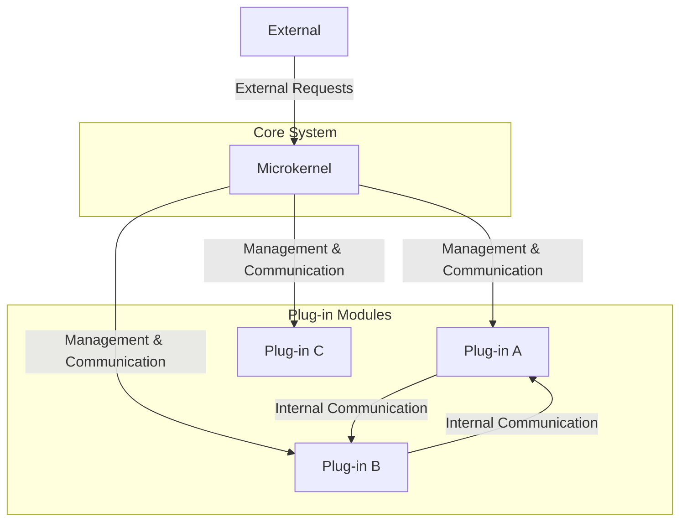

# **Microkernel Architecture**

The **Microkernel** architecture, also known as the **Plug-in architecture**, is a software design pattern that separates a small, core functionality from extended functionalities, known as plug-ins. The microkernel only manages essential functions, while plug-ins add specific features.

***

## **Core Principles**

* **Separation of Concerns:** The microkernel handles the minimal, core functions of the system, such as managing plug-ins and communication. Plug-ins contain all the application-specific logic.
* **Extensibility:** New features can be easily added by developing and deploying new plug-ins without modifying the microkernel or other existing plug-ins.
* **Isolation:** Plug-ins are isolated from each other, which improves fault tolerance and security. A failure in one plug-in should not affect the rest of the system.

***

## **Key Components and Communication Flow**

1.  **Microkernel:** The core system component that provides essential services for plug-ins, including a **plug-in registry** and communication mechanisms. It acts as a **mediator** for all interactions between plug-ins and with external systems.
2.  **Plug-in Modules:** Independent components that provide specific features or business logic. They interact with the microkernel to register their services and to communicate with other plug-ins.
3.  **External:** Any system or user outside the application that sends requests to the microkernel.

***

## **Advantages and Technical Challenges**

* **Advantages:**
    * **Extensibility:** Easy to add new features without modifying the core system.
    * **Modularity:** Plug-ins are independent units, simplifying development, testing, and deployment.
    * **Maintainability:** The core system is minimal and stable, making maintenance easier and safer.
    * **Reliability:** Isolation of plug-ins increases the system's fault tolerance.

* **Challenges:**
    * **Complexity of Communication:** The indirect communication through the microkernel can add complexity to the design.
    * **Initial Design:** Defining the microkernel's boundaries and creating a robust plug-in API is a difficult but crucial task.
    * **Performance Overhead:** The communication layer can introduce latency compared to a monolithic architecture.

***

## **Variations and Derived Architectures**

* **Operating Systems:** The core kernel manages basic functions, while features like device drivers and file systems are implemented as plug-ins.
* **Integrated Development Environments (IDEs):** A basic IDE is the microkernel, extended with plug-ins for different programming languages, debuggers, etc.
* **Web Browsers:** The browser's core rendering engine is extended with browser extensions (plug-ins) to add functionalities.

***

## **Resources & links**

### **Articles**

1.  **[Microkernel Architecture Pattern: Understanding Software Architecture Patterns](https://nerdnodes2023.medium.com/microkernel-architecture-pattern-understanding-software-architecture-patterns-3-1a22f0640118)**

    This article positions the Microkernel architecture as a natural fit for "product-based applications" and explains how this style, also known as the "plug-in" pattern, allows for an extremely flexible and extensible system by separating a basic core from optional components. It serves as an excellent practical guide for understanding this pattern's advantages and use cases.

2.  **[OS Design: Monolithic vs. Microkernel Architecture](https://learningdaily.dev/os-design-monolithic-vs-microkernel-architecture-78981dd41c49)**

    An excellent article for understanding the place of this architecture in the history of computer science. It provides a direct and well-illustrated comparison between monolithic and **Microkernel** architectures, which is perfect for solidifying basic knowledge.

---

### **Videos**

1.  **[Microkernel Architectural Pattern | Software Architecture](https://www.youtube.com/watch?v=h3icQDMRLd8)**

    This video is part of a series on software architecture and offers a comprehensive overview of the **Microkernel** pattern. It covers the origins, examples, and pitfalls to avoid, making it a relevant resource for delving deeper into the topic.

2.  **[Lesson 160 - Microkernel Architecture](https://www.youtube.com/watch?v=rDDsP1hqKa4)**

    This video presents the **Microkernel** architecture style and its roots in operating systems. It details its strengths and weaknesses and, most importantly, provides practical advice on situations where it is a good idea to use this architecture and where it should be avoided.