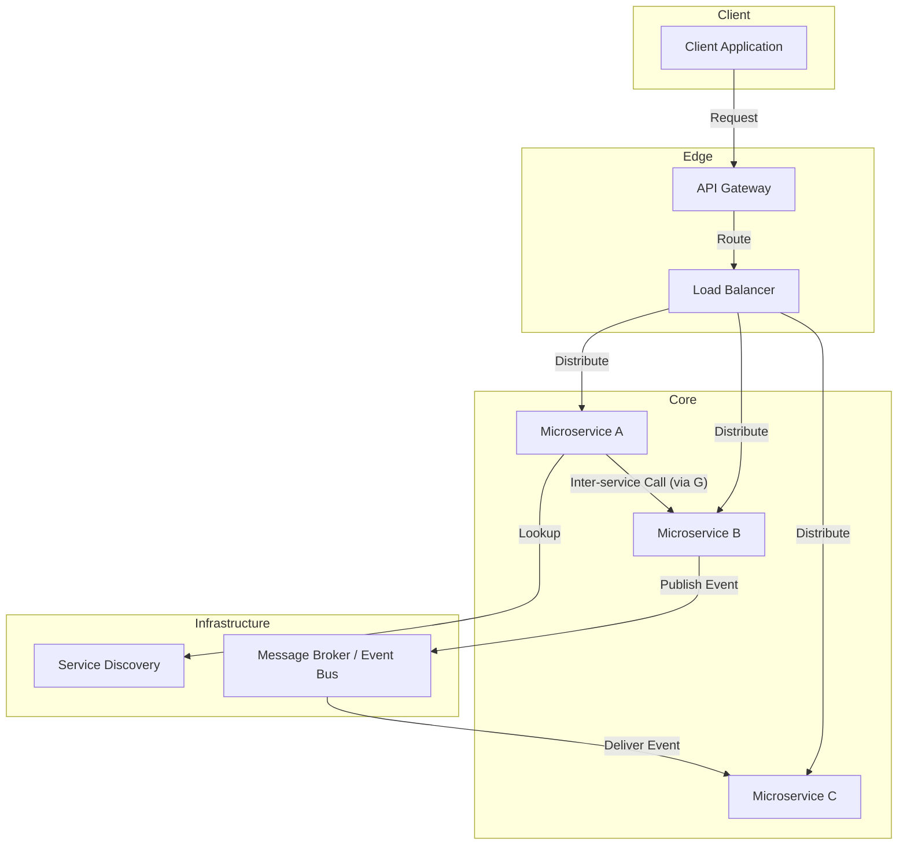

# Microservices Architecture

The **Microservices** architecture is an [[software-architecture/architectural-styles/|architectural style]] that structures an application as a collection of small, independent, and loosely coupled services. Each service is autonomous: it has its own codebase, its own business logic, and often its own database. These services communicate with each other over a **network** using well-defined APIs.

* **Core Principles:**
    * **Team Autonomy & Organizational Alignment:** The architecture is designed to enable small, autonomous teams to own and operate their services independently. This aligns the architecture with the organization's structure (**Conway's Law**), accelerating delivery.
    * **Functional Decomposition:** The application is divided into services based on specific **business domains** (e.g., an order service, a payments service, an inventory service).
    * **Decentralization & "Database per Service":** Each service is self-contained and manages its own data, typically with its own database. This ensures loose coupling and independent evolution.
    * **Automated Infrastructure:** The complexity of the architecture requires strong automation of deployment and management via **DevOps** tools (e.g., **CI/CD**, **containerization** with **Docker**, orchestration with **Kubernetes**).

---

## Key Components and Communication Flow

1.  **Client:** The starting point of the request (for example, a web browser or a mobile app). It only interacts with the API Gateway, without knowing about the individual services.
2.  **API Gateway:** A single entry point that handles client requests, authentication, and routing to the appropriate microservices. It can also manage **rate limiting**.
3.  **Load Balancer:** Distributes the incoming traffic load among different instances of the same service. This is an essential component for the **horizontal scalability** of services.
4.  **Service Discovery:** A mechanism that allows microservices to find and communicate with each other dynamically, without needing to hard-code their network addresses. Services register with a **Service Registry** and can query it.
5.  **Microservices:** The services themselves, containing the business logic. They can be developed with different technologies and languages. Their communication can be synchronous (via an API) or asynchronous (via a message broker).
6.  **Message Broker / Event Bus:** An asynchronous communication system that allows services to exchange messages or events. This model promotes **loose coupling**, as the sender does not need to know the recipients of the message.

---

### **Typical Data Flow**

The data flow in a microservices architecture is often a multi-step process, orchestrated by the intermediary components:

* The client sends an HTTP request to the **API Gateway**.
* The **API Gateway** performs initial validation and forwards the request to the **Load Balancer** for the appropriate service.
* The **Load Balancer** routes the request to one of the available instances of the target microservice.
* Microservice A (e.g., an order service) may need information from another microservice B (e.g., a product service). It uses **Service Discovery** to find the location of B and makes an API call.
* Alternatively, Microservice A can publish an **event** to the **[[broker|Message Broker]]** (e.g., "new order placed"), and Microservice C (e.g., a stock service) that is subscribed to this event, receives it and updates its state asynchronously.
* Microservice A receives the response from B, compiles its own response, and sends it back to the **API Gateway**, which ultimately forwards the final response to the client.

---

### **Communication Styles: Synchronous vs. Asynchronous**

A key architectural decision is how services communicate.

*   **Synchronous Communication (e.g., REST, gRPC):**
    *   **How it works:** The caller sends a request and waits for a response. This is a blocking call.
    *   **Pros:** Simple to understand and implement. The request-response model is familiar.
    *   **Cons:** Creates **temporal coupling**. If the called service is slow or unavailable, the calling service is blocked. Chaining synchronous calls can lead to a **distributed monolith** and cascading failures.

*   **Asynchronous Communication (e.g., Message Queues, Events):**
    *   **How it works:** The sender publishes a message or event to a broker and does not wait for a response. Other services subscribe to these messages and react to them.
    *   **Pros:** Promotes **loose coupling** and resilience. The sender doesn't need to know about the consumers, and a failure in a consumer service does not impact the sender.
    *   **Cons:** More complex to implement and debug. The eventual consistency model and the lack of a single, linear request flow can be challenging to manage.

A mature microservices architecture often uses a combination of both styles: synchronous calls for queries where an immediate response is needed, and asynchronous events for commands and updates that can be processed in the background.

---

## Advantages and Technical Challenges

* **Advantages (Benefits):**
    * **Independent Scalability:** Each service can be scaled vertically or horizontally based on its specific needs, without affecting the others.
    * **Resilience:** If one service fails, the rest of the system can continue to operate, unlike in a [[monolithic|monolithic architecture]] where a single failure can bring down the whole system.
    * **Technological Flexibility:** Teams can choose the most appropriate technologies for each service.
    * **Independent Deployments:** Teams can deploy new versions of their services autonomously, which accelerates **time-to-market** and reduces risk.

* **Challenges:**
    * **The Distributed Monolith Anti-Pattern:** The most common failure mode is creating a "distributed monolith," where services are tightly coupled through synchronous calls (chaining) or shared databases. This leads to a system with the complexity of a distributed system but none of the benefits of a monolith, as a failure in one service can still cascade and bring down others.
    * **Operational Complexity:** Managing a large number of distributed services is complex and requires **DevOps** expertise and a robust infrastructure.
    * **Data Consistency:** Maintaining data consistency across isolated databases is a major challenge. This often requires advanced patterns like **Saga** to manage distributed transactions, which adds significant complexity.
    * **Network Latency and Reliability:** All inter-service communication is a network call, which is inherently slower and less reliable than in-process calls. This must be accounted for in the design.
    * **Debugging and Monitoring:** Debugging a request flow across multiple services is much harder than in a monolith. **Distributed tracing** tools (like Jaeger or OpenTelemetry) are essential.

---

## Variations and Derived Architectures

The **Microservices** architecture is not a final architecture but an approach that is combined with other patterns.

* **[[event-driven|Event-Driven Architecture (EDA)]]:** Services communicate by emitting and consuming events via a **message broker** (e.g., **Kafka**, **RabbitMQ**). This promotes maximum decoupling.
* **[[service-mesh|Service Mesh]]:** A dedicated infrastructure layer that handles communication between services. It provides features like **security**, **observability**, and **traffic control** (e.g., **Istio**, **Linkerd**).
* **[[serverless|Serverless/Function-as-a-Service (FaaS)]]:** A variation of microservices where the service is a function executed in a [[serverless|serverless]] environment (e.g., **AWS Lambda**, **Google Cloud Functions**). This reduces **operational overhead**.

This architecture is the de facto solution for modern large-scale applications and companies seeking greater agility, but it is not a universal solution. It requires a mature culture and skills in **DevOps** and **distributed systems management**.

---

## **Resources & Links**

### **Articles**

1.  **[Microservices Patterns](https://microservices.io/patterns/microservices.html)**
    
    This site is a reference for everything related to **Microservices** architecture patterns. It covers basic concepts as well as solutions for common problems like routing and data consistency. It is an essential guide for developers and architects.

2.  **[Microservices Architecture: A Detailed Guide](https://medium.com/design-microservices-architecture-with-patterns/microservices-architecture-2bec9da7d42a)**
    
    This article goes beyond a simple introduction and explores the challenges and [[software-architecture/design-patterns/|design patterns]] in more depth. It is particularly relevant for understanding architectural choices and the trade-offs involved.

---

### **Videos**

1.  **[Microservices Architecture explained](https://www.youtube.com/watch?v=8BPDv038oMI)**
    
    This video offers a clear and concise introduction to the basic principles of **Microservices** architecture. It is excellent for those who want a quick overview of the concepts and benefits of this model.

2.  **[What are Microservices?](https://www.youtube.com/watch?v=UZQMUiVqpFs)**
    
    This video goes further by explaining not only what **Microservices** are, but also why they are used and what the operational considerations are for implementing them. It is useful for an audience seeking a more comprehensive understanding of the **Microservices** ecosystem.

    On this channel, you will find [many other videos on microservices](https://www.developertoarchitect.com/lessons-microservices.html) addressing different aspects and challenges of these architectures, comparisons with other architectures such as [[soa|SOA]] or [[event-driven|event-driven architecture]].