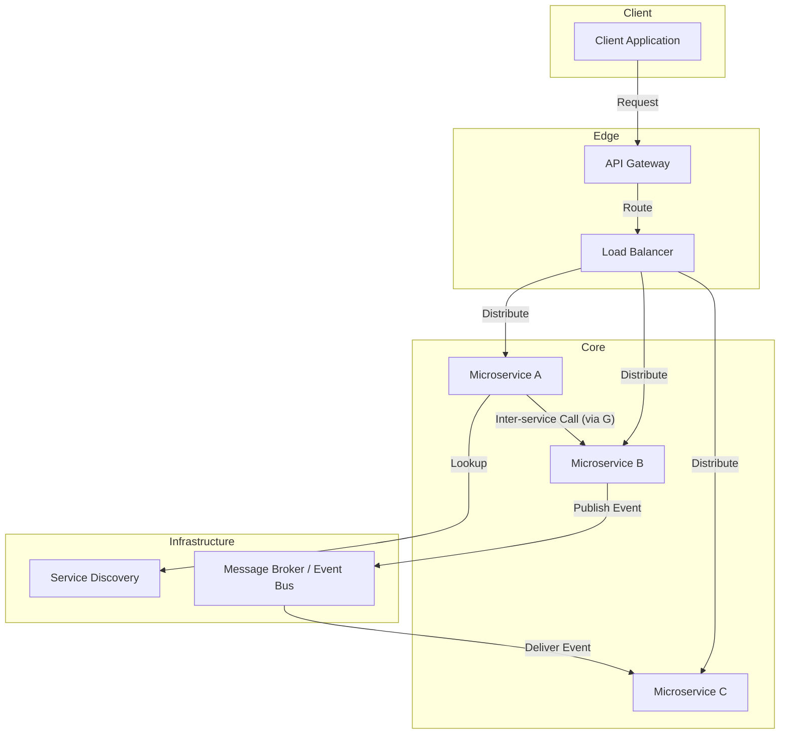

# Microservices Architecture

The **Microservices** architecture is a design style that structures an application as a collection of small, independent, and loosely coupled services. Each service is autonomous: it has its own codebase, its own business logic, and often its own database. These services communicate with each other over a **network** using well-defined APIs.

* **Core Principles:**
    * **Functional Decomposition:** The application is divided into services based on specific **business domains** (e.g., an order service, a payments service, an inventory service).
    * **Decentralization:** Each service can be developed, deployed, and managed independently.
    * **Lightweight Communication:** Services communicate via lightweight protocols such as **REST** (**HTTP**) or **gRPC**.
    * **Automated Infrastructure:** The complexity of the architecture requires strong automation of deployment and management via **DevOps** tools (e.g., **CI/CD**, **containerization** with **Docker**, orchestration with **Kubernetes**).

---

## Key Components and Communication Flow

1.  **Client:** The starting point of the request (for example, a web browser or a mobile app). It only interacts with the API Gateway, without knowing about the individual services.
2.  **API Gateway:** A single entry point that handles client requests, authentication, and routing to the appropriate microservices. It can also manage **rate limiting**.
3.  **Load Balancer:** Distributes the incoming traffic load among different instances of the same service. This is an essential component for the **horizontal scalability** of services.
4.  **Service Discovery:** A mechanism that allows microservices to find and communicate with each other dynamically, without needing to hard-code their network addresses. Services register with a **Service Registry** and can query it.
5.  **Microservices:** The services themselves, containing the business logic. They can be developed with different technologies and languages. Their communication can be synchronous (via an API) or asynchronous (via a message broker).
6.  **Message Broker / Event Bus:** An asynchronous communication system that allows services to exchange messages or events. This model promotes **loose coupling**, as the sender does not need to know the recipients of the message.

---

## Advantages and Technical Challenges

* **Advantages (Benefits):**
    * **Independent Scalability:** Each service can be scaled vertically or horizontally based on its specific needs, without affecting the others.
    * **Resilience:** If one service fails, the rest of the system can continue to operate, unlike in a [[monolithic|monolithic]] architecture where a single failure can bring down the whole system.
    * **Technological Flexibility:** Teams can choose the most appropriate technologies for each service.
    * **Independent Deployments:** Teams can deploy new versions of their services autonomously, which accelerates **time-to-market** and reduces risk.

* **Challenges:**
    * **Operational Complexity:** Managing a large number of distributed services is complex and requires **DevOps** expertise and a robust infrastructure.
    * **Data Consistency:** Maintaining data **consistency** across the isolated databases of different services is a challenge (e.g., via the **event-driven** model and the **Saga** pattern).
    * **Debugging and Monitoring:** Debugging a request flow across multiple services and **networks** is more difficult than in a [[monolithic|monolith]]. **Distributed tracing** tools are necessary.
    * **Security:** Each service is potentially an entry point, which increases the attack surface. Implementing **security** across dozens of services can be complex.

---

## Variations and Derived Architectures

The **Microservices** architecture is not a final architecture but an approach that is combined with other patterns.

* **Event-Driven Architecture (EDA):** Services communicate by emitting and consuming events via a **message broker** (e.g., **Kafka**, **RabbitMQ**). This promotes maximum decoupling.
* **Service Mesh:** A dedicated infrastructure layer that handles communication between services. It provides features like **security**, **observability**, and **traffic control** (e.g., **Istio**, **Linkerd**).
* **Serverless/Function-as-a-Service (FaaS):** A variation of microservices where the service is a function executed in a **serverless** environment (e.g., **AWS Lambda**, **Google Cloud Functions**). This reduces **operational overhead**.

This architecture is the de facto solution for modern large-scale applications and companies seeking greater agility, but it is not a universal solution. It requires a mature culture and skills in **DevOps** and **distributed systems management**.

---

## **Resources & Links**

### **Articles**

1.  **[Microservices Patterns](https://microservices.io/patterns/microservices.html)**
    
    This site is a reference for everything related to **Microservices** architecture patterns. It covers basic concepts as well as solutions for common problems like routing and data consistency. It is an essential guide for developers and architects.

2.  **[Microservices Architecture: A Detailed Guide](https://medium.com/design-microservices-architecture-with-patterns/microservices-architecture-2bec9da7d42a)**
    
    This article goes beyond a simple introduction and explores the challenges and design patterns in more depth. It is particularly relevant for understanding architectural choices and the trade-offs involved.

---

### **Videos**

1.  **[Microservices Architecture explained](https://www.youtube.com/watch?v=8BPDv038oMI)**
    
    This video offers a clear and concise introduction to the basic principles of **Microservices** architecture. It is excellent for those who want a quick overview of the concepts and benefits of this model.

2.  **[What are Microservices?](https://www.youtube.com/watch?v=UZQMUiVqpFs)**
    
    This video goes further by explaining not only what **Microservices** are, but also why they are used and what the operational considerations are for implementing them. It is useful for an audience seeking a more comprehensive understanding of the **Microservices** ecosystem.

    On this channel, you will find [many other videos on microservices](https://www.youtube.com/@markrichards5014/search?query=%22microservices%22) addressing different aspects and challenges of these architectures, comparisons with other architectures such as [[soa|SOA]] or event-driven architecture.