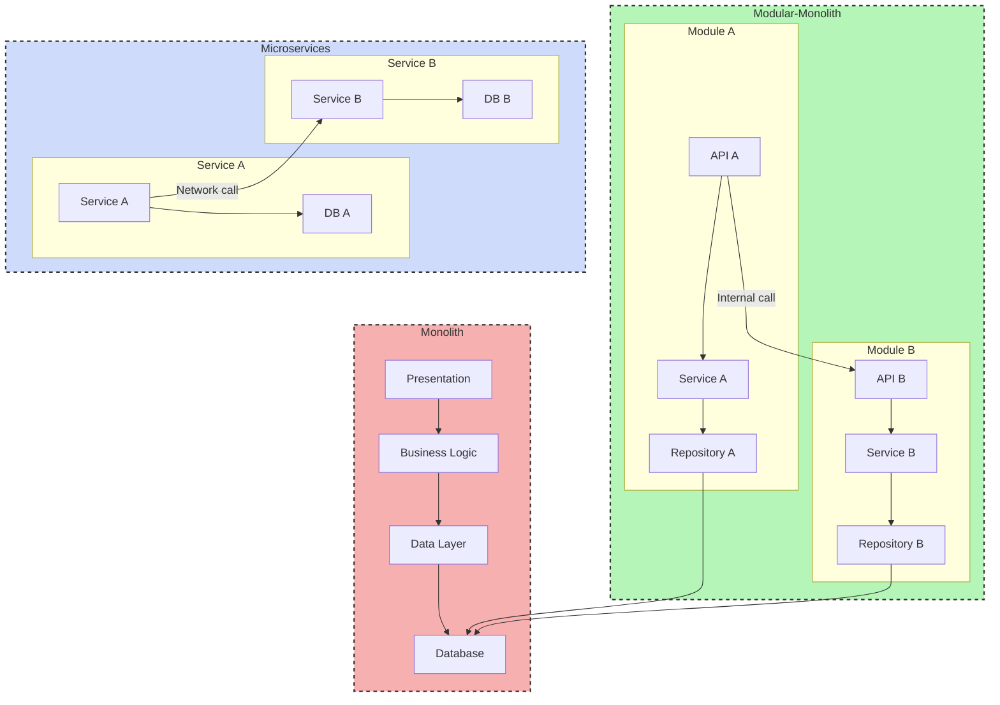

# **Modular Monolith Architecture**

The **Modular Monolith** is an architectural style that combines the operational simplicity of a **monolith** with the modularity benefits of **microservices**. It is a single application, deployed as a single unit, but its internal organization is highly structured into distinct and loosely coupled modules. Each module represents an independent business capability.

* **Core Principles:**
    * **Separation of Concerns:** Each module is a self-contained functional unit, with its own business logic, internal API, and, ideally, its own data schema. It does not directly access other modules' data.
    * **Loose Coupling:** Modules communicate via well-defined interfaces (like services or internal events), which reduces direct dependencies. This allows a team to work on one module with less risk of breaking the rest of the application.
    * **High Cohesion:** A module's code is tightly related and serves a single business responsibility. This makes the code easier to understand and maintain.

---

## **Comparison: Classic Monolith vs. Modular Monolith**

| Characteristic | Classic Monolith | Modular Monolith | Microservices |
| :--- | :--- | :--- | :--- |
| **Structure** | A single application, a single codebase, often without clear boundaries between parts. | A single application, a single codebase but divided into autonomous modules. | A collection of independent, deployable services. |
| **Coupling** | Strong Coupling, components call each other directly and share the same state and database. | Loose Coupling internally between modules via well-defined interfaces. | Loose Coupling between services, communication over the network (e.g., REST, gRPC). |
| **Deployment** | A single binary to deploy. | A single binary to deploy. | Multiple deployments, one per service. |
| **Database** | A monolithic database shared by the entire application. | A single database, but each module is responsible for its own data schema. Discipline is required to manage this. | Each microservice has its own database. |

---

## **Use Cases and Benefits**

* **Ideal for:**
    * **Startups and initial projects:** It allows for quick time to market with simple deployment, while laying the groundwork for a future migration to **microservices** if needed.
    * **Complex Enterprise Applications:** A CRM (Customer Relationship Management) system can have modules for contact management, sales, and customer support, allowing dedicated teams to work on each module.
    * **Migration Preparation (Transition to Microservices):** This is an excellent stepping stone. Once module boundaries are well-established, they can be extracted from the **monolith** and deployed as independent services with less risk. This is often referred to as the **"strangler fig pattern"**.

* **Advantages (Benefits):**
    * **Simplicity of Deployment:** Like a **monolith**, there is only one application to deploy, which simplifies CI/CD pipelines.
    * **Performance:** Communication between modules happens in memory, which is much faster than network calls between **microservices**.
    * **Maintainability and Internal Scalability:** The modularity makes maintenance and modifications easier. While the entire application is deployed together, it is easier to identify and resolve internal bottlenecks.

---

## **Challenges and Technical Considerations**

* **Team Discipline:** This is the biggest challenge. Developers must commit to respecting module boundaries and avoiding cross-module dependencies.
* **Data Coupling:** Managing a single database for multiple modules is tricky. Each module should own its own data schema, and direct relationships between module tables should be avoided to maintain independence.
* **Scalability:** While you can replicate the entire **monolith** behind a **Load Balancer**, you cannot scale a single module independently.

---

## **Resources & Links**

### **Articles**

1.  **[What Is a Modular Monolith?](https://www.milanjovanovic.tech/blog/what-is-a-modular-monolith)**
    This article by Milan Jovanović gives a clear explanation of what a **modular monolith** is and why it can be an excellent alternative to **microservices**. It highlights how to get the benefits of decoupling without the complexity of a distributed system.

2.  **[When (modular) monolith is the better way to build software](https://www.thoughtworks.com/insights/blog/microservices/modular-monolith-better-way-build-software)**
    Published by Thoughtworks, a leader in software architecture, this article argues that the **modular monolith** is often a better starting point for projects. It emphasizes the simplicity of management, deployment, and the ability to evolve toward a **microservices** architecture if the need arises.

### **Videos**

1.  **[Understanding the Modular Monolith Architecture](https://www.youtube.com/watch?v=ikuu3QIuJuc)**
    This video offers a comprehensive overview of the modular monolith concept, explaining its principles, benefits, and how it can be implemented in real-world projects.

2.  **[Choosing the Modular Monolith Architecture](https://www.youtube.com/watch?v=Xo3rsiZYsJQ&list=PLYpjLpq5ZDGvOGMF2tIHEkPKf7_5tXwr4)**
    This resource discusses the key factors and decision-making process for choosing a modular monolith over other architectural styles, providing practical advice for architects and development teams.

3.  **[The Simon Brown Conference that Introduced the Concept](https://www.youtube.com/watch?v=5OjqD-ow8GE)**
    This is the original talk by Simon Brown, who is often credited with popularizing the concept of the **modular monolith**. This is a bonus resource to give you the origin of the idea.