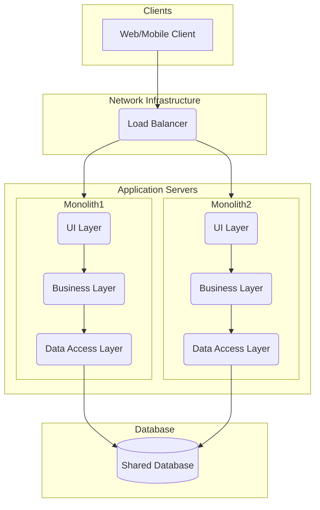

# Monolithic Architecture

**Monolithic Architecture** is a traditional but still highly relevant [[software-architecture/architectural-styles/|architectural style]] where an entire application is built and deployed as a **single, unified unit**. Despite often being contrasted with [[microservices]], a well-designed monolith can be a powerful and pragmatic choice, especially for startups and teams that prioritize development speed and simplicity.

The defining characteristic is **deployment**, not size or complexity. All features are contained within a single deployable artifact.

* **Key Principles:**
    * **Single Deployment Unit:** All code for the application is released as a single artifact. For availability and scale, this unit is typically deployed as multiple identical instances behind a [[load-balancing|load balancer]].
    * **Single Codebase:** The application is usually managed in a single source code repository.
    * **Direct Communication:** Components communicate with each other via in-process, local method calls, which are fast and reliable.
    * **Shared Database:** All modules typically share a single, common database schema.

---

## Overview and Communication Flow

A well-designed monolith is not an unstructured "big ball of mud." It is often a **[[modular-monolith|Modular Monolith]]** with a clear internal structure, such as a **[[layered]]** architecture, to enforce [[soc|separation of concerns]]. For scalability and availability, it is deployed as multiple identical instances behind a load balancer.

---

## Advantages and Challenges (Technical and Operational)

* **Advantages (Benefits):**
    * **Simplicity of Development:** A single codebase, a single build, and a single deployment artifact make the initial development process straightforward. It's easy for a new developer to get up and running.
    * **Reduced Operational Overhead:** You only have one application to deploy, manage, monitor, and secure. This significantly reduces operational complexity compared to a distributed system.
    * **High Performance:** All communication between components happens via in-process function calls, which are orders of magnitude faster and more reliable than network calls.
    * **Simplified Debugging and Testing:** End-to-end testing and debugging are simpler because the entire application state is in one place. You can trace a request through the entire stack within a single process.

* **Challenges (and how to mitigate them):**
    * **Scalability:** The entire application must be scaled as a single unit. You cannot scale individual features independently. This is known as **coarse-grained scaling**.
    * **Maintenance and Comprehension:** Without strong internal boundaries, the codebase can degrade into a "Big Ball of Mud," making it difficult and risky to change.
    * **Technology Lock-in:** It is difficult to adopt new technologies for parts of the application, as the entire system is built on a single, unified tech stack.
    * **Deployment Risk:** A change in any part of the application requires redeploying the entire monolith. This can make deployments large, slow, and risky.

Many of these challenges can be effectively addressed by adopting a **[[modular-monolith|Modular Monolith]]** architecture, which enforces strong boundaries between modules within the single deployment unit.

## **Resources & links**

### **Articles**

1.  **[Monolithic vs. Microservices Architecture](https://www.atlassian.com/microservices/microservices-architecture/microservices-vs-monolith)**
    This article from Atlassian provides an overview of monolithic architecture, then compares it to [[microservices|microservices]]. It details the pros and cons of each approach, covering aspects such as development complexity, deployment, and scalability.

2.  **[Monolithic architecture](https://www.techtarget.com/whatis/definition/monolithic-architecture)**
    This article from TechTarget offers a concise and clear definition of monolithic architecture. It explains its basic components, characteristics, and the reasons why this model is often chosen, especially for small to medium-sized projects.

---

### **Videos**

1.  **[Monolithic Architecture Explained](https://www.youtube.com/watch?v=WffbSw-I-iU&list=PLdsOZAx8I5umhnn5LLTNJbFgwA3xbycar&index=52&pp=iAQB)**
    This video offers a clear and concise explanation of what a monolith is. It highlights its key characteristics, as well as its advantages and disadvantages.

2.  **[Monolithic vs. Microservice Architecture](https://www.youtube.com/watch?v=_07NtoK-Kns)**
    This video provides a deep comparative analysis. It doesn't just list the pros and cons, but it explores the reasons for choosing one approach over the other and the implications of these design decisions.