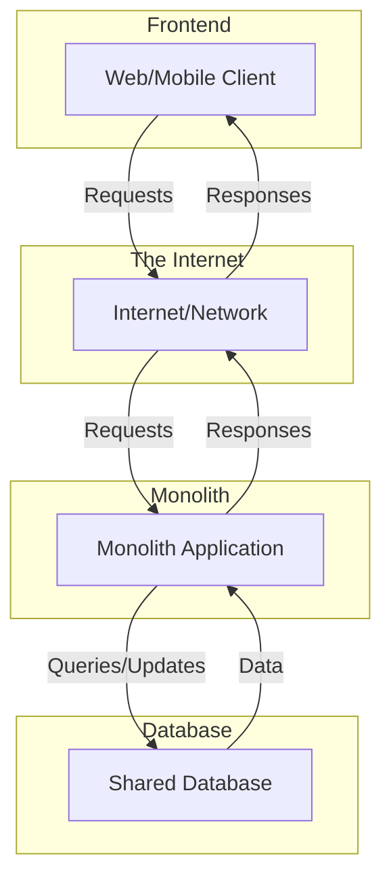

# Monolithic Architecture

**Monolithic architecture** is a software design style where the entire application is built as a **single, indivisible deployment unit**. All application functionalities (the user interface, business logic, and data access) are packaged into a single artifact, which is then deployed to a single server or a cluster of servers acting as a unified entity.

* **Key Principles:**
    * **Single Codebase:** The application is a single project with one source code repository.
    * **Single Process:** The entire application runs within a single operating system process.
    * **Tight Coupling:** The different modules of the application communicate directly via local method or function calls, making them highly dependent on each other.
    * **Shared Resources:** Modules share the same in-memory resources and often connect to a single, shared database.

---

## Overview and Communication Flow

The most generic and specific diagram for a monolith highlights its unified nature, contrasting it with a distributed architecture like microservices.

1. A **Client** (web browser, mobile app) sends requests to the application.

2. The entire **Monolithic Application** handles all requests, processes the business logic, and accesses the database.

3. The **Database** is a shared resource, common to all application functionalities.

---

## Advantages and Challenges (Technical and Operational)

* **Advantages (Benefits):**
    * **Development and Deployment Simplicity:** A single codebase and a single binary to deploy. This makes Continuous Integration / Continuous Deployment (CI/CD) pipelines initially simple and fast for a small team.
    * **High-Performance Communication:** Communication between components are local function calls, without the latency and overhead of network calls.
    * **Low Initial Cost:** Minimal startup and hosting costs, making it ideal for an **MVP (Minimum Viable Product)** or a small project.

* **Challenges:**
    * **Scalability:** The main challenge. You cannot scale a single feature. The entire application must be duplicated (multiple instances of the monolith), which can be very expensive and inefficient. This is known as **coarse-grained scaling**.
    * **Maintenance and Comprehension:** The codebase can grow into a "Big Ball of Mud" where changes are risky and dependencies are difficult to manage.
    * **Team Scalability:** It's difficult for multiple teams to work in parallel on a single codebase. Code conflicts and bottlenecks become frequent.
    * **Technology Lock-in:** Once the core technology is chosen, it's very difficult to change it for only one part of the application, as everything is tightly coupled.
    * **Single Point of Failure:** A bug in one module can potentially cause the entire application to crash.

## **Resources & links**

### **Articles**

1.  **[Monolithic vs. Microservices Architecture](https://www.atlassian.com/microservices/microservices-architecture/microservices-vs-monolith)**
    This article from Atlassian provides an overview of monolithic architecture, then compares it to microservices. It details the pros and cons of each approach, covering aspects such as development complexity, deployment, and scalability.

2.  **[Monolithic architecture](https://www.techtarget.com/whatis/definition/monolithic-architecture)**
    This article from TechTarget offers a concise and clear definition of monolithic architecture. It explains its basic components, characteristics, and the reasons why this model is often chosen, especially for small to medium-sized projects.

---

### **Videos**

1.  **[Monolithic Architecture Explained](https://www.youtube.com/watch?v=WffbSw-I-iU&list=PLdsOZAx8I5umhnn5LLTNJbFgwA3xbycar&index=52&pp=iAQB)**
    This video offers a clear and concise explanation of what a monolith is. It highlights its key characteristics, as well as its advantages and disadvantages.

2.  **[Monolithic vs. Microservice Architecture](https://www.youtube.com/watch?v=_07NtoK-Kns)**
    This video provides a deep comparative analysis. It doesn't just list the pros and cons, but it explores the reasons for choosing one approach over the other and the implications of these design decisions.