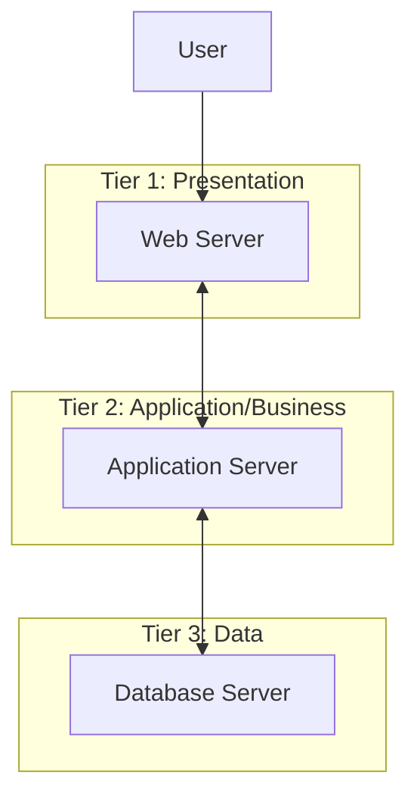
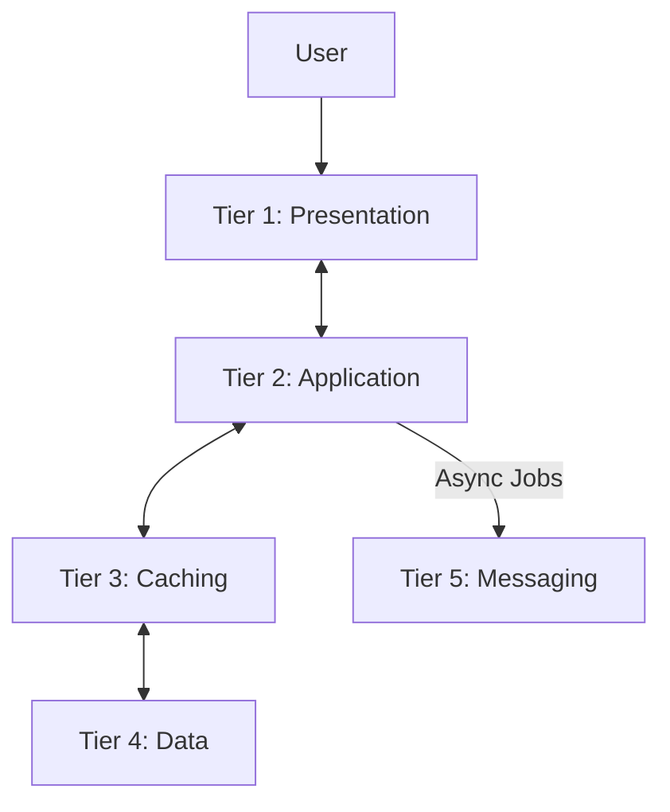

# N-Tier Architecture

**N-Tier Architecture** (also known as multi-tier architecture) is an [[software-architecture/architectural-styles/|architectural style]] where the application is separated into distinct **physical tiers**. This is its key difference from a [[layered|Layered Architecture]], which describes a *logical* separation of code within a single application. Each tier runs on separate infrastructure (servers, containers, etc.) and is responsible for a specific concern.

While the 3-Tier model is the most famous example, N-Tier architecture can be implemented with any number of tiers (where N >= 2).

---

## Common Implementations

### 2-Tier Architecture

This is the classic [[client-server]] model. The logic is split into two tiers:

1.  **Client Tier:** A "thick client" (often a desktop application) that contains both the presentation logic and the business logic.
2.  **Data Tier:** A database server that the client connects to directly.

-   **Use Case:** Simple departmental applications or legacy systems.
-   **Limitation:** Tightly couples the business logic to the client, making updates difficult.

### 3-Tier Architecture

This is the most common implementation for web applications. It introduces an Application Tier to decouple the business logic from the presentation.

1.  **Presentation Tier (Web Tier):** The user-facing UI, typically running on web servers.
2.  **Application Tier (Business Tier):** The core business logic, running on separate application servers.
3.  **Data Tier:** The database servers.

*Description: A classic 3-Tier architecture, where the Presentation, Application, and Data layers are deployed on physically separate servers.*

### More than 3 Tiers (N-Tier)

For complex, large-scale systems, additional tiers can be introduced to handle specific concerns, further improving separation and scalability. There is no rigid definition, as tiers are added to solve specific problems.

#### Example: 4-Tier Architecture
A common 4-tier model further separates the business logic from the data access logic.
- **Tier 1:** Presentation (Web Servers)
- **Tier 2:** Business (Application Servers)
- **Tier 3:** Data Access (e.g., a dedicated service layer for persistence)
- **Tier 4:** Data Store (Database Servers)

#### Example: 5-Tier Architecture
A high-performance system might introduce tiers for caching and asynchronous messaging.

*Description: An example of a 5-Tier architecture with dedicated tiers for caching (to reduce latency) and asynchronous messaging (to offload heavy tasks).*

---

## Relationship with Layered Architecture

The terms "Layer" and "Tier" are often confused. The distinction is crucial:

*   **Layers** describe the **logical** organization of code within a single application. It's a code structure and dependency management strategy.
*   **Tiers** describe the **physical** deployment of these layers onto separate infrastructure. It's a network topology and deployment strategy.

You can have a [[layered|Layered Architecture]] on a single tier (a standard [[monolithic|monolith]]). An N-Tier architecture is what you get when you decide to deploy those layers on physically separate machines or containers.

---

## Benefits and Challenges

### Benefits

-   **Independent Scaling:** This is the primary advantage. If your application tier is under heavy load, you can add more application servers without having to touch the web or data tiers. This allows for more efficient and cost-effective scaling.
-   **Improved Security:** You can place firewalls and stricter security groups between tiers. For example, the data tier can be configured to only accept connections from the application tier, completely isolating it from public access.
-   **Separation of Concerns:** The physical separation enforces a strong decoupling between the layers, improving maintainability.
-   **Technological Flexibility:** Different tiers can be built with different technologies best suited for their purpose.

### Challenges

-   **Increased Complexity:** Compared to an all-in-one [[monolithic|monolith]], an N-Tier architecture has more moving parts to deploy, manage, and monitor.
-   **Network Latency:** All communication between tiers happens over the network, which is inherently slower than in-process calls within a [[monolithic|monolith]]. This can impact performance if not managed carefully.

---

## N-Tier in Modern Architectures

The N-Tier concept remains highly relevant today. A modern, cloud-native application often uses this style where:

-   The **Presentation Tier** might be a static single-page application (SPA) hosted on a [[cdn|CDN]].
-   The **Application Tier** is a collection of [[microservices]] running in containers, orchestrated by a platform like Kubernetes.

When the application tier is built from multiple services, it introduces the challenge of inter-service communication. This is where patterns like **[[service-discovery|Service Discovery]]** become essential, allowing services to find and communicate with each other dynamically.

---

## Resources & links

### Articles

1.  **[N-tier Architecture Style - Azure Architecture Center](https://learn.microsoft.com/en-us/azure/architecture/guide/architecture-styles/n-tier)**
    This Microsoft Learn article details the N-tier architecture style, covering its benefits, challenges, and best practices, especially within the Azure cloud ecosystem.

2.  **[Introduction to architecting systems for scale](http://lethain.com/introduction-to-architecting-systems-for-scale/#platform_layer)**
    This article from `lethain.com` discusses scaling systems and introduces the concept of a "platform layer" (an application tier) as a way to scale web and application components independently.

### Videos

1.  **[What Is n-Tier Architecture? | Scott Duffy](https://www.youtube.com/watch?v=gdEZBNUccq8)**
    A concise 3-minute explanation of n-tier architecture, illustrating the differences between 2-tier, 3-tier, and 4-tier models.
