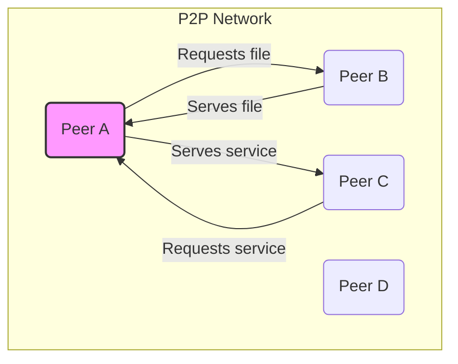

# Peer-to-Peer Architecture

The **Peer-to-Peer** (P2P) architecture is a distributed [[software-architecture/architectural-styles/|architectural style]] where each node, called a **peer**, acts as both a [[client-server|client]] and a [[client-server|server]]. There is no centralized [[client-server|server]] or single authority. Communication takes place directly between peers, eliminating the need for a central intermediary to coordinate services.

* **Core Principles :**
    * **Decentralization** : There is no single point of failure (`SPOF`). Resilience is an inherent characteristic of the system as the failure of one `peer` does not impact the entire network.
    * **Resource Sharing** : Resources (CPU, bandwidth, storage space) are distributed and shared by all `peers` in the network. The network's capacity increases with the number of participants.
    * **Symmetry** : Each `peer` has the same functional capacity and responsibilities. A `peer` can both initiate and respond to a request, making their roles interchangeable.
    * **Self-organization** : The network is capable of organizing and managing itself without centralized control. `Peers` can dynamically join or leave the network.

---

## Key Components and Communication Flow

1.  **Peers :** Each node in the network, which can be a personal computer, a [[client-server|server]], or a mobile device. Each `peer` must be able to locate the resources and services of other `peers`.
2.  **Network :** The P2P network topology can be structured or unstructured. Unstructured networks (e.g., Gnutella) are simpler to implement but less efficient for resource discovery. Structured networks (e.g., DHT - Distributed Hash Table) organize `peers` to enable faster resource searching, often by using an algorithm to assign the responsibility for each resource to a specific `peer`.
3.  **Communication Protocol :** `Peers` communicate with each other using specific protocols (e.g., BitTorrent, Ethereum's `devp2p`). These protocols manage `peer discovery`, connectivity, and data exchange.

**Typical Data Flow :**
* `Peer` A wants a file.
* It asks its neighboring `peers` if they have the file.
* Neighbors that don't have the file can re-transmit the request to their own neighbors (`query flooding`).
* `Peer` B, which has the file, sends the file directly to `peer` A.
* In more advanced systems like BitTorrent, the file is divided into multiple `chunks` that can be downloaded simultaneously from several `peers`.

---

## Advantages and Technical Challenges

* **Advantages (Benefits) :**
    * **[[software-architecture/system-design-fundamentals/index#Scalability|Scalability]]** : Adding new `peers` increases the total capacity of the system, in terms of bandwidth and storage. This is called **`organic scalability`**.
    * **Cost-Effectiveness** : Eliminates the need for expensive centralized [[client-server|server]] infrastructure, as resources are provided by the users themselves.
    * **Censorship Resistance** : The absence of a central control point makes the system resistant to censorship and targeted denial-of-service attacks.
    * **Resilience** : The network is highly resilient to individual node failures. If a `peer` goes down, the rest of the network continues to function.

* **Challenges :**
    * **Security & Trust** : It is difficult to authenticate `peers` and guarantee data reliability. `Peers` can be malicious (`malicious actors`). The problem of "freeriding" (using resources without providing any in return) is common.
    * **Discovery & Routing Complexity** : Finding peers or resources in a large, dynamic network is a major challenge. This is often solved in **Hybrid P2P** systems by using a central server (a "bootstrap server" or "tracker") to help peers find each other initially.
    * **Reliability & Availability** : The availability of a resource depends on the reliability of the `peers` holding it. If the `peers` with the resource disconnect, the resource becomes unavailable.

---

## Related Patterns, Concepts and Variations

The **Peer-to-Peer** architecture is the basis for many more sophisticated models, including:

* **Pure P2P :** `Peers` are strictly equal, with no centralized infrastructure. Ex: Gnutella.
* **Hybrid P2P :** Uses a central [[client-server|server]] for certain functions, such as `peer discovery` or authentication. Once the connection is established, communication happens directly in a P2P manner. Ex: BitTorrent (which uses central `trackers` to initiate the connection).
* **Decentralized Ledger Technologies (DLT) :** Ex: **Blockchain** (Bitcoin, Ethereum). These systems are applications of the P2P model where a shared, immutable ledger is replicated across all peers. Transactions are validated by a consensus algorithm, ensuring [[data-integrity|data integrity]] without a central authority.
* **Distributed File Systems :** Ex: IPFS (InterPlanetary File System). Files are stored and retrieved on a network of `peers`, optimizing content distribution and resilience.

---

## **Resources & Links**

### **Articles**

1.  **[Peer-to-Peer (P2P) Architecture](https://www.geeksforgeeks.org/system-design/peer-to-peer-p2p-architecture/)**
    This article from GeeksforGeeks is a complete technical resource on P2P architectures, covering network types, key components, and security mechanisms.

2.  **[What Is Peer-to-Peer?](https://www.spiceworks.com/tech/networking/articles/what-is-peer-to-peer/)**
    Spiceworks provides an excellent overview for understanding the basics of P2P, its use cases, and its main differences from [[client-server|client-server architecture]].

### **Videos**

1.  **[Peer-to-Peer (P2P) Architecture - Software Architecture Patterns](https://www.youtube.com/watch?v=mNwJHPMaEKk)**
    This video presents the P2P model as one of the **`software architecture patterns`**, explaining how it works and comparing it to the [[client-server|client-server model]].

2.  **[Peer-to-Peer Architectural Model: Overlay Network, Unstructured & Structured P2P, Advtgs & Disadvtgs](https://www.youtube.com/watch?v=5TlXplq3wv4)**
    This detailed video from a university professor covers structured and unstructured P2P models, as well as **`overlay networks`**.