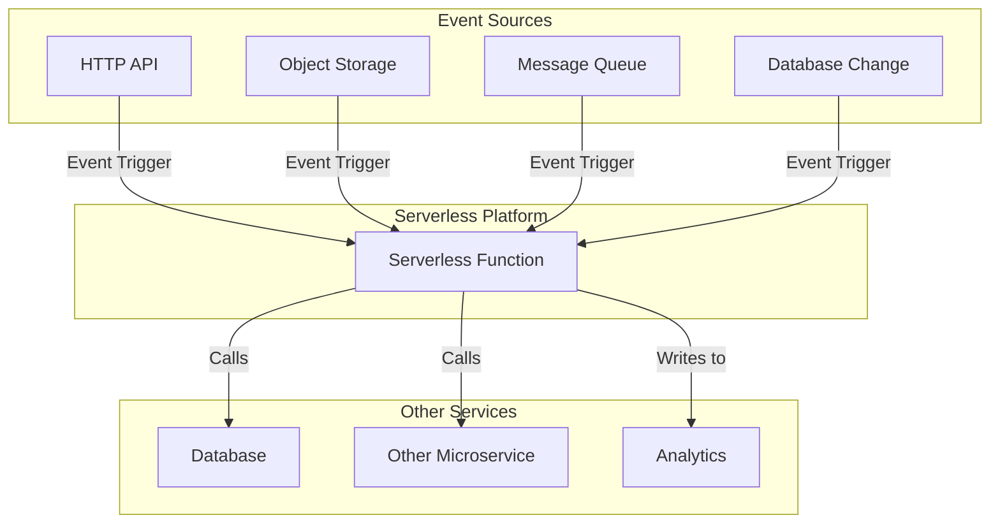

# Serverless Architecture

The **Serverless architecture** is an [[software-architecture/architectural-styles/|architectural style]] where the **cloud provider** dynamically handles the allocation and management of servers. The developer focuses on writing code, often as functions, without having to worry about provisioning, scaling, or maintaining the underlying infrastructure. This model is another step in the abstraction of infrastructure, following virtual machines and containers.

* **Core Principles:**
    * **No Server Management:** The developer no longer needs to provision or maintain servers (OS patching, etc.).
    * **Pay-per-use:** Billing is based on the resources actually consumed (execution time, memory, requests), with no idle costs.
    * **Automatic Scalability:** The system scales automatically and instantly to adapt to the load, from zero to thousands of instances.
    * **[[event-driven|Event-driven Architecture]]:** Functions are often triggered by events, such as an HTTP request, a file upload, or a message in a queue.

---

## Key Components and Communication Flow

1.  **Event Sources:** The sources that trigger code execution. This can be an HTTP request for an API, a file added to a cloud storage bucket like **Amazon S3** or **Google Cloud Storage (GCS)**, a [[software-architecture/databases/|database]] modification, or a message published to a queue like **Amazon SQS** or **Google Cloud Pub/Sub**. The upload of the file itself is often handled securely using the [[valet-key|Valet Key]] pattern.
2.  **Serverless Function (FaaS - Function as a Service):** The function or piece of code that runs in response to an event. This is the core of a **serverless** architecture. Examples include **AWS Lambda**, **GCP Cloud Functions**, and **Azure Functions**.
3.  **Backend as a Service (BaaS):** Managed third-party services from the cloud provider, such as [[nosql|**NoSQL** databases]] (**Amazon DynamoDB**, **Google Cloud Firestore**) or authentication services (**Auth0**, **Firebase Authentication**), which complement the architecture and reduce the amount of code you need to write.

---

## Typical Data Flow

The data flow in a **Serverless** architecture is fundamentally different from the traditional [[client-server|Client-Server]] model because it is [[event-driven|event-driven]]. Instead of a persistent connection between a client and a server, communication is triggered by events.

1.  **Event Triggered**: An event occurs. For example, a user sends an HTTP request to an API endpoint.
2.  **Function Invocation**: The **cloud provider** detects this event and, in response, invokes the associated **Serverless** function. If the function isn't "warm" (already in memory), a "cold start" occurs, which can introduce initial latency to initialize the execution environment.
3.  **Code Execution**: The function runs, processing the business logic. It may interact with other cloud services ([[software-architecture/databases/|databases]] like **DynamoDB**, [[message-queue|message queues]], or other APIs) to complete its task.
4.  **Result Handling**: Once execution is complete, the function returns a response (e.g., an HTTP status code and a JSON response body) or writes data to another service. The function then stops, and the execution environment is released.
5.  **No Persistent Connection**: There is no long-lasting connection maintained. Each invocation is a distinct, isolated execution.

This **stateless**, [[event-driven|event-driven]] model is what enables the massive **scalability** and reduced costs associated with a **Serverless** architecture.

---

## Benefits and Technical Challenges

* **Benefits:**
    * **Reduced Cost:** The **pay-per-use** model eliminates costs for idle servers.
    * **Accelerated Time-to-market:** Developers focus on business logic without worrying about infrastructure, which speeds up development and deployment.
    * **Elastic Scalability:** The platform automatically and transparently manages scaling, allowing you to handle massive traffic spikes without manual intervention.
    * **Simplified Operations:** There are fewer **DevOps** tasks, such as managing servers, OS updates, or infrastructure monitoring.

* **Challenges:**
    * **Unpredictable Cost at Scale:** While the model is economical for low and variable workloads, it can become very expensive for high-volume applications or unforeseen traffic spikes, where the cost of each invocation adds up.
    * **Cold Starts:** If a function hasn't been used in a while, it may need to "cold start," which can introduce latency.
    * **Vendor Lock-in:** **Serverless** architectures are inherently tied to a specific cloud provider's services (AWS, GCP, Azure), which can make migration difficult.
    * **Complex Debugging and Monitoring:** Debugging a distributed application composed of ephemeral functions can be complex. Traditional monitoring tools aren't always suitable.
    * **Potential Latency:** The distributed and network-dependent nature can introduce latency, especially between functions and backend services.
    * **Execution Limits:** **Serverless** platforms often impose limits on function execution time, memory, or package size.

---

## Use Cases and Practical Examples

* **[[event-driven|Event-driven APIs]]:** Create **REST** or **gRPC** **APIs** where each endpoint is managed by a **serverless** function.
* **[[pipe-filters|Data Processing]]:** A function triggered by adding an image to an **S3** bucket that resizes the image and adds it to another bucket.
* **Scheduled Tasks:** Replace **cron jobs** with functions triggered at regular intervals to, for example, generate reports or clean up data.
* **[[microservices|Microservices]]:** A [[microservices|microservices]] architecture where each service is implemented as one or more **serverless** functions.
* **Real-time Processing:** Process real-time data streams from IoT or user events.

---

## Related Patterns, Concepts and Variations

* **FaaS (Function as a Service):** The concept that allows for the execution of functions in response to events without managing the underlying infrastructure.
* **BaaS (Backend as a Service):** Provides managed backend services, such as databases, authentication, and storage, so the developer can focus on front-end code or **FaaS** functions.
* **[[event-driven|Event-Driven Architecture]]:** This is a fundamental design principle, not just a variation. It is centered around producing, consuming, and reacting to events to orchestrate data flow and communication between services. **Serverless** is the perfect technical example of this.

---

## **Resources and Links**

### **Articles**

1.  **[Serverless Architectures](https://martinfowler.com/articles/serverless.html)**
    This article by Martin Fowler is a great starting point for an in-depth understanding. It covers the fundamental concepts, benefits, pitfalls, and reference architectures, which is highly relevant for an architect role.

2.  **[What is Serverless?](https://www.redhat.com/en/topics/cloud-native-apps/what-is-serverless)**
    Red Hat offers a very clear article that puts **serverless** in context with other cloud technologies like containers and [[microservices|microservices]]. It is ideal for placing this model within the broader landscape of **cloud computing**.

### **Videos**

1.  **[Serverless Architecture Explained](https://www.youtube.com/watch?v=vxJobGtqKVM)**
    This video from The TechCave is a concise and clear introduction to **serverless architecture**. It explains how **FaaS** and **BaaS** work, along with their pros and cons.

2.  **[What is Serverless?](https://www.youtube.com/watch?v=RzsaM6kL1FU)**
    This video from IBM Technology is an excellent resource for getting an explanation of **serverless** from a leading cloud provider. It helps demystify the concept by relating it to other cloud technologies and services.