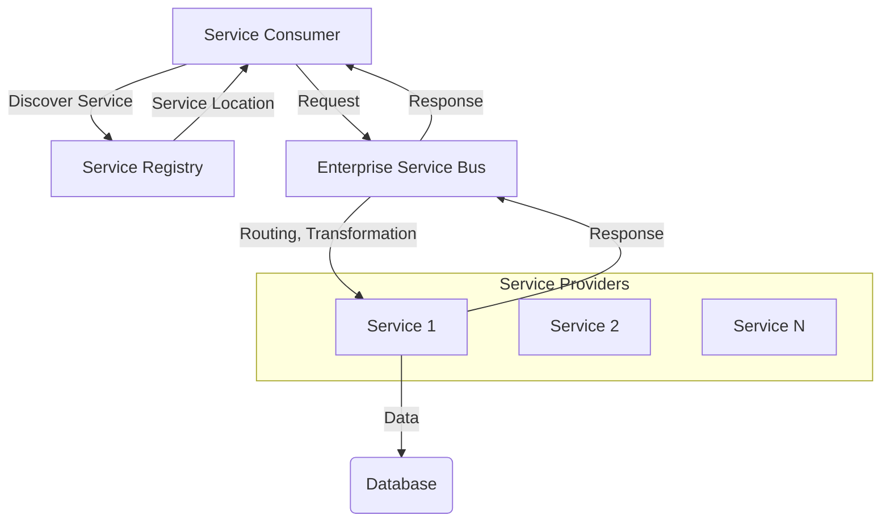

# Service-Oriented Architecture (SOA)

**Service-Oriented Architecture (SOA)** is a software [[software-architecture/architectural-styles/|architectural style]] where application components are structured as a set of **services**. These services are autonomous, loosely coupled, and can be invoked by other applications or services. SOA is not a specific technology, but rather a design model that focuses on exposing business functionalities as reusable services.

---

## Fundamental Principles

* **[[cohesion-coupling|Loose Coupling]]**: Services are designed to be independent of each other. A change in a service's implementation should not affect its consumers, as long as the service interface remains stable.
* **Reusability**: Services encapsulate business functionalities and can be reused by multiple applications within the enterprise.
* **Interoperability**: Services communicate via standard protocols, such as **SOAP** (Simple Object Access Protocol) or **REST** (Representational State Transfer). This allows applications developed in different programming languages to interact with each other.
* **Abstraction**: Services hide the complexity of their internal logic, exposing only a clear and well-defined interface.
* **Statelessness** (or optional "Stateful"): A service may not retain any information about a client's session between requests, or it may maintain a state to simplify certain interactions. The **stateless** nature is preferred for scalability.

---

## Key Components and Communication Flow

SOA typically relies on an **Enterprise Service Bus (ESB)**, a centralized communication "backbone" that manages the message exchange between services.

1.  **Service Provider**: The entity that implements and provides a service.
2.  **Service Consumer**: The entity (application, client) that calls a service to consume a functionality.
3.  **Enterprise Service Bus (ESB)**: A middleware that handles complex interactions. It can route messages, transform data formats, and manage security.
4.  **Service Registry / Repository**: A centralized directory that allows consumers to discover which services are available and how to access them.

**Typical Data Flow:**
* The client searches for a service in the **Service Registry**.
* The client sends a request to the **ESB**.
* The **ESB** routes the request to the appropriate **Service Provider**, performing protocol or data transformations if necessary.
* The **Service Provider** executes the business logic and returns a response to the **ESB**.
* The **ESB** forwards the response to the client.

---

## Advantages and Technical Challenges

* **Advantages (Benefits)**:
    * **Reusability**: Services can be reused across the enterprise, reducing code duplication and accelerating development.
    * **Business Agility**: Reuse and loose coupling allow for faster responses to changes in business needs.
    * **Interoperability**: The use of communication standards allows for the integration of heterogeneous systems.
    * **Scalability**: Services can be scaled independently, based on demand.

* **Challenges**:
    * **Complexity**: Implementing an **ESB** and a **Service Registry** can be costly and complex to manage.
    * **Performance**: Network communications between services and the **ESB** can introduce **latency**.
    * **Centralization**: Dependence on an **ESB** can create a **Single Point of Failure (SPOF)** and bottlenecks.
    * **Governance**: Ensuring that services adhere to design standards and best practices requires strong governance.

---

## Variations and Derived Architectures

SOA has served as the foundation for many more recent architectural styles, especially with the advent of Cloud Computing and DevOps. The following architectures are often considered evolutions or direct alternatives to SOA, each addressing specific needs.

* **[[microservices|Microservices Architecture]]**: **[[microservices|Microservices]]** architecture is the most famous evolution of SOA. While SOA focuses on "coarse-grained" services reusable at the enterprise level, [[microservices|microservices]] focus on "fine-grained," highly specialized, and autonomous services. Each microservice can have its own database, and communication is often decentralized, without a central **ESB**. The goal is to maximize agility, deployment speed, and fault tolerance.

* **[[event-driven|Event-Driven Architecture (EDA)]]**: **EDA** is a style that focuses on the production, detection, and consumption of **events**. Unlike classic SOA, which relies on a synchronous request/response model, EDA uses **asynchronous** communication. A service emits an event when a state change occurs, and other services, called "consumers," subscribe to these events to react in a decoupled manner. EDA is ideal for systems that require real-time responses and high scalability, such as IoT or financial services. It is worth noting that SOA and EDA are not necessarily mutually exclusive and can be combined; this is known as **[[event-driven|Event-driven SOA]]**.

---

## **Resources & Links**

### **Articles**

1.  **[Service-Oriented Architecture (SOA)](https://www.ibm.com/think/topics/soa)**

    This resource from **IBM** is a comprehensive collection of articles and guides on SOA. It covers a wide range of topics, from foundational concepts and business benefits to its role in modern enterprise architecture. It's an excellent reference for anyone looking for in-depth, enterprise-level insights into SOA.

2.  **[Service-Oriented Architecture (SOA)](https://blog.bitsrc.io/service-oriented-architecture-soa-31c88eeeeb1b)**

    This detailed blog post from **Bits and Pieces** serves as a complete guide to SOA. It explains the core principles and characteristics of the architecture, delves into the advantages and disadvantages, and provides a clear overview of the components involved. It's a great reference for a comprehensive understanding of the topic.

### **Videos**

1.  **[Lesson 164 - Service Oriented Architecture](https://www.youtube.com/watch?v=9fn4vGEKFs8)**

    This video provides a deep technical explanation of SOA, detailing the principles of **abstraction** and **interoperability**. It highlights the challenges related to the cost and complexity of this architectural style, which is highly relevant for an architect.

2.  **[Service-Oriented Architecture - SOA | Software/Web Application Architecture](https://www.youtube.com/watch?v=jNiEMmoTDoE)**

    This video provides a clear and concise explanation of SOA as a key architectural style for software and web applications. It covers the core concepts and the fundamental role of services in system design. It is a very good resource for understanding how SOA fits into the broader context of **application architecture**.