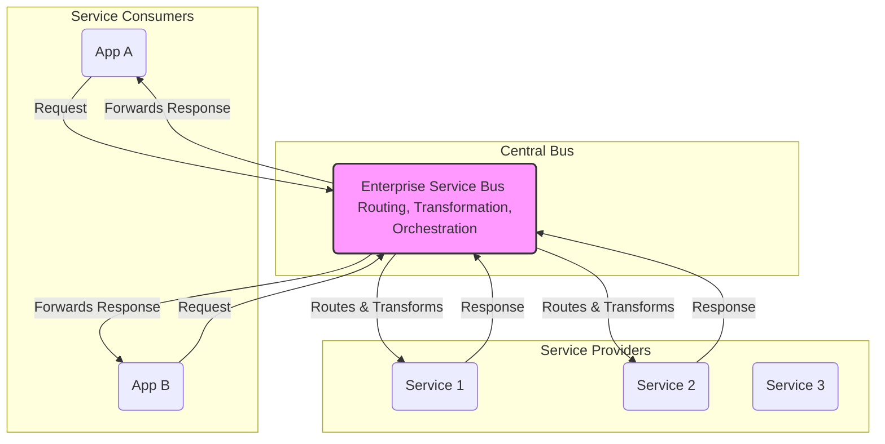

# Service-Oriented Architecture (SOA)

**Service-Oriented Architecture (SOA)** is an [[software-architecture/architectural-styles/|architectural style]] where business capabilities are exposed and consumed as reusable, enterprise-level **services**. Unlike other styles, classic SOA is defined by its use of a central communication backbone, the **Enterprise Service Bus (ESB)**, which handles all routing, transformation, and [[event-driven#Mediator Topology (Orchestration)|orchestration]] logic.

This leads to a philosophy of **"smart pipes and dumb endpoints."** The ESB is the "smart pipe" containing the integration logic, while the services themselves are "dumb endpoints" that simply provide a business function.

---

## Fundamental Principles

*   **Service as a Business Capability:** A service in SOA is typically **coarse-grained** and represents a complete business function (e.g., `CreateCustomer`, `GetInvoice`).
*   **Centralized Mediation (ESB):** All communication between services is mediated by the ESB. Services do not call each other directly.
*   **Shared Contract:** Services adhere to a formal, standardized contract (often defined using WSDL for SOAP-based services) that is published in a central registry.
*   **Loose Coupling:** The ESB decouples service consumers from providers. Consumers only need to know how to talk to the ESB, not the specific service implementation.
*   **Reusability:** The primary goal of SOA is to promote the reuse of common business services across an entire organization.

---

## Key Components and Communication Flow

1.  **Service Provider:** An application component that provides a specific business service. In classic SOA, these are "dumb" endpoints that know how to execute their function but are unaware of the broader workflow.
2.  **Service Consumer:** An application that needs to invoke a business service. It sends a request to the ESB, not directly to the service provider.
3.  **Enterprise Service Bus (ESB):** The central communication hub. It is responsible for:
    *   **Routing:** Directing requests to the correct service.
    *   **Transformation:** Converting data between different formats (e.g., XML to JSON).
    *   **[[event-driven#Mediator Topology (Orchestration)|Orchestration]]:** Coordinating calls to multiple services to fulfill a single business process.
    *   **Protocol Translation:** Bridging different communication protocols (e.g., HTTP and FTP).

**Typical Data Flow:**
* The client searches for a service in the **Service Registry**.
* The client sends a request to the **ESB**.
* The **ESB** routes the request to the appropriate **Service Provider**, performing protocol or data transformations if necessary.
* The **Service Provider** executes the business logic and returns a response to the **ESB**.
* The **ESB** forwards the response to the client.

---

## Advantages and Technical Challenges

* **Advantages (Benefits)**:
    * **Reusability**: Services can be reused across the enterprise, reducing code duplication and accelerating development.
    * **Business Agility**: Reuse and loose coupling allow for faster responses to changes in business needs.
    * **Interoperability**: The use of communication standards allows for the integration of heterogeneous systems.
    * **Scalability**: Services can be scaled independently, based on demand.

* **Challenges**:
    * **Complexity**: Implementing an **ESB** and a **Service Registry** can be costly and complex to manage.
    * **Performance**: Network communications between services and the **ESB** can introduce **latency**.
    * **Centralization**: Dependence on an **ESB** can create a **Single Point of Failure (SPOF)** and bottlenecks.
    * **Governance**: Ensuring that services adhere to design standards and best practices requires strong governance.

---

## SOA vs. Microservices

While microservices evolved from SOA, they represent a fundamentally different philosophy.

| Characteristic | Service-Oriented Architecture (SOA) | Microservices Architecture |
| :--- | :--- | :--- |
| **Scope** | **Enterprise-wide**. Services are coarse-grained and shared across the organization. | **Application-specific**. Services are fine-grained and scoped to a single application's context. |
| **Communication** | **"Smart Pipes, Dumb Endpoints."** Relies on a central ESB for routing, transformation, and [[event-driven#Mediator Topology (Orchestration)|orchestration]]. | **"Dumb Pipes, Smart Endpoints."** Services communicate over simple protocols (like HTTP or gRPC) and contain their own logic. |
| **Data Storage** | Services often share a common, enterprise-level database. | Each microservice **owns its own database** to ensure full decoupling. |
| **Deployment** | Services are often deployed in larger, coordinated releases. | Each service is **independently deployable**. |
| **Goal** | **Integration** and reuse of existing enterprise assets. | **Agility** and speed of delivery for a single application. |

---

## **Resources & Links**

### **Articles**

1.  **[Service-Oriented Architecture (SOA)](https://www.ibm.com/think/topics/soa)**

    This resource from **IBM** is a comprehensive collection of articles and guides on SOA. It covers a wide range of topics, from foundational concepts and business benefits to its role in modern enterprise architecture. It's an excellent reference for anyone looking for in-depth, enterprise-level insights into SOA.

2.  **[Service-Oriented Architecture (SOA)](https://blog.bitsrc.io/service-oriented-architecture-soa-31c88eeeeb1b)**

    This detailed blog post from **Bits and Pieces** serves as a complete guide to SOA. It explains the core principles and characteristics of the architecture, delves into the advantages and disadvantages, and provides a clear overview of the components involved. It's a great reference for a comprehensive understanding of the topic.

### **Videos**

1.  **[Lesson 164 - Service Oriented Architecture](https://www.youtube.com/watch?v=9fn4vGEKFs8)**

    This video provides a deep technical explanation of SOA, detailing the principles of **abstraction** and **interoperability**. It highlights the challenges related to the cost and complexity of this architectural style, which is highly relevant for an architect.

2.  **[Service-Oriented Architecture - SOA | Software/Web Application Architecture](https://www.youtube.com/watch?v=jNiEMmoTDoE)**

    This video provides a clear and concise explanation of SOA as a key architectural style for software and web applications. It covers the core concepts and the fundamental role of services in system design. It is a very good resource for understanding how SOA fits into the broader context of **application architecture**.