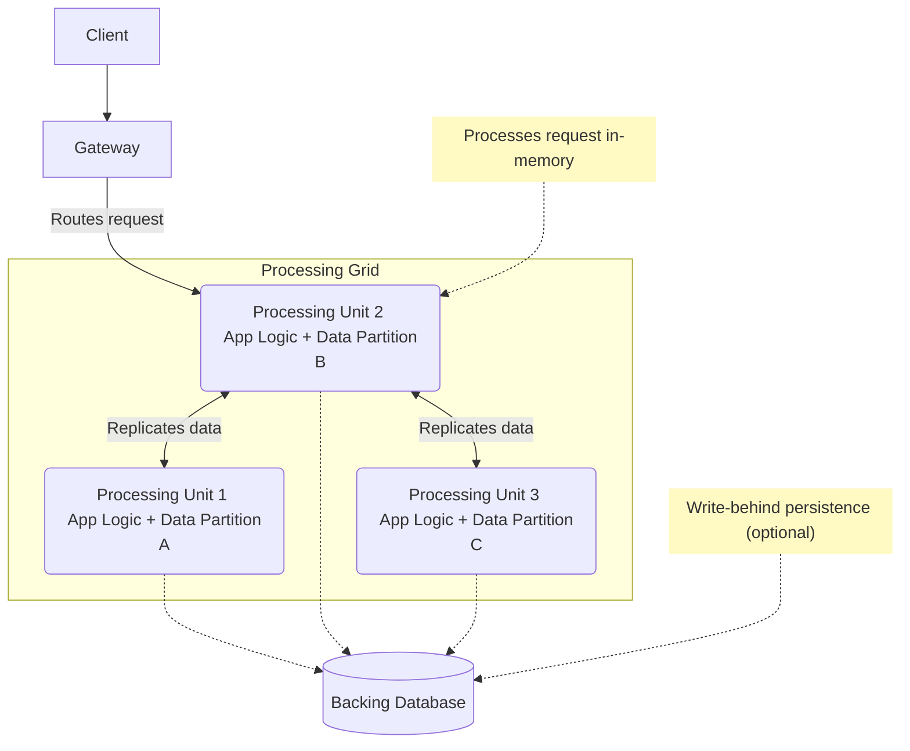

# Space-Based Architecture (SBA)

The **Space-Based Architecture** (SBA) is a high-performance [[software-architecture/architectural-styles/|architectural style]] designed for extreme scalability and elasticity. The name comes from the concept of a **"tuple space,"** a shared memory space where multiple processes can read and write data [[transversal-programming-models#1-concurrent-programming|concurrently]]. In SBA, this concept is realized as a grid of self-sufficient **processing units**, each hosting a copy of the application logic and a portion of the in-memory data.

This style, also known as **Shared-Nothing Architecture**, avoids the bottleneck of a central database by processing data in memory and replicating it across the grid.

* **Core Principles:**
    * **Shared-Nothing Processing:** Each Processing Unit (PU) is independent and does not share resources (CPU, memory) with others for request processing. While the data grid is replicated and "shared" across the network, the PUs themselves are autonomous.
    * **In-Memory Data Grid (IMDG):** The heart of SBA is the distributed in-memory data grid. Data is stored and processed directly in RAM for maximum performance.
    * **Elastic Scalability:** The architecture can scale out elastically by adding new processing units to handle increased load.
    * **Self-Healing:** In case of a node failure, the virtual middleware automatically fails over to a replica node without service interruption.

---

## Key Components and Communication Flow

1.  **Processing Unit (PU):** A self-sufficient component containing the application logic and an in-memory data store for a subset of the application's data. All PUs are identical.
2.  **Virtual Middleware:** The infrastructure that manages the grid. It includes:
    *   **Gateway:** Routes requests to the correct processing unit, typically based on a partition key in the request.
    *   **Messaging Grid:** Manages input request processing.
    *   **Data Grid:** The core of the pattern. It's the distributed in-memory data store that handles data replication and synchronization between processing units.
3.  **Backing Database:** A permanent data store (e.g., SQL or NoSQL) that is used for initial data loading and for long-term persistence via an asynchronous "write-behind" mechanism.

**Typical Data Flow:**
* A request is sent by the client.
* The **gateway** receives the request and routes it to the **processing unit** that holds the relevant data partition.
* The **processing unit** executes the business logic by accessing data directly in memory (read/write).
* Data modifications are replicated synchronously or asynchronously to one or more backup nodes to ensure resilience.
* The in-memory writes are **persisted asynchronously** to the central **Data Source**. This mechanism is typically called **write-behind** to avoid blocking the in-memory operation on disk write latency.
* The **processing unit** returns the response to the client.

### A Note on Data Partitioning

The scalability of SBA relies on effective data partitioning. The data grid is typically divided into partitions using a **routing key** (e.g., a customer ID, a product ID). The gateway uses this key to route a request directly to the Processing Unit that holds the relevant data partition. This ensures that each PU only manages a subset of the data, allowing the system to scale horizontally as more data and traffic are added.

---

## Advantages and Technical Challenges

* **Advantages (Benefits):**
    * **Horizontal Scalability (Scale-out):** The ability to add nodes indefinitely to increase processing capacity. It is an ideal solution for **bursts of traffic**.
    * **High Performance:** Using RAM for data storage and business logic execution eliminates the latency of disk and network access.
    * **High Availability and Resilience:** The lack of a **single point of failure** and the replication and failover mechanisms ensure service continuity.
    * **Low Latency:** Crucial for financial trading, online gaming, or real-time bidding applications.

* **Challenges:**
    * **Design Complexity:** Managing replicated data consistency (often with **eventual consistency**), partitioning, and failovers is complex to implement.
    * **RAM Cost:** The architecture is very memory-intensive, which can make the initial cost high.
    * **Deployment Complexity:** Deploying and managing the service grid and its components requires specific expertise.
    * **Consistency Issues:** While **strong consistency** is possible, it can limit performance. Often, an **eventual consistency** model is preferred, which may not be suitable for all applications.

---

## Related Patterns, Concepts and Variations

SBA is often implemented with technologies like **Apache Ignite**, **Hazelcast**, or **Oracle Coherence**. It is typically used in highly specific contexts and is not a universal architecture.

* **Typical Use Cases:**
    * **Financial Trading:** Real-time pricing and risk management systems.
    * **Online Auctions:** High-volume platforms where price updates must be instantaneous.
    * **Gaming:** Backends for multiplayer online games.
    * **E-commerce:** Recommendation engines and shopping cart management that require ultra-fast responses.

This architectural style is a highly specialized solution for specific **scalability** and **performance** problems. It is not a substitute for more traditional architectures like the [[layered|3-tier]] or [[microservices|microservices]], but rather a complementary option for the most critical parts of an application.

## **Resources & Links**

### **Articles**

1.  **[Space-Based Architecture: A Scalable Solution for High-Traffic Systems](https://simsonmoses.medium.com/space-based-architecture-a-scalable-solution-for-high-traffic-systems-6c8ad3fa31fb)**
    
    This article focuses on the ability of SBA to handle high-traffic systems by explaining the "shared-nothing" model and the use of in-memory data grids for optimal performance.

2.  **[Understanding Space-Based Architecture for efficient Data Processing](https://machine-learning-made-simple.medium.com/understanding-space-based-architecture-for-efficient-data-processing-68896a42b991)**
    
    This article by Devansh, which includes diagrams and clear explanations of resilience and fault tolerance, is a good resource for a deeper understanding of SBA.

---

### **Videos**

1.  **[Space Based Architecture - Lesson 166](https://www.youtube.com/watch?v=0nXKFwTEQHY)**
    
    This video is an excellent overview of SBA, explaining how this architecture uses "tuple spaces" to avoid database bottlenecks and achieve high elasticity and performance. The speaker, Mark Richards, presents the key principles and scenarios where this architecture is most appropriate, highlighting its pros and cons.

2.  **[Space-Based Architecture Styles](https://www.youtube.com/watch?v=b33qSmRwhgw&t)**
    
    This video is a detailed explanation of SBA, addressing the challenges of traditional architectures and how SBA solves problems of scalability and concurrency. It breaks down the architecture into its main components (Processing Unit, Data Grid, Messaging Grid) and explains their roles for a comprehensive understanding of the design style.