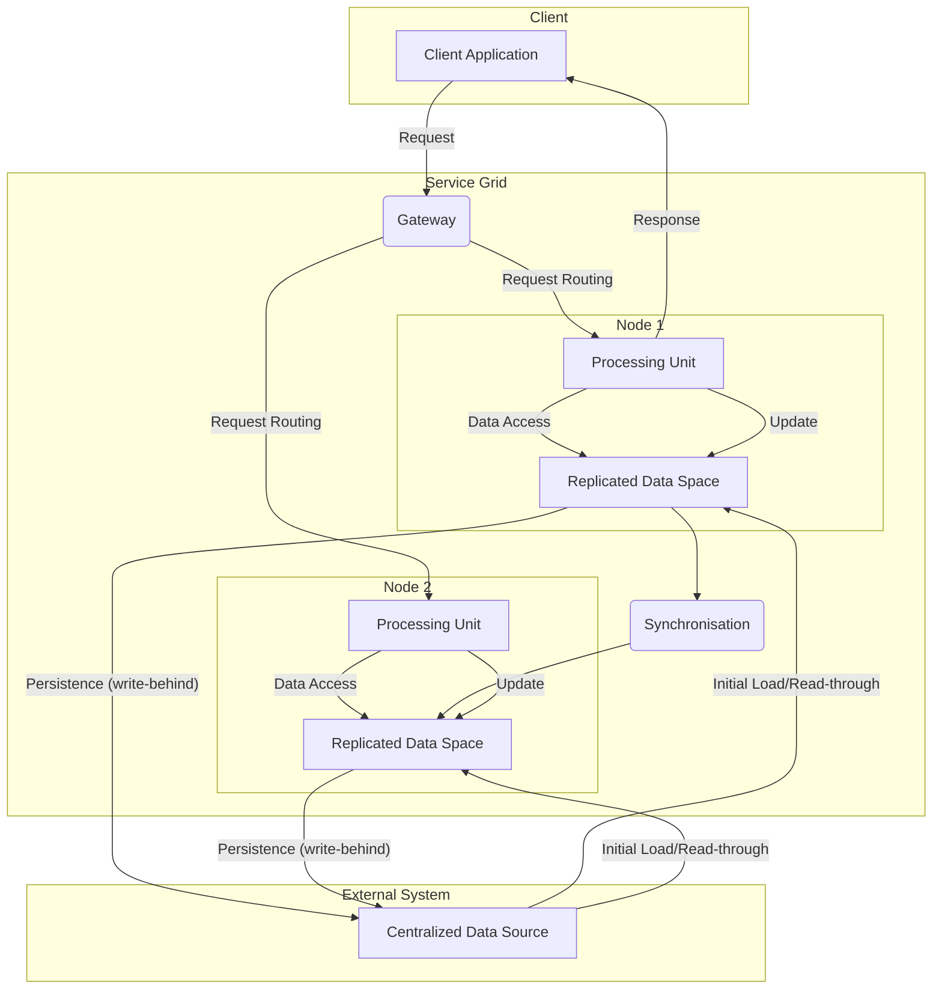

# Space-Based Architecture (SBA)

The **Space-Based Architecture** (SBA), also known as **Shared-Nothing Architecture**, is a distributed system design style focused on high performance, scalability, and resilience, particularly suited for applications with high transaction volumes and low latency. This model relies on replicating data and application logic in memory across multiple nodes ("spaces"), eliminating **single points of failure** and bottlenecks associated with a centralized database.

* **Core Principles:**
    * **Shared-Nothing:** Each processing node is independent and does not share memory or disk with others. Data is replicated between nodes.
    * **In-Memory Data Grid (IMDG):** The heart of SBA is the in-memory data grid. Data is stored and processed directly in RAM for maximum performance.
    * **Elastic Scalability:** The architecture can scale out elastically by adding new nodes to handle increased load.
    * **Self-Healing:** In case of a node failure, data and processing are automatically switched to a replicated node without service interruption.

---

## Key Components and Communication Flow

1.  **Client:** The application or service that interacts with the service grid.
2.  **Processing Unit (Processing Grid):** A container that includes both the application's business logic and a portion of the data. This component handles requests.
3.  **Data Space (IMDG):** The distributed in-memory data grid. Data is partitioned and replicated here. Each **processing unit** has local, direct access to the data it is responsible for.
4.  **Gateway:** The entry point that routes incoming requests to the appropriate **processing units**, often based on the data's partitioning key.
5.  **Centralized Data Source:** A **single, external persistence database** (relational or NoSQL) that serves as the source of truth for all data. **Processing units** interact with it to load data and persist it durably.

**Typical Data Flow:**
* A request is sent by the client.
* The **gateway** receives the request and routes it to the **processing unit** that holds the relevant data partition.
* The **processing unit** executes the business logic by accessing data directly in memory (read/write).
* Data modifications are replicated synchronously or asynchronously to one or more backup nodes to ensure resilience.
* The in-memory writes are **persisted asynchronously** to the central **Data Source**. This mechanism is typically called **write-behind** to avoid blocking the in-memory operation on disk write latency.
* The **processing unit** returns the response to the client.

---

## Advantages and Technical Challenges

* **Advantages (Benefits):**
    * **Horizontal Scalability (Scale-out):** The ability to add nodes indefinitely to increase processing capacity. It is an ideal solution for **bursts of traffic**.
    * **High Performance:** Using RAM for data storage and business logic execution eliminates the latency of disk and network access.
    * **High Availability and Resilience:** The lack of a **single point of failure** and the replication and failover mechanisms ensure service continuity.
    * **Low Latency:** Crucial for financial trading, online gaming, or real-time bidding applications.

* **Challenges:**
    * **Design Complexity:** Managing replicated data consistency (often with **eventual consistency**), partitioning, and failovers is complex to implement.
    * **RAM Cost:** The architecture is very memory-intensive, which can make the initial cost high.
    * **Deployment Complexity:** Deploying and managing the service grid and its components requires specific expertise.
    * **Consistency Issues:** While **strong consistency** is possible, it can limit performance. Often, an **eventual consistency** model is preferred, which may not be suitable for all applications.

---

## Variations and Derived Architectures

SBA is often implemented with technologies like **Apache Ignite**, **Hazelcast**, or **Oracle Coherence**. It is typically used in highly specific contexts and is not a universal architecture.

* **Typical Use Cases:**
    * **Financial Trading:** Real-time pricing and risk management systems.
    * **Online Auctions:** High-volume platforms where price updates must be instantaneous.
    * **Gaming:** Backends for multiplayer online games.
    * **E-commerce:** Recommendation engines and shopping cart management that require ultra-fast responses.

This architectural style is a highly specialized solution for specific **scalability** and **performance** problems. It is not a substitute for more traditional architectures like the [[layered|3-tier]] or **microservices**, but rather a complementary option for the most critical parts of an application.

## **Resources & Links**

### **Articles**

1.  **[Space-Based Architecture: A Scalable Solution for High-Traffic Systems](https://simsonmoses.medium.com/space-based-architecture-a-scalable-solution-for-high-traffic-systems-6c8ad3fa31fb)**
    
    This article focuses on the ability of SBA to handle high-traffic systems by explaining the "shared-nothing" model and the use of in-memory data grids for optimal performance.

2.  **[Understanding Space-Based Architecture for efficient Data Processing](https://machine-learning-made-simple.medium.com/understanding-space-based-architecture-for-efficient-data-processing-68896a42b991)**
    
    This article by Devansh, which includes diagrams and clear explanations of resilience and fault tolerance, is a good resource for a deeper understanding of SBA.

---

### **Videos**

1.  **[Space Based Architecture - Lesson 166](https://www.youtube.com/watch?v=0nXKFwTEQHY)**
    
    This video is an excellent overview of SBA, explaining how this architecture uses "tuple spaces" to avoid database bottlenecks and achieve high elasticity and performance. The speaker, Mark Richards, presents the key principles and scenarios where this architecture is most appropriate, highlighting its pros and cons.

2.  **[Space-Based Architecture Styles](https://www.youtube.com/watch?v=b33qSmRwhgw&t)**
    
    This video is a detailed explanation of SBA, addressing the challenges of traditional architectures and how SBA solves problems of scalability and concurrency. It breaks down the architecture into its main components (Processing Unit, Data Grid, Messaging Grid) and explains their roles for a comprehensive understanding of the design style.