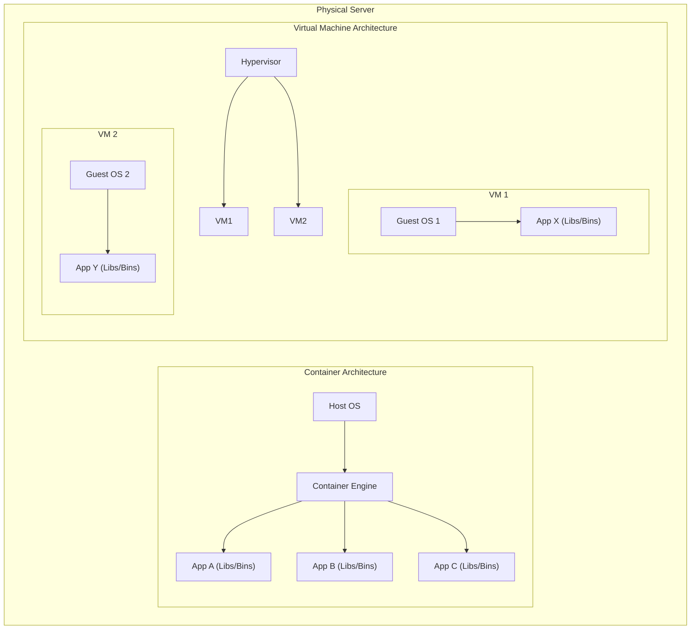
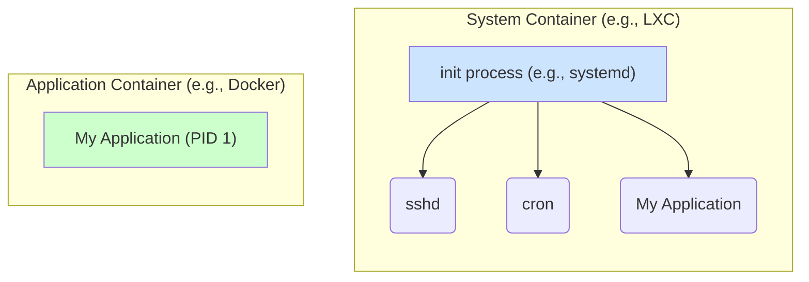

Containerization is a form of operating system virtualization that allows an application and its dependencies—such as libraries, system tools, and runtime environments—to be packaged together in a lightweight, isolated environment known as a container. This encapsulation ensures that the application runs consistently and reliably across different computing environments.

Unlike traditional Virtual Machines (VMs) that virtualize an entire hardware stack including a full guest OS, containers share the host system's OS kernel. This makes them significantly more lightweight, faster to start, and more resource-efficient, enabling higher density on a single host.

This technology is a cornerstone of modern [[cloud-native-principles]] development and DevOps practices, forming the foundation for [[microservices]] architectures and streamlining CI/CD pipelines.

### Containers vs. Virtual Machines

The primary difference lies in the level of abstraction. VMs virtualize hardware, while containers virtualize the operating system.

*   **VMs** each have a full-blown guest OS, leading to significant overhead in size (gigabytes) and startup time (minutes).
*   **Containers** share the host kernel and package only the application and its dependencies, resulting in a smaller footprint (megabytes) and near-instantaneous startup.

---

### System Containers vs. Application Containers

A critical distinction in the container world is the philosophy behind what a container represents.

*   **System Containers (e.g., [[lxc|LXC]])**: Aim to virtualize a full operating system. They boot an `init` process, allowing them to run multiple services and behave like a traditional, lightweight virtual machine. You can SSH into them, install packages, and manage them as persistent servers.

*   **Application Containers (e.g., [[docker|Docker]])**: Designed to package and run a single application process. The container's lifecycle is tied to this one process. This model is optimized for immutable infrastructure and deploying [[microservices]].

---

### Technology Comparison: LXC vs. Docker

| Feature | LXC (Linux Containers) | Docker |
| :--- | :--- | :--- |
| **Philosophy** | **System Container**: Emulates a full OS. | **Application Container**: Runs a single process. |
| **Process Management** | Runs a full `init` system, can manage multiple processes. | Designed to run a single foreground process (PID 1). |
| **Image/Filesystem** | Typically uses a root filesystem based on a distribution template (e.g., Ubuntu, CentOS). | Uses a layered image format (Docker Image) for portability and versioning. |
| **Networking** | Provides advanced, flexible networking options (bridges, veth pairs). | Provides simpler, more abstracted networking models (bridge, host, overlay). |
| **Use Case** | Lightweight VMs, development environments, infrastructure virtualization. | [[microservices]], CI/CD, application packaging and distribution. |

---

### Core Concepts

- **Container Image & Union Filesystems**: A static, immutable file that acts as a blueprint for a container. It's a snapshot containing everything needed to run an application: code, runtime, libraries, and environment variables. Modern container images are built using a **layered filesystem**. Each instruction in a `Dockerfile` (or similar build script) creates a new layer on top of the previous one. This design is made possible by **union file systems** (like OverlayFS), which can merge several layers into a single, coherent filesystem view. This layering is highly efficient, as it allows different images to share common layers (like a base OS), significantly reducing disk space usage and speeding up image distribution.
- **Container Engine**: The runtime software that manages containers. It is responsible for creating, starting, stopping, and destroying containers based on the specified images. While [[docker|Docker]] popularized application containers, other important engines exist. Lower-level runtimes like `containerd` and `CRI-O` are foundational in the Kubernetes ecosystem. Another key technology is [[lxc|LXC (Linux Containers)]], which focuses more on "system containers" that behave like lightweight virtual machines, offering a different approach to virtualization.
- **Container Orchestration**: As the number of containers grows, managing them manually becomes impractical. Orchestration platforms automate the deployment, management, [[software-architecture/system-design-fundamentals/index#Scalability|scaling]], and networking of containers. [[kubernetes|Kubernetes]] has become the de-facto standard for container orchestration, though other tools like Docker Swarm and Apache Mesos exist.

### Open Container Initiative (OCI)
The OCI is a governance body established under the Linux Foundation to create open industry standards around container formats and runtimes. Its goal is to ensure that the container ecosystem remains interoperable, preventing vendor lock-in. The OCI maintains two key specifications:
- **The Runtime Specification (runtime-spec)**: Defines how to run a "filesystem bundle" as a container. Runtimes like `runc` (used by Docker) are implementations of this spec.
- **The Image Specification (image-spec)**: Defines the format for container images, ensuring that an image built with one tool (like Docker) can be run by any other OCI-compliant runtime.

### Benefits of Containerization

1.  **Portability**: "Build once, run anywhere." A containerized application and its dependencies are guaranteed to run uniformly on any environment that supports the container runtime, from a developer's laptop to a production cloud server.
2.  **Efficiency & Density**: The lightweight nature of containers allows for much higher resource utilization. More containers can run on a single host compared to VMs, reducing infrastructure costs.
3.  **Consistency**: Eliminates the "it works on my machine" problem. By packaging dependencies, containers ensure a consistent environment from development through staging and into production.
4.  **[[software-architecture/system-design-fundamentals/index#Scalability|Scalability]] & Agility**: Containers can be spun up or down in seconds, enabling rapid, fine-grained scaling of application components. This is a perfect match for [[microservices]] architectures, where individual services can be scaled independently.
5.  **Faster Development Lifecycle**: Containerization accelerates CI/CD pipelines. The consistent and portable format simplifies the build, test, and deployment processes, enabling teams to ship features faster.
6.  **Isolation**: Containers provide process and filesystem isolation. While not as strong as the hardware-level isolation of VMs, it ensures that applications do not interfere with each other on the same host.

### Challenges and Considerations

- **Security**: Sharing the host kernel introduces a potential security risk. A kernel vulnerability could theoretically allow a process to break out of its container and access the host or other containers. Secure images, vulnerability scanning, and runtime security tools are essential.
- **Data Persistence**: Containers are ephemeral by default. When a container is destroyed, its data is lost. Persistent storage must be managed externally using volumes, which map a host directory or a network storage location into the container.
- **Complexity**: While simple applications are easy to containerize, large-scale distributed systems introduce complexity in networking, storage, and observability. Container orchestration platforms like [[kubernetes|Kubernetes]] have a steep learning curve.
- **Monitoring**: Traditional monitoring tools may not be sufficient. [[software-architecture/observability/|Observability]] in a containerized environment requires tools that can track ephemeral containers, aggregate logs, and trace requests across multiple services. See [[opentelemetry]].

### Common Use Cases

- **Microservices**: Containerization is the ideal deployment model for [[microservices]], where each service can be packaged, scaled, and updated independently.
- **CI/CD Pipelines**: Used to create consistent build and test environments, ensuring that artifacts are validated in a production-like setting before deployment.
- **Lift and Shift**: Migrating legacy applications to modern infrastructure. An application can be packaged into a container with minimal code changes, allowing it to run on a cloud platform. This is often a first step before refactoring into a more [[cloud-native-principles|cloud-native]] architecture, sometimes using the [[strangler-fig]] pattern.
- **Hybrid and Multi-Cloud Deployments**: Containers abstract away the underlying infrastructure, making it easier to move workloads between on-premises data centers and different public cloud providers.

---

## Resources & links

### Articles

1.  **[What is a Container? - Docker](https://www.docker.com/resources/what-container/)**

    This official resource from Docker defines a container as a standard unit of software that packages up code and all its dependencies. It explains how containers enable applications to run quickly and reliably from one computing environment to another, highlighting their lightweight nature and efficiency compared to virtual machines.

2.  **[What are Containers? - Google Cloud](https://cloud.google.com/learn/what-are-containers?hl=en)**

    A clear explanation from Google Cloud on the fundamentals of containers. The article details how containers provide OS-level virtualization, their key benefits like portability and isolation, and their role in modern application development, particularly within microservices architectures and CI/CD pipelines.

### Videos

1.  **[Containerization Explained - IBM Technology](https://www.youtube.com/watch?v=0qotVMX-J5s)**

    This video from IBM Technology provides a concise overview of containerization. It explains how containers bundle an application with its dependencies to ensure consistent operation across different environments and contrasts this with traditional virtual machines, highlighting the efficiency gains from sharing the host OS kernel.

2.  **[Containers vs VMs: What's the difference? - IBM Technology](https://www.youtube.com/watch?v=cjXI-yxqGTI)**

    This video from IBM Technology clearly explains the fundamental differences between virtual machines (VMs) and containers. It highlights that VMs virtualize the hardware to run multiple operating systems, while containers virtualize the operating system itself, allowing multiple applications to run in isolated processes on a single OS. The video also discusses how both technologies can be used together in modern cloud-native architectures.
