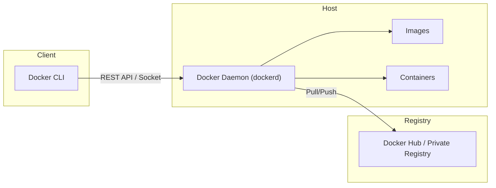

**Docker** is an open-source platform that implements [[containerization]] technology to automate the deployment, scaling, and management of applications. While often used synonymously with containers, Docker specifically provides the tooling and runtime environment to build, share, and run application containers efficiently.

It differs from system containers (like [[lxc]]) by focusing on **application containers**—packaging a single service and its dependencies into a standardized unit that runs consistently across any infrastructure.

---

## Architecture

Docker uses a client-server architecture. The client talks to the Docker daemon, which does the heavy lifting of building, running, and distributing your Docker containers.



- **Docker Daemon (`dockerd`)**: The persistent process that manages Docker objects (images, containers, networks, volumes). It listens for Docker API requests.
- **Docker Client (`docker`)**: The primary way many Docker users interact with Docker. When you use commands like `docker run`, the client sends these commands to `dockerd`, which carries them out.
- **Docker Registries**: Stores Docker images. Docker Hub is a public registry that anyone can use, and Docker is configured to look for images on Docker Hub by default.

---

## Core Objects

### 1. Images
An **Image** is a read-only template with instructions for creating a Docker container. Often, an image is based on another image, with some additional customization.
- **Layered Filesystem**: Images are built from layers. Each layer represents an instruction in the image's Dockerfile. When you change the Dockerfile and rebuild the image, only those layers which have changed are rebuilt.
- **UnionFS**: Docker uses Union File Systems to combine these layers into a single image.

### 2. Containers
A **Container** is a runnable instance of an image. You can create, start, stop, move, or delete a container using the Docker API or CLI.
- **Isolation**: By default, a container is relatively well isolated from other containers and its host machine. You can control how isolated a container's network, storage, or other underlying subsystems are from other containers or from the host machine.
- **Ephemeral**: Containers are designed to be transient.

### 3. Storage
By default, all files created inside a container are stored on a writable container layer. This means the data doesn't persist when that container no longer exists, and it can be difficult to get the data out of the container if another process needs it.
- **Volumes**: Stored in a part of the host filesystem which is managed by Docker (`/var/lib/docker/volumes/`). This is the best way to persist data in Docker.
- **Bind Mounts**: Map a file or directory on the host machine to a file or directory in the container.

### 4. Networking
Docker's networking subsystem is pluggable, using drivers.
- **Bridge**: The default network driver. Used when applications run in standalone containers that need to communicate.
- **Host**: Removes network isolation between the container and the Docker host.
- **Overlay**: Connects multiple Docker daemons together and enables swarm services to communicate with each other.

---

## The Dockerfile

A `Dockerfile` is a text document that contains all the commands a user could call on the command line to assemble an image.

### Common Instructions
- `FROM`: Sets the Base Image for subsequent instructions.
- `RUN`: Executes any commands in a new layer on top of the current image and commits the results.
- `COPY` / `ADD`: Copies new files or directories from `<src>` and adds them to the filesystem of the container at the path `<dest>`.
- `CMD`: Provides defaults for an executing container.
- `ENTRYPOINT`: Configures a container that will run as an executable.

### Pattern: Multi-Stage Builds
One of the most powerful patterns to keep image size down. You use one stage to build your application (with all build tools) and a second stage to run it (with only the runtime).

```dockerfile
# Stage 1: Build
FROM golang:1.21 AS builder
WORKDIR /app
COPY . .
RUN go build -o myapp main.go

# Stage 2: Run
FROM alpine:latest
WORKDIR /root/
# Copy only the binary from the builder stage
COPY --from=builder /app/myapp .
CMD ["./myapp"]
```

---

## Docker Compose

**Docker Compose** is a tool for defining and running multi-container Docker applications. With Compose, you use a YAML file to configure your application's services.

Example `docker-compose.yml`:
```yaml
version: "3.9"
services:
  web:
    build: .
    ports:
      - "5000:5000"
    depends_on:
      - redis
  redis:
    image: "redis:alpine"
    volumes:
      - redis-data:/data

volumes:
  redis-data:
```

---

## Best Practices

1.  **Don't Run as Root**: Whenever possible, run your processes as a non-root user inside the container to limit the blast radius of security vulnerabilities.
2.  **Keep Images Small**: Use minimal base images (like `alpine` or `distroless`) and multi-stage builds.
3.  **One Process Per Container**: Decouple applications into multiple containers. This makes it easier to scale horizontally and reuse containers.
4.  **Use `.dockerignore`**: Exclude files not relevant to the build (like `.git`, `node_modules`) to speed up the build context sending and keep images clean.
5.  **Tagging Strategy**: Avoid using `latest` in production. Use specific version tags (e.g., `node:18.4.0`) to ensure reproducibility.

---

## Resources & Links

### Articles

1.  **[What is Docker? - Docker Docs](https://docs.docker.com/get-started/docker-overview/)**
    This official overview provides an in-depth look at the Docker platform, explaining its client-server architecture, the role of the daemon, and key objects like images and containers. It also details how Docker enables fast, consistent delivery of applications and efficient resource utilization.

2.  **[Docker: Explained Simply for a 10-Year-Old](https://aws.plainenglish.io/docker-explained-simply-for-a-10-year-old-the-magic-box-for-computer-programs-94452b930d6b)**
    A beginner-friendly article that uses the analogy of a "magic box" to explain containerization. It simplifies complex concepts into easy-to-understand terms, highlighting how Docker ensures that a program runs exactly the same way on any computer, regardless of the underlying system.

3.  **[A Comprehensive Guide to Docker](https://medium.com/@moraneus/a-comprehensive-guide-to-docker-286d6f3ad122)**
    This guide covers the core concepts of Docker, including images, containers, and Dockerfiles, and provides a practical list of useful commands for building, running, and managing containers. It serves as a solid introduction for developers looking to understand the operational side of Docker.

### Videos

1.  **[What is Docker in 5 minutes](https://www.youtube.com/watch?v=_dfLOzuIg2o)**
    A concise video introduction that explains the fundamental concepts of Docker and containerization. It covers the problems Docker solves, such as the "it works on my machine" issue, and provides a high-level overview of how containers differ from virtual machines.

2.  **[100+ Docker Concepts you Need to Know](https://www.youtube.com/watch?v=rIrNIzy6U_g)**
    An extensive tutorial that dives deep into the Docker ecosystem. This video is ideal for those who want to go beyond the basics, covering a wide range of topics from building images and running containers to scaling infrastructure and understanding the nuances of containerization.
