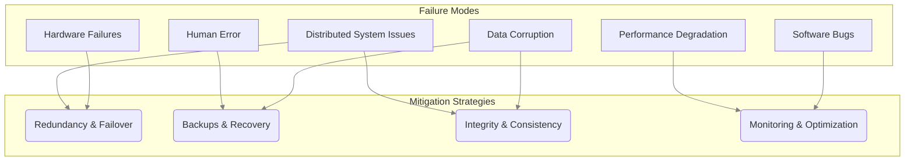

# Database Failure Modes

Understanding how a database can fail is as critical as understanding how it works. Database failure modes are the various ways a database system can malfunction, leading to issues ranging from performance degradation to complete data loss. Designing a reliable system requires anticipating these failures and implementing strategies to mitigate their impact.

This page catalogs the common failure modes and introduces the high-level strategies and patterns used to build resilient, fault-tolerant data layers.

*Description: Common database failure modes and the corresponding high-level strategies used to mitigate them.*

---

## Hardware Failures

These are physical failures of the underlying server components. While cloud providers have reduced the impact of single-component failures, they can still occur.

-   **Disk Failure**: Hard drives (both SSD and HDD) have a finite lifespan and can fail, leading to data loss on that disk.
-   **Memory Errors**: RAM modules can fail, causing server crashes or data corruption in memory.
-   **Power Outages**: A loss of power can bring a database server down instantly.
-   **Network Failures**: A faulty network interface card (NIC) or switch can isolate the database server from the application.

#### Mitigation Strategies
-   **Redundancy**: This is the primary defense.
    -   **RAID (Redundant Array of Independent Disks)**: Configures multiple disks to act as a single unit, providing redundancy against single-disk failure.
    -   **Replication**: The most effective strategy. By replicating data to one or more standby servers, the system can fail over if the primary server is lost. See [[availability-patterns]].
-   **Backups**: Regular, automated backups are essential for recovering from catastrophic hardware failure.

---

## Software Bugs

Bugs can exist in the database management system (DBMS) itself or in the application code that interacts with it.

-   **DBMS Bugs**: A bug in the database software (e.g., PostgreSQL, MongoDB) could cause crashes, incorrect query results, or subtle data corruption.
-   **Application Bugs**: A flaw in the application logic can lead to writing incorrect or inconsistent data into the database. For example, a non-idempotent API endpoint could create duplicate records if retried. See [[idempotent-operations]].

#### Mitigation Strategies
-   **Thorough Testing**: Rigorous unit, integration, and end-to-end testing can catch many application-level bugs.
-   **Use Stable Versions**: Avoid using bleeding-edge versions of database software in production.
-   **Monitoring and Alerting**: Proactive [[monitoring]] can help detect anomalies caused by bugs before they become critical.
-   **Canary Deployments**: Roll out new application code to a small subset of users first to limit the blast radius of potential bugs.

---

## Data Corruption

Data corruption occurs when data becomes unreadable, inaccurate, or inconsistent.

-   **Physical Corruption**: Often caused by hardware issues or bugs in the disk subsystem, where the data on the storage medium is physically damaged.
-   **Logical Corruption**: The data is physically readable but is semantically incorrect. This is often caused by application bugs or human error (e.g., incorrectly updating a foreign key, leading to an orphaned record).

#### Mitigation Strategies
-   **[[data-integrity|Data Integrity Constraints]]**: Using `PRIMARY KEY`, `FOREIGN KEY`, and `CHECK` constraints helps prevent logical corruption at the database level.
-   **Checksums**: Many databases use internal checksums to detect physical data corruption on disk.
-   **Transaction Logging**: The write-ahead log (WAL) used to ensure [[acid|ACID]] durability can also be used to recover from corruption.
-   **Point-in-Time Recovery (PITR)**: Combining regular backups with transaction logs allows you to restore a database to a specific point in time just before the corruption occurred.

---

## Performance Degradation

This is a "silent killer" where the database is technically operational but has become so slow that the application is unusable.

-   **Unoptimized Queries**: A single inefficient query (e.g., a full table scan on a massive table) can consume excessive CPU and I/O, slowing down the entire system.
-   **Index Issues**: Missing indexes are a common cause of slow reads. Unused or poorly designed indexes can slow down writes.
-   **Resource Exhaustion**: The server runs out of CPU, RAM, or disk I/O capacity. This is a classic [[system-performance#9. Noisy Neighbor|noisy neighbor]] problem in consolidated environments.
-   **Deadlocks**: Two or more transactions are stuck, each waiting for the other to release a lock. The database will typically detect and kill one of the transactions, but frequent deadlocks indicate a design problem.

#### Mitigation Strategies
-   **[[monitoring#Performance Monitoring|Performance Monitoring]]**: Use tools to monitor query latency, resource utilization, and other key metrics.
-   **[[rdbms#SQL Tuning|Query Analysis]]**: Use tools like `EXPLAIN` to analyze query execution plans and identify bottlenecks.
-   **Indexing Strategy**: Add indexes strategically to support common query patterns.
-   **[[caching|Caching]]**: Reduce read load on the database by caching frequently accessed data.
-   **[[sharding|Sharding]]**: Distribute data and load across multiple servers to improve [[software-architecture/system-design-fundamentals/index#Scalability|scalability]].

---

## 5Distributed System Issues

When a database is distributed across multiple nodes, a new class of failures emerges, primarily related to networking and consistency.

-   **Network Partitions**: A network failure isolates nodes from each other. The [[cap|CAP Theorem]] dictates that during a partition, you must choose between [[availability-patterns|availability]] and [[consistency]].
-   **Replication Lag**: In asynchronous replication, there is a delay before writes on the primary are visible on the replicas. Reading from a replica during this window can return stale data.
-   **Split-Brain**: A scenario in a distributed system where, due to a network partition, two or more subsets of nodes believe they are the "primary" authority. This can lead to conflicting writes and data divergence.

#### Mitigation Strategies
-   **Consensus Algorithms**: Use algorithms like Paxos or Raft to ensure that all nodes agree on the state of the system, which is crucial for [[leader-election]].
-   **Quorum Reads/Writes**: Configure the number of replicas that must acknowledge a read or write operation. This allows you to tune the trade-off between [[consistency]] and performance.
-   **Heartbeating and Fencing**: Nodes use heartbeat messages to monitor each other's health. Fencing is a technique to forcefully shut down a node that is believed to be malfunctioning to prevent a split-brain scenario.

---

## Human Error

One of the most common causes of failure.

-   **Accidental Deletion**: A developer or DBA runs a `DELETE` or `DROP TABLE` command on the production database by mistake.
-   **Misconfiguration**: Incorrectly configuring database settings (e.g., memory allocation, security rules) can lead to poor performance or vulnerabilities.
-   **Faulty Migrations**: A flawed [[database-migration]] script can corrupt data or break the schema.

#### Mitigation Strategies
-   **Access Control**: Implement the principle of least privilege. Developers should not have direct write access to production databases. This involves robust [[authentication]] to verify identity and [[authorization]] to define what actions an authenticated user can perform.
-   **Automated Backups**: Ensure you have a reliable, automated backup and restore process.
-   **Infrastructure as Code (IaC)**: Manage database configurations as code to make changes repeatable and reviewable.
-   **Migration Reviews**: All [[database-migration]] scripts should be peer-reviewed and tested in a staging environment before being applied to production.
