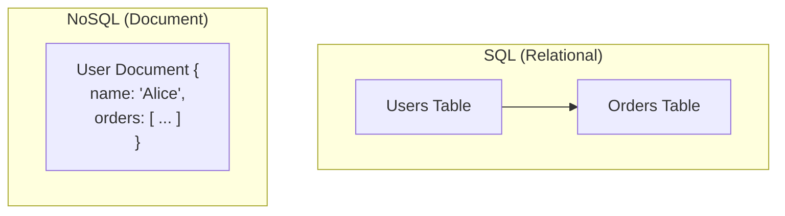

# Databases in System Design

Choosing the right database is one of the most critical decisions in system design. The choice impacts [[system-design-fundamentals#Performance-vs-Scalability|performance]], [[system-design-fundamentals#Scalability|scalability]], [[data-integrity|data integrity]], and the overall complexity of the system. A database model that excels for one use case can be a poor fit for another.

This section introduces the two major families of databases—[[rdbms|SQL]] and [[nosql|NoSQL]] —and explores the fundamental trade-offs between them.

---

## The Fundamental Trade-Off: SQL vs. NoSQL

The primary difference between [[rdbms|SQL]] and [[nosql|NoSQL]]  lies in how they model, store, and retrieve data, which in turn dictates their strengths in consistency, scalability, and flexibility.

*Description: [[rdbms|SQL databases]]  use a structured, tabular format with relationships between tables. [[nosql|NoSQL databases]]  often use flexible formats like JSON documents where related data can be embedded.*

### SQL (Relational) Databases

[[rdbms|Relational databases]] , which use Structured Query Language (SQL), have been the standard for decades. They organize data into tables with rows and columns, and enforce a predefined schema.

-   **Data Model:** Structured and tabular.
-   **Schema:** Fixed and defined before data is inserted. Enforces [[data-integrity|data integrity]].
-   **Key Strength:** Guarantees **[[acid|ACID]]** transactions (Atomicity, Consistency, Isolation, Durability), making them extremely reliable for financial and mission-critical data.
-   **Querying:** [[rdbms|SQL]] is an extremely powerful language for performing complex queries, aggregations, and JOINs across multiple tables.
-   **Scalability:** Traditionally scale **[[system-design-fundamentals#Scalability|vertically]]** (by increasing the power of a single server). While modern RDBMS have better horizontal scaling, it is generally more complex than in [[nosql|NoSQL]]  systems.
-   **Examples:** MySQL, PostgreSQL, Microsoft SQL Server, Oracle.
-   **Learn more:** [[rdbms|Relational Databases (RDBMS)]]

### NoSQL (Non-Relational) Databases

[[nosql|NoSQL databases]]  emerged to meet the demands of large-scale, distributed systems where the rigid structure of [[rdbms|SQL]] was a bottleneck. They encompass a wide variety of data models.

-   **Data Model:** Highly flexible, including Key-Value, Document, Column-family, and Graph models.
-   **Schema:** Dynamic or schema-less. You can add new fields without redefining the entire database structure.
-   **Key Strength:** Designed for **[[system-design-fundamentals#Scalability|horizontal scaling]]** (scaling out by adding more servers). They often prioritize performance and [[system-design-patterns/availability-patterns|availability]] over [[consistency#Strong-Consistency|strong consistency]], aligning with the **BASE** model (Basically Available, Soft state, [[consistency#Eventual-Consistency|Eventually consistent]]).
-   **Querying:** Query languages vary by database and are often less powerful than SQL for complex joins.
-   **Trade-offs:** The flexibility and scalability often come at the cost of weaker consistency guarantees, as explained in the [[cap|CAP Theorem]].
-   **Examples:** MongoDB (Document), Redis (Key-Value), Cassandra (Wide-column), Neo4j (Graph).
-   **Learn more:** [[nosql|NoSQL Databases]]

---

## Further Reading

* [[failure-modes|Database Failure Modes]]
* [[poeaa#Object-Relational-Mapper-(ORM)|Object-Relational Mapper (ORM)]]
* [[monitoring#Performance-Monitoring|Performance Monitoring]]

---

## At a Glance: SQL vs. NoSQL

| Feature | SQL (RDBMS) | NoSQL |
| :--- | :--- | :--- |
| **Data Model** | Structured (Tables with rows/columns) | Flexible (Documents, Key-Value, etc.) |
| **Schema** | Rigid, predefined | Dynamic |
| **Scalability** | Vertical (Scale-up) | Horizontal (Scale-out) |
| **Consistency** | Strong ([[acid|ACID]]) | Varies (Often BASE / Eventual) |
| **Querying** | Powerful SQL with complex JOINs | Varies; often simpler, no complex JOINs |
| **Best for...** | Financial systems, e-commerce, applications requiring high [[data-integrity|data integrity]]. | Big Data, social media, IoT, real-time web apps. |

---

## Resources & links

### Articles

1.  **[SQL vs. NoSQL: What’s the difference? - IBM](https://www.ibm.com/blog/sql-vs-nosql/)**
    An article from IBM that provides a high-level overview of the key differences in data structure, scalability, and use cases for SQL and [[nosql|NoSQL databases]] .

2.  **[SQL vs NoSQL: 5 Critical Differences | Integrate.io](https://www.integrate.io/blog/the-sql-vs-nosql-difference/)**
    This article details five critical differences between SQL and NoSQL, focusing on architecture, schemas, and scaling to help choose the right database.

### Videos

1.  **[SQL vs. NoSQL: What's the difference?](https://www.youtube.com/watch?v=Q5aTUc7c4jg)**
    A video from IBM explaining the top five differences between SQL and NoSQL to help in making an informed decision.

2.  **[SQL vs. NoSQL Explained (in 4 Minutes)](https://www.youtube.com/watch?v=_Ss42Vb1SU4)**
    A concise video that clarifies the distinctions between SQL and NoSQL, covering concepts like structured data, [[acid|ACID]] compliance, and horizontal scaling.
