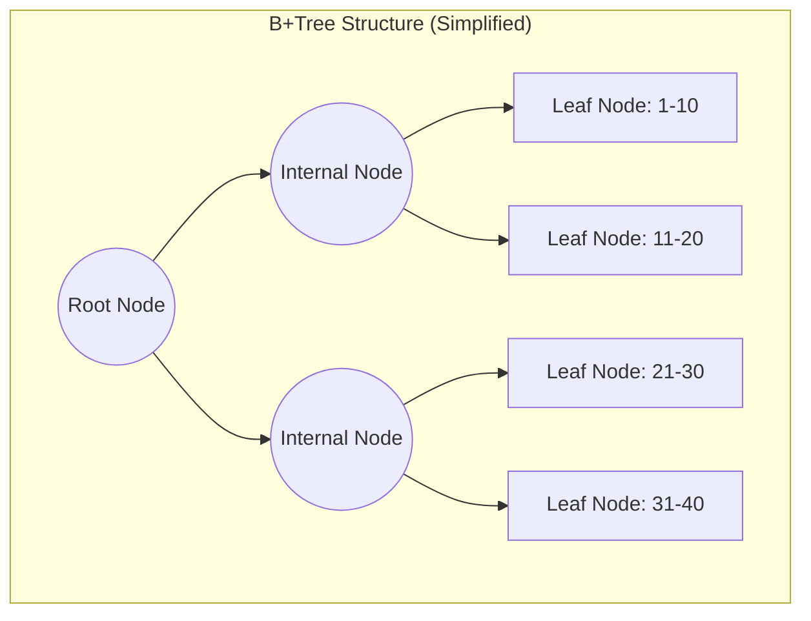

# Database Indexing

**Database Indexing** is a data structure technique used to quickly locate and access the data in a database. Indexes are the primary tool for optimizing query performance, often turning an operation that takes minutes into one that takes milliseconds.

## The Fundamental Trade-off

Indexing is not free. It introduces a fundamental trade-off between **Read Performance** and **Write Performance**.

*   **Faster Reads**: Indexes allow the database to find rows without scanning the entire table (a "full table scan").
*   **Slower Writes**: Every time you `INSERT`, `UPDATE`, or `DELETE` data, the database must update not just the table, but also every index associated with that table.
*   **Storage Cost**: Indexes consume additional disk space and memory.

---

## Core Data Structures

Different databases use different underlying data structures for indexing, optimized for different workloads.

### 1. B-Tree (Balanced Tree) / B+Tree

The **B-Tree** (and its variant, the B+Tree) is the standard index structure for almost all **Relational Databases (RDBMS)** like PostgreSQL, MySQL, and Oracle.

*   **Mechanism**: It organizes data in a balanced tree structure. This keeps the tree shallow, ensuring that any piece of data can be found in a predictable, logarithmic number of steps ([[computer-science/algorithm-complexity-analysis|O(log n)]]).
*   **Optimized For**: **Read-heavy** workloads and **Range Queries** (e.g., `WHERE age > 25`).
*   **How it works**: The tree remains sorted. To find a value, you start at the root and traverse down.

### 2. LSM Tree (Log-Structured Merge-Tree)

The **LSM Tree** is the standard index structure for many modern **NoSQL Databases** like Cassandra, RocksDB, and LevelDB.

*   **Mechanism**: It buffers writes in memory (MemTable) and then flushes them to disk as immutable sorted files (SSTables). Background processes periodically merge these files (Compaction).
*   **Optimized For**: **Write-heavy** workloads. Because writes are simply appended to a log file (sequential I/O), they are extremely fast compared to the random I/O often required to update a B-Tree.
*   **Trade-off**: Reads can be slower because the system may need to check multiple files (MemTable + several SSTables) to find the latest version of a key. Bloom Filters are used to optimize this.

### 3. Hash Index

*   **Mechanism**: Uses a hash table to map keys to their location on disk.
*   **Optimized For**: **Point Lookups** (equality checks like `WHERE id = 123`). It offers O(1) access time.
*   **Limitation**: Cannot handle **Range Queries** (`WHERE age > 25`) because hash functions do not preserve order.

---

## Index Types

### 1. Clustered Index

*   **Definition**: The index *is* the table. The rows of data are stored physically on disk in the same order as the index.
*   **Constraint**: A table can have only **one** clustered index (usually the Primary Key).
*   **Benefit**: Retrieving data via the clustered index is the fastest method because no additional lookups are needed.

### 2. Non-Clustered (Secondary) Index

*   **Definition**: A separate structure that contains the index key and a pointer (or Primary Key) to the actual row in the table.
*   **Constraint**: A table can have multiple non-clustered indexes.
*   **Cost**: Requires an extra lookup step (Index -> Pointer -> Data).

### 3. Composite Index

*   **Definition**: An index on multiple columns (e.g., `(Lastname, Firstname)`).
*   **Importance of Order**: The order of columns matters. An index on `(A, B)` can be used for queries filtering on `A` or `A and B`, but **not** for queries filtering only on `B`. This is often called the "Leftmost Prefix Rule".

---

## Resources & links

### Articles

1.  **[Database Indexing Explained - GeeksforGeeks](https://www.geeksforgeeks.org/indexing-in-databases-set-1/)**
    A fundamental overview of indexing, covering dense vs. sparse indexes and B-Tree structures.
