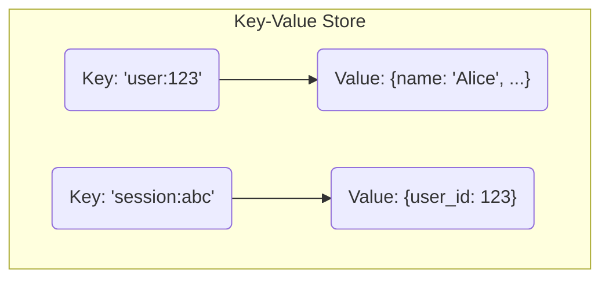
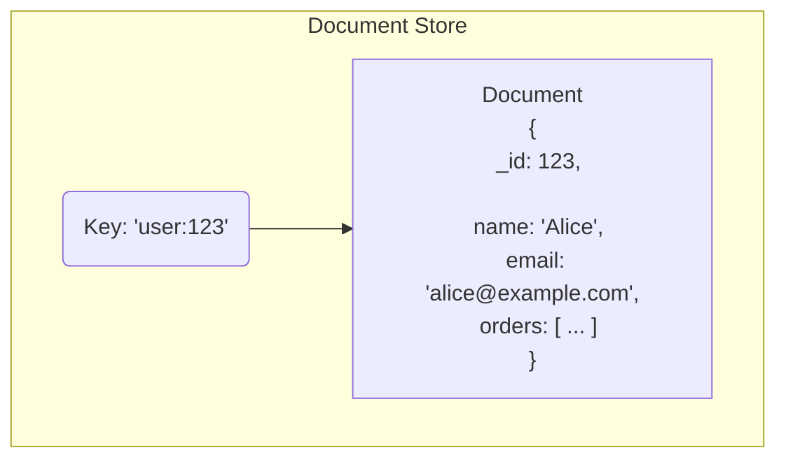
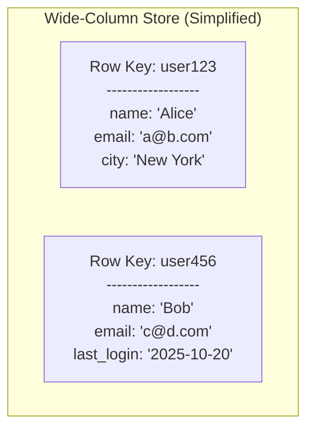
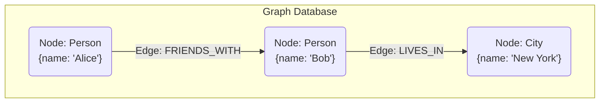
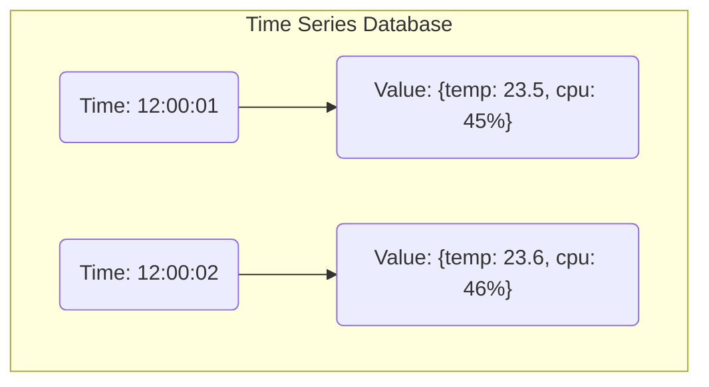
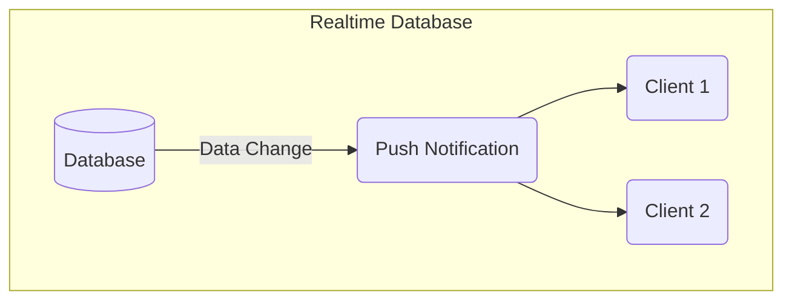

# NoSQL Databases

NoSQL, meaning "Not Only SQL," represents a diverse family of [[databases|database]] systems that break away from the rigid, tabular structure of traditional [[rdbms|relational databases]]. They emerged from the needs of web-scale applications at companies like Google, Amazon, and Facebook, which required massive [[system-design-fundamentals#Scalability|scalability]], high [[system-design-fundamentals#Performance-vs-Scalability|performance]], and flexibility that RDBMS struggled to provide.

This page covers the core concepts of NoSQL and details its most common data models.

---

## Key Characteristics of NoSQL Databases

NoSQL databases are defined by a different set of priorities compared to their relational counterparts, focusing on speed, scale, and flexibility.

### 1. Flexible Data Models

The most defining characteristic of NoSQL databases is their flexible data model. Unlike the strict, predefined schemas of SQL, NoSQL databases allow you to store data without a fixed structure. This is often called "schema-on-read"—the data has a structure, but the database doesn't enforce it. This allows you to store varied data types in the same collection and add new fields on the fly, providing immense flexibility for rapidly evolving applications.

### 2. Horizontal [[software-architecture/system-design-fundamentals/index#Scalability|Scalability]] (Scaling Out)

NoSQL databases are designed from the ground up to [[system-design-fundamentals#Scalability|scale horizontally]]. This means they can handle increased load by adding more commodity servers to a cluster. This is most commonly achieved through **sharding**, a powerful pattern for partitioning data. This architecture is what allows NoSQL databases to handle massive volumes of data and high traffic loads.

For a detailed explanation of sharding strategies and their trade-offs, see [[data-management-patterns#Sharding|Data Management Patterns]].

### 3. High Performance and Availability

By simplifying their data models and often relaxing the strict consistency guarantees of [[acid|ACID]], NoSQL databases can achieve extremely high performance for specific workloads, especially large-volume reads and writes. Many use **[[indexing#2-lsm-tree-log-structured-merge-tree|LSM Trees]]** (Log-Structured Merge-Trees) instead of B-Trees to optimize for write throughput. They are typically optimized for availability, meaning the system remains operational for both reads and writes even if some nodes in the cluster fail. This aligns with the **BASE** model:

-   **B**asically **A**vailable: The system guarantees [[system-design-patterns/availability-patterns|availability]].
-   **S**oft State: The state of the system may change over time, even without input.
-   **E**ventually Consistent: The system will become [[consistency#Eventual-Consistency|eventually consistent]].

This approach is a direct trade-off, as explained in the [[cap|CAP Theorem]], prioritizing availability over strong consistency.

### 4. API-Driven and Developer-Friendly

Most NoSQL databases are designed to be used by developers via simple, API-driven calls. The data formats they use, such as JSON in document databases, map directly to the objects and data structures used in modern programming languages. This eliminates the "object-relational impedance mismatch"—the complex mapping layer (ORM) often required to translate between the object-oriented world of an application and the relational world of a SQL database.

### 5. Replication
Replication is a cornerstone of NoSQL database architecture, enabling both high availability and read [[software-architecture/system-design-fundamentals/index#Scalability|scalability]]. Most NoSQL databases have built-in support for automatic replication, where data written to one node (the primary or master) is copied to other nodes (replicas or secondaries).

This is fundamental to their design for two reasons:
-   **Availability**: If a node fails, a replica can be automatically promoted to take its place, ensuring the system remains operational.
-   **Read [[software-architecture/system-design-fundamentals/index#Scalability|Scalability]]**: Read requests can be distributed across multiple replicas, increasing the system's overall read throughput.

The specific replication models and consistency guarantees vary widely between different NoSQL databases. For a detailed explanation of the common models (Master-Slave, Multi-Master) and synchronization methods, see the main page on [[replication|Database Replication]].

---

## Common NoSQL Database Models

NoSQL is not a single type of database, but a category that includes several different models.

### 1. Key-Value Store

This is the simplest NoSQL model. Data is stored as a collection of key-value pairs, much like a dictionary or hash map. The value is treated as an opaque blob.

*Description: Each key maps to a single value. Retrieval is extremely fast when you know the key.*

-   **Operations:** Simple `get`, `set`, and `delete` operations.
-   **Use Cases:** Caching, session management, real-time leaderboards.
-   **Examples:**
    *   **Redis**: An in-memory data structure store, used as a database, cache, and message broker. It's renowned for its extremely high performance.
        > [Official Website](https://redis.io/)
    *   **Amazon DynamoDB**: A fully managed, serverless key-value and document database that delivers single-digit millisecond performance at any scale.
        > [Official Website](https://aws.amazon.com/dynamodb/)
    *   **Google Cloud Memorystore**: A fully managed in-memory data store service for Redis and Memcached, used for caching and high-speed data storage.
        > [Official Website](https://cloud.google.com/memorystore)

### 2. Document Store

A Document Store extends the key-value concept. The value is a structured "document," typically in a JSON or BSON format, which the database can understand and query.

*Description: Data is stored in self-contained documents. The database can index and query fields within the document.*

-   **Operations:** Rich query language to filter documents based on their internal fields.
-   **Use Cases:** Content management systems, e-commerce product catalogs, user profiles.
-   **Examples:**
    *   **MongoDB**: A source-available, document-oriented database program that is one of the most popular NoSQL databases for general-purpose application development.
        > [Official Website](https://www.mongodb.com/)
    *   **CouchDB**: An open-source database that uses JSON for documents and JavaScript for MapReduce queries. It has a strong focus on high availability and eventual consistency.
        > [Official Website](https://couchdb.apache.org/)
    *   **Google Cloud Firestore**: A flexible, scalable NoSQL document database that provides live synchronization and offline support for mobile, web, and server development.
        > [Official Website](https://cloud.google.com/firestore)

### 3. Wide-Column Store

Wide-Column stores organize data into tables, rows, and columns, but unlike an RDBMS, the names and format of the columns can vary from row to row in the same table. They are optimized for queries over large datasets.

*Description: Rows are not required to have the same columns. This is ideal for storing data with varied attributes.*

-   **Operations:** Optimized for high-speed reads and writes on specific columns for a given row key.
-   **Use Cases:** Big Data analytics, IoT time-series data, logging systems.
-   **Examples:**
    *   **Apache Cassandra**: A distributed, wide-column store database designed to handle large amounts of data across many commodity servers, providing high availability with no single point of failure.
        > [Official Website](https://cassandra.apache.org/)
    *   **Google Cloud Bigtable**: A fully managed, scalable NoSQL wide-column database service. It's the same database that powers many core Google services, including Search, Analytics, and Maps.
        > [Official Website](https://cloud.google.com/bigtable)
    *   **ClickHouse**: An open-source, column-oriented DBMS for online analytical processing (OLAP) that is exceptionally fast for analytical queries.
        > [Official Website](https://clickhouse.com/)
    *   **ScyllaDB**: A high-performance big data database that is API-compatible with Apache Cassandra and Amazon DynamoDB, rewritten in C++ for maximum performance.
        > [Official Website](https://www.scylladb.com/)

### 4. Graph Database

Graph databases are purpose-built to store and navigate relationships. They use nodes (to store entities) and edges (to represent the relationships between entities).

*Description: The model focuses on the connections between data points, making relationship-based queries extremely efficient.*

-   **Operations:** Specialized query languages (e.g., Cypher for Neo4j) designed to traverse complex relationships efficiently.
-   **Use Cases:** Social networks, fraud detection, recommendation engines.
-   **Examples:**
    *   **Neo4j**: A native graph database platform optimized to store and traverse graphs, using the Cypher query language.
        > [Official Website](https://neo4j.com/)
    *   **Amazon Neptune**: A fully-managed graph database service from AWS that supports both Property Graph (Gremlin) and RDF (SPARQL) models.
        > [Official Website](https://aws.amazon.com/neptune/)
    *   **Dgraph**: An open-source, distributed graph database built for scalability, providing a GraphQL-like query language.
        > [Official Website](https://dgraph.io/)

### 5. Time Series Database

This is a specialized type of database optimized for storing and querying time-stamped data, or "time series." Data points are always associated with a timestamp.

*Description: Each data point is indexed by a timestamp, allowing for highly efficient time-based queries.*

-   **Operations:** Optimized for fast ingestion of high-volume data and complex queries over time ranges (e.g., aggregations, downsampling).
-   **Use Cases:** IoT sensor data, financial trading data, application performance [[monitoring]].
-   **Examples:**
    *   **InfluxDB**: An open-source time series database optimized for fast, high-availability storage and retrieval of time series data.
        > [Official Website](https://www.influxdata.com/)
    *   **TimescaleDB**: An open-source time-series database engineered on top of PostgreSQL, combining the performance of a time-series DB with the reliability of PostgreSQL.
        > [Official Website](https://www.timescale.com/)

### 6. Realtime Database

A realtime database is a type of NoSQL database that is designed to push data updates to connected clients in realtime. Instead of a client polling for changes, the database notifies clients as soon as data is modified.

*Description: The database automatically pushes data changes to all subscribed clients.*

-   **Operations:** Typically provides SDKs that manage a persistent connection (e.g., via WebSockets) and expose subscription APIs.
-   **Use Cases:** Collaborative applications (e.g., online whiteboards, document editors), live chat, multiplayer games.
-   **Examples:**
    *   **Firebase Realtime Database**: A cloud-hosted NoSQL database that lets you store and sync data between your users in realtime.
        > [Official Website](https://firebase.google.com/docs/database)
    *   **Google Cloud Firestore**: As a document database with realtime listeners, Firestore is also a powerful realtime database solution, automatically pushing data updates to connected clients.
        > [Official Website](https://cloud.google.com/firestore)
    *   **RethinkDB**: An open-source, distributed database that pushes JSON data to applications in realtime.
        > [Official Website](https://rethinkdb.com/)

---

## Resources & links

### Articles

1.  **[What Is NoSQL? NoSQL Databases Explained - MongoDB](https://www.mongodb.com/resources/basics/databases/nosql-explained)**
    An article from MongoDB explaining the features, types, and benefits of NoSQL databases, contrasting them with relational models.

2.  **[What is a NoSQL Database? - Google Cloud](https://cloud.google.com/discover/what-is-nosql?hl=en)**
    A high-level overview of NoSQL databases and their use cases from Google Cloud.

### Videos

1.  **[How do NoSQL databases work? Simply Explained!](https://www.youtube.com/watch?v=0buKQHokLK8)**
    A short video explaining the core concepts of NoSQL, including horizontal scaling and the different data models.

2.  **[NoSQL Databases - Hussein Nasser](https://www.youtube.com/watch?v=qEhNHOEa5sE&list=PLsyeobzWxl7r0bn6dzVA8bQNxcx7DRl5F)**
    The first video of a detailed playlist from Hussein Nasser covering the fundamentals and various types of NoSQL databases.

