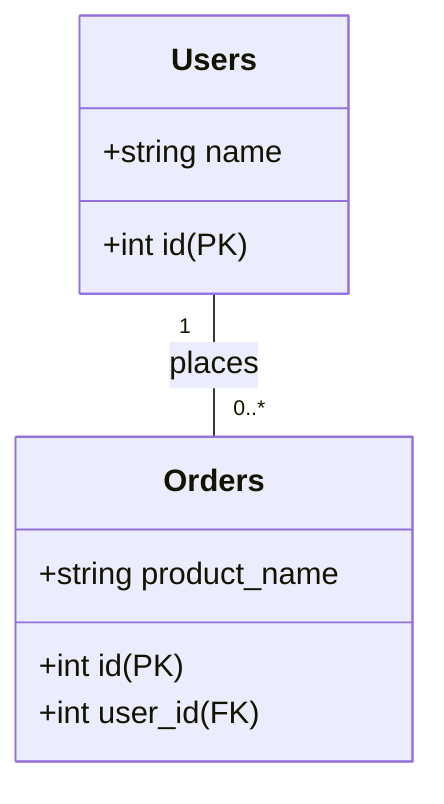

# Relational Databases (RDBMS)

Relational Database Management Systems (RDBMS) are the traditional workhorses of the [[software-architecture/databases/|database]] world. Based on the relational model, they store data in structured tables composed of rows and columns and use Structured Query Language (SQL) for data manipulation and retrieval.

While they are known for their robustness, scaling a single RDBMS to handle massive traffic presents significant challenges. These challenges led to the development of alternative models, collectively known as [[nosql|NoSQL Databases]]. This page covers the core concepts of RDBMS and the primary patterns used to improve their performance, scalability, and availability.

---

## Core Concepts and Guarantees

Before discussing scaling patterns, it's important to understand the fundamental principles that define an RDBMS.

### The Relational Model: Structure and Schema

The core of an RDBMS is the relational model, which organizes data into tables (or "relations"). Each table has a predefined structure—a **schema**—consisting of columns with specific data types (e.g., `VARCHAR`, `INT`, `DATETIME`). Data is stored as rows (or "tuples") in these tables.

-   **Data Integrity:** The strict schema ensures a high degree of data integrity. You cannot, for example, insert a string into a column defined as an integer.
-   **Relationships via Keys:** Data between tables is linked using keys, which enforces relational integrity.
    -   **Primary Key (PK):** A column (or set of columns) that uniquely identifies each row in a table. It cannot contain NULL values.
    -   **Foreign Key (FK):** A column (or set of columns) in one table that refers to the Primary Key of another table. This creates the link, or relationship, between the two tables.

*Description: The `user_id` in the `Orders` table is a Foreign Key that points to the Primary Key `id` in the `Users` table, establishing a one-to-many relationship.*

#### Normalization

**Normalization** is the process of structuring a relational database to reduce data redundancy and improve data integrity. The goal is to ensure that each piece of data is stored in only one place. This is achieved by following a set of rules called **Normal Forms**.

-   **1NF (First Normal Form):** Ensures that table cells hold single, atomic values and each row is unique.
-   **2NF (Second Normal Form):** Requires the table to be in 1NF and all non-key attributes to be fully dependent on the entire primary key.
-   **3NF (Third Normal Form):** Requires the table to be in 2NF and all attributes to depend only on the primary key, not on other non-key attributes (eliminating transitive dependencies).

-   **Benefit:** High data integrity and no redundant data.
-   **Trade-off:** A highly normalized schema often results in a large number of tables. Retrieving data may require complex and potentially slow JOIN operations across these tables.

### ACID Transactions: The Guarantee of Reliability

The defining feature of most RDBMSs is their strong support for **[[acid|ACID transactions]]**, which provides a powerful guarantee that database operations are processed reliably. See the main page on [[acid]] for a detailed explanation of Atomicity, Consistency, Isolation, and Durability.

### Strengths and Weaknesses

-   **Strengths:**
    -   **Reliability and Integrity:** [[acid|ACID]] compliance makes RDBMS the default choice for financial, e-commerce, and other mission-critical systems.
    -   **Powerful Querying:** SQL is a mature, declarative language that allows for extremely powerful and complex data querying and aggregation.
    -   **Mature Ecosystem:** A vast ecosystem of tools, libraries, and expertise has been built around relational databases.
-   **Weaknesses:**
    -   **Schema Rigidity:** Changing the schema of a large table can be a slow and complex process, making it difficult to adapt to rapidly changing application requirements.
    -   **Scalability Challenges:** RDBMSs are traditionally designed to scale vertically (on a single server). Horizontal scaling is possible but often complex to implement (see patterns below).

---

## Scaling and Distributing RDBMS

Scaling an RDBMS involves two main dimensions: improving read performance and improving write performance. Most of these techniques involve distributing the data or the load across multiple servers.

### 1. Replication

Replication is the process of creating and maintaining multiple copies of data on different servers. It is a fundamental pattern for achieving both high [[system-design-patterns/availability-patterns|availability]] and read scalability. The two most common models are Master-Slave and Master-Master.

For a detailed explanation of these models and their trade-offs, see the main page on [[availability-patterns#Replication-Patterns|Replication Patterns]].

### 2. Partitioning

Partitioning is the act of splitting a large database into smaller, faster, and more manageable pieces. There are two main strategies for this.

-   **Federation (Vertical Partitioning):** The database is split by **function**. For example, instead of a single monolithic database, you could have separate databases for `Users`, `Products`, and `Forums`. This reduces the traffic to each individual database and allows for more targeted caching and optimization. The main drawback is that database-level JOINs between different functions are no longer possible.

-   **Sharding (Horizontal Partitioning):** This strategy involves splitting a single large table by its **rows** and distributing them across multiple database servers. This is a powerful but complex pattern for achieving massive write scalability. For a detailed explanation of sharding strategies and their trade-offs, see the main page on [[data-management-patterns#Sharding|Data Management Patterns]].

### 3. Denormalization

Denormalization is a performance optimization technique where you intentionally violate data normalization rules by adding redundant copies of data to your tables. The goal is to avoid costly JOIN operations during read queries.

-   **Example:** Imagine an `orders` table and a `customers` table. To display a list of orders with the customer's name, you would need to JOIN the two tables. With denormalization, you could store a copy of the `customer_name` directly in the `orders` table. 
-   **Trade-off:** This makes reads much faster but makes writes more complex and slower, as you now have to update the data in multiple places. It also increases storage requirements. Some RDBMSs, like PostgreSQL, offer **Materialized Views** to help manage denormalized data automatically.

### 4. SQL Tuning

Sometimes, the biggest performance gains come not from changing the architecture, but from optimizing the SQL queries themselves. SQL tuning is the process of diagnosing and improving poorly performing queries.

-   **Use Indexes:** An index is a data structure that improves the speed of data retrieval operations on a database table at the cost of additional writes and storage space. Creating an index on a column used in a `WHERE` clause can change a query from a slow "full table scan" to a near-instant lookup.
-   **Analyze the Query Plan:** Most databases provide a command (e.g., `EXPLAIN`) that shows the **query execution plan**. This plan reveals how the database intends to execute your query, allowing you to identify bottlenecks, such as inefficient JOINs or missing indexes.
-   **Benchmark and Profile:** Use tools to simulate high-load situations and enable features like a "slow query log" to identify the most problematic queries in a production environment.

---

## Resources & links

### Articles

1.  **[What is RDBMS (Relational Database Management System)? - TechTarget](https://www.techtarget.com/searchdatamanagement/definition/RDBMS-relational-database-management-system)**
    A technical definition of RDBMS, its features, and its role in modern data management.

2.  **[What is a Relational Database? - IBM](https://www.ibm.com/think/topics/relational-databases)**
    An article from IBM explaining how relational databases organize data into tables and ensure reliability through ACID properties.

### Videos

1.  **[What Is RDBMS ? | What Is Relational Database Management ...](https://www.youtube.com/watch?v=6BSlwKkgCYU)**
    This video defines RDBMS as the software used to create and administer relational databases, citing popular examples like MySQL and Oracle.

2.  **[What is RDBMS? full Explanation | Learn Coding](https://www.youtube.com/watch?v=pFfXhCMlkdk)**
    A comprehensive video explanation of RDBMS as part of the "Learn Coding" series.
