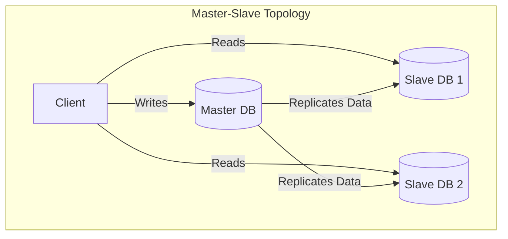
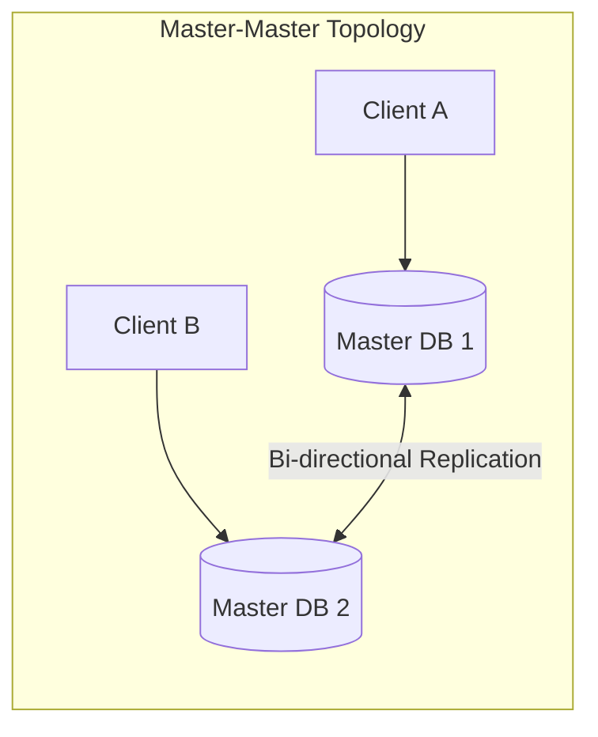
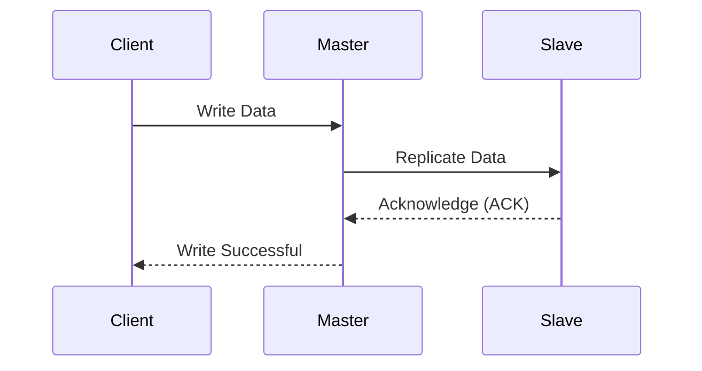
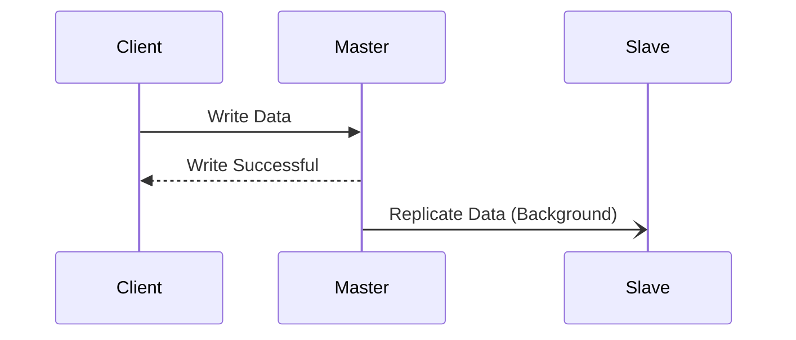

# Database Replication

**Database Replication** is the process of copying data from one database server (node) to one or more other nodes. This redundancy is a cornerstone of modern distributed systems, serving three primary goals:

1.  **High [[availability-patterns|Availability]]**: If one node fails, others can take over, ensuring the system remains operational.
2.  **Read [[software-architecture/system-design-fundamentals/index#Scalability|Scalability]]**: Read requests can be distributed across multiple replicas, increasing the system's capacity to handle traffic.
3.  **Disaster Recovery**: Replicas can be kept in different geographic locations to protect against catastrophic regional failures (see [[geode|Geode Pattern]]).

---

## Types of Database Replication (Topologies)

The topology defines the relationship between the nodes and how writes are propagated.

### 1. Master-Slave Replication

Also known as **Leader-Follower** or **Primary-Secondary**. One node is designated as the **Master** and handles all write operations. Changes are then replicated to one or more **Slave** nodes, which are typically read-only.

*   **Pros**:
    *   **Simplicity**: No conflict resolution needed as there is only one source of truth for writes.
    *   **Read Scaling**: Excellent for read-heavy workloads (e.g., social media feeds, blogs).
*   **Cons**:
    *   **Write Bottleneck**: The master is a single point of failure and a bottleneck for write performance.
    *   **Replication Lag**: Slaves may not be immediately up-to-date with the master (see [[consistency|Eventual Consistency]]).

### 2. Master-Master Replication

Also known as **Multi-Leader**. Two or more nodes can accept write operations. Each master replicates its writes to the other masters.

*   **Pros**:
    *   **Write Availability**: If one master fails, writes can still be processed by the other.
    *   **Locality**: Users can write to a master geographically closer to them.
*   **Cons**:
    *   **Complexity**: Requires complex **conflict resolution** strategies (e.g., Last-Write-Wins, Vector Clocks) when the same data is modified on both masters simultaneously.
    *   **Consistency**: Achieving strong consistency is extremely difficult.

### 3. Snapshot Replication

Unlike the previous methods which replicate changes transaction-by-transaction, Snapshot Replication copies the **entire state** of the database (or a subset) at a specific point in time.

*   **Mechanism**: A "snapshot" of the source data is taken and moved to the destination.
*   **Use Cases**:
    *   **Data Warehousing/Analytics**: Moving production data to a warehouse for analysis without impacting live performance.
    *   **Development/Testing**: Refreshing staging environments with production data.
    *   **Disconnected Environments**: Syncing data to mobile devices that only connect periodically.
*   **Cons**: High bandwidth usage; data at the destination is stale until the next snapshot.

---

## Methods of Database Replication (Synchronization)

The method defines *when* and *how* the data is transferred, determining the trade-off between [[consistency]] and [[software-architecture/system-design-fundamentals/index#Latency-vs-Throughput|latency]].

### 1. Synchronous Replication

The master waits for the replica(s) to acknowledge the write before confirming success to the client.

*   **Guarantee**: **Strong Consistency**. If the client gets a success response, the data is guaranteed to be on the replica. [[data-integrity|Data loss]] is zero if the master fails.
*   **Trade-off**: **High Latency**. The write is as slow as the slowest network link. If the replica goes down, the master cannot accept writes (reduced availability).

### 2. Asynchronous Replication

The master confirms the write to the client immediately, *without* waiting for the replica. The data is sent to the replica in the background.

*   **Guarantee**: **Eventual Consistency**. The replica will catch up eventually.
*   **Trade-off**: **Data Loss Risk**. If the master crashes before the background replication happens, that data is lost. However, it offers **Low Latency** and higher availability (master works even if slave is down).

### 3. Semi-Synchronous Replication

A hybrid approach. The master waits for *at least one* replica to acknowledge the write, but not necessarily all of them.

*   **Balance**: Offers a middle ground. It guarantees that the data exists on at least two nodes (Master + 1 Slave) before confirming, reducing the risk of data loss compared to asynchronous, while performing better than fully synchronous replication if there are many slaves.

---

## Challenges & Mitigation Strategies

### 1. Replication Lag
In asynchronous replication, the delay between a write on the master and its appearance on the slave is called **replication lag**. This can lead to "stale reads," where a user updates their profile but sees the old info immediately after because their read went to a lagging slave.
*   **Mitigation**:
    *   **Sticky Sessions**: Route a user's reads to the same replica (or master) to ensure **Read-Your-Own-Writes** consistency.
    *   **Synchronous Replication**: Use for critical data where consistency is non-negotiable.

### 2. Split-Brain (Network Partitions)
In a cluster, if the network connection between nodes fails, multiple nodes might mistakenly decide they should be the Master. This leads to a **Split-Brain** scenario where two divergent versions of the data are created.
*   **Mitigation**:
    *   **Quorum Consensus**: Require a strict majority (N/2 + 1) of nodes to agree before electing a leader or committing a write. If a partition has fewer than the quorum, it pauses operations.
    *   **Fencing (STONITH)**: "Shoot The Other Node In The Head". If a node is suspected to be malfunctioning or disconnected, the cluster forcibly isolates it (e.g., by cutting its power or blocking storage access) to prevent it from corrupting data.

### 3. Write Conflict Resolution
In Master-Master topologies, concurrent writes to the same data are inevitable. The system must have a strategy to resolve them.
*   **Strategies**:
    *   **Last-Write-Wins (LWW)**: The update with the most recent timestamp wins. It's simple to implement but relies on synchronized clocks and can silently discard data.
    *   **Vector Clocks**: Uses version counters to track the causal history of data. It allows the system to detect *concurrent* modifications and present them to the application for manual resolution.
    *   **CRDTs (Conflict-free Replicated Data Types)**: Specialized data structures (like Counters, Sets, or Maps) designed to mathematically guarantee that all replicas will eventually converge to the same state, regardless of the order in which updates are received.

---

## Resources & links

### Articles

1.  **[Types of Database Replication - GeeksforGeeks](https://www.geeksforgeeks.org/system-design/types-of-database-replication-system-design/)**
    A detailed breakdown of various replication types including Master-Slave, Master-Master, Snapshot, Transactional, and Merge replication. It explains how each works along with their specific applications, benefits, and challenges.

2.  **[Replication Strategies: A Deep Dive into Leading Databases](https://medium.com/@alxkm/replication-strategies-a-deep-dive-into-leading-databases-ac7c24bfd283)**
    An in-depth look at replication strategies used in modern database systems, exploring how leading databases implement these patterns to ensure data consistency and availability.

### Videos

1.  **[Database Replication Explained (in 5 Minutes)](https://www.youtube.com/watch?v=bI8Ry6GhMSE)**
    A concise and high-level overview of database replication concepts. This video explains the "why" and "how" of replication, touching on the trade-offs between consistency and availability in a distributed system.
