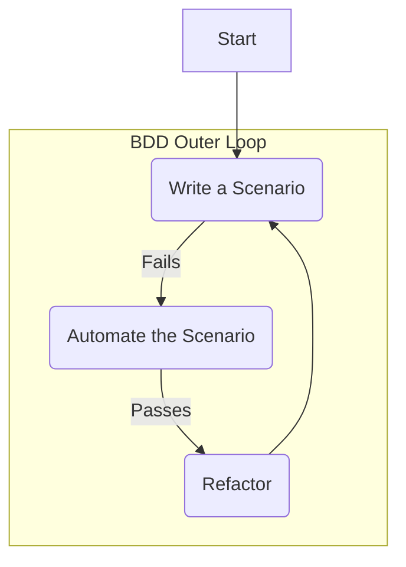

# Behavior-Driven Development (BDD)

Behavior-Driven Development (BDD) is a software development process that evolved from [[tdd|Test-Driven Development (TDD)]]. It aims to bridge the communication gap between technical teams and business stakeholders by encouraging collaboration and building a shared understanding of the desired software behavior.

Coined by Dan North, BDD shifts the focus from writing "tests" to specifying "behaviors." It does this by using a natural, human-readable, and domain-specific language to describe how the application should behave from the user's perspective. This language, often Gherkin, acts as a firm, common ground for developers, QA, and business analysts.

BDD is not just a testing technique; it is a **design methodology** centered on communication and collaboration. The executable specifications it produces serve as living documentation that is always in sync with the system's actual behavior.

---

## The Core Idea: From Tests to Behaviors

BDD emerged from the challenges of TDD. While TDD is excellent for guiding code design, its unit tests are often written in technical terms, making them inaccessible to non-developers. BDD addresses this by changing the vocabulary:

*   Instead of **tests**, we write **specifications**.
*   Instead of **test cases**, we write **scenarios**.
*   These scenarios are described in a structured but natural language that focuses on **behavior** and **business outcomes**.

This approach aligns perfectly with the concept of a **[[ddd|Ubiquitous Language]]** from Domain-Driven Design, as it forces all parties to agree on a single, unambiguous way to describe the system's features.

---

## The BDD Cycle and Gherkin

BDD follows a collaborative cycle where scenarios are defined first, then automated. The most common syntax for writing these scenarios is **Gherkin**.

### Gherkin: The `Given-When-Then` Syntax

Gherkin provides a simple structure for describing behavior:

*   **`Given`**: Describes the initial context or precondition. It sets up the state of the world before the action happens.
*   **`When`**: Describes the action or event performed by the user or an external system.
*   **`Then`**: Describes the expected outcome or result. It verifies that the action produced the correct behavior.

```gherkin
Feature: User Authentication
  As a user
  I want to log in to the application
  So that I can access my personalized content

  Scenario: Successful login with valid credentials
    Given a registered user with the email "user@example.com" and password "password123"
    And the user is on the login page
    When the user enters their valid credentials and clicks "Log In"
    Then they should be redirected to their dashboard
    And a welcome message "Hello, user!" should be displayed
```

### The BDD Outer Loop

BDD acts as an "outer loop" of development, which contains the TDD "inner loop."



1.  **Write a Scenario:** The team collaborates to write a Gherkin scenario that describes a required feature. Initially, this is just text.
2.  **Automate the Scenario:** The development team writes "step definitions" that connect the plain-text steps of the Gherkin scenario to the application code. When first automated, the scenario **fails** because the underlying application code has not been written yet.
3.  **Implement the Feature:** Now, the team uses the classic **[[tdd|TDD]]** cycle (Red-Green-Refactor) as an "inner loop" to write the production code required to make the scenario pass.
4.  **Refactor:** Once the scenario passes, the team can refactor both the production code and the test code, confident that the specified behavior is locked in.

---

## Benefits of BDD

*   **Shared Understanding:** BDD's greatest strength is creating a single source of truth. By using a common language, it ensures that developers, testers, and business stakeholders are all aligned on what needs to be built.
*   **Living Documentation:** The Gherkin feature files are not just tests; they are executable specifications. This documentation never goes out of date because if it did, the tests would fail.
*   **Strict YAGNI Enforcement:** BDD provides a powerful mechanism for enforcing the **[[yagni|YAGNI]]** principle. Because development is driven by concrete, stakeholder-approved scenarios, no code is written for a feature that isn't specified. This prevents gold-plating and ensures all development effort is directly tied to business value.
*   **Reduced Ambiguity and Rework:** The collaborative process of writing scenarios uncovers ambiguities and misunderstandings *before* development begins, significantly reducing rework.
*   **Improved Testability:** Because the system is designed with behavior in mind, it naturally leads to more testable and modular code.

---

## Relationship with Other Methodologies

BDD does not exist in a vacuum. It is most powerful when combined with other agile and design practices.

*   **[[tdd|Test-Driven Development (TDD)]]:** BDD and TDD are a perfect match. BDD is the "outer loop" that defines *what* behavior to build from a business perspective. TDD is the "inner loop" used by developers to implement *how* that behavior is built, one unit test at a time.

*   **[[ddd|Domain-Driven Design (DDD)]]:** BDD provides an excellent way to formalize and validate the **Ubiquitous Language** that is central to DDD. Scenarios can be written to describe the expected behavior of Aggregates, Domain Services, and other tactical patterns, ensuring the code implementation matches the domain model.

*   **Acceptance Test-Driven Development (ATDD):** BDD is a specific, and very popular, implementation of ATDD. Both practices involve using acceptance tests to drive development, but BDD places a stronger emphasis on the collaborative process and the specific `Given-When-Then` format.

---

## Resources & links

### Articles

1.  **[What is Behavior-Driven Development (BDD)?](https://www.geeksforgeeks.org/software-engineering/behavioral-driven-development-bdd-in-software-engineering/)**
    This article explains that BDD fosters collaboration to define system behavior before development, using natural language (Gherkin) to improve code quality and meet business requirements.

2.  **[What Is BDD (Behavior-Driven Development)?](https://www.spiceworks.com/tech/devops/articles/what-is-bdd/)**
    This article describes BDD as an Agile-based process focusing on end-user requirements to facilitate collaboration, emphasizing customer-driven development and risk reduction.

### Videos

1.  **[An Ultimate Guide To BDD](https://www.youtube.com/watch?v=gXh0iUt4TXA)**
    Dave Farley explains that BDD is more than just testing; it's a method for organizing software development to improve communication and create meaningful, executable specifications.

2.  **[Introduction To Behavior-Driven Development and Gherkin](https://www.youtube.com/watch?v=ZhDSNBoTYJc)**
    This video introduces BDD and Gherkin as tools to facilitate collaboration between technical and non-technical stakeholders in agile teams for defining application requirements.
