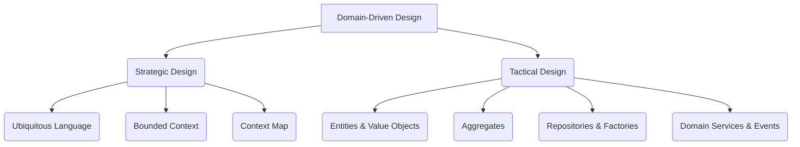
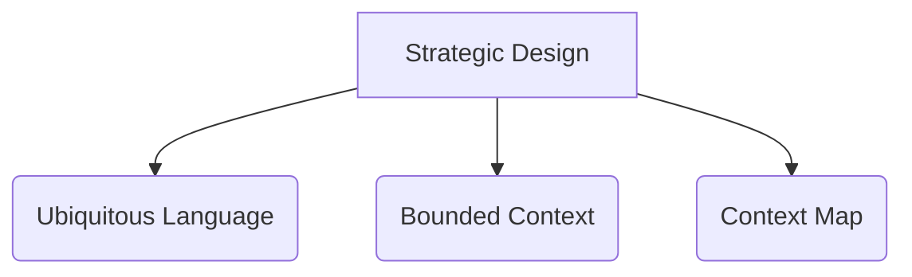
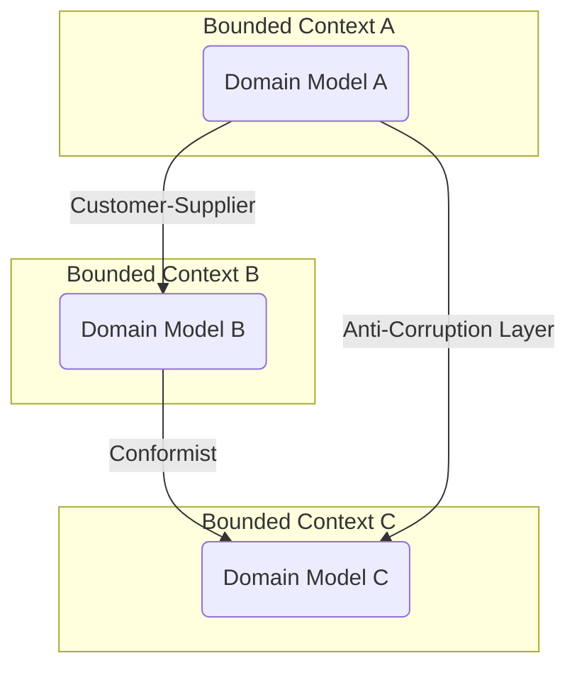
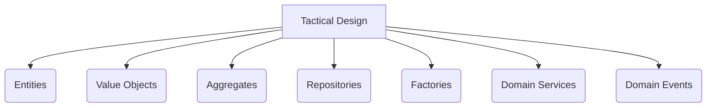
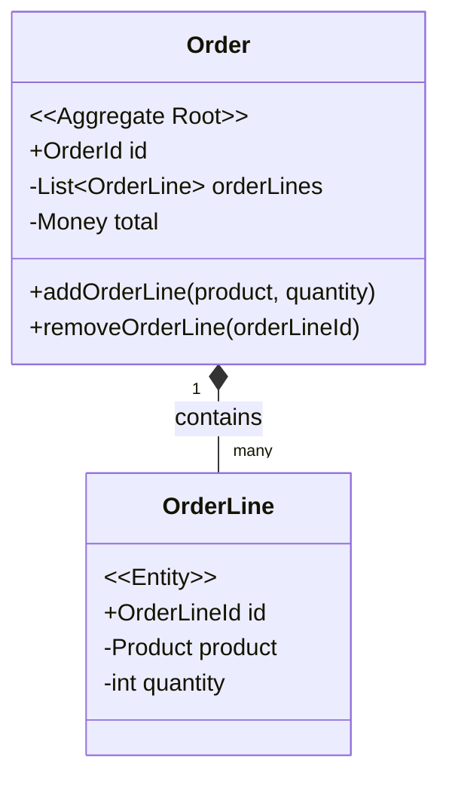

# Domain-Driven Design (DDD)

Domain-Driven Design (DDD) is an approach to software development for complex needs that connects the implementation to an evolving model of the core business concepts. Coined by Eric Evans in his seminal book "Domain-Driven Design: Tackling Complexity in the Heart of Software," DDD is not a specific technology or methodology but a mindset and a set of priorities that guide design and development decisions.

The central premise of DDD is to place the project's primary focus on the **core domain** and its logic, and to ground the software design in a rich, expressive **domain model**. This model is not just a data schema; it is a system of interconnected objects that encapsulates both the data and the behavior of the business domain.

A critical success factor in DDD is the development of a **Ubiquitous Language**, a shared vocabulary used by all stakeholders—developers, domain experts, and business analysts—to talk about the system. This language is used in all communication, in the code, and in the documentation, eliminating ambiguity and ensuring that the software model accurately reflects the business reality. Practices like [[bdd|Behavior-Driven Development (BDD)]] take this concept a step further by formalizing the Ubiquitous Language into executable specifications.

---

## DDD and Model-Driven Design (MDD)

It's helpful to understand DDD in the context of **Model-Driven Design (MDD)**. MDD is a broad software development approach where the primary focus is on creating, refining, and using models to guide the creation of the software. The model becomes the central artifact of the development process.

**Domain-Driven Design is a specific type of Model-Driven Design.** While MDD can be based on any type of model (e.g., data models, workflow models), DDD insists that the model must be a **rich domain model** that captures the deep knowledge and business rules of the domain.

In short:
*   **Model-Driven Design (MDD):** Let's build our software based on a model.
*   **Domain-Driven Design (DDD):** A specific MDD approach where the model is a rich, behavior-focused **Domain Model**, developed in collaboration with domain experts and expressed in a **Ubiquitous Language**.

---

DDD is divided into two main parts: **Strategic Design** and **Tactical Design**.



---

## Strategic Design



Strategic Design is the "macro" part of DDD. It focuses on defining the large-scale structure of the system and the relationships between different parts of the domain. Its primary goal is to create a clear and well-defined model of the business domain by breaking it down into manageable, independent pieces.

### Ubiquitous Language

The Ubiquitous Language (also known as the **Domain Language**) is a shared, rigorous vocabulary developed collaboratively by the development team and domain experts. It is a living language that evolves with the project.

*   **Expressive and Unambiguous:** The language should be rich enough to express the domain's complexities without ambiguity. If a term is confusing or has multiple meanings, it's a sign that the domain model needs refinement or that a boundary is missing.
*   **Shared and Enforced:** All team members, from developers to product managers, must commit to using this language. It should be used in conversations, diagrams, documentation, and, most importantly, in the code itself.
*   **Grounded in Code:** The ultimate expression of the Ubiquitous Language is the code. Class names, method names, and module names should all be drawn from this language. If the code doesn't reflect the language, one of them is wrong.

**Example:**
In an e-commerce system, the business might talk about "customers placing an order." A team practicing DDD would not translate this into technical jargon like `user.create_cart_item()`. Instead, the code would directly reflect the language:
```java
// Code that reflects the Ubiquitous Language
class Customer {
    public void placeOrder(Order anOrder) {
        // ...
    }
}
```

### Bounded Context

A **Bounded Context** is a central pattern in Strategic DDD. It defines a clear boundary within which a specific domain model is defined and applicable. Inside a Bounded Context, every term from the Ubiquitous Language has a single, unambiguous meaning.

*   **Autonomy and Focus:** Bounded Contexts allow teams to work autonomously on different parts of the system without needing to understand the entire domain. Each team can focus on its specific context and develop a model that is perfectly suited for that purpose.
*   **Model Integrity:** It protects the integrity of the domain model by preventing concepts from different domains from leaking into each other and creating a "big ball of mud."
*   **Relationship to Team Organization:** Bounded Contexts often align with team structures (Conway's Law). A single team should ideally own a single Bounded Context, giving them full ownership of their part of the domain.

**Example (Class Variants):**
The concept of a "Product" can have different meanings across a business. These different representations are sometimes referred to as **Class Variants**.
*   In the **Sales Context**, a `Product` has a `price`, a `name`, and marketing `description`.
*   In the **Shipping Context**, the same `Product` is defined by its `weight`, `dimensions`, and `hazmat_status`.
*   In the **Inventory Context**, it might be represented by a `SKU` and `stock_level`.

DDD advises against creating a single `Product` class with all these attributes. Instead, each Bounded Context would have its own `Product` model, tailored to its specific needs.

### Context Map

A Context Map is a diagram that visualizes the relationships between different Bounded Contexts. It is a crucial tool for managing inter-team communication and integration. The map identifies the specific patterns that govern how contexts interact.


This diagram shows a simple Context Map with three common relationship patterns:
*   **Customer-Supplier:** Two teams in an upstream/downstream relationship. The downstream team is a "customer" of the upstream team.
*   **Conformist:** The downstream team conforms to the model of the upstream team, without a clear customer-supplier relationship.
*   **Anti-Corruption Layer (ACL):** The downstream team builds a translation layer to protect its model from being "corrupted" by the upstream model.

---

## Inter-Context Communication and Integration

While Bounded Contexts help to break down a complex domain, a key challenge in any large system is how these contexts interact with each other. DDD's strategic design provides a set of patterns to manage these integrations, ensuring that the boundaries remain well-defined and the models don't get "corrupted".

### The Role of the Anti-Corruption Layer (ACL)

The **Anti-Corruption Layer (ACL)** is one of the most important patterns for integrating Bounded Contexts. It is a defensive layer of software that acts as a translator between two different domain models. When a downstream context needs to interact with an upstream context, it does not do so directly. Instead, it communicates through the ACL.

The ACL's responsibilities are:
*   To translate requests from the downstream context's model to the upstream context's model.
*   To translate responses from the upstream model back into the downstream model.
*   To isolate the downstream model from any changes or "impurities" in the upstream model.

This is a direct application of the **[[gof#adapter|Adapter]]** pattern, as seen in **[[hexagonal|Hexagonal Architecture]]**. The ACL is an adapter that allows the core domain of one context to communicate with another system without being tightly coupled to it.

### Asynchronous Integration with Domain Events

For a more decoupled integration, **Domain Events** are the preferred mechanism. When a significant business event occurs within one Bounded Context (e.g., `OrderPlaced`), it publishes a `Domain Event`. Other Bounded Contexts can subscribe to this event and react to it asynchronously.

This approach has several advantages:
*   **[[cohesion-coupling|Loose Coupling]]:** The publishing context has no knowledge of the subscribing contexts.
*   **Resilience:** If a subscribing service is temporarily unavailable, it can process the event later once it comes back online (assuming a durable message bus is used).
*   **Scalability:** Multiple subscribers can react to the same event in parallel.

This [[event-driven|event-driven communication]] is the foundation of many modern distributed systems and is a key enabler for building reactive and scalable applications. It is often implemented using [[message-queue|messaging technologies]] like RabbitMQ or Kafka.

---

## Tactical Design



Tactical Design is the "micro" part of DDD. It provides a set of building blocks for creating a rich and expressive domain model within a single Bounded Context. These patterns help developers translate the conceptual model into working code.

### The Anemic Domain Model Anti-Pattern

Before diving into the tactical building blocks, it's crucial to understand a common pitfall: the **Anemic Domain Model**. This is an anti-pattern where domain objects are reduced to simple data containers (getters and setters) with no business logic. All the logic that should be encapsulated within these objects is instead moved into separate "service" or "manager" classes.

This leads to a procedural style of programming, where the rich, object-oriented model envisioned by DDD is lost. The core principle of bundling data and behavior together is violated, resulting in code that is harder to maintain, understand, and test. A key goal of Tactical Design is to create a **rich domain model**, not an anemic one.

### Entities and Value Objects

These are the fundamental building blocks of the domain model, as described in the **[[poeaa|P of EAA]]** patterns.
*   **[[poeaa#Entity|Entity]]:** An object defined not by its attributes, but by its thread of continuity and identity. An Entity's identity must be unique within the system and remain constant throughout its lifecycle. Entities are mutable, meaning their attributes can change over time.
    **Example:** A `User` is an Entity. A user can change their name or address, but they are still the same user, identified by a unique `userId`.
    ```java
    public class User {
        private final UserId id;
        private String name;

        public User(UserId id, String name) { this.id = id; this.name = name; }
        public void changeName(String newName) { this.name = newName; }
        // equals() and hashCode() are based on id
    }
    ```
*   **[[poeaa#Value-Object|Value Object]]:** An immutable object that has no conceptual identity. Two Value Objects are considered equal if all their attributes are equal. They are used to describe characteristics of an Entity.
    **Example:** An `Address` is a classic Value Object. If you change the street, you are not changing the address, you are creating a new one.

### Aggregate

In a complex domain model, objects are often interconnected. A key challenge is maintaining the integrity of this object graph. If any part of the system can freely modify any object, it becomes impossible to guarantee that business rules (invariants) are always respected. This leads to an inconsistent and buggy system.

The **Aggregate** pattern is DDD's solution to this problem. An Aggregate is a cluster of associated domain objects (Entities and Value Objects) that are treated as a single unit for the purpose of data changes. It acts as a transactional consistency boundary.

The core purpose of an Aggregate is to **enforce invariants**. Invariants are business rules that must always be true. For example, "the total price of an order must equal the sum of its line items" or "a product cannot be added to an order if it is out of stock."

To achieve this, Aggregates follow a strict set of rules:

*   **The Aggregate Root is the Gatekeeper:** Each Aggregate has a single root **Entity**, known as the Aggregate Root. This Root is the only object that external clients are allowed to hold a reference to. Any command to modify an object inside the aggregate's boundary must be sent to the Aggregate Root.
*   **Protecting the Boundary:** External objects are forbidden from holding references to any object inside the aggregate, other than the root. This prevents any "back-door" modifications that could bypass the root's validation logic.
*   **Transactional Consistency:** All objects within the Aggregate are loaded and saved together as a single unit. When a change is made, the entire Aggregate is persisted in a single transaction, ensuring that all invariants within the boundary are maintained.
*   **Reference by Identity:** An aggregate should reference other aggregates only by their identity (e.g., `OrderId`), not by holding a direct object reference. This keeps the aggregate small and prevents the loading of large, complex object graphs into memory.


In this example, the `Order` is the Aggregate Root. To add an `OrderLine`, a client cannot create an `OrderLine` and add it to the list directly. It **must** call the `addOrderLine()` method on the `Order` object. This allows the `Order` to enforce invariants, such as checking if the product is in stock or updating the total price. The `Order` object is in complete control of its internal state.

### Repositories and Factories

These two patterns handle the lifecycle of domain objects, separating the core model from the concerns of creation and persistence.

#### Repositories

A **[[poeaa#Repository|Repository]]** is a crucial pattern for decoupling the domain model from the persistence layer (e.g., the database). Its main role is to provide the illusion of an in-memory collection of all aggregates of a certain type.

*   **Collection-like Interface:** The repository exposes a simple, intention-revealing interface for accessing aggregates. Common methods include `findById`, `save`, and `findAll`. The client code that uses the repository is not concerned with how the data is stored (e.g., in a [[rdbms|SQL databases]] , a [[nosql|NoSQL]]  document, or in memory).
*   **Works with Aggregates:** Repositories are designed to work with Aggregates. You should have one repository per aggregate type. For example, you would have an `OrderRepository` but not an `OrderLineRepository`. You retrieve and save the entire aggregate through its root.
*   **Dependency Inversion:** The repository *interface* is defined in the domain layer, alongside the aggregate it serves. The concrete *implementation* (e.g., `PostgresOrderRepository`) resides in the infrastructure layer. This is a key application of the [[solid|Dependency Inversion Principle]], ensuring the domain model has no knowledge of the database.

**Example of a Repository Interface:**
```java
// Defined in the Domain Layer
public interface OrderRepository {
    Optional<Order> findById(OrderId id);
    void save(Order order);
}
```

#### Factories

A **[[gof#factory-method|Factory]]** is used to encapsulate the logic of creating complex objects or aggregates. When the creation of an object is a non-trivial process that involves enforcing business rules, a Factory is a better choice than a simple constructor.

*   **Ensuring Invariants:** The primary role of a Factory is to ensure that an aggregate is created in a valid and consistent state. It hides the complexity of the creation process from the client.
*   **Abstracting Complexity:** If creating an object requires specific knowledge or coordination (e.g., calling another service to get a required piece of data), a Factory can handle this, keeping the client code clean.

There are two common types of factories in DDD:
1.  **Factory Method:** A static method on the Aggregate Root itself that handles creation. This is suitable for simpler cases.
2.  **Factory Service:** A dedicated service class for creation. This is used when the creation logic is more complex, involves other dependencies, or doesn't naturally belong on the aggregate root.

**Example of a Factory:**
```java
// A dedicated Factory for creating a complex Customer aggregate
public class CustomerFactory {
    private final GeocodingService geocodingService;

    public Customer createCustomer(String name, Address address) {
        // Enforce invariants, e.g., a customer must have a valid address
        if (!geocodingService.isValid(address)) {
            throw new InvalidAddressException();
        }
        // Other complex creation logic...
        return new Customer(CustomerId.generate(), name, address);
    }
}
```

### Domain Services

A **Domain Service** is an object that implements domain logic that doesn't naturally fit within a specific Entity or Value Object. This often happens when an operation involves coordinating between multiple domain objects.

*   **Stateless:** Domain Services should be stateless. Any state they need should be passed in as parameters.
*   **Domain-Specific:** The service's interface should be defined in terms of the Ubiquitous Language.
*   **When to use:** Use a Domain Service when putting the logic on a single Entity would feel unnatural and break its cohesion.

**Example:**
Transferring funds between two bank accounts is a classic example. The logic involves debiting one account and crediting another, and it doesn't belong to a single `Account` entity.
```java
class FundTransferService {
    public void transfer(Account source, Account destination, Money amount) {
        source.debit(amount);
        destination.credit(amount);
    }
}
```

### Domain Events

A **Domain Event** is an object that represents something significant that has happened in the domain. They are a crucial tool for communication between Aggregates and for decoupling Bounded Contexts.

*   **Immutable and Past-Tense:** An event represents something that has already occurred, so it should be immutable and named in the past tense (e.g., `OrderShipped`, `CustomerRelocated`).
*   **Decoupling:** When an Aggregate performs an action, it can publish a Domain Event. Other parts of the system can subscribe to this event and react to it without the Aggregate needing to know about them. This creates a highly decoupled architecture.

**Example:**
When an order is placed, the `Order` aggregate might publish an `OrderPlaced` event.
```java
public class OrderPlaced {
    private final OrderId orderId;
    private final CustomerId customerId;
    // ... other relevant data

    // Constructor and getters
}
```
The **Shipping Context** could then subscribe to this event to start the shipping process, and the **Notifications Context** could subscribe to it to send a confirmation email to the customer.

---

## Relationship with Other Patterns and Architectures

DDD is not an architecture itself, but it strongly influences architecture. It fits naturally with several modern architectural patterns.

*   **[[clean|Clean Architecture]], [[onion|Onion Architecture]], [[hexagonal|Hexagonal Architecture]]:** DDD provides the "what" for the core of these architectures. The rich domain model, composed of Aggregates, Entities, and Value Objects, is precisely what resides at the center of the onion or hexagon. These architectures provide the "how" by enforcing the dependency rules that protect the domain model from external concerns.
*   **[[poeaa#Domain-Model|Domain Model Pattern]]:** DDD is the most complete and formal methodology for implementing the Domain Model pattern.
*   **[[tdd|Test-Driven Development (TDD)]]:** TDD is a highly effective technique for implementing a DDD model. It provides the discipline to build the domain layer correctly. By writing tests first, developers can ensure that each Aggregate, Entity, and Value Object adheres to its specified invariants and behaviors before the implementation is written, leading to a more robust and reliable domain core.
*   **[[cqrs|CQRS (Command Query Responsibility Segregation)]]:** In complex domains, the same model is often not optimal for both writing (commands) and reading (queries). CQRS separates these two concerns, and DDD is often used to build the rich, behavior-focused model on the command side.
*   **[[event-sourcing|Event Sourcing]]:** Event Sourcing is a pattern where all changes to an application's state are stored as a sequence of events. This pattern is a natural fit with DDD Aggregates, where state changes within an Aggregate can be recorded as a series of Domain Events.
*   **[[microservices|Microservices]]:** The **Bounded Context** from Strategic DDD is one of the most effective ways to define the boundaries of a microservice. Each microservice can own one or more Bounded Contexts, ensuring that it is a cohesive and independent unit.

---

## Resources & links

### Articles

1.  **[Domain Driven Design in 10 minutes - part one](https://www.thoughtworks.com/insights/blog/evolutionary-architecture/domain-driven-design-in-10-minutes-part-one)**
    This article introduces important ideas of DDD, focusing on concepts relevant to everyone involved in software development, such as Model Driven Design, Ubiquitous Language, Strategic and Tactical Design, Problem Space and Solution Space, Bounded Contexts, and Core Domain.

2.  **[Domain Driven Design in 10 minutes - Part two](https://www.thoughtworks.com/insights/blog/evolutionary-architecture/domain-driven-design-part-two)**
    This article is about the "Tactical Design" aspect of Domain-Driven Design (DDD), which provides constructs like Entities, Value Objects, Aggregates, Domain Events, Repositories, Application Services, and Domain Services to create rich, pure expressions of business logic in Domain Models.

3.  **[Understanding Domain-Driven Design: A Practical Approach for Modern Software Architecture](https://sensiolabs.com/blog/2024/understanding-domain-driven-design)**
    Explore Domain-Driven Design (DDD) principles and patterns like Ubiquitous Language, Aggregates, and Bounded Contexts. Learn how DDD fits seamlessly into PHP and Symfony projects, helping you align software with business needs.

### Videos

1.  **[Domain Driven Design: What You Need To Know](https://www.youtube.com/watch?v=4rhzdZIDX_k)**
    When you are trying to design software, one of the best ways to do this is to mimic how the business is structured in the real world. This makes talking to the business easier as everyone is on the same page when it comes to discussing business processes.

2.  **[Modeling a Domain With Domain-Driven Design From Scratch (Playlist)](https://www.youtube.com/watch?v=fO2T5tRu3DE&list=PLYpjLpq5ZDGtR5nMKGDCa031hx1jVuHXn)**
    This video is the first in a complete playlist on Domain-Driven Design. It shows how to start with a diagram of a domain model and then apply DDD patterns to create the domain models.
