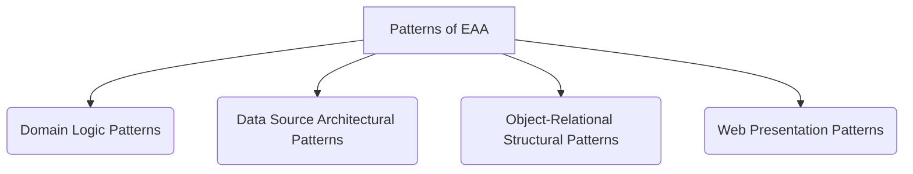
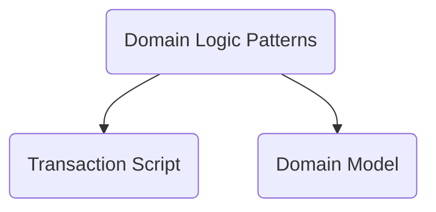
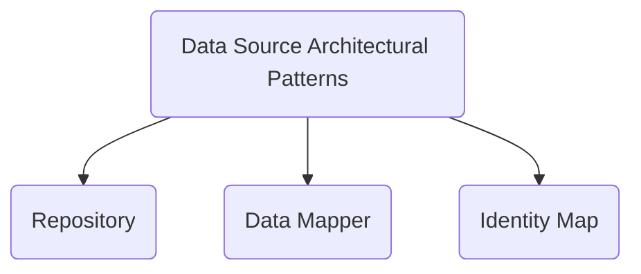
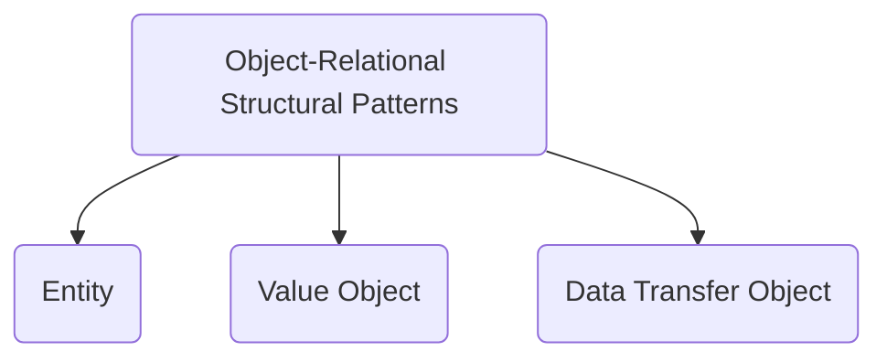
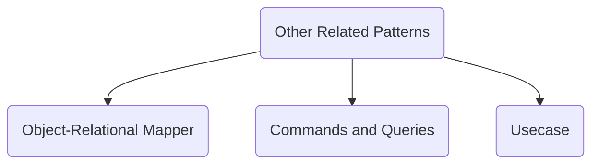

# Patterns of Enterprise Application Architecture

The patterns described here are largely drawn from Martin Fowler's seminal book, "Patterns of Enterprise Application Architecture". This document covers a selection of these patterns, but the original book is a much more comprehensive catalogue. Unlike the classic [[gof|GoF patterns]] that focus on object-oriented design in a general sense, P of EAA patterns provide proven solutions to the specific, recurring problems encountered when building large-scale, data-intensive enterprise applications.

These patterns offer a vocabulary and a set of blueprints for structuring business logic, managing data persistence, and handling the complexities of web presentation and concurrency. They are foundational for understanding modern application frameworks and architectures like [[clean|Clean Architecture]] and [[ddd|Domain-Driven Design (DDD)]].



---

## 1. Domain Logic Patterns



These patterns describe different ways to organize the core business logic of an application.

### **Transaction Script**

*   **Problem**: How to organize business logic for simple applications or simple procedures within a larger application?
*   **Synopsis**: The **Transaction Script** pattern organizes business logic as a collection of procedural scripts. Each script handles a single request from the presentation layer, processing it in a single, linear transaction. It's a straightforward approach that doesn't require a complex domain model.

    ```mermaid
    sequenceDiagram
        participant Client
        participant PresentationLayer as Presentation Layer
        participant TransactionScript as Transaction Script
        participant Database

        Client->>PresentationLayer: HTTP Request (e.g., POST /reservations)
        PresentationLayer->>TransactionScript: call makeReservation(data)
        activate TransactionScript
        TransactionScript->>Database: 1. Read data (e.g., check availability)
        TransactionScript->>Database: 2. Write data (e.g., insert reservation)
        Database-->>TransactionScript: Confirm
        TransactionScript-->>PresentationLayer: Return result
        deactivate TransactionScript
        PresentationLayer-->>Client: HTTP Response
    ```

    The sequence diagram shows a client request being handled by a single procedural script. The script directly interacts with the [[databases|database]] to perform all the steps of the business transaction within one method call.

*   **Key Characteristics**:
    *   **[[imperative-programming|Procedural]]**: Logic is organized by procedure, not by object.
    *   **Simplicity**: Easy to understand and implement for simple tasks.
    *   **Coarse-Grained**: Each script typically corresponds to a single user action.
*   **Applicability**: Simple applications, or simple features within a complex application (e.g., a reporting feature).
*   **Limitations and Challenges**: Becomes difficult to maintain as business logic grows more complex, leading to code duplication. It is not suitable for applications with rich, complex domain rules.

*   **Related Patterns**:
    *   It is the simplest alternative to a [[#Domain Model]].
    *   Transaction Scripts are often used in a traditional [[layered|Layered Architecture]].

### **Domain Model**

*   **Problem**: How to manage complex and ever-changing business rules in a structured and maintainable way?
    **Synopsis**: The **Domain Model** pattern represents the business logic as an object model with both data and behavior. This model is composed of a network of interconnected objects that directly reflect the domain concepts. It's the foundation of **[[ddd|Domain-Driven Design (DDD)]]**.

    ```mermaid
    classDiagram
        class Order {
            -List~OrderLine~ orderLines
            -OrderStatus status
            +addLine(Product, quantity)
            +calculateTotal() Money
            +ship()
        }
        class OrderLine {
            -Product product
            -int quantity
            +calculatePrice() Money
        }
        class Product {
            -Money price
        }
        Order "1" *-- "many" OrderLine
        OrderLine "1" -- "1" Product
    ```

    The class diagram shows an `Order` object that contains business logic (`addLine`, `calculateTotal`, `ship`) and maintains its own state. The logic is encapsulated within the domain objects themselves, rather than in separate service classes.

*   **Key Characteristics**:
    *   **Rich Objects**: Objects contain both data and the business logic that operates on that data.
    *   **Behavioral Encapsulation**: Business rules are encapsulated within the relevant domain objects.
    *   **Reflects Reality**: The object model is a rich representation of the business domain.
*   **Applicability**: Complex applications with a lot of business logic and rules that change over time.
*   **Limitations and Challenges**: Requires a deeper understanding of object-oriented design and [[ddd|Domain-Driven Design (DDD)]]. Can be overkill for simple applications.

*   **Related Patterns**:
    *   A Domain Model is composed of [[#Entity|Entities]] and [[#Value Object|Value Objects]].
    *   It is the core of architectures like [[onion|Onion Architecture]] and [[clean|Clean Architecture]].
    *   It contrasts with the procedural [[#Transaction Script]] pattern.

---

## 2. Data Source Architectural Patterns



These patterns deal with how the application communicates with the [[databases|database]].

### **Repository**

*   **Problem**: How to separate the domain and business logic from the details of data access, making the system more testable and flexible?
*   **Synopsis**: The **Repository** pattern mediates between the domain and data mapping layers. It provides a collection-like interface for accessing domain objects, hiding the underlying persistence mechanism (like a [[databases|database]] or a web service).

    ```mermaid
    classDiagram
        direction LR
        class ApplicationService {
            -userRepository: IUserRepository
            +findUser(id)
        }
        class IUserRepository {
            &lt;&lt;interface&gt;&gt;
            +findById(id) User
            +save(user)
        }
        class JpaUserRepository {
            +findById(id) User
            +save(user)
        }
        class InMemoryUserRepository {
            +findById(id) User
            +save(user)
        }
        ApplicationService o-- IUserRepository
        JpaUserRepository ..|> IUserRepository
        InMemoryUserRepository ..|> IUserRepository
    ```

    The diagram shows an `ApplicationService` depending on a `IUserRepository` interface, not a concrete implementation. This allows the persistence mechanism (`JpaUserRepository` for production, `InMemoryUserRepository` for testing) to be swapped out easily.

*   **Key Characteristics**:
    *   **Abstraction**: Hides the data store implementation from the business logic.
    *   **Collection-like Interface**: Provides methods like `findById`, `save`, `findAll`.
    *   **Testability**: Allows for easy mocking or stubbing of the data layer for unit tests.
*   **Applicability**: Almost any application that requires a clean separation between business logic and data persistence. It's a cornerstone of [[clean|Clean Architecture]] and [[ddd|Domain-Driven Design (DDD)]].
*   **Limitations and Challenges**: Can add a layer of abstraction that is not necessary for very simple applications.

*   **Related Patterns**:
    *   A Repository's interface is defined in the domain layer to adhere to the [[solid|Dependency Inversion Principle]].
    *   It often uses a [[#Data Mapper]] or a full [[#Object-Relational Mapper (ORM)|ORM]] for its implementation.
    *   It is a core component in architectures like [[clean|Clean Architecture]] and [[onion|Onion Architecture]].

### **Data Mapper**

*   **Problem**: How to move data between objects and a [[databases|database]] while keeping both the objects and the [[databases|database]] schema independent of each other?
*   **Synopsis**: A **Data Mapper** is a layer of software that separates the in-memory objects from the [[databases|database]]. Its responsibility is to transfer data between the two and to isolate them from each other.

    ```mermaid
    classDiagram
        class UserMapper {
            +find(id) User
            +insert(User)
            +update(User)
        }
        class User {
            -id
            -name
        }
        class Database
        UserMapper --> User : creates/reads
        UserMapper <--> Database : SQL queries
    ```

    The diagram shows a `UserMapper` that is solely responsible for mapping data from the `User` domain object to [[databases|database]] tables and back. The `User` object itself has no knowledge of the [[databases|database]].

*   **Key Characteristics**:
    *   **[[cohesion-coupling|Decoupling]]**: The domain model and the [[databases|database]] schema can evolve independently.
    *   **[[soc|Separation of Concerns]]**: The mapping logic is completely isolated in the mapper.
    *   **Complexity**: More complex to set up than simpler patterns like Active Record.
*   **Applicability**: Applications with a rich [[#domain-model|Domain Model]] where keeping the domain logic free from persistence concerns is critical.

*   **Related Patterns**:
    *   **[[#Repository|Repositories]]** are often implemented using **Data Mappers**.
    *   An **[[#Object-Relational Mapper (ORM)|ORM]]** is essentially a sophisticated, framework-level implementation of the Data Mapper pattern.
    *   It often works with an [[#Identity Map]] to handle object identity.

### **Identity Map**

*   **Problem**: How to ensure that each object is loaded from the [[databases|database]] only once per transaction, preventing inconsistencies from multiple in-memory copies of the same data?
*   **Synopsis**: An **Identity Map** is a map-like object that keeps track of all objects that have been read from the [[databases|database]] in a single session or transaction. Whenever you need an object, you first check the Identity Map to see if you already have it in memory.

    ```mermaid
    sequenceDiagram
        participant Repository
        participant IdentityMap
        participant DataMapper
        
        Repository->>IdentityMap: getUser(id: 123)?
        alt User not in map
            IdentityMap-->>Repository: Not found
            Repository->>DataMapper: loadUser(id: 123)
            DataMapper-->>Repository: return userObject
            Repository->>IdentityMap: addUser(id: 123, userObject)
        else User in map
            IdentityMap-->>Repository: return userObject
        end
    ```
    
    The sequence diagram illustrates how the Identity Map prevents redundant [[databases|database]] calls. When an object is requested, the map is checked first. If the object is not in the map, it is loaded from the [[databases|database]] via the Data Mapper and then stored in the map for future requests.
    
*   **Key Characteristics**:    
    *   **Caching**: Acts as a session-level [[caching|cache]].
    *   **Identity Management**: Guarantees a one-to-one correspondence between a [[databases|database]] row and an in-memory object within a transaction.
    *   **Performance**: Avoids redundant [[databases|database]] queries.
*   **Applicability**: Used within frameworks that manage [[databases|database]] sessions, such as ORMs.
*   **Limitations and Challenges**: The scope and lifetime of the map (per transaction, per session) must be carefully managed to avoid memory leaks or stale data.

*   **Related Patterns**:
    *   This pattern is almost always used by a [[#Data Mapper]] or an [[#Object-Relational Mapper (ORM)|ORM]] to ensure object identity.

---

## 3. Object-Relational Structural Patterns



These patterns describe how to structure the domain objects themselves.

### **Entity**

*   **Problem**: How to model objects that have a distinct identity that runs through time and different states?
*   **Synopsis**: An **Entity** (also known as a Reference Object) is an object that is not defined by its attributes, but rather by its thread of continuity and identity. Two `Entity` objects are considered the same if they have the same ID, even if their other attributes are different.

    ```mermaid
    classDiagram
        class Customer {
            &lt;&lt;Entity&gt;&gt;
            +UUID id
            -String name
            -Address address
            +changeAddress(newAddress)
        }
    ```

    The diagram shows a `Customer` class as an Entity. It has a unique identifier (`id`) and its identity persists over time, even if its attributes like `name` or `address` change.

*   **Key Characteristics**:
    *   **Identity**: Has a unique identifier that is stable over its lifecycle.
    *   **Mutable**: The attributes of an entity can change over time.
    *   **Lifecycle**: Has a clear creation, modification, and deletion lifecycle.
*   **Applicability**: Modeling core domain concepts like `Customer`, `Product`, `Order`.

*   **Related Patterns**:
    *   A core component of a [[#Domain Model]].
    *   Contrasts directly with a [[#Value Object]].
    *   [[#Repository|Repositories]] are used to manage the lifecycle of Entities.
    *   [[#Object-Relational Mapper (ORM)|ORMs]] are the primary tools used to manage the persistence of entities.

### **Value Object**

*   **Problem**: How to represent a descriptive aspect of the domain that has no conceptual identity?
*   **Synopsis**: A **Value Object** is an object that represents a descriptive aspect of the domain. It is defined by its attributes, not by an ID. Two `Value Objects` are equal if all their attributes are equal. They should be treated as immutable.

    ```mermaid
    classDiagram
        class Money {
            &lt;&lt;Value Object&gt;&gt;
            -BigDecimal amount
            -Currency currency
            +add(Money) Money
            +isGreaterThan(Money) bool
        }
    ```

    The diagram shows a `Money` class as a Value Object. Its equality is determined by its attributes (`amount` and `currency`), not by an ID. It is immutable and contains related logic.

*   **Key Characteristics**:
    *   **No Identity**: Equality is based on attribute values.
    *   **Immutability**: Once created, a Value Object should not be changed. Operations that would change it should return a new Value Object.
    *   **Self-validating**: Can encapsulate validation logic (e.g., an `Email` value object).
*   **Applicability**: Modeling concepts like `Money`, `DateRange`, `Address`, or a `Color`.

*   **Related Patterns**:
    *   A core component of a [[#Domain Model]], often as an attribute of an [[#Entity]].
    *   Contrasts directly with an [[#Entity]].
    *   It is distinct from a [[#Data Transfer Object (DTO)|DTO]], as a Value Object can contain business logic, whereas a DTO is a simple data container with no behavior.

### **Data Transfer Object (DTO)**

*   **Problem**: How to pass data with multiple attributes in a single, efficient call between processes or layers?
*   **Synopsis**: A **Data Transfer Object (DTO)** is a simple object used to transfer data between application layers or across process boundaries (e.g., from a server to a client). It contains only data and has no business logic. Its purpose is to reduce the number of remote calls.

    ```mermaid
    classDiagram
        class CustomerDTO {
            +String name
            +String address
            +List~OrderDTO~ recentOrders
        }
    ```

    The diagram shows a `CustomerDTO` used for data transfer. It is a simple data container with no business logic, designed to carry data between layers or across the network.

*   **Key Characteristics**:
    *   **No Behavior**: DTOs are simple data containers with getters and setters.
    *   **Serialization**: Designed to be easily serialized for transfer over a network.
    *   **[[cohesion-coupling|Decoupling]]**: Decouples the presentation layer from the domain model.
*   **Applicability**: Transferring data from a server to a web client (e.g., as JSON), or between different layers of an application to avoid exposing the internal domain model.

*   **Related Patterns**:
    *   Used to avoid exposing domain objects like [[#Entity|Entities]] to the presentation layer.
    *   Often returned by the read-side in a [[cqrs|CQRS]] architecture.
    *   It differs from a [[#Value Object]], as a DTO has no behavior and its purpose is to move data between layers, while a Value Object is a part of the domain model and can have domain-specific logic.

---

## 4. Other Related Patterns



### **Object-Relational Mapper (ORM)**

*   **Problem**: How to automate the tedious and error-prone task of writing data mapping code between an object-oriented domain model and a [[rdbms|relational database]]?
*   **Synopsis**: An **ORM** is a tool or framework that automates the transfer of data between an object model and a [[rdbms|relational database]]. It acts as a generic **[[#data-mapper|Data Mapper]]**, handling object creation, updates, and queries, and translating them into SQL.

    ```mermaid
    graph TD
        subgraph Application
            DomainObjects[Domain Objects]
        end
        subgraph ORM
            APILayer[ORM API - JPA, Hibernate]
            MappingEngine[Mapping Engine]
        end
        subgraph Database
            DB[(Relational DB)]
        end
        DomainObjects <--> APILayer
        APILayer --> MappingEngine
        MappingEngine <--> DB
    ```

    The diagram illustrates the role of an ORM as a layer between the application's domain objects and the relational [[rdbms|database]], automating data mapping.

*   **Key Characteristics**:
    *   **Automation**: Automates CRUD (Create, Read, Update, Delete) operations.
    *   **Abstraction**: Hides SQL from the developer for most common operations.
    *   **Implements Patterns**: An ORM typically implements the [[#repository|Repository]], [[#data-mapper|Data Mapper]], and [[#identity-map|Identity Map]] patterns for you.
*   **Applicability**: Most enterprise applications that use a relational [[rdbms|database]].
*   **Limitations and Challenges**: Can generate inefficient SQL for complex queries. The abstraction can "leak," forcing developers to understand the underlying SQL anyway.

*   **Related Patterns**:
    *   An ORM is a concrete and powerful implementation of the [[#Data Mapper]] pattern.
    *   It internally uses an [[#Identity Map]] to manage object identity.

### **Commands and Queries**

*   **Problem**: How to clearly separate operations that change state from operations that only read state, while decoupling the invoker from the handler?
*   **Synopsis**: This pattern, which is the core of **[[cqrs|CQRS]]**, separates every operation into two distinct categories:
    *   A **Command** is an object that encapsulates an intent to change the state of the system (e.g., `CreateUserCommand`). It is dispatched to a central bus and handled by a single, specific command handler. Commands should not return data.
    *   A **Query** is an object that encapsulates a request for data (e.g., `GetUserDetailsQuery`). It is dispatched to a bus and handled by a query handler to retrieve data, typically from a read-optimized model. Queries are side-effect-free and return data, often as a [[#Data Transfer Object (DTO)|DTO]].

    ```mermaid
    sequenceDiagram
        participant Client as UI/Controller
        participant Bus as Command/Query Bus
        participant Handler
        participant Domain/ReadModel as Domain Model / Read Model

        Client->>Bus: dispatch(CreateUserCommand)
        activate Bus
        Bus->>Handler: find handler for CreateUserCommand
        Bus->>Handler: handle(CreateUserCommand)
        deactivate Bus
        activate Handler
        Handler->>Domain/ReadModel: Perform action (e.g., save user)
        Domain/ReadModel-->>Handler: (no return for command)
        deactivate Handler

        Client->>Bus: dispatch(GetUserDetailsQuery)
        activate Bus
        Bus->>Handler: find handler for GetUserDetailsQuery
        Bus->>Handler: handle(GetUserDetailsQuery)
        deactivate Bus
        activate Handler
        Handler->>Domain/ReadModel: Fetch data
        Domain/ReadModel-->>Handler: return DTO
        Handler-->>Client: return DTO
        deactivate Handler
    ```

    The flow involves a client creating a command or query object and passing it to a **Bus**, which acts as a mediator. The bus is responsible for finding and invoking the single, specific **Handler** registered for that message. This decouples the client (what needs to be done) from the handler (how it is done).

*   **Key Characteristics**:
    *   **[[soc|Separation of Concerns]]**: Clearly separates write operations (Commands) from read operations (Queries).
    *   **Intent**: Commands and Queries are message objects that explicitly represent the user's intent.
    *   **Decoupling**: The client is decoupled from the handler via the Bus.
    *   **Optimization**: Allows the read (query) and write (command) paths of an application to be optimized independently.
*   **Applicability**: A core part of the [[cqrs|CQRS]] architectural pattern, often used in [[event-sourcing|Event Sourcing]] and complex systems that require a clear separation of concerns.

*   **Related Patterns**:
    *   The fundamental components of the [[cqrs|CQRS]] architectural pattern.
    *   A Command is an implementation of the [[gof#Command|Command pattern]].
    *   The Bus acts as a [[gof#Mediator|Mediator]] between the client and the handlers.
    *   Queries often return [[#Data Transfer Object (DTO)|DTOs]] to avoid leaking domain models.

### **Usecase (Application Service)**

*   **Problem**: A system's requirements are often captured as **Use Cases**, which describe the interactions between a user (actor) and the system to achieve a goal. How do we implement these use cases in code in a way that is decoupled from the UI and infrastructure, and avoids putting orchestration logic in the domain objects?
*   **Synopsis**: The **Usecase** pattern (often called an **Application Service**) implements a single business use case. It is an object that orchestrates the sequence of actions required to fulfill the goal described in the use case requirement. It contains the *application logic* (the sequence of steps), but delegates the core *domain logic* (the business rules) to the domain objects ([[#entity|Entities]], [[#repository|Repositories]]) it coordinates.

    ```mermaid
    sequenceDiagram
        participant Controller
        participant RegisterUserUsecase as RegisterUser Usecase
        participant UserRepository
        participant UserEntity as User (Entity)

        Controller->>RegisterUserUsecase: execute(userData)
        activate RegisterUserUsecase
        Note over RegisterUserUsecase: Contains Application Logic (the "how-to")
        RegisterUserUsecase->>UserRepository: findByEmail(email)
        UserRepository-->>RegisterUserUsecase: (returns null)
        RegisterUserUsecase->>UserEntity: create(userData)
        activate UserEntity
        Note over UserEntity: Contains Domain Logic (the "rules")<br/>e.g., password validation, etc.
        UserEntity-->>RegisterUserUsecase: newUser
        deactivate UserEntity
        RegisterUserUsecase->>UserRepository: save(newUser)
        deactivate RegisterUserUsecase
    ```

    The diagram shows how the `Usecase` orchestrates the flow. It calls the `User` entity to create a new user, but the actual validation rules (e.g., password strength, valid email format) are encapsulated within the `User` entity itself. The Usecase only manages the sequence of operations.

*   **Key Characteristics**:
    *   **Orchestration**: Coordinates domain objects to perform a task.
    *   **Transactional**: A use case method typically defines the boundary of a transaction.
    *   **Separation of Logic**: It separates the *application logic* (the flow of steps) from the core *domain logic* (the business rules, which reside in the domain model).
*   **Applicability**: A key component of [[clean|Clean Architecture]] and [[hexagonal|Hexagonal Architecture]], acting as the primary entry point into the application's core logic.

*   **Related Patterns**:
    *   The central element of the application layer in [[clean|Clean Architecture]] and [[onion|Onion Architecture]].
    *   It uses [[#Repository|Repositories]] to interact with the persistence layer and orchestrates [[#Entity|Entities]] and [[#Value Object|Value Objects]].

---

## **Resources & links**

### **Articles**

1.  **[Catalog of Patterns of Enterprise Application Architecture](https://www.martinfowler.com/eaaCatalog/)**

    This is the online catalog of patterns from Martin Fowler's book, providing summaries for structuring business logic, data source integration, and more in enterprise applications.

2.  **[Patterns of Enterprise Application Architecture — Organizing Domain Logic](https://medium.com/javarevisited/patterns-of-enterprise-application-architecture-organizing-domain-logic-50efd9ea3f39)**

    This Medium article summarizes key patterns for organizing domain logic from Fowler's book, including Transaction Script, Domain Model, and the Service Layer concept.

### **Videos**

1.  **[Enterprise Architecture - Domain Logic Patterns](https://www.youtube.com/watch?v=sQgSkkh1VBw)**

    This video provides an overview of the Domain Logic patterns from the "Patterns of Enterprise Application Architecture" book.

