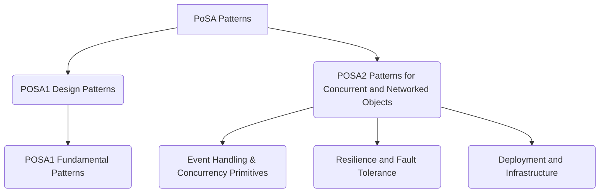
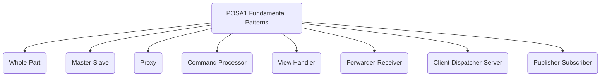
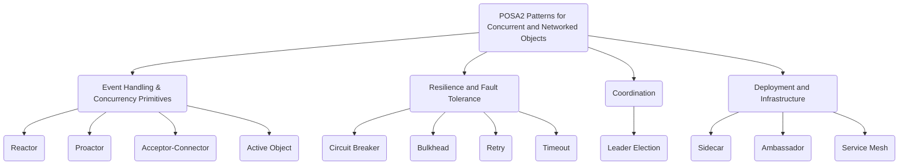

# POSA Design Patterns

## What is POSA?

**POSA**, which stands for **Pattern-Oriented Software Architecture**, is a series of books that catalogue and describe fundamental patterns for building robust and resilient software systems. Unlike the more focused **[[gof|Gang of Four (GoF) patterns]]** for object-oriented design, POSA patterns address broader architectural and design issues, particularly in areas like concurrent, distributed, and networked systems. The series provides a common language and a systematic approach for tackling complex software design challenges.

This section focuses on the **[[software-architecture/design-patterns/|design patterns]]** from the POSA series that solve intermediate-level design problems, often related to object collaboration or managing concurrency and network communication.

The POSA series is divided into two main volumes: POSA1, which focuses on fundamental design patterns, and POSA2, which covers patterns for concurrent and networked objects.



---

## POSA1 Design Patterns

This section focuses on the **[[software-architecture/design-patterns/|design patterns]]** described in **POSA Volume 1: A System of Patterns**. These patterns often serve as a bridge between high-level architectural decisions and object-oriented design.

### POSA1 Fundamental Patterns



#### Whole-Part

* **Problem**: How to organize objects that are the components of a larger, composite object?
* **Synopsis**: The **Whole-Part** (or Composition) pattern allows for structuring a composite aggregate of objects. The **Whole** is responsible for managing the collection of its **Parts** and coordinating their interactions. This pattern is foundational for any system that deals with hierarchical or composite data, like a company's organizational chart or a document's structure.

    ```mermaid
    classDiagram
        class Whole {
            + List~Part~ parts
            + operationA()
            + operationB()
            - manageParts()
        }
        class Part {
            - data
            + behavior()
        }
        Whole "1" *-- "many" Part
        Client --> Whole : uses
    ```

    This class diagram illustrates the compositional structure of the `Whole-Part` pattern. It shows a `Whole` class that maintains a collection of `Part` objects. It also depicts the `Whole` as responsible for the lifecycle of its `Parts` and shows how a client interacts with the `Whole` to perform operations on the collection.

* **Key Characteristics**:
    * **Composition**: The parts are fully contained within the whole. If the `Whole` is destroyed, its `Parts` are typically destroyed as well. This creates a strong, "has-a" relationship.
    * **Unified interface**: Clients interact with the `Whole` via a single interface, abstracting away the complexity of its internal structure.
    * **Encapsulation**: The `Whole` encapsulates the behavior and data of its `Parts`, providing a single point of control.
* **Applicability**: This pattern is ideal for any system where objects are logically composed of other objects, such as a graphical user interface composed of widgets, or a complex order composed of individual line items.
* **Limitations and Challenges**: Can lead to a monolithic `Whole` object with too many responsibilities. The management of complex interactions between `Parts` can be difficult to manage.
* **Relationship with Other Patterns**:
    * The **Whole-Part** pattern is fundamentally the same as the **Composite** pattern from the GoF book, which allows clients to treat individual objects and compositions of objects uniformly.
    * It can be used within an **[[mvc|MVC]]** architecture, where a complex `View` (the `Whole`) is composed of smaller UI widgets (the `Parts`).
    * The `Parts` can be lazily loaded using the **[[#proxy|Proxy]]** pattern to improve performance.

---

#### Master-Slave

* **Problem**: How to decompose a complex and resource-intensive task into smaller sub-tasks that can be executed by independent entities?
* **Synopsis**: The **Master-Slave** pattern separates the coordination logic of a task from its execution. The `Master` is responsible for decomposing the task and distributing sub-tasks to the `Slaves`, as well as for aggregating the final results. This pattern is a fundamental approach for parallel and distributed computing.

    ```mermaid
    sequenceDiagram
        participant Client
        participant Master
        participant Slave1
        participant Slave2
        participant Slave3
        
        Client->>Master: Request for Complex Task
        activate Master
        Master-->>Master: Decompose into Sub-tasks
        Master->>Slave1: Dispatch Sub-task A
        Master->>Slave2: Dispatch Sub-task B
        Master->>Slave3: Dispatch Sub-task C
        
        Slave1-->>Master: Result A
        Slave2-->>Master: Result B
        Slave3-->>Master: Result C
        
        Master-->>Master: Aggregate Results
        Master-->>Client: Final Result
        deactivate Master
    ```

    This sequence diagram illustrates the delegation of work from the `Master` to its `Slaves`. It shows the `Master` first decomposing a complex task, then sending individual sub-tasks to each `Slave`. Finally, it depicts the `Master` receiving and aggregating the results from each `Slave` to form the final outcome.

* **Key Characteristics**:
    * **Task decomposition**: The `Master` divides the problem into manageable, independent sub-problems.
    * **Delegation**: The `Slaves` perform the computations, often in parallel, without needing to communicate with each other.
    * **Results aggregation**: The `Master` reassembles the individual results from the `Slaves` into a single, cohesive final solution.
* **Applicability**: This pattern is commonly used in parallel computing, data processing systems (e.g., MapReduce frameworks), and large-scale search algorithms.
* **Limitations and Challenges**: Performance depends heavily on the ability to effectively decompose the task. Synchronization and managing failures of the `Slaves` (e.g., what if a `Slave` crashes?) can be complex.
* **Relationship with Other Patterns**:
    * The **Master-Slave** pattern is a specific implementation of task parallelism and is related to patterns like **Fork/Join**.
    * The `Master` can use the **[[#command-processor|Command Processor]]** pattern to create and manage the sub-tasks that are sent to the `Slaves`.
    * In distributed systems, this pattern is often a building block for more complex architectures like MapReduce.

---

#### Proxy

* **Problem**: How to provide a substitute or **placeholder** for another object to control its access?
* **Synopsis**: The **Proxy** pattern offers an intermediary that controls access to an underlying object. The `Proxy` and the real object (`Subject`) share the same interface, allowing the `Proxy` to intercept method calls and add functionality, such as security checks, remote communication, or `lazy loading`.

    ```mermaid
    classDiagram
        class Client
        class Subject {
            &lt;&lt;interface&gt;&gt;
            +request()
        }
        class Proxy {
            +request()
            -realSubject: RealSubject
        }
        class RealSubject {
            +request()
        }
        
        Client --> Subject
        Proxy ..|> Subject
        RealSubject ..|> Subject
        Proxy o-- RealSubject
    ```

    This class diagram shows the structural relationship between a `Client`, a `Proxy`, and the real `Subject`. It illustrates how the `Client` interacts with the `Proxy` via a shared interface. The `Proxy` then delegates the requests to the real `Subject`, adding a layer of control over the interaction.

    The `Whole` object doesn't just hold its `Parts`; it acts as an **orchestrator and abstraction layer**. It's the `Whole` that aggregates the behavior and state of its `Parts` to provide a coherent, high-level functionality. For example, a `Car` object (the `Whole`) has `Wheels`, a `Chassis`, and an `Engine` (the `Parts`). The client only interacts with the `Car`'s `drive()` method, while the `Car` internally coordinates the actions of its `Parts` to make the entire system work. This strong **composition** ensures that the `Parts` cannot exist without the `Whole`, and the client is shielded from their internal complexity.

* **Key Characteristics**:
    * **Shared interface**: The `Proxy` implements the same interface as the real `Subject`, making it transparent to the client.
    * **Access control**: The `Proxy` can authorize or deny access to the `Subject`'s methods, acting as a gatekeeper.
    * **Lazy initialization**: The `Proxy` can defer the creation of the `RealSubject` until it is actually needed, improving startup performance.
* **Applicability**: This pattern is widely used in object-relational mapping (ORM) frameworks for lazy loading, in remote procedure call (RPC) mechanisms, and for implementing security and caching.
* **Limitations and Challenges**: Can introduce an overhead due to the extra layer of indirection. Overuse of this pattern can make the architecture unnecessarily complex.
* **Relationship with Other Patterns**:
    * The **Proxy** pattern is one of the original **GoF patterns**.
    * It is often used in conjunction with the **[[#forwarder-receiver|Forwarder-Receiver]]** pattern, where the `Forwarder` acts as a proxy for a remote object.
    * A **[[#client-dispatcher-server|Client-Dispatcher-Server]]** can use a `Proxy` on the client side to hide the `Dispatcher`'s location.
    * It can also be used to implement lazy loading for the `Parts` in a **[[#whole-part|Whole-Part]]** structure.

---

#### Command Processor

* **Problem**: How to encapsulate requests so they can be handled transparently, queued, logged, or undone?
* **Synopsis**: The **Command Processor** pattern separates a command's invocation from its execution. A command is encapsulated in a `Command` object that can be stored in a [[message-queue|queue]]. A `Processor` then executes these commands sequentially, providing a robust mechanism for managing a sequence of actions.

    ```mermaid
    sequenceDiagram
        participant Client
        participant Command
        participant CommandProcessor
        participant Receiver
        
        Client->>Command: create()
        Client->>CommandProcessor: execute(command)
        
        CommandProcessor->>CommandProcessor: queue(command)
        CommandProcessor->>Command: execute()
        Command->>Receiver: action()
    ```

    This sequence diagram illustrates the flow of a command through the `Command Processor` pattern. It shows a `Client` creating and invoking a `Command` object on a `Command Processor`. The `Processor` then manages a queue of commands and executes them in sequence, decoupling the invocation from the execution.

* **Key Characteristics**:
    * **Command encapsulation**: The request is a first-class object, allowing it to be passed around, stored, and executed later.
    * **Queueing**: Commands are stored in a queue, enabling features like batch processing and scheduling.
    * **Extended functionality**: The pattern's structure makes it easy to add features like a transaction log (for persistence), undo/redo functionality, and macros.
* **Applicability**: This pattern is a cornerstone of text editors (`undo/redo` functionality), workflow systems, and any application that needs to manage a history of operations.
* **Limitations and Challenges**: Can introduce complexity for simple applications. Implementing `undo/redo` can be difficult for commands that have side effects.
* **Relationship with Other Patterns**:
    * This pattern is an extension of the **Command** pattern from the GoF book. It adds the "processor" component that manages a queue of commands.
    * It can be used in a **[[#master-slave|Master-Slave]]** architecture, where the `Master` creates `Command` objects and sends them to `Slaves` for execution.
    * The queueing mechanism is a form of **[[message-queue|Message Queue]]**.

#### View Handler

* **Problem**: How to manage the dependencies and coordination between multiple views in an interactive system?
* **Synopsis**: The **View Handler** pattern manages the creation, destruction, and switching between different views of an application. It acts as a coordinator that ensures the views' consistency with the data model. This pattern is crucial for maintaining a clean separation between the user interface and the underlying business logic.

    ```mermaid
    graph TD
        subgraph System
            subgraph Views
                View1
                View2
                View3
            end
            ViewHandler
            Model
        end
        
        ViewHandler --> View1
        ViewHandler --> View2
        ViewHandler --> View3
        ViewHandler <--> Model
    ```

    This component diagram shows the responsibilities of the `View Handler`. It illustrates the `View Handler` component managing multiple `View` components. It also shows the `View Handler`'s role in communicating with the underlying `Model` to ensure that all `Views` are synchronized with the state of the application data.

* **Key Characteristics**:
    * **Centralized coordination**: The `View Handler` serves as a single point of control for managing all views, simplifying the overall architecture.
    * **State management**: It is responsible for handling view state changes and ensuring that views are properly synchronized with the `Model`.
    * **[[cohesion-coupling|Decoupling]]**: It decouples the `Views` from each other, as they only need to communicate with the `View Handler` or the `Model` directly.
* **Applicability**: This pattern is fundamental to GUI frameworks, `single-page` web applications (SPAs), and dashboard systems where multiple views of the same data need to be managed.
* **Limitations and Challenges**: Can become a `god object` or a central point of contention if its logic is not carefully managed.
* **Relationship with Other Patterns**:
    * The **View Handler** is a key component in presentation patterns like **[[mvc|MVC]]**, **[[mvp|MVP]]**, and **[[mvvm|MVVM]]**, where it often plays the role of the `Controller` or `Presenter`.
    * It frequently manages a **[[#whole-part|Whole-Part]]** structure, where the main view is composed of smaller, nested views.
    * It often works with the **[[publish-subscribe|Publisher-Subscriber]]** pattern to receive updates from the `Model` and refresh the `Views`.

---

#### Forwarder-Receiver

* **Problem**: How to provide transparent point-to-point communication in a distributed system, hiding network details?
* **Synopsis**: The **Forwarder-Receiver** pattern separates communication layers from the applications that use them. A **Forwarder** is responsible for sending messages from one process to another, while the **Receiver** receives and distributes incoming messages. This pattern is often used as a building block for more complex communication systems.

    ```mermaid
    graph TD
        Client --> Forwarder
        Forwarder --> Receiver
        Receiver --> Server
        subgraph Host1
            Client
            Forwarder
        end
        subgraph Host2
            Receiver
            Server
        end
    ```

    This component diagram illustrates the `Forwarder-Receiver` pattern. It shows a `Client` interacting with a `Forwarder` component to send a message. The `Forwarder` handles the network details and passes the message to a remote `Receiver` component, which then delivers the message to the intended `Server`. This highlights the encapsulation of communication logic.

* **Key Characteristics**:
    * **Encapsulation of transport**: Network protocols, serialization, and other low-level details are hidden from the application logic.
    * **Synchronous communication**: It is often used for request-response interactions where the client waits for a reply.
    * **Simplicity**: Provides a relatively straightforward way to achieve point-to-point communication without building a complex messaging system.
* **Applicability**: This pattern is suitable for `Inter-Process Communication` (IPC) and simple distributed systems where direct, encapsulated communication is required.
* **Limitations and Challenges**: It does not natively handle distributing messages to multiple recipients. It is also not suitable for systems that require a high degree of [[cohesion-coupling|loose coupling]] or [[message-driven|asynchronous communication]].
* **Relationship with Other Patterns**:
    * The **Forwarder-Receiver** pattern is a foundational pattern for building distributed systems and can be seen as a simplified version of the **[[broker|Broker]]** pattern.
    * It is often used with the **[[#proxy|Proxy]]** pattern, where the `Forwarder` acts as a local proxy for a remote service, hiding the network communication details from the client.

#### Client-Dispatcher-Server

* **Problem**: How to manage communication between clients and servers in a flexible way, hiding the location of services?
* **Synopsis**: The **Client-Dispatcher-Server** pattern introduces a central `Dispatcher` component that acts as a [[broker]]. `Clients` send their requests to the `Dispatcher`, which then routes them to the appropriate `Server`. This pattern provides a level of indirection that simplifies service management and adds flexibility.

    ```mermaid
    graph TD
        Client --> Dispatcher
        Dispatcher --> Server1
        Dispatcher --> Server2
        Dispatcher --> Server3
        subgraph "Servers"
            Server1
            Server2
            Server3
        end
    ```

    This component diagram shows the `Client-Dispatcher-Server` pattern. It illustrates how the `Client` sends a request to a central `Dispatcher` component. The `Dispatcher` is then responsible for locating the correct `Server` and forwarding the request. This centralized approach hides the service location from the client.

* **Key Characteristics**:
    * **Centralization**: A single point of coordination (`Dispatcher`) simplifies service discovery and routing.
    * **Flexibility**: It allows for adding, removing, or moving `servers` without affecting client code.
    * **[[cohesion-coupling|Decoupling]]**: `Clients` do not need to know the location of the `Servers`, only the address of the `Dispatcher`.
* **Applicability**: This pattern is well-suited for dynamic distributed systems, service registries, and [[microservices]] architectures where services may be added or removed frequently.
* **Limitations and Challenges**: The `Dispatcher` can become a performance bottleneck or a `single point of failure`. A robust implementation requires built-in redundancy and failover mechanisms.
* **Relationship with Other Patterns**:
    * This pattern is a specific implementation of the **[[broker|Broker]]** pattern, where the `Dispatcher` acts as the central message broker.
    * It is conceptually similar to the **Service Locator** pattern.
    * In modern **[[microservices]]** architectures, the `Dispatcher` role is often fulfilled by an **API Gateway** or a combination of a **Service Registry** and **Service Discovery** mechanism.

#### Publisher-Subscriber

* **Problem**: How to enable asynchronous and decoupled communication between entities?
* **Synopsis**: The **[[publish-subscribe|Publisher-Subscriber]]** pattern allows entities (**Subscribers**) to subscribe to events or messages of interest. A **Publisher** emits messages without knowing the `Subscribers`, which creates a [[cohesion-coupling|loose coupling]] between them. This pattern is the cornerstone of [[event-driven|event-driven architectures]].

    ```mermaid
    graph TD
        Publisher1 --> Broker
        Publisher2 --> Broker
        Broker --> Subscriber1
        Broker --> Subscriber2
    ```

    This component diagram illustrates the `Publisher-Subscriber` pattern. It shows `Publishers` sending messages to a central `Channel` or `Broker`. The `Subscribers` are registered with the `Channel` and receive messages without being aware of the `Publishers`. This highlights the asynchronous and decoupled nature of the communication.

* **Key Characteristics**:
    * **[[cohesion-coupling|Loose coupling]]**: `Publishers` and `Subscribers` are not aware of each other, communicating through a shared channel.
    * **Asynchronous**: Communication is non-blocking, allowing `Publishers` to continue processing without waiting for `Subscribers` to receive the message.
    * **Scalability**: The pattern is highly scalable, as new `Publishers` or `Subscribers` can be added without modifying existing components.
* **Applicability**: This pattern is fundamental to real-time data streams, notification systems, and [[microservices]] that communicate via events.
* **Limitations and Challenges**: The reliability of message delivery can be a challenge. The system's complexity increases if message ordering or guaranteed delivery is required.
* **Relationship with Other Patterns**:
    * The **Publisher-Subscriber** pattern is a more scalable and decoupled version of the **Observer** pattern from the GoF book.
    * It is the foundation of **[[event-driven|event-driven architectures]]** and is often implemented using a **[[message-queue|Message Queue]]** or a **[[broker|Broker]]**.
    * In **[[microservices]]**, this pattern is the primary way services communicate asynchronously.

---

## POSA2 Patterns for Concurrent and Networked Objects



### Event Handling & Concurrency Primitives

#### Reactor

* **Problem**: How to efficiently handle multiple service requests from various sources without blocking the program's execution?
* **Synopsis**: The `Reactor` pattern demultiplexes events from multiple sources and dispatches them to their corresponding `handlers`. It's the foundation of many non-blocking I/O frameworks.

    ```mermaid
    sequenceDiagram
        participant Client1
        participant Client2
        participant Reactor
        participant EventHandler1
        participant EventHandler2

        Client1->>Reactor: Service Request 1 (e.g., connection, data)
        Client2->>Reactor: Service Request 2 (e.g., connection, data)

        Reactor->>Reactor: Wait for events on handles (non-blocking)
        Note over Reactor: Event detected on handle for Client1
        Reactor->>EventHandler1: Dispatch Event 1
        EventHandler1->>Client1: Process Request 1 & Send Response

        Note over Reactor: Event detected on handle for Client2
        Reactor->>EventHandler2: Dispatch Event 2
        EventHandler2->>Client2: Process Request 2 & Send Response
    ```

    This sequence diagram illustrates the event-driven behavior of the `Reactor` pattern. It shows how the `Reactor` waits for events from multiple clients. When an event is detected on a handle, the `Reactor` dispatches it to the appropriate `EventHandler` to be processed, allowing the system to handle multiple requests concurrently without blocking.

* **Key Characteristics**:
    * **Event-driven model**: Uses an event management mechanism.
    * **Single-threaded demultiplexing**: A single thread (`Reactor`) waits for events on a set of `handles` (e.g., sockets, file descriptors).
    * **Event handlers**: Objects that encapsulate the processing logic for each event.
* **Applicability**: High-performance servers, event loops for GUIs, and notification systems.
* **Limitations and Challenges**: Can become complex for managing intricate states. The `event handler` logic must be very fast to avoid blocking the main thread.
* **Relationship with Other Patterns**:
    * The **Reactor** pattern is often contrasted with the **[[#proactor|Proactor]]** pattern. `Reactor` handles readiness events (e.g., "data is ready to be read"), while `Proactor` handles completion events (e.g., "the read operation has completed").
    * It implements the **Observer** pattern, where the `Reactor` observes multiple event sources (handles) on behalf of the application.
    * It is often used in conjunction with the **[[#acceptor-connector|Acceptor-Connector]]** pattern to handle connection and service initialization.

#### Proactor

* **Problem**: How to efficiently manage multiple long-running asynchronous operations in a non-blocking manner without using active polling?
* **Synopsis**: The `Proactor` pattern delegates the execution of long-running operations to separate threads or components. It notifies a `completion handler` once the operation is done, which is the inverse of the `Reactor`.

    ```mermaid
    sequenceDiagram
        participant Client
        participant Initiator
        participant Proactor
        participant OS_Kernel
        participant CompletionHandler

        Client->>Initiator: Invoke async_operation(callback)
        Initiator->>OS_Kernel: Start async I/O operation (non-blocking)
        OS_Kernel-->>Initiator: Immediate return (operation in progress)

        Note over OS_Kernel,Proactor: Long-running I/O operation finishes
        OS_Kernel->>Proactor: Notify completion (result)
        Proactor->>CompletionHandler: Dispatch completion event
        CompletionHandler->>Client: Process result with callback
    ```

This sequence diagram shows the asynchronous behavior of the `Proactor` pattern. It highlights how the `Initiator` begins a non-blocking I/O operation via the `OS Kernel` and returns immediately to the `Client`. Once the operation completes, the `OS Kernel` notifies the `Proactor`, which then dispatches a completion event to the `CompletionHandler` to process the result.

* **Key Characteristics**:
    * **Asynchronous operations**: The operation is launched, and the function call returns immediately.
    * **Completion-based**: Once the operation is finished, the system generates a "completion" event.
    * **Proactor event loop**: A thread or `thread pool` waits for notification of operation completion.
* **Applicability**: Server architectures that manage intense I/O (e.g., file servers, databases).
* **Limitations and Challenges**: Depends on native OS support for asynchronous I/O operations. Implementation complexity is often higher.
* **Relationship with Other Patterns**:
    * The **Proactor** pattern is the asynchronous counterpart to the **[[#reactor|Reactor]]** pattern. While `Reactor` is based on synchronous event demultiplexing, `Proactor` is based on asynchronous operation completion.
    * It is often used with the **[[#acceptor-connector|Acceptor-Connector]]** pattern to handle asynchronous connection establishment and service processing.
    * The callback-based nature of the `CompletionHandler` is similar to how the **Command** pattern can be used to encapsulate a piece of work to be executed later.

#### Acceptor-Connector

* **Problem**: How to separate the logic of establishing a connection (accepting/connecting) from the service's processing logic itself?
* **Synopsis**: This pattern facilitates code reuse by decoupling the connection mechanics from the service implementation. The `Acceptor` creates a service `handler` that manages the communication.

    ```mermaid
    classDiagram
        class Acceptor {
            +accept()
            +createServiceHandler()
        }
        class Connector {
            +connect()
            +createServiceHandler()
        }
        class ServiceHandler {
            +handleService()
        }
        class Client {
            +requestConnection()
        }
        class Server {
            +startAccepting()
        }

        Client --o Connector : uses
        Server --o Acceptor : uses
        Acceptor --o ServiceHandler : creates
        Connector --o ServiceHandler : creates
        ServiceHandler <-- Client : communicates with
    ```

    This class diagram illustrates the structural separation of roles in the `Acceptor-Connector` pattern. It clearly shows how the `Acceptor` and `Connector` components are responsible for connection management. The `Acceptor` is used by the `Server` for passive connections, while the `Connector` is used by the `Client` for active connections. Both roles ultimately delegate the service logic to a `ServiceHandler` instance.

* **Key Characteristics**:
    * **Separation of concerns**: Separates the roles of the `Acceptor` and the `Connector` from the service `handler`.
    * **Acceptor**: Manages the passive acceptance of client connections.
    * **Connector**: Manages the active establishment of connections.
* **Applicability**: Middleware frameworks, [[peer-to-peer]] architectures, [[client-server]] systems.
* **Limitations and Challenges**: Can introduce some complexity if the connection logic is very simple.
* **Relationship with Other Patterns**:
    * The **Acceptor-Connector** pattern is almost always used with either the **[[#reactor|Reactor]]** or **[[#proactor|Proactor]]** pattern. The `Acceptor` or `Connector` creates a `ServiceHandler`, which is then registered with the `Reactor` to handle I/O events.
    * It is also an example of the **Separation of Concerns** principle, as it decouples the connection logic from the application-level service logic.

#### Active Object

* **Problem**: How to manage concurrency using an object-oriented approach, synchronizing access to shared data and separating a method's invocation from its execution?
* **Synopsis**: An `Active Object` encapsulates a control thread and a [[message-queue|queue]]. Clients interact with it asynchronously, which protects the object's internal state from concurrent access.

    ```mermaid
    sequenceDiagram
        participant Client
        participant Proxy
        participant Scheduler
        participant MethodRequestQueue
        participant ActiveObject_Impl
        participant ServantThread

        Client->>Proxy: invoke_async_method(args)
        Proxy->>MethodRequestQueue: add(MethodRequest(method, args))
        Proxy-->>Client: Return immediately (future/promise)

        loop Scheduler loop
            Scheduler->>MethodRequestQueue: retrieve_next_request()
            activate Scheduler
            alt Request available
                Scheduler->>ActiveObject_Impl: execute(method, args)
                ActiveObject_Impl->>ServantThread: perform actual work
            else No request
                Scheduler->>Scheduler: Wait for requests
            end
            deactivate Scheduler
        end
    ```

    This sequence diagram depicts the asynchronous behavior of the `Active Object` pattern. It shows how the `Client` makes an asynchronous call on a `Proxy`. The `Proxy` serializes the request into a `MethodRequestQueue`. A separate `Scheduler` and `ServantThread` then retrieve and execute the request, ensuring concurrent access is managed safely.

* **Key Characteristics**:
    * **Asynchronous method invocation**: Method calls are asynchronous.
    * **Method request queue**: A queue stores method requests.
    * **Scheduler**: An object that executes requests from the queue.
    * **Proxy**: An object that manages the `Active Object`'s interface and places requests into the queue.
* **Applicability**: Systems that require concurrent or parallel execution and thread management.
* **Limitations and Challenges**: Can introduce communication overhead due to the queues.
* **Relationship with Other Patterns**:
    * The **Active Object** pattern combines several other patterns to achieve concurrency. It uses a **[[#proxy|Proxy]]** to provide an asynchronous interface to clients.
    * The `MethodRequestQueue` is a form of **[[message-queue|Message Queue]]**, and the `Scheduler` acts as a consumer in a **Producer-Consumer** relationship.
    * Each `MethodRequest` is an implementation of the **Command** pattern, encapsulating a method call as an object.

### Resilience and fault tolerance

#### Circuit Breaker

* **Problem**: How to prevent a network or service failure from cascading to other parts of the system? When a remote service is failing, repeated calls can exhaust resources and cause the entire application to become unresponsive.
* **Synopsis**: The **Circuit Breaker** pattern is a stateful pattern that wraps a protected function call (typically a network call) in a circuit breaker object, which monitors for failures. It acts as a proxy for operations that might fail. The circuit breaker has three states: `Closed`, `Open`, and `Half-Open`.
    *   **Closed**: In the normal state, the circuit breaker allows requests to pass through. It counts the number of failures, and if the count exceeds a threshold, it "trips" and moves to the `Open` state.
    *   **Open**: The circuit breaker immediately rejects all requests with an error, without attempting to call the remote service. After a timeout, it moves to the `Half-Open` state.
    *   **Half-Open**: The circuit breaker allows a single request to pass through to check if the service has recovered. If the request succeeds, the circuit breaker moves to the `Closed` state. If it fails, it returns to the `Open` state.

    ```mermaid
    graph TD
        subgraph Circuit Breaker States
            Closed -- Failure Threshold Exceeded --> Open;
            Open -- Timeout --> HalfOpen[Half-Open];
            HalfOpen -- Success --> Closed;
            HalfOpen -- Failure --> Open;
        end
    ```

* **Key Characteristics**:
    * **Stateful**: The pattern is inherently stateful, tracking the state of the external service.
    * **Fail-Fast**: It provides a fast-failing response when the service is known to be down, preventing the application from waiting for long timeouts.
    * **Automatic Recovery**: The `Half-Open` state allows the circuit breaker to automatically detect when the service has recovered.
    * **Resilience**: It improves the resilience of the system by isolating failures and preventing them from cascading.
* **Applicability**:
    * **Microservices Architectures**: Essential for managing communication between services where failures are expected.
    * **Remote Service Calls**: When interacting with any external system or API that might be unreliable.
    * **High Availability Systems**: For systems that require high uptime, the pattern helps manage service failures and allows the system to self-heal.
* **Limitations and Challenges**:
    * **Configuration**: The thresholds for failure counts and timeouts need to be carefully configured.
    * **Complexity**: The pattern adds complexity to the system, especially when dealing with distributed systems.
    * **Fallback Logic**: A fallback mechanism should be provided for when the circuit is open.

#### Bulkhead

* **Problem**: How to prevent a failure in one part of a system from cascading and bringing down the entire system? A single misbehaving component can exhaust critical resources, such as threads or connections, causing a system-wide outage.
* **Synopsis**: The **Bulkhead** pattern isolates elements of an application into separate pools so that if one fails, the others can continue to function. The name comes from the bulkheads in a ship's hull, which prevent a single breach from flooding the entire ship. This pattern partitions resources, such as connection pools or thread pools, and allocates them to specific components. If a component fails, it only affects its own resource pool, leaving the rest of the system unaffected.

    ```mermaid
    graph TD
        subgraph Client
            direction LR
            C1[Client Application]
        end

        subgraph Server
            direction LR
            subgraph Bulkhead_A
                direction TB
                P1[Connection Pool A]
                T1[Thread Pool A]
                S1[Service A]
                P1 --> T1 --> S1
            end
            subgraph Bulkhead_B
                direction TB
                P2[Connection Pool B]
                T2[Thread Pool B]
                S2[Service B]
                P2 --> T2 --> S2
            end
            subgraph Bulkhead_C
                direction TB
                P3[Connection Pool C]
                T3[Thread Pool C]
                S3[Service C]
                P3 --> T3 --> S3
            end
        end

        C1 --> P1
        C1 --> P2
        C1 --> P3

        style Bulkhead_A fill:#ccc,stroke:#333,stroke-width:2px
        style Bulkhead_B fill:#ccc,stroke:#333,stroke-width:2px
        style Bulkhead_C fill:#ccc,stroke:#333,stroke-width:2px
    ```

* **Key Characteristics**:
    * **Isolation**: Failures are contained within a "bulkhead," preventing them from spreading.
    * **Resource Partitioning**: System resources are divided into pools dedicated to specific components.
    * **Resilience**: The system can withstand partial failures and continue to operate with reduced functionality.
    * **Predictable Performance**: By limiting the resources a single component can consume, the pattern prevents "noisy neighbors" from degrading the performance of the entire system.
* **Applicability**:
    * **Microservices Architectures**: To isolate individual services and prevent cascading failures.
    * **Multi-tenant Systems**: To ensure that the load from one tenant does not affect others.
    * **Resource-Intensive Applications**: To manage and partition resources like thread pools and connection pools.
* **Limitations and Challenges**:
    * **Increased Complexity**: Partitioning the system into isolated components can make the overall design more complex.
    * **Resource Utilization**: Segregated resource pools can sometimes lead to underutilization if one pool is idle while another is overwhelmed.
    * **Configuration**: The size of each bulkhead (e.g., the number of threads in a pool) needs to be carefully configured.

**Relationship with Circuit Breaker**:

The **Bulkhead** and **Circuit Breaker** patterns are often used together to create a comprehensive fault-tolerance strategy. While both patterns aim to improve system resilience, they do so in different ways:

*   **Bulkhead** is a structural pattern that isolates components by partitioning resources. It's about preventing a failure in one area from exhausting resources needed by another. It's a static partitioning of the system.
*   **Circuit Breaker** is a stateful behavioral pattern that stops requests to a service that is known to be failing. It's about giving a failing service time to recover and preventing the application from wasting resources on calls that are likely to fail.

In a typical scenario, a **Bulkhead** might be used to create separate thread pools for different services, and each of these pools would be protected by a **Circuit Breaker**. If a service becomes unresponsive, the **Circuit Breaker** for that service will trip, and only the threads in the corresponding **Bulkhead** pool will be blocked, leaving the rest of the system unaffected.


#### Retry

* **Problem**: How to handle temporary failures when communicating with remote services without immediately failing the operation?
* **Synopsis**: The **Retry** pattern enables an application to handle transient failures by transparently retrying a failed operation. This pattern is particularly useful in distributed systems where temporary network issues or service unavailability are common. The core idea is to retry the operation a certain number of times with a delay between each attempt.

    ```mermaid
    sequenceDiagram
        participant Client
        participant Service

        Client->>Service: Attempt 1
        Service-->>Client: Fail (transient error)

        note over Client: Wait (backoff strategy)

        Client->>Service: Attempt 2
        Service-->>Client: Fail (transient error)

        note over Client: Wait (increased backoff)

        Client->>Service: Attempt 3
        Service-->>Client: Success
    ```

* **Key Characteristics**:
    * **Transient Fault Handling**: Specifically designed to handle temporary issues like network glitches or short-lived service outages.
    * **Backoff Strategy**: To avoid overwhelming a struggling service, a backoff strategy (e.g., exponential backoff) is used to introduce a delay between retries.
    * **Idempotency**: The pattern should only be applied to operations that are idempotent, meaning they can be repeated multiple times without changing the outcome.
    * **Configurable**: The number of retry attempts and the backoff strategy should be configurable.
* **Applicability**:
    * **Unreliable Network Communications**: When calling services over a network that may experience intermittent connectivity issues.
    * **Throttled Services**: When a service may temporarily reject requests due to rate limiting.
    * **Database Connections**: When there are transient issues with database connections or deadlocks.
* **Limitations and Challenges**:
    * **Non-transient failures**: The pattern is not suitable for non-transient (permanent) failures. Retrying a permanent failure will only waste resources.
    * **Retry Storms**: If not implemented carefully with a backoff strategy, multiple clients retrying at the same time can create a "retry storm" that overwhelms the service.
    * **Latency**: Retrying an operation adds latency to the overall response time.

**Relationship with other patterns**:
*   **[[#circuit-breaker|Circuit Breaker]]**: The Retry pattern is often used in conjunction with the **Circuit Breaker** pattern. After a certain number of retries, the circuit breaker can trip to prevent further calls to a failing service.
*   **[[#timeout|Timeout]]**: A **Timeout** pattern is essential to prevent a retry from waiting indefinitely for a response. Each retry attempt should have a timeout.
*   **Exponential Backoff**: This is a common strategy used with the Retry pattern to increase the wait time between retries, giving the service time to recover.

#### Timeout

* **Problem**: How to prevent an application from waiting indefinitely for a response from a remote service that may be slow or unresponsive?
* **Synopsis**: The **Timeout** pattern sets a time limit on how long an application will wait for a response to a request. If no response is received within the time limit, the operation is considered to have failed. This prevents resources from being tied up waiting for a response that may never come.

    ```mermaid
    sequenceDiagram
        participant Client
        participant Service

        Client->>Service: Request
        note over Client: Start timer

        alt Response received in time
            Service-->>Client: Success
        else Timeout
            note over Client: Timer expires
            Client->>Client: Handle timeout (e.g., fail operation)
        end
    ```

* **Key Characteristics**:
    * **Time Limit**: A predefined duration to wait for a response.
    * **Fail-Fast**: If the time limit is exceeded, the operation fails immediately.
    * **Resource Protection**: Prevents system resources (like threads) from being blocked indefinitely.
    * **Improved User Experience**: Provides quicker feedback to the user when a service is unresponsive.
* **Applicability**:
    * **Remote Service Calls**: Any interaction with an external service over a network.
    * **Database Queries**: To prevent long-running queries from blocking the application.
    * **Resource-intensive operations**: Any operation that has the potential to hang.
* **Limitations and Challenges**:
    * **Choosing the right timeout value**: Too short, and it might fail operations that are just slow. Too long, and it defeats the purpose of the pattern. The value often needs to be configurable and sometimes dynamically adjusted.
    * **Cascading Timeouts**: In a chain of service calls, the timeout of the calling service should be shorter than the timeout of the called service to get a meaningful error.

**Relationship with other patterns**:
*   **[[#retry|Retry]]**: The Timeout pattern is often used with the **Retry** pattern. Each retry attempt should have its own timeout.
*   **[[#circuit-breaker|Circuit Breaker]]**: A timeout can be a signal that a service is failing. The **Circuit Breaker** can count timeouts as failures and trip if the threshold is exceeded.
*   **[[#bulkhead|Bulkhead]]**: Timeouts can help prevent a slow service from consuming all the threads in a bulkhead.

### Coordination

#### Leader Election

*(This pattern is not yet documented in this file)*

### Deployment and Infrastructure

#### Sidecar

*(This pattern is not yet documented in this file)*

#### Ambassador

*(This pattern is not yet documented in this file)*

#### Service Mesh

*(This pattern is not yet documented in this file)*

---

## Other POSA Patterns

These patterns belong to other categories (architectural, etc.) but are also fundamental elements of software architecture.

### Architectural Patterns

* `[[layered|Layers]]`
* `[[pipe-filters|Pipes and Filters]]`
* `[[broker|Broker]]`
* `[[blackboard|Blackboard]]`
* `[[mvc|Model View Controler]]`
* `[[microkernel|Microkernel]]`
* ...

### Idioms

* `Handle-Body`
* `Counted Body`
* ...

---

## **Resources & links**

### **Videos**

1.  **[GoF and POSA Pattern Examples (Part 1)](https://www.youtube.com/watch?v=iYNa_KcWxCU)**

    In this video by **Douglas Schmidt**, the section starting at [00:06:45] focuses on the **patterns from the POSA 1 book**. It explains how these patterns are structured, differentiating between architectural patterns and design patterns. The creator also discusses specific POSA 1 patterns such as **[[broker|Broker]]** and **Command Processor**, and highlights the relevance of many POSA patterns for concurrent and networked software, including [[publish-subscribe|Publisher-Subscriber]] and [[layered|Layers]].
