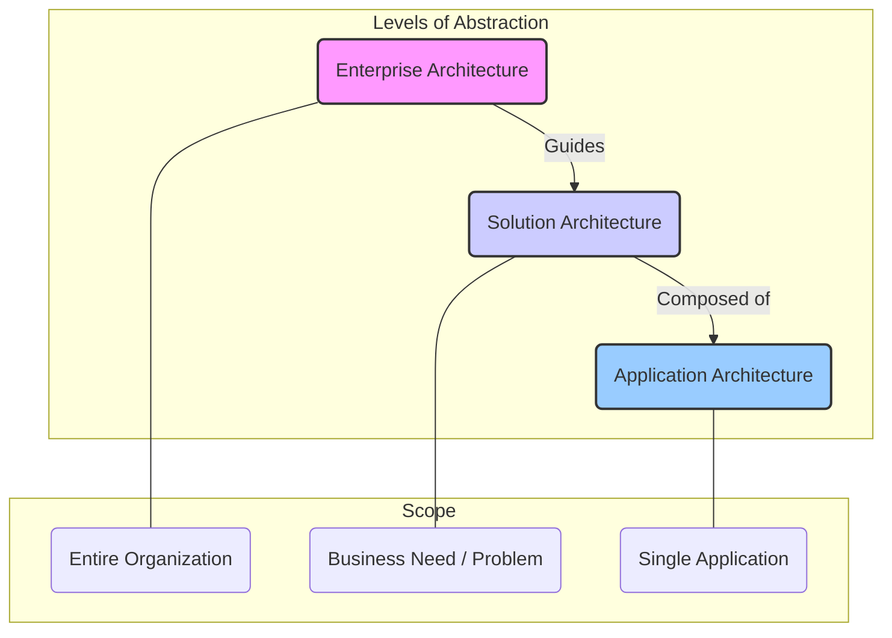

A list of topics related to Software design and architecture principles, styles, patterns, practices, etc.

To this end, this section draws on the excellent roadmap.sh tool, which can be used to define a complete map of the concepts and notions relating to a given subject.

[Roadmap Software Design and Architecture](https://roadmap.sh/r/software-design-and-architecture-qnur8)
[System Design](https://roadmap.sh/system-design)
[Software Architect](https://roadmap.sh/software-architect)
[Full Stack](https://roadmap.sh/full-stack)
[Backend](https://roadmap.sh/backend)
[Frontend](https://roadmap.sh/frontend)
[API Design](https://roadmap.sh/api-design)

## Topics

* [[software-architecture/architectural-patterns/|Architectural Patterns]]
* [[software-architecture/architectural-principles/|Architectural Principles]]
* [[software-architecture/architectural-styles/|Architectural Styles]]
* [[clean-code]]
* [[software-architecture/databases/|Databases]]
* [[software-architecture/design-patterns/|Design Patterns]]
* [[software-architecture/system-design-patterns/|System Design Patterns]]
* [[software-architecture/design-principles/|Design Principles]]
* [[software-architecture/observability/|Observability]]
* [[software-architecture/programming-paradigms/|Programming Paradigms]]

---

## Levels of Architecture

In software engineering, architecture can be viewed from different levels of abstraction. Each level addresses a distinct set of concerns and requires a different scope of thinking. Understanding these levels is crucial for aligning technology with business goals and ensuring that systems are well-designed from the macro to the micro scale.

While various categorizations exist, a common and practical way to segment architectural focus is across three primary levels: Application, Solution, and Enterprise.

This diagram illustrates the hierarchical relationship between the levels. Enterprise Architecture provides the high-level strategic context for Solution Architecture, which in turn orchestrates one or more applications, each with its own Application Architecture.

### Application Architecture

Application Architecture is the lowest and most concrete level of architecture. It focuses on the internal structure and design of a single software application. The primary goal is to create a robust, scalable, and maintainable application that meets its specific functional and non-functional requirements.

#### Scope and Focus

-   **Scope:** A single application or service.
-   **Focus:** Technology stack, programming languages, frameworks, and libraries. It defines the modules, components, classes, and their interactions within the application.
-   **Concerns:** [[clean-code]], performance, security within the application, and adherence to [[gof|GoF design patterns]].

#### Key Activities

-   Selecting an appropriate [[modern-application-architectures|architectural pattern]] (e.g., [[mvc]], [[mvvm]], [[layered]], [[clean|Clean Architecture]]).
-   Defining the interaction between components.
-   Choosing data storage and access strategies for the application.
-   Ensuring the application is testable and maintainable.

#### Example Patterns & Technologies

-   **Architectural Patterns:** [[microservices]], [[monolithic]], [[event-driven]].
-   **Frameworks:** Spring, .NET, React, Angular.
-   **Design Patterns:** Singleton, Factory, Observer, [[retry|Retry Pattern]].

### Solution Architecture

Solution Architecture operates at a middle level, focusing on addressing a specific business problem or need by orchestrating multiple applications and systems. It acts as a bridge between the high-level strategic goals of Enterprise Architecture and the low-level details of Application Architecture.

#### Scope and Focus

-   **Scope:** One or more applications and services working together to fulfill a business requirement.
-   **Focus:** Integration between systems, data flow, and ensuring that the collection of applications works as a cohesive whole. It translates business requirements into a technical solution.
-   **Concerns:** [[communication-protocols]], [[asynchronous-messaging]], [[api-gateway]], and data consistency across systems.

#### Key Activities

-   Analyzing business requirements and identifying the applications and services needed to meet them.
-   Defining the interfaces and interactions between different components of the solution.
-   Selecting the right technologies for integration and communication.
-   Managing trade-offs between quality, cost, and time for the solution.

#### Example Patterns & Technologies

-   **Integration Patterns:** [[publish-subscribe]], [[message-queue]], [[api-gateway]].
-   **Architectural Styles:** [[soa|Service-Oriented Architecture (SOA)]], [[microservices]].
-   **Technologies:** RabbitMQ, Kafka, REST APIs, [[graphql]], [[cdn]].

### Enterprise Architecture

Enterprise Architecture is the highest level of abstraction. It provides a holistic, strategic view of the entire organization's IT landscape, processes, and business capabilities. The goal is to align the technology strategy with the business strategy, driving standardization, reuse, and efficiency across the enterprise.

#### Scope and Focus

-   **Scope:** The entire organization, including all its business units, applications, data, and infrastructure.
-   **Focus:** Business strategy, capability mapping, technology portfolio management, and governance. It defines the principles, standards, and roadmaps that guide the evolution of the IT landscape.
-   **Concerns:** Long-term technology vision, IT governance, cost optimization, risk management, and business process alignment.

#### Key Activities

-   Developing and maintaining the enterprise's technology roadmap.
-   Defining and enforcing architectural standards and principles across all projects.
-   Identifying opportunities for consolidation, reuse, and simplification of the IT landscape.
-   Assessing the impact of new technologies on the business.

#### Example Frameworks

-   **Frameworks:** TOGAF (The Open Group Architecture Framework), Zachman Framework, FEAF (Federal Enterprise Architecture Framework). These frameworks provide structured approaches for designing, planning, implementing, and governing an enterprise information technology architecture.

---

### Summary of Levels

| Level                   | Scope                  | Focus                                       | Key Artifacts                               |
| ----------------------- | ---------------------- | ------------------------------------------- | ------------------------------------------- |
| **Application**         | Single Application     | Code, Components, Classes, Technical Stack  | Design Docs, Code, Component Diagrams       |
| **Solution**            | Business Problem       | System Integration, Data Flow, APIs         | Solution Design, Integration Diagrams       |
| **Enterprise**          | Entire Organization    | Business Strategy, IT Landscape, Governance | Technology Roadmap, Standards, Principles   |
