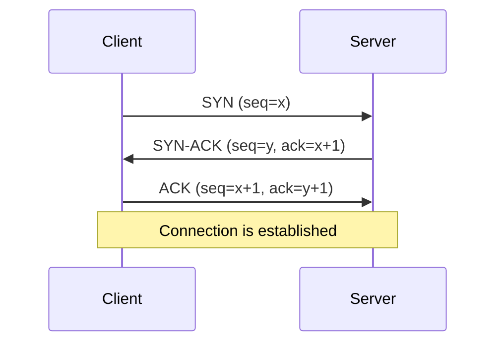
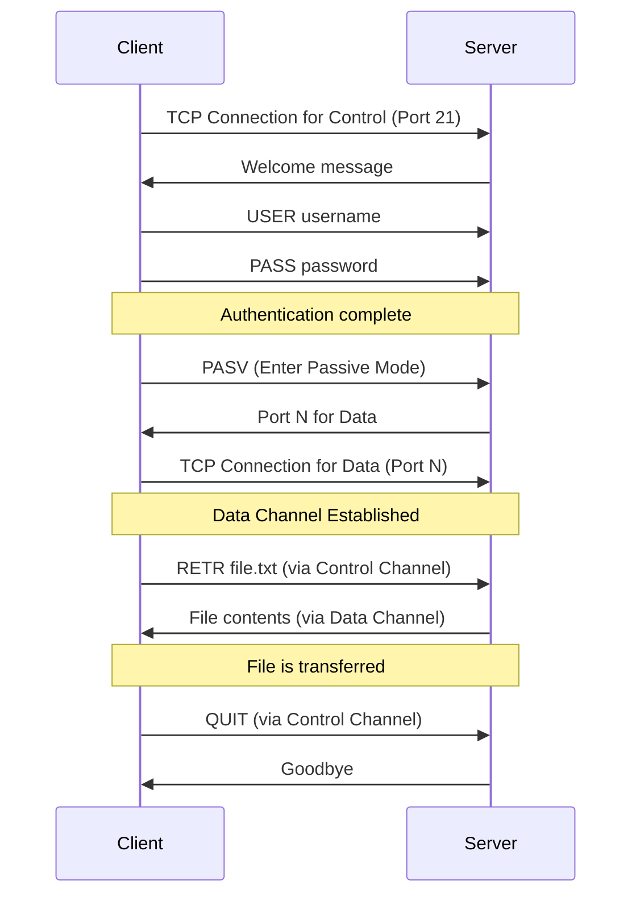

Network protocols are the foundational rules that govern how data is exchanged between computer systems. In modern system design, understanding these protocols is crucial, as nearly all systems are distributed and rely on communication over a network. They define the syntax, semantics, and synchronization of communication, ensuring that different systems can interact reliably and efficiently.

This document covers fundamental network protocols like TCP, UDP, and HTTP, as well as communication styles like RPC and its modern implementation, gRPC. For a conceptual understanding of where these protocols fit in the networking stack, refer to the [[osi-model]].

## Transmission Control Protocol (TCP)

TCP is a connection-oriented protocol that provides reliable, ordered, and error-checked delivery of a stream of bytes between applications running on hosts communicating over an IP network. It is the most common protocol used on the internet.

### Key Characteristics

- **Reliability**: TCP guarantees that data sent from one end of the connection will be received by the other end, intact and in the correct order. It uses a system of sequence numbers, acknowledgments (ACKs), and retransmissions to achieve this.
- **Connection-Oriented**: A connection must be established before any data can be sent. This is done through a three-way handshake (`SYN`, `SYN-ACK`, `ACK`). The connection is terminated with a similar handshake.
- **Ordered Data Transfer**: TCP ensures that data packets are delivered to the application layer in the same order they were sent.
- **Flow Control**: Prevents a fast sender from overwhelming a slow receiver. The receiver advertises a "window" size, indicating how much data it can buffer.
- **Congestion Control**: Manages network congestion by adjusting the rate at which data is sent.

### Three-Way Handshake

The TCP connection is established via a three-way handshake, which ensures both the client and server are ready to communicate.

*Description: The client sends a synchronization (SYN) packet. The server acknowledges it (SYN-ACK) and sends its own SYN. The client then sends a final acknowledgment (ACK).*

### Use Cases

TCP is ideal for applications where data integrity is critical and latency is a secondary concern.
- **Web Browsing**: Historically, and for HTTP/1.x and HTTP/2, [[http|HTTP]] runs on top of TCP to ensure web pages load completely. With HTTP/3, the underlying transport shifts to QUIC/UDP.
- **[[email-protocols|Email]]**: SMTP, POP3, and IMAP use TCP for reliable message delivery.
- **File Transfer**: FTP and SSH rely on TCP to ensure files are transferred without corruption.
- **[[software-architecture/databases/|Database Connections]]**: Ensuring that queries and results are transmitted without error.

## User Datagram Protocol (UDP)

UDP is a connectionless protocol that offers a simpler, more direct way to send data. It provides no guarantees of delivery, ordering, or error correction, making it much faster but less reliable than TCP.

### Key Characteristics

- **Connectionless**: No handshake is required. Packets (datagrams) are sent to the destination without establishing a connection first.
- **Unreliable**: There is no guarantee that datagrams will arrive, arrive in order, or arrive without errors.
- **Low Latency**: The absence of handshakes, acknowledgments, and retransmissions makes UDP very fast.
- **Broadcasting**: UDP supports sending datagrams to all devices on a subnet, a feature used by protocols like DHCP.

### Use Cases

UDP is suitable for applications where speed is more important than reliability, and where occasional data loss is acceptable.
- **Real-time Communication**: VoIP, video conferencing, and online gaming. Late data is often useless in these scenarios.
- **Streaming**: Live video and audio streaming.
- **[[dns|DNS]]**: DNS queries are typically small and use UDP for fast lookups.
- **Monitoring**: Sending metrics or logs where losing a few data points is not critical.

### TCP vs. UDP

| Feature                | TCP                                      | UDP                                    |
| ---------------------- | ---------------------------------------- | -------------------------------------- |
| **Reliability**        | High (guaranteed delivery and order)   | Low (no guarantees)                    |
| **Connection**         | Connection-oriented (three-way handshake)| Connectionless                         |
| **Speed**              | Slower (due to overhead)                 | Faster (minimal overhead)              |
| **Header Size**        | 20 bytes                                 | 8 bytes                                |
| **Use Cases**          | Web, Email, File Transfer                | Streaming, Gaming, DNS, VoIP           |

## File Transfer Protocol (FTP)

FTP is one of the oldest protocols still in use today, designed specifically for transferring files between a client and a server on a computer network. It operates on a client-server model and uses separate control and data connections between the client and the server.

### Key Characteristics

- **Stateful**: The control connection remains open for the duration of the FTP session, tracking the user's state (e.g., current directory, authentication).
- **Separate Control and Data Channels**: FTP uses two distinct TCP connections:
  - **Control Connection (Port 21)**: Used to send commands (e.g., `USER`, `PASS`, `LIST`, `GET`) and receive responses.
  - **Data Connection (Dynamic Port)**: Used for the actual transfer of files.
- **Insecure by Default**: FTP credentials and data are transmitted in clear text, making it vulnerable to sniffing. For security, extensions like FTPS (FTP over SSL/TLS) are used.

### How It Works: Control and Data Channels

The dual-channel architecture is a defining feature of FTP.

*Description: The client first establishes a control connection. For a file transfer, it enters passive mode, receives a data port from the server, establishes a separate data connection, and then transfers the file.*

### Use Cases

- **Legacy Systems**: Common in established workflows for batch file transfers.
- **Web Hosting**: Uploading website files to a hosting provider.
- **Bulk Data Transfer**: Moving large files where performance is more critical than security (in controlled networks).

## Secure File Transfer Protocol (SFTP)

Despite its name, SFTP is not FTP over SSL. It is a completely different protocol designed as an extension of the Secure Shell (SSH) protocol. It provides secure file transfer, access, and management functionalities over a reliable data stream.

### Key Characteristics

- **Secure**: All traffic, including credentials and data, is encrypted as it runs over an SSH channel.
- **Single Connection**: SFTP uses a single connection (typically on SSH port 22) for both commands and data, which simplifies firewall configuration.
- **More than just Transfers**: The protocol allows for a range of operations on remote files, such as file locking, permission management, and symbolic linking.
- **Reliable**: Built on top of TCP (via the SSH protocol), ensuring data integrity.

### FTP vs. SFTP

| Feature                | FTP                                      | SFTP                                   |
| ---------------------- | ---------------------------------------- | -------------------------------------- |
| **Security**           | Insecure (clear text) unless using FTPS  | Secure (encrypted via SSH)             |
| **Protocol**           | Own protocol (RFC 959)                   | Extension of SSH                       |
| **Connections**        | 2 (Control + Data)                       | 1 (within SSH tunnel)                  |
| **Port(s)**            | 21 (Control), plus a dynamic data port   | 22 (or other SSH port)                 |
| **Firewall Friendliness**| Difficult (due to dynamic ports)       | Easy (single port)                     |

## HyperText Transfer Protocol (HTTP)

HTTP is the application-layer protocol that forms the foundation of the World Wide Web. It follows a stateless, request-response model and is used for transmitting hypermedia documents and as the primary communication protocol for [[rest|RESTful APIs]].

For a detailed explanation of its versions (HTTP/1.1, HTTP/2, HTTP/3), message structure, methods, status codes, and more, see the dedicated [[http]] page.
## Resources & Links

The following resources provide more detailed information on the communication protocols discussed in this document.

### Articles

1.  **[Everything you need to know about HTTP](https://cs.fyi/guide/http-in-depth)**
    An in-depth guide covering the evolution of HTTP, from its early versions to HTTP/2, and explaining core concepts like multiplexing, header compression, and security improvements.

2.  **[Transmission Control Protocol (TCP)](https://www.geeksforgeeks.org/computer-networks/what-is-transmission-control-protocol-tcp/)**
    A GeeksforGeeks article detailing TCP as a reliable, connection-oriented protocol, explaining its features, working mechanism, and its advantages and disadvantages.

3.  **[What is User Datagram Protocol (UDP)?](https://www.cloudflare.com/learning/ddos/glossary/user-datagram-protocol-udp/)**
    A Cloudflare article that defines UDP, explaining its use in time-sensitive applications where speed is prioritized over reliability, such as DNS, VoIP, and online gaming.
