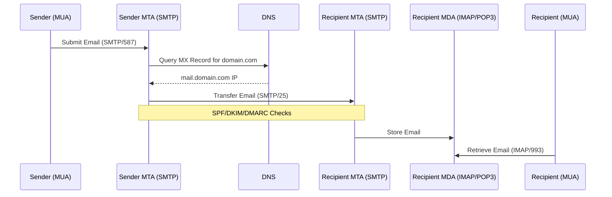

# Email Protocols

Electronic mail (email) remains one of the most critical communication mechanisms in distributed systems. While often abstracted away by third-party services (like SendGrid or AWS SES), understanding the underlying protocols is essential for a software architect. It ensures you can design systems that are reliable, secure, and capable of high deliverability.

This document details the core protocols for sending and retrieving email, as well as the modern security mechanisms required to establish trust and prevent spoofing.

## The Email Delivery Flow

At a high level, email delivery involves a chain of interactions between Mail User Agents (MUA), Mail Submission Agents (MSA), Mail Transfer Agents (MTA), and Mail Delivery Agents (MDA).


*Description: A simplified flow showing how an email travels from a sender's client to the recipient's client, involving DNS lookups and multiple transfer agents.*

## Sending Protocols

### Simple Mail Transfer Protocol (SMTP)

SMTP is the industry standard for sending emails. It is a text-based, connection-oriented protocol used for both **submission** (client to server) and **relaying** (server to server).

#### Key Characteristics
- **Push Protocol**: SMTP is designed to push messages from the sender to the receiver.
- **Stateful**: Uses a command-response mechanism similar to [[communication-protocols#File Transfer Protocol (FTP)|FTP]].
- **Ports**:
    - **25**: The default port for server-to-server relaying. Often blocked by residential ISPs to prevent spam.
    - **587**: The standard port for mail submission (client to server), usually requiring TLS encryption.
    - **465**: Legacy port for SMTPS (SMTP over SSL), still supported by many providers.

#### Typical Command Flow
1.  **HELO/EHLO**: The client identifies itself.
2.  **MAIL FROM**: Specifies the sender.
3.  **RCPT TO**: Specifies the recipient(s).
4.  **DATA**: The body of the email.
5.  **QUIT**: Terminates the session.

## Retrieval Protocols

Once an email reaches the destination server, it sits in a mailbox. Retrieval protocols allow a client (MUA) to access these messages.

### Internet Message Access Protocol (IMAP)

IMAP is the modern standard for email retrieval, designed for a multi-device world.

-   **Server-Side Storage**: Emails remain on the server. The client essentially caches a local copy.
-   **Synchronization**: Actions (read, delete, move) are synced across all devices.
-   **On-Demand**: Clients can download headers first and fetch the body only when opened, saving bandwidth.
-   **Port**: 143 (Unencrypted), 993 (Secure/IMAPS).

**Use Case**: Users accessing email from their phone, laptop, and web browser simultaneously.

### Post Office Protocol v3 (POP3)

POP3 is an older protocol designed for a "store-and-forward" model.

-   **Download and Delete**: Traditionally, POP3 downloads emails to the local device and deletes them from the server (though "leave on server" is an option).
-   **Single Device**: Best suited for accessing email from a single location.
-   **Simplicity**: Easier to implement but lacks folder synchronization.
-   **Port**: 110 (Unencrypted), 995 (Secure/POP3S).

**Use Case**: Archival systems or privacy-focused setups where users want full local ownership of their data without server retention.

## Security & Authentication

In the early days of the internet, SMTP had no built-in authentication, making it easy to spoof sender addresses. Modern email infrastructure relies on three pillars of authentication to verify identity and reputation.

### Sender Policy Framework (SPF)

SPF is a DNS-based mechanism that authorizes specific IP addresses to send email on behalf of a domain.

-   **Mechanism**: A TXT record in [[dns|DNS]] lists authorized IPs.
-   **Check**: The receiving MTA checks the `Return-Path` domain's SPF record against the connecting IP.

**Example DNS Record**:
```dns
v=spf1 ip4:192.0.2.0/24 include:_spf.google.com -all
```
*Meaning: Allow emails from the subnet 192.0.2.0/24 and Google's servers; hard fail (`-all`) everything else.*

### DomainKeys Identified Mail (DKIM)

DKIM provides cryptographic proof that an email was indeed sent by the domain owner and has not been altered in transit.

-   **Mechanism**: The sending server signs the email headers (and body hash) with a private key.
-   **Verification**: The receiver retrieves the public key from the sender's DNS (TXT record) to verify the signature.
-   **Integrity**: Ensures the message content hasn't been tampered with.

### Domain-based Message Authentication, Reporting, and Conformance (DMARC)

DMARC ties SPF and DKIM together. It tells the receiving server what to do if an email fails SPF or DKIM checks.

-   **Policy Enforcement**: You can set policies to `none` (monitor), `quarantine` (spam folder), or `reject` (block).
-   **Reporting**: Provides feedback reports (RUA/RUF) to the domain owner about authentication failures, helping to identify spoofing attempts.

**Example DNS Record**:
```dns
v=DMARC1; p=reject; rua=mailto:dmarc-reports@domain.com
```
*Meaning: Reject any email that fails authentication and send reports to the specified address.*

### DomainKeys

*Legacy Note*: "DomainKeys" was the predecessor to DKIM (developed by Yahoo!). It is largely obsolete and has been superseded by DKIM. In modern contexts, when people say "DomainKeys", they usually mean DKIM.

## Trust Mechanisms

Beyond cryptographic verification, spam filters use reputation-based lists to decide whether to accept traffic.

### Whitelisting
A list of trusted IP addresses or domains that are explicitly allowed to bypass certain spam filters. This is often done manually by administrators or via reputation services.

### Greylisting
A temporary rejection technique to block spam bots.
1.  **First Attempt**: The receiving server temporarily rejects a message from an unknown sender with a "4xx" error (Try again later).
2.  **Retry**: Legitimate MTAs (compliant with SMTP) will queue and retry the message after a few minutes.
3.  **Acceptance**: On the second attempt, the server accepts the message and "whitelists" the tuple (Sender IP, Sender Email, Recipient Email) for a period.
*Rationale*: Spambots are often "fire-and-forget" and will not retry, effectively filtering them out.

## Related Concepts

-   **[[dns|DNS]]**: Critical for MX, SPF, DKIM, and DMARC records.
-   **[[communication-protocols#Transmission Control Protocol (TCP)|TCP]]**: The transport layer protocol used by SMTP, IMAP, and POP3.
-   **[[software-architecture/security/encryption|Encryption]]**: TLS is mandatory for modern email security (STARTTLS).
