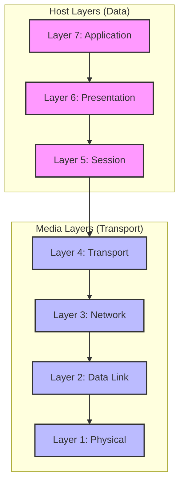

The **Open Systems Interconnection (OSI) model** is a conceptual framework used to describe the functions of a networking system. It characterizes computing functions into a universal set of rules and requirements in order to support interoperability between different products and software.

For a software architect, understanding the OSI model is crucial not just for network engineering, but for designing distributed systems, troubleshooting connectivity issues ("is this a Layer 4 or Layer 7 load balancer?"), and understanding security boundaries.

## The 7 Layers of the OSI Model

The model partitions the data flow into seven abstraction layers. Each layer serves the layer above it and is served by the layer below it.

### 1. Physical Layer (Layer 1)
This is the lowest layer, representing the physical medium for data transfer. It deals with the electrical, mechanical, and procedural interface to the transmission medium.
*   **Unit of Data**: Bit.
*   **Function**: Transmission and reception of raw bitstreams over a physical medium.
*   **Examples**: Ethernet cables (Cat6), Fiber optics, Wi-Fi (radio waves), Hubs.

### 2. Data Link Layer (Layer 2)
This layer provides node-to-node data transfer—a link between two directly connected nodes. It handles error correction from the physical layer.
*   **Unit of Data**: Frame.
*   **Function**: MAC (Media Access Control) addressing, error detection, and flow control on the physical link.
*   **Examples**: Ethernet (802.3), Wi-Fi (802.11), VLANs, Switches.

### 3. Network Layer (Layer 3)
This layer provides data routing, paths for data transfer between nodes on different networks.
*   **Unit of Data**: Packet.
*   **Function**: Logical addressing (IP addresses), routing, traffic control, and fragmentation.
*   **Examples**: IP (IPv4, IPv6), ICMP, IPsec, Routers.
*   **Relevance**: This is where "Routing" happens. When you ping a server, you are operating primarily at Layer 3.

### 4. Transport Layer (Layer 4)
This layer provides transparent transfer of data between end systems, or hosts, and is responsible for end-to-end error recovery and flow control.
*   **Unit of Data**: Segment (TCP) or Datagram (UDP).
*   **Function**: End-to-end connection management, segmentation, reliability, and flow control.
*   **Examples**: [[communication-protocols#transmission-control-protocol-tcp|TCP]], [[communication-protocols#user-datagram-protocol-udp|UDP]].
*   **Pattern**: **Layer 4 Load Balancing**. A load balancer at this layer (e.g., AWS Network Load Balancer) makes routing decisions based on IP address and port, without inspecting the packet contents. It is extremely fast but less "smart" than Layer 7.

### 5. Session Layer (Layer 5)
This layer establishes, manages, and terminates connections between applications.
*   **Unit of Data**: Data.
*   **Function**: Session establishment, maintenance, and termination; synchronization points.
*   **Examples**: [[rpc|RPC]] (Remote Procedure Call), NetBIOS, PPTP.
*   **Note**: In modern web development, this layer is often handled implicitly by the application or the transport protocols. For instance, [[grpc|gRPC]] handles session management but operates over HTTP/2 (Layer 7).

### 6. Presentation Layer (Layer 6)
This layer transforms data to provide a standard interface for the Application layer. It ensures that data sent from the application layer of one system can be read by the application layer of another system.
*   **Unit of Data**: Data.
*   **Function**: Data translation, encryption, and compression.
*   **Examples**: [[ssl-tls|SSL/TLS]] (often mapped here conceptually), [[json-api|JSON-API]], JPEG, ASCII, EBCDIC, JSON/XML serialization.
*   **Relevance**: When you serialize an object to JSON for a REST API, you are performing a presentation layer function.

### 7. Application Layer (Layer 7)
This is the layer that directly interacts with the end-user application. It provides network services to the end-user applications.
*   **Unit of Data**: Data.
*   **Function**: Network process to application, resource sharing, remote file access.
*   **Examples**: [[http|HTTP/HTTPS]], [[dns|DNS]], SMTP, SSH, [[graphql|GraphQL]], [[grpc|gRPC]], [[rest|REST]].
*   **Pattern**: **Layer 7 Load Balancing**. An Application Load Balancer (ALB) operates here. It can inspect the content of the message (e.g., HTTP headers, cookies, URL path) to make intelligent routing decisions (e.g., routing `/api/v1` to one service and `/api/v2` to another).

## OSI vs. TCP/IP Model

While OSI is the theoretical standard, the TCP/IP model (or Internet Protocol Suite) is the practical implementation that powers the internet. TCP/IP collapses the layers into four:

| OSI Model | TCP/IP Model | Key Protocols |
| :--- | :--- | :--- |
| **7. Application** | **Application** | HTTP, DNS, SMTP |
| **6. Presentation** | **Application** | SSL/TLS, JSON |
| **5. Session** | **Application** | RPC |
| **4. Transport** | **Transport** | TCP, UDP |
| **3. Network** | **Internet** | IP, ICMP |
| **2. Data Link** | **Network Access** | Ethernet, ARP |
| **1. Physical** | **Network Access** | (Hardware standards) |

## Why it Matters for System Design

### Troubleshooting
Understanding layers helps isolate problems.
*   **"It's a Layer 1 issue"**: The cable is unplugged.
*   **"It's a Layer 3 issue"**: The router configuration is wrong; I can't ping the host.
*   **"It's a Layer 7 issue"**: The application is returning a 500 Internal Server Error, or the WAF (Web Application Firewall) is blocking the request based on a header.

### Security
Security controls are often applied at specific layers:
*   **Layer 3/4**: Firewalls filtering by IP and Port (e.g., AWS Security Groups).
*   **Layer 7**: WAFs filtering by SQL injection patterns in the HTTP body or malicious User-Agent strings.

### Performance Optimization
*   **Protocol Overhead**: Knowing that every layer adds headers (encapsulation) helps understand the overhead.
*   **TLS Termination**: Deciding where to terminate TLS (Layer 6/7 function) impacts CPU load on your load balancers vs. your application servers.

## Related Concepts
*   [[communication-protocols]]: Deep dive into TCP and UDP.
*   [[http]]: The most ubiquitous Layer 7 protocol.
*   [[dns]]: The phonebook of the internet (Layer 7).
*   [[rest]]: Architectural style for distributed hypermedia systems.
*   [[graphql]]: Query language for APIs.
*   [[grpc]]: High-performance RPC framework.
*   [[api-security]]: Security considerations often spanning Layers 4-7.

---

## Resources & Links

### Articles

1.  **[What is the OSI Model? - Cloudflare](https://www.cloudflare.com/learning/ddos/glossary/open-systems-interconnection-model-osi/)**
    This Cloudflare article defines the OSI model as a conceptual framework that standardizes network communication functions. It details the 7 layers and explains the model's importance for compatibility between different products and software, as well as its role in understanding network attacks like DDoS.

2.  **[What is the OSI model? - IBM](https://www.ibm.com/think/topics/osi-model)**
    IBM provides an in-depth explanation of the OSI model, from its history to its detailed operation. The article describes each layer, from physical to application, and compares the theoretical OSI model to the practical TCP/IP model, while highlighting the benefits of this layered structure for troubleshooting and interoperability.

3.  **[OSI Model Explained - Imperva](https://www.imperva.com/learn/application-security/osi-model/)**
    This Imperva guide breaks down the 7 layers of the OSI model starting from the application layer down to the physical layer. It offers concrete examples for each stage, discusses the model's benefits for application security and troubleshooting, and puts into perspective the key differences with the TCP/IP model.

### Videos

1.  **[What is OSI Model? | Real World Examples](https://www.youtube.com/watch?v=0y6FtKsg6J4)**
    A concise visual explanation of the OSI model. This video uses clear animations and real-world analogies to demystify how each layer works and how data travels from point A to point B on a network.

2.  **[What is OSI Model?](https://www.youtube.com/watch?v=Ilk7UXzV_Qc)**
    This educational video presents the OSI model in a simple and accessible way. It reviews the 7 layers one by one, explaining the specific role of each in data transmission, which is ideal for visualizing the global information flow.
