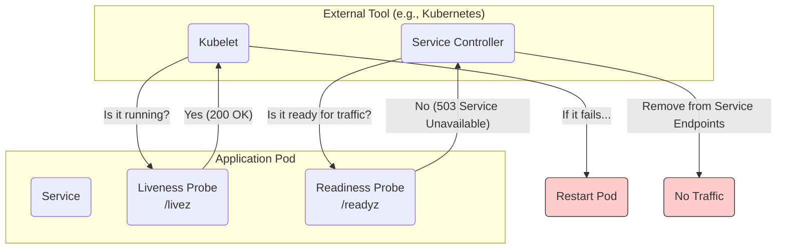

# Health Endpoint Monitoring Pattern

The **Health Endpoint Monitoring** pattern (also known as the **Health Check** pattern) is a fundamental technique for reporting the health of an application or service. It involves exposing a dedicated HTTP endpoint that external tools can poll at regular intervals to determine if the service is running correctly and is ready to handle requests.

This pattern is critical for building self-healing and highly available systems, as it provides a simple, automated way for other parts of the infrastructure (like [[load-balancing|load balancers]], container orchestrators, or [[service-discovery]] registries) to make decisions about the service's state.

---

## Levels of Health Checks

A simple "200 OK" response is often not enough. A robust health monitoring strategy typically involves multiple types of checks, each answering a different question. The most common are Liveness, Readiness, and Startup probes, concepts popularized by container orchestrators like Kubernetes.


*Description: A diagram showing how a container orchestrator uses separate Liveness and Readiness probes to make different decisions: restarting the pod vs. removing it from service.*

### 1. Liveness Probe

- **Question:** "Is the application alive and running?"
- **Purpose:** To detect a situation where the application is running but is in a broken, unrecoverable state (e.g., a deadlock, out of memory). It tells the orchestrator that the process is effectively dead and needs to be terminated and replaced.
- **Action on Failure:** If the liveness probe fails, the orchestrator will **restart the container/pod**.
- **Implementation:** The liveness endpoint should be simple. It should not check dependencies on other services. A failure of a downstream service should *not* cause the application to be restarted. A simple "I am running" check is usually sufficient.

**Example Endpoint:** `GET /livez` or `GET /healthz`

```javascript
// Example in JavaScript (Node.js/Express)
app.get('/livez', (req, res) => {
  // This check should be very simple and not check external dependencies.
  // It confirms the HTTP server is responsive.
  res.status(200).json({ status: 'UP' });
});
```

### 2. Readiness Probe

- **Question:** "Is the application ready to accept new traffic?"
- **Purpose:** To signal whether the application is temporarily unable to serve requests, even though it is "live". This could be because it's still starting up, initializing connections, or currently overloaded.
- **Action on Failure:** If the readiness probe fails, the orchestrator will **stop sending traffic** to the instance (e.g., by removing it from the load balancer's pool). It will *not* restart the container. Once the probe succeeds again, traffic will be restored.
- **Implementation:** The readiness endpoint should perform deeper checks. It should verify its critical dependencies (database connections, cache availability, etc.). If any of these are unhealthy, the service is not "ready" to serve traffic properly.

**Example Endpoint:** `GET /readyz`

```javascript
// Example in JavaScript (Node.js/Express)
app.get('/readyz', async (req, res) => {
  try {
    // This check is more comprehensive and verifies critical dependencies.
    await checkDatabaseConnection();
    await checkCacheConnection();
    res.status(200).json({ status: 'READY' });
  } catch (error) {
    // Log the actual error for internal diagnostics
    console.error('Readiness check failed:', error);
    res.status(503).json({
      status: 'UNAVAILABLE',
      reason: 'A critical dependency is unhealthy.',
    });
  }
});
```

### 3. Startup Probe

- **Question:** "Has the application finished its initial startup?"
- **Purpose:** To handle applications that have a slow startup time. A startup probe allows the container a generous amount of time to start before the liveness probe takes over.
- **Action on Failure:** If the startup probe fails after its configured period, the container is restarted, just like a failed liveness probe.
- **Implementation:** The check itself can be identical to the liveness probe, but it is configured with a longer initial delay and failure threshold to accommodate slow-starting services.

---

## Best Practices

- **Separate Liveness and Readiness:** Do not use the same logic for both. A failing readiness check should not cause the service to restart.
- **Keep Liveness Checks Simple:** Avoid checking external dependencies in liveness probes to prevent cascading failures.
- **Protect Health Endpoints:** While they expose internal state, they should not expose sensitive information. They should also be lightweight and not consume significant resources.
- **Consider Timeouts and Deadlines:** The health check itself should have a timeout to prevent it from blocking the monitoring tool.

## Related Patterns

- **[[monitoring|Monitoring]]:** Health endpoints are a key source of data for a broader monitoring strategy.
- **[[load-balancing|Load Balancing]]:** Load balancers are primary consumers of health check information, using it to manage their server pools.
- **[[service-discovery|Service Discovery]]:** Service registries use health checks to determine which service instances are valid targets for routing.
- **[[availability-patterns|Availability Patterns]]:** This pattern is a cornerstone of building highly available systems.

---

## Resources & Links

### Articles

1.  **[Health Endpoint Monitoring pattern - Azure Architecture Center](https://learn.microsoft.com/en-us/azure/architecture/patterns/health-endpoint-monitoring)**
    The official Microsoft documentation provides a detailed overview of the pattern. It explains how functional checks exposed through endpoints can be used by external tools to verify application health. The article covers implementation considerations, such as what information to expose, how to secure the endpoints, and how services like Azure Application Gateway and Azure Traffic Manager consume these checks to enable load balancing and failover.

2.  **[Health Endpoint Monitoring Pattern - GeeksforGeeks](https://www.geeksforgeeks.org/system-design/health-endpoint-monitoring-pattern/)**
    This article gives a solid introduction to the pattern from a general system design perspective. It outlines the key metrics to monitor (uptime, response time, error rates) and the benefits of implementing health endpoints, such as improved reliability and proactive maintenance. It also provides a high-level overview of how the pattern is implemented and the types of tools that consume the health information.

### Videos

1.  **[Health Monitoring in Microservice explained with Spring Boot Actuator](https://www.youtube.com/watch?v=me_FwTx3ZEw)**
    This video provides a practical demonstration of how to implement the Health Endpoint Monitoring pattern in a Java application using the Spring Boot Actuator. It shows how the actuator automatically exposes default health endpoints and how they can be customized to include checks for databases and other dependencies, making it a great resource for developers working in the Spring ecosystem.

2.  **[Health Endpoint Monitoring Pattern (Monitor YOUR service and its dependencies!)](https://www.youtube.com/watch?v=8aY1ZvZproY)**
    This video provides a clear, high-level explanation of the Health Endpoint Monitoring pattern. It covers the core problem of knowing the health of a service and its dependencies, and it walks through an example solution. The video is great for understanding the "why" behind the pattern and the design considerations for implementing it effectively in a cloud environment.