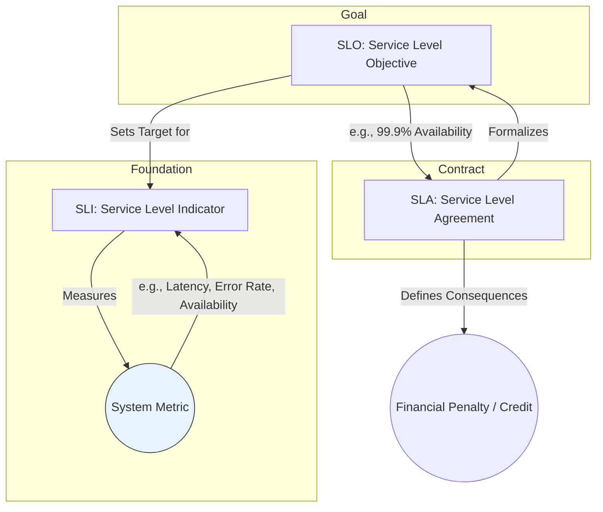

# Observability

Observability is a measure of how well internal states of a system can be inferred from knowledge of its external outputs. In modern software engineering, it represents a shift from the reactive nature of traditional [[monitoring]] to a more proactive and exploratory approach to understanding complex, distributed systems.

While monitoring relies on predefined dashboards to answer known questions (e.g., "What is our current CPU usage?"), observability provides the tools to ask new questions about system behavior you didn't anticipate (e.g., "Why are users in a specific region experiencing higher latency?").

## The Three Pillars of Observability

Observability is commonly described as being supported by three main types of telemetry data:

1.  **Metrics (Monitoring)**: Aggregated, numerical data collected over time (e.g., request rates, error counts, CPU utilization). This is the domain of [[monitoring]].
2.  **Logs**: Immutable, timestamped records of discrete events. Logs provide context-rich details for specific events.
3.  **Traces**: A representation of the end-to-end journey of a single request as it travels through all the services in a distributed system.

Together, these pillars provide a comprehensive view that enables deep analysis and rapid troubleshooting.

---

## SLIs, SLOs, and SLAs: The Business Impact of Observability

Observability data is not just for engineers; it forms the foundation for defining and upholding business commitments. This is formalized through Service Level Indicators (SLIs), Objectives (SLOs), and Agreements (SLAs).

*A diagram showing how SLIs inform SLOs, which are then formalized into SLAs.*

*   **SLI (Service Level Indicator):** A direct, quantitative measure of a service's performance. It is what you *measure*. An SLI is based on the telemetry data gathered through [[monitoring]].
    *   **Example:** The percentage of successful HTTP requests, or the fraction of requests served in under 300ms.

*   **SLO (Service Level Objective):** A target value or range for an SLI that a team aims to meet over a specific period. It is the *goal* you set internally.
    *   **Example:** "99.9% of requests will be successful over a 30-day period." The [[reliability-engineering#Availability in Numbers (The Nines)|'Nines' table]] is a classic way to define availability SLOs.

*   **SLA (Service Level Agreement):** A formal contract with a customer that defines the SLOs and the consequences (e.g., financial penalties, service credits) for failing to meet them. It is the *promise* you make externally.
    *   **Example:** "If monthly uptime is below 99.9%, the customer will receive a 10% credit on their bill."

This hierarchy is crucial: you can't have a meaningful SLA without a clear SLO, and you can't have a meaningful SLO without a reliable SLI to measure it.

---

## Concepts in Observability

* [[health-endpoint-monitoring|Health Endpoint Monitoring]]
* [[monitoring|Monitoring]]
* [[opentelemetry|OpenTelemetry]]
