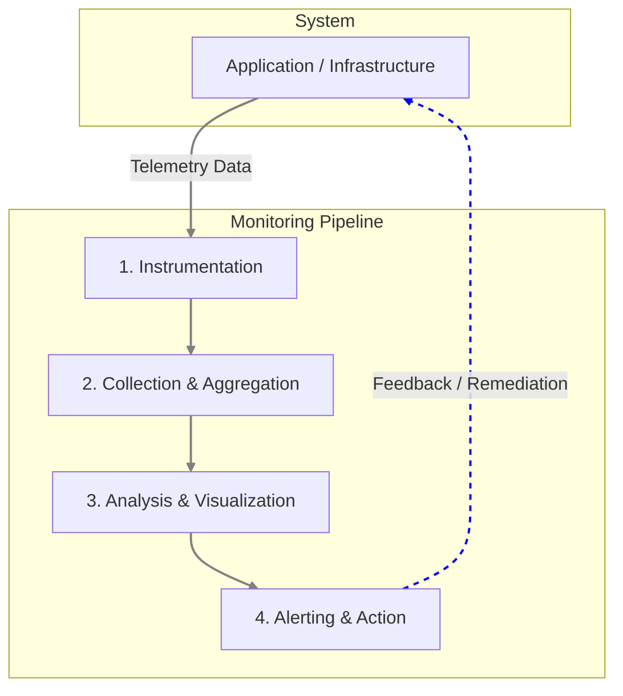
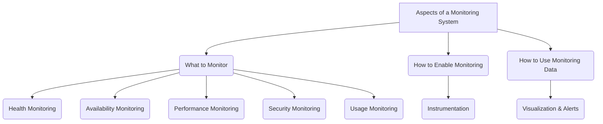
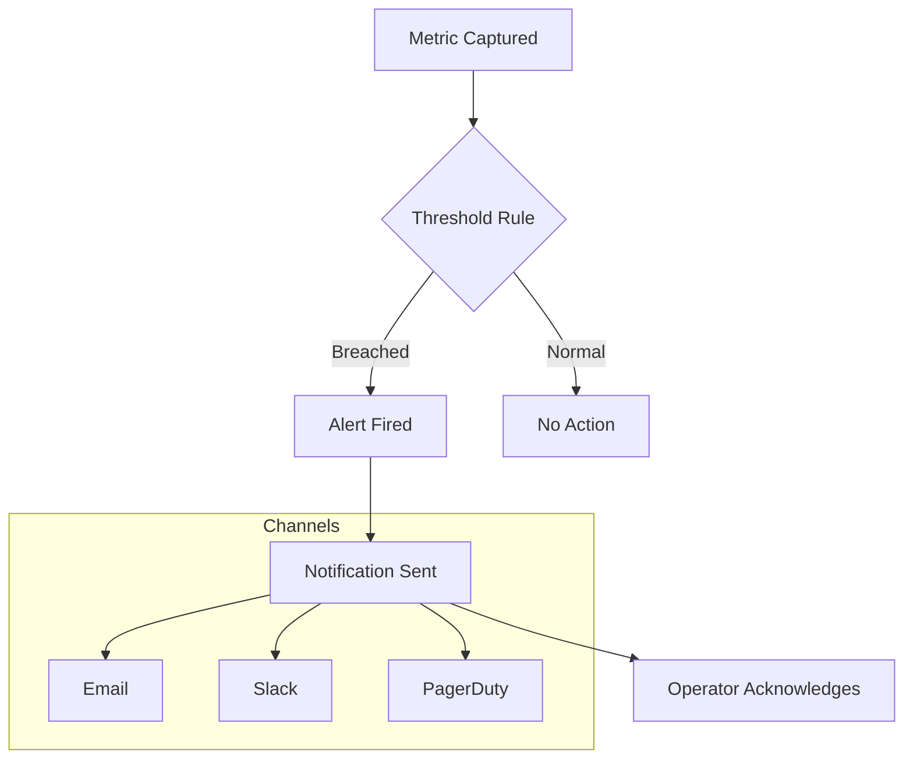

# Monitoring

**Monitoring** is a fundamental pillar of [[observability]] and a critical practice in modern system operations. It is the process of systematically collecting, analyzing, and using data to track a system's health, performance, and availability over time. While often used interchangeably with observability, monitoring is more accurately the *act* of watching and measuring a system using a predefined set of metrics and logs.

In a distributed system, where complexity arises from numerous interacting components, monitoring provides the essential feedback loop needed to maintain reliability and efficiency. It allows teams to move from a reactive state (fixing problems after they occur) to a proactive one (identifying and addressing issues before they impact users).

The core feedback loop of monitoring can be illustrated as follows:


*A diagram illustrating the continuous loop of a monitoring system, from data collection to action.*

---

## Aspects of a Monitoring System



A comprehensive monitoring strategy involves several distinct, yet interconnected, aspects that provide a holistic view of the system.

### Health Monitoring

Health monitoring provides an immediate, real-time snapshot of a system's operational status. Its primary goal is to answer the question: "Is the system running and able to process requests right now?"

This is typically implemented via **health check endpoints** (e.g., `/health`, `/status`, `/ping`) that services expose. These endpoints are consumed by other systems, such as a [[load-balancing|load balancer]] or a [[service-discovery]] registry, to make automated decisions.

For example, a load balancer will stop routing traffic to an instance that reports an "unhealthy" status, preventing user-facing errors.

**Example: Simple Health Check in Node.js/Express**
```javascript
app.get('/health', (req, res) => {
  // Check critical dependencies, like a database connection
  const isDbConnected = checkDatabaseConnection();

  if (isDbConnected) {
    res.status(200).json({ status: 'UP' });
  } else {
    res.status(503).json({ status: 'DOWN', reason: 'Database unavailable' });
  }
});
```

### Availability Monitoring

While health monitoring is instantaneous, **availability monitoring** tracks a system's operational uptime over a period. It answers the question: "Has the system been running reliably over the last day, week, or month?"

Availability is a core component of [[software-architecture/observability/index#SLIs, SLOs, and SLAs: The Business Impact of Observability|Service Level Agreements (SLAs)]] and is measured as a percentage of uptime (e.g., 99.9%, or "three nines"). For more details on how this is measured, see the fundamentals of [[availability]]. This involves tracking not just complete outages but also periods of degradation where the system is technically "healthy" but unusable. This data is crucial for capacity planning and ensuring reliability promises to customers are met.

See also: [[availability-patterns]].

### Performance Monitoring

Performance monitoring focuses on the efficiency, responsiveness, and resource utilization of a system under load. It helps identify bottlenecks, degradation, and inefficiencies before they lead to outages. Key metrics often align with the **Four Golden Signals**:

1.  **[[software-architecture/system-design-fundamentals/index#Latency vs. Throughput|Latency]]**: The time it takes to service a request.
2.  **Traffic**: The demand on the system (e.g., requests per second).
3.  **Errors**: The rate of requests that fail.
4.  **Saturation**: How "full" the service is (e.g., CPU utilization, memory usage).

By monitoring these metrics, teams can detect when a [[performance-antipatterns|performance antipattern]] is emerging and take corrective action, such as [[software-architecture/system-design-fundamentals/index#Scalability|scaling resources]], [[rdbms#SQL Tuning|optimizing queries]], or leveraging a [[caching]] or [[cdn|CDN]] strategy.

### Security Monitoring

Security monitoring is dedicated to detecting, analyzing, and responding to potential security threats. It involves collecting and correlating data from various sources (firewalls, application logs, identity providers) to identify malicious activity.

Common goals include:
- **Detecting unauthorized access**: Monitoring failed and successful login attempts to spot brute-force attacks.
- **Identifying intrusion attempts**: Analyzing network traffic for patterns indicative of a DDoS attack or vulnerability scanning.
- **Auditing data access**: Recording which users access sensitive data to ensure compliance and detect insider threats.

This often involves specialized tools like Security Information and Event Management (SIEM) systems that aggregate and analyze security-related events from across the entire IT infrastructure.

### Usage Monitoring

Usage monitoring tracks how users interact with an application. Unlike performance monitoring, which focuses on system behavior, usage monitoring focuses on user behavior. The insights gathered are valuable for:

- **Business Intelligence**: Identifying popular or underutilized features to guide product development.
- **Capacity Planning**: Using trends in user activity (e.g., number of transactions) to forecast future resource needs.
- **Detecting User Friction**: A high abandonment rate on a checkout page might indicate a bug or a poor user experience.
- **Billing and Quotas**: In multi-tenant systems, usage data is essential for charging customers based on consumption and enforcing resource limits.

### Instrumentation

Instrumentation is the **how** of monitoring. It is the process of integrating code into an application to generate the telemetry data (metrics, logs, and traces) that monitoring systems consume. Meaningful monitoring is impossible without effective instrumentation.

#### The Rise of OpenTelemetry
Historically, instrumentation was often done using vendor-specific agents or libraries, leading to vendor lock-in. **[[opentelemetry|OpenTelemetry]] (OTel)** emerged as a CNCF standard to solve this problem by providing a unified framework for all telemetry data.

The promise of OpenTelemetry is three-fold:

1.  **Vendor-Neutral Instrumentation**: Instrument your code once using the OTel API and SDK. This single instrumentation effort allows you to send telemetry data to *any* OTel-compatible backend, whether it's an open-source tool like Prometheus or Jaeger, or a commercial platform like Datadog or New Relic. You can switch backends without ever changing your application's code.

2.  **Unified Telemetry (Metrics, Traces, and Logs)**: OTel aims to be the single standard for generating and collecting the three pillars of observability. This breaks down data silos and allows for powerful correlation between different types of telemetry, for example, jumping from a metric that shows a spike in errors directly to the traces and logs that correspond to those errors.

3.  **Automatic Instrumentation**: For many popular libraries and frameworks (like Express.js, Spring, or ASP.NET Core), the OpenTelemetry community provides auto-instrumentation libraries. These can be enabled with minimal configuration and automatically generate valuable telemetry (like HTTP request latency and error rates) with no manual code changes, offering a huge productivity boost.

**Example: Basic Instrumentation with the OTel API**

The following snippet shows the core developer interaction with the OTel API to create and record a custom metric. It focuses on the instrumentation logic itself, assuming the SDK has been initialized elsewhere in the application.

```javascript
// Assumes the OTel SDK has been initialized elsewhere in the application.
import { metrics } from '@opentelemetry/api';

// 1. Get a "Meter" instance for a specific component (e.g., a microservice).
const meter = metrics.getMeter('my-ecommerce-app');

// 2. Create a counter instrument to track a value that increases over time.
const checkoutCounter = meter.createCounter('checkouts_total', {
  description: 'Counts the total number of completed checkouts',
});

// 3. In the application logic, record a measurement.
function processCheckout(cart) {
  // ... business logic ...

  // Increment the counter by 1 and add attributes (dimensions)
  // to allow for filtering and grouping in the backend.
  checkoutCounter.add(1, {
    'payment_method': 'credit_card',
    'currency': 'USD'
  });
}
```
This standardized approach ensures that telemetry data is portable and can be consumed by any OTel-compatible backend.

### Visualization and Alerts

This is the **action** phase of monitoring, where raw data is transformed into actionable insights.

-   **Visualization**: Involves presenting data in human-readable formats like dashboards, graphs, and heatmaps. Tools like Grafana or Kibana allow operators to explore data, spot trends, and correlate events across different services. A well-designed dashboard can instantly reveal the health of a complex system.

-   **Alerting**: Proactively notifies operators when a system metric crosses a predefined threshold, indicating a potential problem. A robust alerting strategy is crucial for minimizing downtime.

The alerting pipeline typically follows this flow:


*A diagram illustrating the alerting pipeline. A captured metric is evaluated against a predefined threshold. If the threshold is breached, an alert is fired, which in turn triggers a notification to be sent through various channels (like Email, Slack, or PagerDuty) to an operator, who can then acknowledge it.*

A key challenge is to make alerts meaningful and actionable, avoiding "alert fatigue" where operators become desensitized due to excessive, low-priority notifications.

---

## Resources & links

### Articles

1.  **[Monitoring and diagnostics guidance - Azure Architecture Center](https://learn.microsoft.com/en-us/azure/architecture/best-practices/monitoring)**
    A comprehensive guide from Microsoft on best practices for monitoring cloud applications, covering data collection, health monitoring, and alerting.

2.  **[Application Monitoring Best Practices - IBM](https://www.ibm.com/think/topics/application-monitoring-best-practices)**
    An article from IBM detailing key practices for effective application monitoring, focusing on user experience, infrastructure, and setting up the right alerts.
