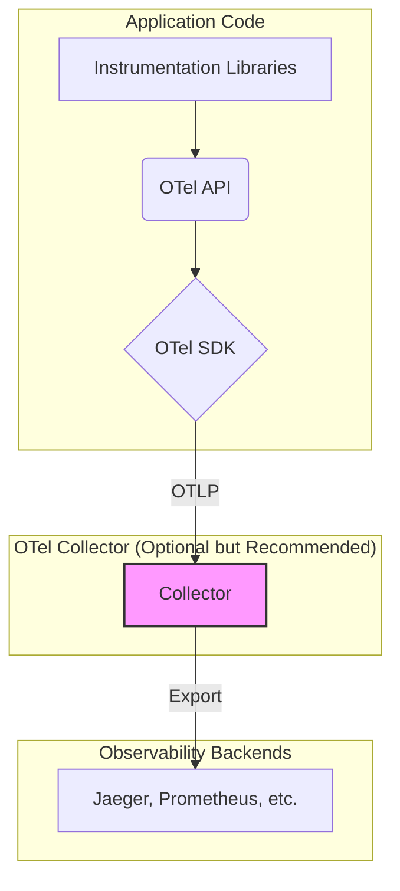
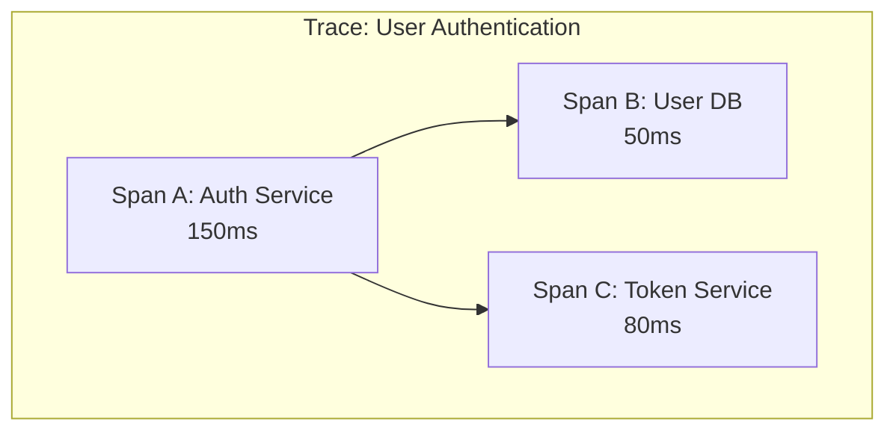
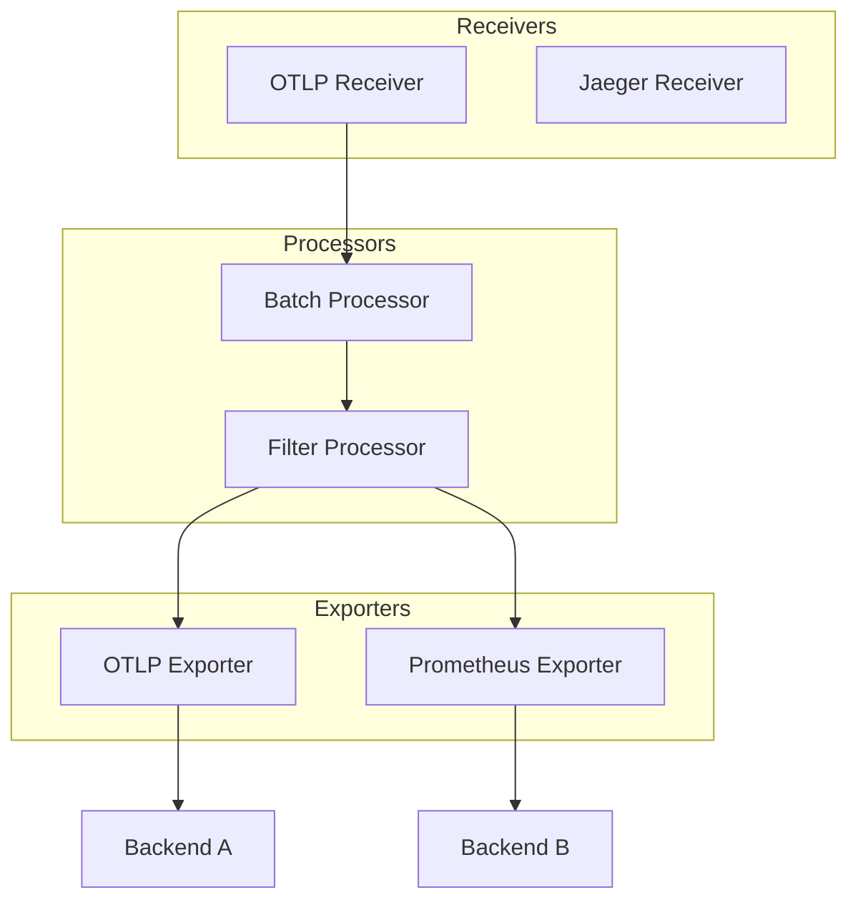

# OpenTelemetry

OpenTelemetry (OTel) is a collection of tools, APIs, and SDKs used to instrument, generate, collect, and export telemetry data (metrics, logs, and traces) for analysis in order to understand your software's performance and behavior. It is a vendor-neutral, open-source project managed by the Cloud Native Computing Foundation (CNCF).

The fundamental goal of OpenTelemetry is to standardize the way we collect and transmit telemetry data, freeing developers from being locked into a specific [[monitoring]] vendor. The core promise is: **instrument your application once, and send the data to any backend.**

---

## The Problem OpenTelemetry Solves

Before OpenTelemetry, instrumenting an application was a fragmented and proprietary process:

-   **Vendor Lock-In**: If you wanted to use a [[monitoring]] tool from Vendor A, you had to use their specific agent and SDK. If you later decided to switch to Vendor B, you had to rip out all the old instrumentation and re-instrument your entire application with Vendor B's tools.
-   **Data Silos**: Different tools were used for different signals. You might use Prometheus for metrics, Jaeger for traces, and an ELK stack for logs. Correlating data between these systems (e.g., finding the exact traces that correspond to a spike in metric errors) was extremely difficult, if not impossible.
-   **Inconsistent Data**: Each vendor had its own data format and conventions, making it hard to build a unified view of system health.

OpenTelemetry solves this by providing a single, standardized specification and toolset for all three pillars of observability.

---

## Core Components of the OTel Standard

OpenTelemetry is not a single product, but a system of components that work together.

1.  **API**: A set of interfaces that define how to instrument code. The API is decoupled from the implementation, meaning your code doesn't depend on any specific OTel SDK configuration.
2.  **SDK (Software Development Kit)**: The official implementation of the API. The SDK is where you configure details like sampling strategies for traces, metric aggregation, and which exporters to use.
3.  **Exporters**: These are the components within the SDK that send the collected telemetry data to a destination. This could be standard output, an OpenTelemetry Collector, or directly to a compatible backend.
4.  **The Collector**: A highly powerful and flexible vendor-agnostic proxy. The Collector can receive telemetry data in various formats (e.g., OTLP, Jaeger, Prometheus), process it (e.g., filter, batch, add attributes), and export it to one or more backends. It acts as a central, configurable pipeline for all telemetry data.

---

## The Three Pillars in OpenTelemetry

OpenTelemetry provides a unified data model for the three pillars of observability.

### 1. Traces

A trace represents the end-to-end journey of a single request as it moves through the various services in a distributed system. A trace is composed of **Spans**.

-   **Span**: Represents a single unit of work or operation (e.g., a database query, an API call). Each span has a name, a start and end time, attributes (key-value pairs), and events (timestamped log messages).
-   **TraceID**: A unique identifier shared by all spans within a single trace.

*A simplified view of a trace, showing how a request flows through different services, with each operation represented as a span.*

### 2. Metrics

Metrics are aggregated numerical data captured over time. OTel provides a powerful API for capturing metrics through **Instruments**.

-   **Counter**: A value that only ever increases (e.g., `http_requests_total`).
-   **UpDownCounter**: A value that can increase or decrease (e.g., `active_connections`).
-   **Histogram**: Measures the statistical distribution of a set of values (e.g., `http_request_latency`).
-   **Observable Gauges**: Captures a snapshot of a value at a specific point in time (e.g., `cpu_temperature`).

### 3. Logs

Logs are timestamped text records of discrete events. For a long time, logging was the missing piece in OpenTelemetry. However, the log data model is now stable.

The OTel log model allows for structured logging and aims to automatically correlate logs with the traces and spans that generated them, providing deep, contextual insights during troubleshooting.

---

## The OpenTelemetry Collector

The Collector is a key component for any serious OTel deployment. It runs as a separate service and acts as a receiving, processing, and exporting pipeline for telemetry.

Its pipeline consists of three main types of components:

1.  **Receivers**: How data gets into the Collector. Receivers can be push-based (e.g., listening for OTLP data on an HTTP port) or pull-based (e.g., scraping a Prometheus metrics endpoint).
2.  **Processors**: How data is manipulated within the Collector. Processors can filter out sensitive data, add metadata, batch data for efficient export, or calculate new metrics.
3.  **Exporters**: How data gets out of the Collector. An exporter can send the processed data to any number of backends, such as Jaeger for traces, Prometheus for metrics, or a commercial observability platform.

*A conceptual view of an OTel Collector pipeline, receiving data in one format, processing it, and exporting it to multiple different backends.*

---

## Resources & links

### Articles

1.  **[What is OpenTelemetry? - Official Docs](https://opentelemetry.io/docs/concepts/what-is-opentelemetry/)**
    The official conceptual overview of the project, its components, and its goals. This is the canonical source for understanding the standard.

2.  **[Qu'est-ce qu'OpenTelemetry ? - Elastic](https://www.elastic.co/fr/what-is/opentelemetry)**
    An article from Elastic explaining how OpenTelemetry standardizes the collection and export of telemetry data for cloud-native applications.

### Videos

1.  **[OpenTelemetry: Simplifying Hybrid Cloud Monitoring - Christopher Walker](https://www.youtube.com/watch?v=hLvwoow3XTk)**
    A video covering the basics of OpenTelemetry, including instrumentation, data generation, and signal transmission.

2.  **[What is OpenTelemetry? - Explanation and Demo](https://www.youtube.com/watch?v=LzLULxhyIpU)**
    A video that provides an explanation and demonstration of OpenTelemetry, covering its benefits, concepts, and a practical Node.js demo.