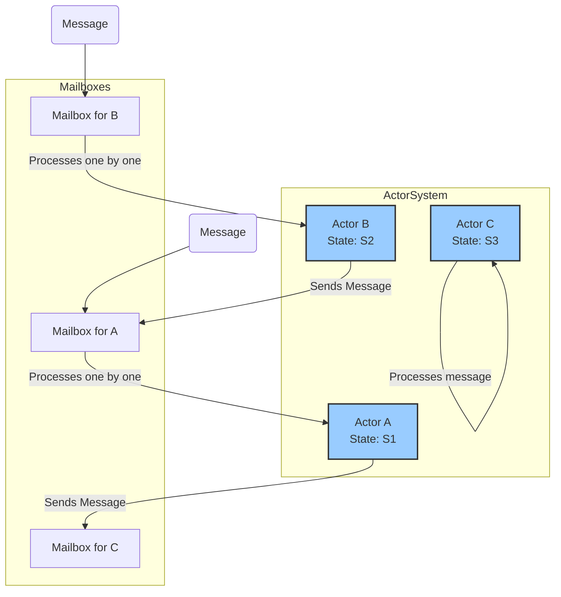

# Actor Model

The **Actor Model** is a conceptual model of concurrent computation that treats "actors" as the universal primitives of concurrent computation. In this model, an actor is a lightweight, independent entity that communicates with other actors exclusively through [[asynchronous-messaging|asynchronous messages]]. Each actor has a private state that is never shared directly with other actors, which eliminates the need for locks and other complex synchronization mechanisms.

The model was first proposed by Carl Hewitt in 1973 and is a powerful paradigm for building highly concurrent, distributed, and [[reliability-engineering|fault-tolerant systems]].

---

## Core Principles

An actor is a computational entity that, in response to a message it receives, can concurrently:
1.  Send a finite number of messages to other actors.
2.  Create a finite number of new actors.
3.  Designate the behavior to be used for the next message it receives.

These three actions define the core of the model. Let's break down the key components:

### 1. Actors
An actor is the fundamental unit of computation. It is a lightweight process that has its own private state and behavior. It is completely isolated from all other actors.

### 2. Mailbox
Each actor has a "mailbox," which is a queue where incoming messages are stored. The actor processes messages from its mailbox one at a time, in the order they were received. This sequential processing of messages is what ensures that the actor's internal state is handled in a thread-safe manner without requiring locks.

### 3. Messages
Actors communicate by sending asynchronous, immutable messages to each other. "Asynchronous" means the sender does not wait for the message to be delivered or processed; it can continue its own work immediately after sending the message. This "fire-and-forget" nature is key to the model's [[software-architecture/system-design-fundamentals/index#Scalability|scalability]].

### 4. State
An actor's state is its private data, which it encapsulates and protects from the outside world. No other actor can access this state directly. The state can only be modified by the actor itself in response to a message.

*Description: Actors (A, B, C) are isolated entities with their own state. They communicate by sending messages to each other's mailboxes. Each actor processes messages from its mailbox sequentially.*

---

## Benefits of the Actor Model

-   **Simplified Concurrency:** The model eliminates the need for manual thread management, locks, semaphores, and other complex synchronization primitives. By design, there are no race conditions on an actor's state because it is only ever modified by the actor itself in a single-threaded manner.
-   **High [[software-architecture/system-design-fundamentals/index#Scalability|Scalability]]:** The lightweight nature of actors and the asynchronous, non-blocking communication allow systems to scale to millions of concurrent actors on a single machine or be distributed across a cluster of machines.
-   **[[reliability-engineering|Fault Tolerance and Resilience]]:** The model promotes a "let it crash" philosophy. Actors are often organized in a hierarchy where a "supervisor" actor manages child actors. If a child actor crashes, the supervisor is notified and can decide whether to restart it, stop it, or escalate the failure. This allows for self-healing systems.
-   **Location Transparency:** Because actors communicate only through messages, it doesn't matter whether the recipient actor is in the same process, on the same machine, or on a different machine across the network. This makes it easy to build distributed systems.

---

## Relationship to Other Concepts

-   **[[reactive-programming|Reactive Programming]]:** The Actor Model is a natural fit for reactive systems. Actors are inherently message-driven and reactive. They react to incoming messages and produce new messages as output, aligning perfectly with the principles of the Reactive Manifesto.
-   **[[event-driven|Event-Driven Architecture]]:** The Actor Model can be seen as a specific implementation of an event-driven architecture, where actors are the event handlers and messages are the events.
-   **[[object-oriented-programming|Object-Oriented Programming]]:** The Actor Model can be viewed as a more disciplined form of OOP. Alan Kay, one of the creators of OOP, has stated that he originally envisioned objects as being more like biological cells, communicating via messages—a concept very close to actors. In this view, actors are the "true" objects.

---

## Common Technologies and Frameworks

-   **Erlang/OTP:** The Erlang programming language and its Open Telecom Platform (OTP) framework are the most famous and mature implementations of the Actor Model. It was designed from the ground up for building highly concurrent and reliable telecommunication systems.
-   **Akka:** A toolkit and runtime for building highly concurrent, distributed, and [[reliability-engineering|resilient]] message-driven applications on the JVM (with versions for both Scala and Java). It is heavily inspired by Erlang/OTP.
-   **Orleans:** A cross-platform framework for building distributed interactive applications, developed by Microsoft Research. It introduces the concept of "virtual actors" to simplify state management.

---

## Resources & links

### Articles

1.  **[The Actor Model in 10 Minutes](https://www.brianstorti.com/the-actor-model/)** (Brian Storti)

    A concise and clear introduction to the core concepts of the Actor Model, explaining how actors, mailboxes, and messages work together to provide a powerful model for concurrency.

2.  **[How the Actor Model works by example](https://www.theserverside.com/blog/Coffee-Talk-Java-News-Stories-and-Opinions/How-the-Actor-Model-works-by-example)** (TheServerSide)

    This article provides a practical explanation of the Actor Model using a real-world example of a coffee shop. It illustrates how actors encapsulate state and behavior, communicate asynchronously, and how the model facilitates building scalable and resilient systems.

3.  **[Actor Model For Object Oriented Programmers](https://hackernoon.com/actor-model-for-object-oriented-programmers)** (HackerNoon)

    This article explains the Actor Model from the perspective of an object-oriented programmer. It highlights the key differences between traditional objects and actors, emphasizing the concepts of state isolation, asynchronous messaging, and location transparency. It's a great resource for understanding the paradigm shift from OOP to the Actor Model.