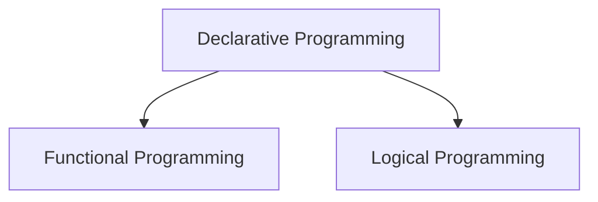

--- 
title: Declarative Programming
tags:
  - programming-paradigm
  - declarative-programming
  - functional-programming
  - logical-programming
date: 2025-09-28
---
# Declarative Programming

In contrast to the [[imperative-programming|imperative paradigm]], which focuses on **how** to achieve a result, the **declarative programming** paradigm focuses on **what** the program should accomplish, without specifying the control flow. You describe the desired result, and the language's execution engine is responsible for figuring out the steps to get there.

An excellent analogy is asking for directions. An imperative approach would be a turn-by-turn list of instructions ("drive 2 miles, turn left, drive 300 feet..."). A declarative approach would be simply stating the destination address and letting a GPS device (the engine) calculate the route.

This paradigm is built on core concepts like:
- **Focus on Logic:** You express the logic of the computation, not the step-by-step execution.
- **Immutability:** State changes are often avoided. Instead of modifying data, new data structures are created from existing ones.
- **No Explicit Control Flow:** You typically do not use loops (`for`, `while`) or complex conditional branching. The underlying engine handles the iteration and flow.

**Main Declarative Paradigms**: Declarative programming is primarily expressed through two major sub-paradigms: [[functional-programming|Functional Programming]] and **Logical Programming**.



## 1. [[functional-programming|Functional Programming]]

[[functional-programming|Functional Programming]] (FP) treats computation as the evaluation of mathematical functions. It emphasizes the use of **pure functions** and **immutable data**. A pure function is one whose output value depends only on its input values, without any observable side effects (like modifying a global variable or writing to a file).

### Key Characteristics
- **Pure Functions:** Predictable and easy to test, as they have no hidden state or side effects.
- **Immutability:** Data is never changed in place. This eliminates a whole class of bugs related to [[transversal-programming-models#1-concurrent-programming|concurrent]] access and unexpected state changes.
- **First-Class Functions:** Functions are treated like any other data type. They can be passed as arguments to other functions, returned as values, and stored in variables.
- **Composition:** Complex behavior is built by composing simpler functions together, much like a [[pipe-filters|pipeline]].
- **Examples of Languages:** Haskell, Lisp, F#, Clojure. Many modern languages like JavaScript, Python, and C# have incorporated strong functional features.

These concepts are explored in greater detail on the dedicated [[functional-programming|Functional Programming]] page.

This emphasis on purity and immutability naturally leads to systems with very high [[cohesion-coupling|cohesion]] and low [[cohesion-coupling|coupling]].

## 2. Logical Programming

Logical Programming is a paradigm based on the principles of formal logic, where a program is a collection of **facts** and **rules**. Instead of writing a sequence of steps, the developer builds a knowledge base. Execution involves posing a **query** to this knowledge base, and the language's engine uses a process of logical deduction to find the answer. It's less about computing a result and more about proving a theorem.

### Key Characteristics
- **Facts and Rules:** The program is a database of logical statements. A **fact** is a simple, true statement (e.g., `parent(john, pete)`). A **rule** is a more complex statement that defines a relationship, typically in the form "Head is true if Body is true" (e.g., `grandparent(X, Z) :- parent(X, Y), parent(Y, Z)`).
- **Queries:** The program is executed by asking a question, or posing a query, to the knowledge base. For example, `?- grandparent(john, X).` asks the system to find all values of `X` for which "john" is a grandparent.
- **Unification and Backtracking:** The engine works by trying to match variables in the query with values from the facts and rules (unification). If one path of reasoning leads to a dead end (fails to prove the query), the engine automatically goes back and tries an alternative path (backtracking). This powerful search mechanism is built into the language itself.
- **Examples of Languages:** Prolog, Datalog.

**Pseudo-code Example (Prolog-like):**

```prolog
// Facts: state what is true
human(socrates).
human(plato).

// Rule: defines a relationship
// "X is mortal if X is human"
mortal(X) :- human(X).

// Query: ask a question to the knowledge base
?- mortal(socrates).
```

This example demonstrates the essence of logical programming. We don't write a function to check if Socrates is mortal. Instead, we provide the system with knowledge: a fact (`human(socrates)`) and a rule (`mortal(X) :- human(X)`). When we pose the query `?- mortal(socrates).`, the engine uses its deduction capabilities. It unifies `X` with `socrates`, sees that `mortal(socrates)` is true if `human(socrates)` is true, and finds that `human(socrates)` is a known fact. The system therefore answers `true`. We only described the logic, and the engine figured out how to get the answer.

## Key Differences Summarized

| Characteristic | [[functional-programming|Functional Programming]] | Logical Programming |
| :--- | :--- | :--- |
| **Based On** | Mathematical Functions | Formal Logic & Relations |
| **Core Idea** | Composing functions to transform data | Proving theorems based on facts and rules |
| **Execution Model** | Function application and reduction | Querying, unification, and backtracking |
| **Primary Use Case** | Data processing, concurrency, mathematical computation | Artificial intelligence, expert systems, database querying |

In summary, declarative programming provides a higher level of abstraction that allows developers to focus on the problem's logic rather than the machine's execution details. [[functional-programming|Functional programming]] achieves this through the composition of pure functions, while logical programming uses the power of formal deduction.

## **Resources & Links**

### Articles

1. **[Declarative programming: When “what” is more important than “how”](https://www.ionos.com/digitalguide/websites/web-development/declarative-programming/)** (IONOS)

    A programming paradigm focused on describing the **desired end result** (the "**what**") rather than the execution steps (the "**how**"). Characterized by a high level of **Abstraction**, **short, efficient code**, and reliance on an **algorithm** (Functional or Logic programming) to automatically determine the solution path.

2. **[I finally understand Declarative Programming](https://blog.saihemanth.com/posts/I-Finally-Understand-Declarative/)** (Sai Hemanth's Blog)

    Defines the paradigm as writing code that closely matches the **human language explanation** of the solution, expressing **what** it does. It emphasizes that implementation details like **iteration** and **state mutation** (C++ `for` loops) must be hidden, favoring **composition** and **pure functions** (like in Haskell or SQL).
