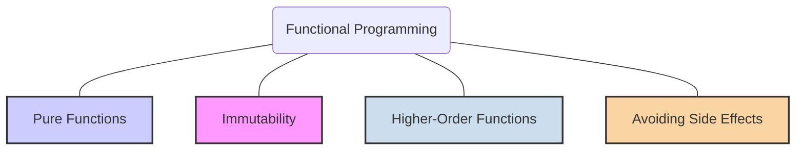
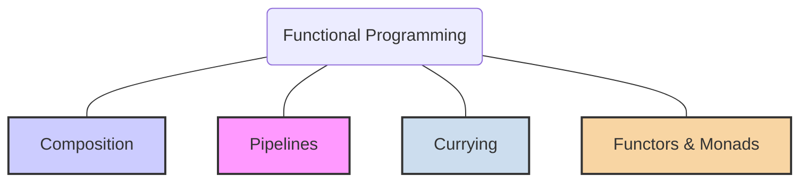

# Functional Programming (FP)

**Functional Programming (FP)** is a [[declarative-programming|declarative]] programming paradigm where programs are constructed by applying and composing **functions**. Unlike [[imperative-programming|imperative programming]], which focuses on a sequence of commands that change program state, FP treats computation as the evaluation of mathematical functions and avoids changing state and mutable data.

If imperative programming is like a detailed, step-by-step recipe for baking a cake, functional programming is like defining the cake itself as a composition of its ingredients and the transformations applied to them (`cake = bake(mix(flour, sugar, eggs))`). The focus is on *what* you are trying to achieve, not *how* you are achieving it step-by-step.

## The Core Principles of Functional Programming



These principles are the foundation of building robust and predictable functional programs.

### 1. Pure Functions

- **What it is:** A pure function is a function that adheres to two main properties:
    1.  Its return value is the same for the same arguments (it is deterministic).
    2.  Its evaluation has no observable side effects (e.g., no mutation of global state, no I/O operations).
- **Why it's important:** Pure functions are easy to reason about, test, and debug. Since they don't depend on or modify external state, they can be run in parallel without causing race conditions. This property is also known as **Referential Transparency**.
- **Analogy:** A mathematical function like `cos(x)`. For any given `x`, it will always return the same result, and it doesn't change anything else in the world.

**Pseudo-code Example:**
```javascript
// Pure function: always returns the same output for the same input
const add = (a, b) => a + b;

// Impure function: its output depends on external state
let minimumAge = 18;
const isOldEnough = (age) => age >= minimumAge; // Output changes if minimumAge changes
```

### 2. Immutability

- **What it is:** The principle that data should not be changed after it is created. Instead of modifying an existing data structure, you create a new one with the updated values.
- **Why it's important:** Immutability prevents side effects and makes tracking changes throughout your application easier. It simplifies debugging and reasoning about the program's state at any given moment.
- **Analogy:** A signed contract. If you need to make changes, you don't scribble on the original; you create a new addendum or a completely new contract that supersedes the old one.

**Pseudo-code Example:**
```javascript
// Mutation (avoid in FP)
const person = { name: "John", age: 30 };
person.age = 31; // Modifying the original object

// Immutability (preferred in FP)
const person = { name: "John", age: 30 };
const olderPerson = { ...person, age: 31 }; // Creates a new object
```

### 3. Functions as First-Class Citizens & Higher-Order Functions

- **What it is:** In FP, functions are treated like any other value (e.g., numbers, strings). They can be:
    - Assigned to variables.
    - Passed as arguments to other functions.
    - Returned as values from other functions.
- A **Higher-Order Function** is a function that either takes one or more functions as arguments or returns a function as its result.
- **Why it's important:** This allows for powerful abstractions and composition. Functions like `map`, `filter`, and `reduce` are common higher-order functions that enable concise and expressive data manipulation.
- **Analogy:** A multi-tool. A function is a tool. A higher-order function is like a tool that can hold and use other tools (e.g., a drill that can accept different drill bits).

**Pseudo-code Example:**
```javascript
const numbers = [1, 2, 3, 4];

// `filter` is a higher-order function that takes a function as an argument
const isEven = (n) => n % 2 === 0;
const evenNumbers = numbers.filter(isEven); // [2, 4]

// `createAdder` is a higher-order function that returns a function
const createAdder = (x) => (y) => x + y;
const addFive = createAdder(5);
console.log(addFive(10)); // 15
```

### 4. Avoiding Side Effects

- **What it is:** A side effect is any interaction with the outside world that occurs during a computation. This includes modifying a global variable, writing to a file or database, or logging to the console. FP aims to minimize side effects and isolate them from the core logic of the program.
- **Why it's important:** Code without side effects is more predictable, testable, and maintainable. It's easier to understand what a function does because its entire impact is described by its return value.
- **Analogy:** A calculator. When you compute `2 + 2`, the calculator gives you `4` but doesn't change its own internal state or affect anything else around it.

---

## Core Concepts in Functional Programming



These are common techniques and patterns used to build functional applications.

### Function Composition

- **What it is:** The process of combining multiple simple functions to create a more complex one. The output of one function becomes the input of the next.
- **Example:** `f(g(x))`. In this case, the `g` function is applied to `x` first, and then the `f` function is applied to the result.

### Pipelines

- **What it is:** A more readable way to express function composition, often found in functional languages or libraries. Data flows through a sequence of functions, each one transforming it in some way.
- **Example:**
  ```fsharp
  // F# pipeline operator |>
  let result = 10 |> add 5 |> multiplyBy 2 // equivalent to multiplyBy(add(10, 5))
  ```

### Currying

- **What it is:** A technique of transforming a function that takes multiple arguments into a sequence of functions that each take a single argument.
- **Why it's useful:** Currying is a powerful tool for creating specialized functions and is closely related to the concept of partial application.
- **Example:**
  ```javascript
  // Uncurried version
  const multiply = (a, b) => a * b;

  // Curried version
  const curriedMultiply = (a) => (b) => a * b;

  const double = curriedMultiply(2); // Creates a specialized function
  console.log(double(5)); // 10
  ```

### Functors, Applicatives, and Monads

These are advanced concepts borrowed from category theory that provide robust patterns for handling "boxed" values (values with a context, like an optional value, a list, or a future result).

- **Functor:** An object that implements a `map` function. It allows you to apply a function to a value inside a container without changing the container's structure. `Array` in JavaScript is a functor.
  ```javascript
  [1, 2, 3].map(x => x + 1); // [2, 3, 4]
  ```
- **Applicative Functor:** An object with an `ap` function. It allows you to apply a "boxed" function to a "boxed" value.
- **Monad:** An object with a `flatMap` or `chain` function (often called `bind`). Monads are used to sequence computations that are wrapped in a context. They are essential for managing side effects (like I/O or null-checking) in a functional way. `Promise` in JavaScript is a monad, as its `.then()` method acts like `flatMap`.

---

## **Resources & links**

### **Articles**

1. **[Functional Programming in JavaScript: A Beginner's Guide](https://www.freecodecamp.org/news/functional-programming-in-javascript/)**

    An introduction to **FP** as a **Declarative** sub-paradigm. It defines the core principles: using **pure, isolated functions** and strictly avoiding **mutability** and **side-effects**. Key techniques covered include **Higher-Order Functions** (`map`, `reduce`) and **Function Composition**.

2. **[What is Functional Programming?](https://softwaremill.com/what-is-functional-programming/)**

    A practical definition of **FP** that goes beyond the "pure function" rule. It contrasts the **declarative** style with the **imperative** style, highlighting the use of **immutable data structures**, **Function composition**, **Higher-order functions**, and the separation of **Data & behavior**.

### **Videos**

1. **[Functional programming - A general introduction](https://www.youtube.com/watch?v=8z_bUIl_uPo)**

    This video presents **FP** as a paradigm where programs are built from the **composition of mathematical functions** (output depends only on input). It highlights that instructions are **expressions**, not commands, and covers features like treating functions as **first-class values**, **Higher-Order Functions**, **Anonymous Functions**, and **Recursion**.

2. **[Functional Programming (Playlist)](https://www.youtube.com/watch?v=Z3PLwD3iebg&list=PLuPevXgCPUIMbCxBEnc1dNwboH6e2ImQo)**

    Full course on FP, the first video emphasizes it's a way of thinking to **declaratively chain transformations** instead of mutating state. It focuses on the benefits of **immutability**, functions without **side effects**, and how **Function composition** leads to more maintainable and easier-to-reason-about code.