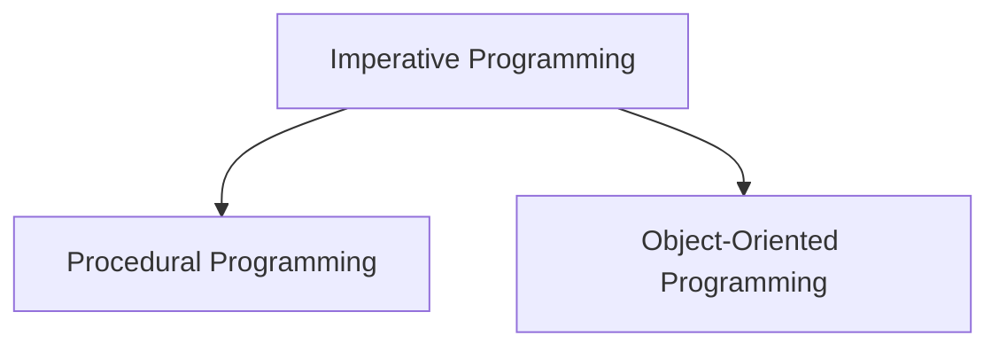

# Imperative Programming

The **imperative programming** paradigm is one of the oldest and most fundamental approaches to programming. It focuses on describing **how** a program operates by providing a sequence of explicit commands that change the program's state. Think of it as giving the computer a detailed, step-by-step recipe to follow. The code is a direct command to the machine, specifying each action in order: "do this, then do that, then change this variable."

This paradigm is built on three core concepts:
- **State:** The program maintains a state, represented by variables that store data in memory.
- **Sequence of Commands:** Instructions are executed in a specific, predefined order, using control flow statements like loops (`for`, `while`) and conditionals (`if-else`).
- **Mutability:** The state is mutable, meaning that commands can directly modify the values of variables as the program runs.

**Main Imperative Paradigms**: Imperative programming is primarily divided into two major sub-paradigms: **Procedural Programming** and **Object-Oriented Programming** but others paradigms can also fall into this category.



## 1. Procedural Programming

Procedural programming organizes imperative code into **procedures** (also known as functions or subroutines). A procedure is a self-contained block of code that performs a specific, well-defined task. This approach encourages a **top-down design**: a developer starts by outlining the main function of the application as a series of high-level steps, and then recursively breaks down each step into smaller, more detailed procedures. The program becomes a master procedure (`main`) that orchestrates calls to these sub-procedures in a highly controlled, sequential manner to accomplish the overall goal. The data on which these procedures operate is kept separate, often passed between procedures as parameters or stored in a shared, global scope.

### Key Characteristics
- **Focus on Process:** The primary focus is on the sequence of actions, the algorithm, or the "procedure" to be followed. The code is a direct, step-by-step implementation of a process that transforms an input into an output. The developer must explicitly manage the entire flow of control.

- **Functional Decomposition:** This is the primary technique for managing complexity. Large, complex problems are not solved by modeling real-world objects, but by breaking the required process down into a hierarchy of simpler, more understandable functions. Each function abstracts a single action or computation.

- **Shared Data:** This is the most critical and defining characteristic, and often the main drawback. Data is treated as a passive entity, separate from the procedures that act upon it. Because there is no mechanism bundling the data with the functions that are meant to modify it, there is no inherent protection. In large applications, this leads to a complex web of dependencies where it becomes unclear which functions can read or write to which data. A change to a global data structure can cause a ripple effect, forcing changes in every single function that uses it. This makes it extremely difficult to track state changes and debug issues, leading to high [[cohesion-coupling|coupling]] and a fragile system where a local change can have unexpected global consequences.

- **Examples of Languages:** C, Pascal, Fortran, COBOL.

**Pseudo-code Example:**

```
// Global variable representing shared state
let account_balance = 100

procedure deposit(amount) {
  // Direct modification of shared state
  account_balance = account_balance + amount
}

procedure withdraw(amount) {
  // Direct modification of shared state
  if (account_balance >= amount) {
    account_balance = account_balance - amount
  } else {
    print("Insufficient funds")
  }
}

// Main execution flow
deposit(50)
withdraw(30)
```

This example illustrates the key points of procedural programming: the data (`account_balance`) is passive and global. The procedures (`deposit`, `withdraw`) are active but separate units of logic that have direct, uncontrolled access to modify this data. There is no intrinsic link between the data and the operations, which is the fundamental problem that encapsulation in Object-Oriented Programming is designed to solve.

### Resources & links

1. **[What Is Procedural Programming?](https://www.baeldung.com/cs/procedural-programming)**

    An **imperative programming paradigm** organizing code into **procedures** (functions/subroutines) executed **sequentially**. It promotes **modularity** and **procedural abstraction**, focusing on separating **data structures** from the operations that act on them.

2. **[The Return of Procedural Programming - Richard Feldman](http://www.youtube.com/watch?v=vQPHtAxOZZw)**

    A talk on the **resurgence of PP** (**Rust**, **Go**), driven by **disillusionment** with **OOP complexity**. It advocates for the **procedural style**: programming with **plain functions and data**, **less hierarchy**, and favoring **static typing** and **composition** over traditional **OOP** features like **inheritance** and **extreme late binding** [00:48:02].

## 2. Object-Oriented Programming (OOP)

Object-Oriented Programming (OOP) evolved as a solution to the challenges of procedural programming, particularly the difficulty of managing complexity and shared state in large applications. OOP organizes code by bundling data and the operations that work on that data into single units called **objects**.

While still imperative at its core (methods of an object are sequences of commands), OOP shifts the focus from procedures to the objects themselves. Instead of data being passive and manipulated by active procedures, data and behavior are combined into active, self-contained objects.

### Key Characteristics
- **Encapsulation:** This is the cornerstone of OOP. An object encapsulates both data (attributes) and the methods (behavior) that operate on that data, creating a protective "capsule." The internal state is hidden from the outside world and can only be modified through the object's public methods, preventing uncontrolled access and modification.
- **Abstraction:** Objects hide their internal complexity behind a simplified public interface. For example, to drive a car, you use the steering wheel and pedals (the interface), without needing to understand the complex mechanics of the engine (the implementation).
- **Inheritance:** Allows a new class (subclass) to inherit properties and methods from an existing class (superclass), promoting code reuse.
- **Polymorphism:** Allows objects of different classes to be treated as objects of a common superclass, enabling flexible and dynamic behavior.
- **Examples of Languages:** Java, C++, C#, Python, Ruby, Smalltalk.

These concepts are explored in greater detail on the dedicated [[object-oriented-programming|Object-Oriented Programming]] page.

## Key Differences Summarized

| Characteristic | Procedural Programming | Object-Oriented Programming |
| :--- | :--- | :--- |
| **Primary Unit** | Procedures / Functions | Objects |
| **Data and Behavior** | Separated | Encapsulated together in objects |
| **State Management** | Often relies on shared or global state | State is contained and managed within objects |
| **Approach** | Top-down (breaking down tasks) | Bottom-up (designing objects first) |
| **Key Goal** | To execute a sequence of computational steps | To model real-world or abstract entities |
| **Complexity Management**| Through functional decomposition | Through encapsulation and abstraction |

In essence, while both paradigms tell the computer *how* to perform tasks, OOP provides a much more robust and scalable way to structure large and complex applications by organizing them around self-contained, stateful objects rather than a global, shared state.

## **Resources & Links**

### Articles

1. **[What is Imperative Programming?](https://www.geeksforgeeks.org/system-design/what-is-imperative-programming/)** (GeeksforGeeks)

    Defines the paradigm based on **step-by-step commands** that sequentially **change the program's state** (mutable state) using **Control Flow**. It focuses explicitly on *how* the program should achieve the final result.

---

2. **[Imperative programming: Overview of the oldest programming paradigm](https://www.ionos.com/digitalguide/websites/web-development/imperative-programming/)** (IONOS)

    The **oldest** programming paradigm. Programs consist of a **clear sequence of instructions** (the "how") that directly manipulate variables. While easy to learn, it can lead to high **code volume** and **complexity** for large applications, unlike the [[declarative-programming|declarative paradigm]] (the "what").