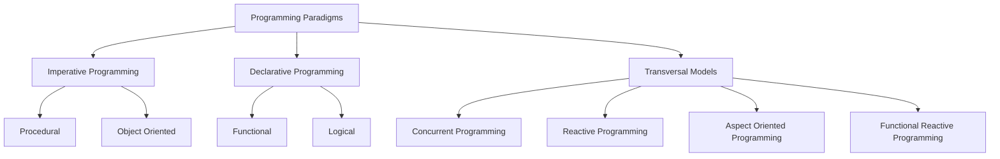

# Programming Paradigms

A programming paradigm is a fundamental style or way of thinking about and building the structure of a computer program. It provides a set of concepts and principles that shape how we write code, from the overall architecture down to individual expressions.

This documentation organizes programming paradigms into three main categories, as illustrated below.

## [[Imperative Programming]]

The imperative paradigm focuses on **how** to execute a task. It describes a sequence of commands that change the program's state.

[[imperative-programing|Learn more about Imperative Programming]]

- **Procedural:** Organizes code into procedures or functions that are called in a specific order.
- **Object-Oriented:** Groups data (attributes) and the operations that modify that data (methods) into objects.

## [[Declarative Programming]]

The declarative paradigm focuses on **what** to execute. It describes the logic of a computation without specifying its control flow.

[[declarative-programing|Learn more about Declarative Programming]]

- **Functional:** Treats computation as the evaluation of mathematical functions and avoids changing-state and mutable data.
- **Logical:** Based on formal logic, where programs are sets of logical clauses and computation is a form of deduction.

## [[Transversal Models]]

Transversal models are paradigms or concerns that can be combined with or applied across the main imperative and declarative paradigms.

[[transversal-paradigm|Learn more about Transversal Models]]

- **Concurrent Programming:** Manages the simultaneous execution of multiple instruction sequences.
- **Reactive Programming:** Focuses on data flows and the propagation of change.
- **Aspect-Oriented Programming:** Separates cross-cutting concerns (like logging or security) from the core business logic.
- **Functional Reactive Programming:** A combination of functional and reactive programming to handle asynchronous data flows in a declarative way.
