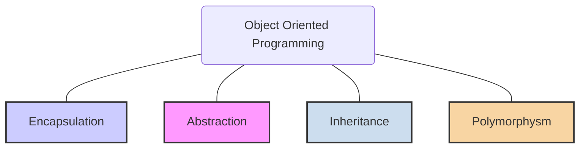
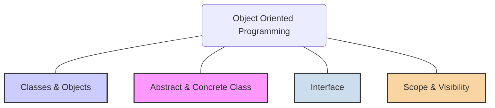

# Object-Oriented Programming (OOP)

**Object-Oriented Programming (OOP)** is a fundamental programming paradigm that revolves around the concept of "objects." Unlike [[imperative-programming#1-procedural-programming|procedural programming]], which structures a program as a sequence of logical steps acting on shared data, OOP bundles data and the methods that operate on that data into a single unit: an **object**. This approach provides a powerful way to model real-world entities, manage complexity, and build reusable, maintainable software.

If procedural programming is like a recipe with a list of instructions, OOP is like assembling a car from pre-built, self-contained components like an engine, wheels, and a chassis. Each component knows how to perform its own functions and interacts with others through well-defined interfaces.

## The Four Primary Principles (Pillars of OOP)



These four principles are the foundation of any robust object-oriented design.

### 1. Encapsulation

- **What it is:** The bundling of data (attributes) and the methods that operate on that data into a single object. Encapsulation also involves restricting direct access to an object's internal state; this is known as **information hiding**.
- **Why it's important:** It protects an object's data from accidental or unauthorized modification from the outside (data integrity). It also reduces system complexity by hiding implementation details, leading to higher [[cohesion-coupling|cohesion]].
- **Analogy:** The engine of a car. You don't need to know how the pistons, valves, and spark plugs work internally. You interact with it through a simple, public interface: the ignition key.

**Pseudo-code Example:**
```java
class BankAccount {
  // Data is private, hidden from the outside
  private double balance;

  // Public methods provide the only way to interact with the data
  public void deposit(double amount) {
    if (amount > 0) {
      this.balance += amount;
    }
  }

  public double getBalance() {
    return this.balance;
  }
}
```

### 2. Abstraction

- **What it is:** The process of hiding complex implementation details and exposing only the essential features of an object. It focuses on *what* an object does, not *how* it does it. It is a form of [[soc|separation of concerns]].
- **Why it's important:** Abstraction simplifies the interaction between objects, making the system easier to understand and use. It is a key tool for managing complexity.
- **Analogy:** A TV remote control. You use simple buttons (the abstraction) like "volume up" or "change channel" without needing to understand the complex electronic signals being sent to the TV.

**Pseudo-code Example:**
```java
// The user of this car object only needs to know about the start() method.
// The complex internal logic is abstracted away.
class Car {
  public void start() {
    checkFuel();
    engageIgnitionSystem();
    // ... and many other complex steps
  }

  private void checkFuel() { /*...*/ }
  private void engageIgnitionSystem() { /*...*/ }
}

// Client code is simple:
Car myCar = new Car();
myCar.start();
```

### 3. Inheritance

- **What it is:** A mechanism that allows a new class (the *subclass* or *child class*) to acquire the properties and behaviors (methods) of an existing class (the *superclass* or *parent class*). This creates an "is-a" relationship.
- **Why it's important:** It promotes code reuse and establishes a natural hierarchy between objects.
- **Analogy:** A `Golden Retriever` *is a* `Dog`, which *is an* `Animal`. The Golden Retriever inherits the general characteristics of a dog (like barking) and an animal (like eating).

**Pseudo-code Example:**
```java
class Animal {
  public void eat() {
    print("This animal eats food.");
  }
}

// Dog inherits the eat() method from Animal
class Dog extends Animal {
  public void bark() {
    print("Woof!");
  }
}

Dog myDog = new Dog();
myDog.eat();  // Inherited from Animal
myDog.bark(); // Defined in Dog
```

#### Composition over Inheritance

A key principle of modern object-oriented design is to **favor composition over inheritance**. While inheritance is powerful, it creates a very strong, static [[cohesion-coupling|coupling]] between a parent and child class. A change in the parent can easily break the child.

**Composition**, on the other hand, models a "has-a" relationship. Instead of a class *being* something, it *has* something. This is achieved by including an instance of another class as a field.

- **Inheritance (is-a):** `class Car extends Vehicle` (A car *is a* vehicle).
- **Composition (has-a):** `class Car { private Engine engine; }` (A car *has an* engine).

Composition is often more flexible, as the composed objects can be swapped out at runtime, and it avoids the rigid hierarchy of inheritance. This leads to more modular and maintainable designs.

**Note:** While powerful, inheritance can create tight [[cohesion-coupling|coupling]] between classes. Modern design often favors composition over inheritance and requires adherence to the [[solid#3-liskov-substitution-principle-lsp|Liskov Substitution Principle]].

### 4. Polymorphism

- **What it is:** From the Greek for "many forms," polymorphism allows objects of different classes to be treated as objects of a common superclass. It enables a single interface to represent different underlying forms (data types).
- **Why it's important:** It provides flexibility and extensibility. You can write code that works with a superclass type, and it will correctly handle any subclass type without needing to know its specific class. This is a key enabler for many of the [[solid|SOLID principles]], such as the Open/Closed and Dependency Inversion principles.
- **Analogy:** The "play" button on a media player. Whether you are playing a song, a video, or a podcast, you press the same button. The button performs the same conceptual action ("play"), but the actual implementation differs for each media type.

**Pseudo-code Example:**
```java
// Continuing the Animal example...
class Cat extends Animal {
  public void makeSound() {
    print("Meow!");
  }
}

class Dog extends Animal {
  public void makeSound() {
    print("Woof!");
  }
}

// Polymorphism in action
Animal myDog = new Dog();
Animal myCat = new Cat();

// We can call the same method on different object types
myDog.makeSound(); // Outputs "Woof!"
myCat.makeSound(); // Outputs "Meow!"
```

---

## Core Features of the Paradigm



These are the building blocks that languages provide to enable object-oriented design.

### Classes and Objects
- **Class:** A blueprint or template for creating objects. It defines a set of attributes (data) and methods (behavior) that the created objects will have.
- **Object:** A specific instance of a class. While the class is the definition, the object is the concrete entity that exists in memory.

### Abstract vs. Concrete Classes
- **Concrete Class:** A complete class from which objects can be directly instantiated. It provides an implementation for all of its methods.
- **Abstract Class:** A class that cannot be instantiated on its own and is meant to be inherited by other classes. It can contain a mix of implemented methods and `abstract` methods (methods without an implementation), which must be implemented by its subclasses.

### Interfaces
An interface is a contract that defines a set of method signatures without providing any implementation. A class that `implements` an interface must provide a concrete implementation for all the methods defined in that interface. Unlike inheritance (which creates an "is-a" relationship), interfaces define a "can-do" relationship. They are a powerful tool for achieving [[cohesion-coupling|decoupling]] and are central to the [[solid#5-dependency-inversion-principle-dip|Dependency Inversion Principle]] and the [[solid#4-interface-segregation-principle-isp|Interface Segregation Principle]].

### Interface vs. Abstract Class

While both are used to achieve abstraction, they serve different purposes:

| Feature | **Abstract Class** | **Interface** |
| :--- | :--- | :--- |
| **Purpose** | To provide a common base with some shared code for subclasses. | To define a pure contract of behavior that a class must implement. |
| **Methods** | Can have both abstract (no body) and concrete (with body) methods. | Traditionally, can only have abstract methods (though modern languages add exceptions). |
| **State** | Can have instance variables (state). | Cannot have instance variables. |
| **Inheritance** | A class can only inherit from **one** abstract class. | A class can implement **multiple** interfaces. |
| **Relationship** | Defines an "is-a" relationship. | Defines a "can-do" relationship. |

**When to use which:**
- Use an **abstract class** when you want to share code among several closely related classes.
- Use an **interface** when you want to define a role or capability that different, unrelated classes can perform.

### Scope and Visibility
Visibility modifiers (like `public`, `private`, and `protected`) are keywords that control the accessibility of attributes and methods. They are the primary mechanism for enforcing **encapsulation**.
- **`public`:** Accessible from anywhere.
- **`private`:** Accessible only within the class itself.
- **`protected`:** Accessible within the class and by its subclasses.

---

## **Resources & links**

### **Articles**

1. **[Object Oriented Programming and Design: a practitioners perspective.](https://medium.com/@james._.watson/object-oriented-programming-and-design-a-practitioners-perspective-3a664cef00b2)**

    A practitioner's view on **OOP**, arguing that **Abstraction** and **sub-typing Polymorphism** (**interface inheritance**) are the core concepts. It criticizes the excessive focus on **implementation inheritance** and misconceptions about **Encapsulation** and **mutable state** associated with the **JavaBeans** ("property bags") style.

2. **[Object-oriented programming](https://developer.mozilla.org/en-US/docs/Learn_web_development/Extensions/Advanced_JavaScript_objects/Object-oriented_programming)**

    An overview of **class-based OOP** concepts (**Classes/Instances**, **Inheritance**, **Encapsulation**, **Polymorphism**) using pseudocode. The article contrasts this with **JavaScript's** implementation, where **constructors** and the **prototype chain** relate to these concepts but function more via **delegation** than classical **inheritance**.

### **Videos**

1. **[Fundamental Concepts of Object Oriented Programming](http://www.youtube.com/watch?v=m_MQYyJpIjg)**

    A presentation defining the four pillars of **OOP**: **Abstraction** (simplifying reality to focus on relevant **data** and **processes**), **Encapsulation** (hiding **inner workings** and binding **data** with **functions**), **Inheritance** (deriving **methods** and **properties** through a **class** hierarchy), and **Polymorphism** (**overriding** inherited methods).

2. **[Intro to Object Oriented Programming - Crash Course](https://www.youtube.com/watch?v=SiBw7os-_zI)**

    This course introduces **OOP** by contrasting it with **primitive data types** and **structures** to explain the need for **objects**. It then details the four main principles: **Encapsulation** (bundling data with **methods** and **information hiding**), **Abstraction** (showing only essential details via the **interface**), **Inheritance** (deriving **subclasses** from **superclasses**), and **Polymorphism** (**dynamic** vs. **static** forms of a method).
