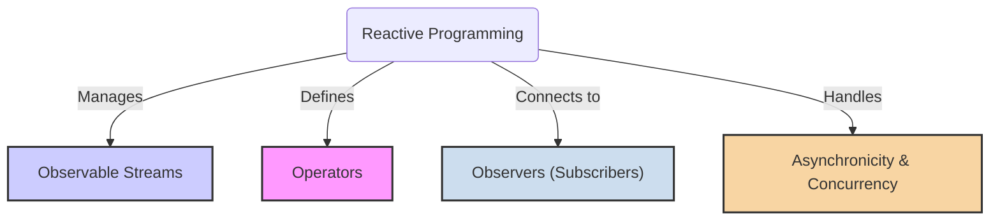
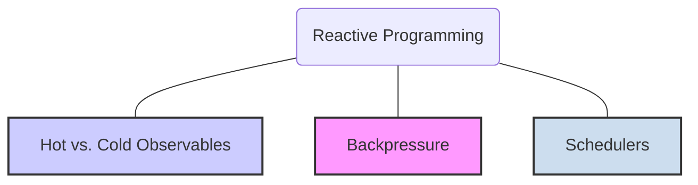

# Reactive Programming

**Reactive Programming** is a [[declarative-programming|declarative]] programming paradigm centered around **data streams** and the **propagation of change**. It provides a powerful model for handling asynchronous data flows and is particularly well-suited for applications that need to respond to a high volume of events, such as user interfaces, real-time systems, and microservices.

An excellent analogy is a spreadsheet: when you change the value in one cell, all other cells that depend on it are automatically recalculated and updated. In reactive programming, you define streams of data and specify how to react to new values, and the framework ensures that changes are propagated automatically through the system.

## The Core Principles of Reactive Programming



### 1. Observable Streams

- **What it is:** A sequence of data/events ordered in time. A stream can emit zero, one, or multiple values, and may or may not terminate. Anything can be a stream: user inputs (clicks, keystrokes), messages from a queue, API responses, or even variables.
- **Why it's important:** By treating everything as a stream, reactive programming provides a unified way to handle data, whether it is synchronous or asynchronous, a single value or a collection.
- **Analogy:** A conveyor belt in a factory. Items (data) are placed on the belt (the stream) one after another. Workers alongside the belt can inspect, modify, or remove items as they pass by.

### 2. Operators

- **What it is:** Pure functions that are used to transform, combine, and manipulate streams. Operators take one or more input streams and produce an output stream. They do not modify the original stream.
- **Why it's important:** Operators are the workhorses of reactive programming. They allow you to build complex data processing pipelines in a declarative and composable way. Common operators include `map`, `filter`, `merge`, and `scan`.
- **Analogy:** The workstations along the conveyor belt. One station might paint an item (`map`), another might inspect it and remove defective ones (`filter`), and a third might combine items from two different belts (`merge`).

### 3. Observers (Subscribers)

- **What it is:** The consumer of a stream. An observer "subscribes" to an observable stream and reacts to the values it emits. An observer typically has three methods:
    1.  `onNext()`: Called for each new value emitted by the stream.
    2.  `onError()`: Called if an error occurs in the stream.
    3.  `onComplete()`: Called when the stream has finished emitting values.
- **Why it's important:** Observers are where the side effects happen. They are the bridge between the declarative, reactive world of streams and the imperative world (e.g., updating the UI, writing to a database).
- **Analogy:** The final station at the end of the conveyor belt that takes the finished items and puts them in a box for shipping. It is the final destination and consumer of the processed items.

### 4. Asynchronicity & Concurrency

- **What it is:** Reactive programming is inherently asynchronous, as it is designed to handle events that can happen at any time. Reactive libraries often provide **Schedulers** to control the execution context (i.e., which thread) a stream operates on.
- **Why it's important:** This makes it easy to manage complex, non-blocking operations without resorting to callbacks (avoiding "Callback Hell"). You can declaratively switch between background threads for processing and the main UI thread for display.
- **Analogy:** A restaurant kitchen. The head chef (the main thread) can give an order to a sous-chef (a background thread) to chop vegetables. The head chef doesn't wait; they move on to other tasks. When the vegetables are chopped, the sous-chef brings them back.

---

## Declarative Core vs. Imperative Side-Effects

The confusion around Reactive Programming often stems from how it is used. The creation and composition of streams is declarative, but the final action can be imperative.

- **The Declarative Part:** You *declare* a processing pipeline by chaining operators. You describe *what* data you want, not *how* to process it step-by-step.
- **The Imperative Part:** The action executed when a value is received (the `subscribe` or `onNext` method) often contains imperative code that produces a **side effect**—like updating the UI, logging to a console, or writing to a database.

**Pseudo-code Example:**
```javascript
// Declarative part: Describing the data pipeline
const newValues = sourceStream
  .filter(value => value > 10) // Keep values greater than 10
  .map(value => value * 2);   // Double them

// Imperative part: The subscription performs a side effect
newValues.subscribe(processedValue => {
  // This is an imperative command: "Set the element's text!"
  document.getElementById('my-label').innerText = processedValue;
});
```
Because it combines a declarative data flow with potentially imperative actions, it is best classified as a transversal model rather than a purely declarative one.

---

## Core Concepts in Reactive Programming



### Hot vs. Cold Observables

- **Cold Observable:** A stream that does not begin emitting values until an observer subscribes to it. Each subscriber gets its own private sequence of values. An HTTP request is a classic example: a new request is made for every subscriber.
- **Hot Observable:** A stream that emits values regardless of whether there are any subscribers. Subscribers will only receive values that are emitted *after* they subscribe. Mouse clicks are a classic example: the mouse is generating click events whether you are listening for them or not.

### Backpressure

- **What it is:** A mechanism to handle situations where an observable stream is emitting values faster than an observer can consume them. It allows the consumer to signal to the producer how much data it can handle, preventing it from being overwhelmed.
- **Why it's important:** Backpressure is crucial for building robust systems that can handle large volumes of data without running out of memory or crashing.
- **Analogy:** A funnel. If you pour water into a funnel faster than it can flow out, the water will overflow. Backpressure is like controlling the flow of water to match the funnel's capacity.

### Schedulers

- **What it is:** Schedulers are a powerful feature of reactive libraries that allow you to control the execution context of your streams. You can specify which thread an observer should subscribe on (`subscribeOn`) and which thread it should receive notifications on (`observeOn`).
- **Why it's useful:** Schedulers make it trivial to manage concurrency. For example, you can perform a network request on a background I/O thread and then switch to the main UI thread to display the result, all within a single, declarative stream pipeline.

---

## **Resources & links**

### Articles

1. **[Introduction to Reactive Programming](https://projectreactor.io/docs/core/release/reference/reactiveProgramming.html)**

    This guide from the Project Reactor documentation introduces **Reactive Programming** as an **asynchronous paradigm** for handling **data streams** and the **propagation of change**. It illustrates how libraries like Reactor simplify complex asynchronous code, such as **Callback Hell** or complicated `CompletableFuture` orchestration, using a declarative chain of operators like `flatMap` and `zipWith`.

2. **[What Is Reactive Programming? | Baeldung](https://www.baeldung.com/cs/reactive-programming)**

    A comprehensive guide to **Reactive Programming** as a **declarative** paradigm based on **asynchronous data streams** and **event processing**. It details the **Observer Pattern**, **Reactive Streams** with **operators** (like map, filter, zip), and the crucial role of **back pressure**. It highlights the pros (resilience, scalability) and cons (steep learning curve, debugging difficulty).


### Videos

1. **[Intro to Reactive Programming by Jordan Jozwiak of Google - CS50 Tech Talk](https://www.youtube.com/watch?v=KOjC3RhwKU4)**

    This CS50 Tech Talk by **Jordan Jozwiak of Google** provides an excellent introduction to **Reactive Programming** and the **ReactiveX (Rx)** specification. The video focuses on the three core principles: **data streams**, [[functional-programming|functional programming]], and **asynchronous observers**, using **RxJava** examples to compare imperative versus reactive solutions for handling data and sensor updates.

2. **[Reactive programming with Java - full course (Playlist)](https://www.youtube.com/watch?v=EExlnnq5Grs&list=PLqq-6Pq4lTTYPR2oH7kgElMYZhJd4vOGI)**

    A full, hands-on, introductory course on **Reactive Programming in Java**. The series focuses on mastering the **"THINK REACTIVE"** mindset and the paradigm shift from the default **blocking programming model**. It provides deep dives into using **Project Reactor**, its **operators**, best practices, and integration patterns with **Spring Boot** for building scalable reactive applications.