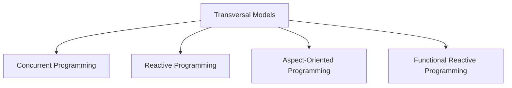

# Transversal Programming Models

Unlike the primary paradigms of [[imperative-programming|imperative]] and [[declarative-programming|declarative]] programming, which define the fundamental way code is structured, **transversal models** (or cross-cutting paradigms) address specific problems that span across an entire application. They are not mutually exclusive and can be combined with other paradigms like Object-Oriented or Functional Programming to solve complex challenges such as concurrency, data flow, or the [[cohesion-coupling|separation of concerns]].



## The Main Transversal Models

### 1. Concurrent Programming

Concurrent programming is a paradigm that deals with structuring a program to handle multiple, simultaneously progressing tasks. The primary goal is to improve throughput (by doing more work at the same time) and responsiveness (by not letting a long task block the entire application, such as a user interface).

It's important to distinguish concurrency from **parallelism**: 
- **Concurrency** is about *dealing* with many things at once (managing multiple tasks over a period).
- **Parallelism** is about *doing* many things at once (physically executing multiple tasks at the exact same instant, which requires multiple CPU cores).

#### Key Concepts
- **Processes and Threads:** Concurrency can be achieved with separate processes (which have their own isolated memory space, making them safer but heavier) or threads (which share memory, making them lightweight but introducing the complexity of shared data).
- **Synchronization:** To prevent data corruption when multiple threads access the same data, access must be controlled. This is done using synchronization primitives like **locks** (like a key to a single-occupancy restroom), **semaphores**, or **mutexes**.
- **Communication:** Concurrent tasks can communicate either by sharing memory (and using locks) or by [[message-driven|passing messages]] between each other. The latter approach, often formalized in the **Actor Model**, avoids many of the risks associated with shared state.

#### Common Challenges

- **Race Conditions:** Occur when the result of a computation depends on the non-deterministic scheduling of two or more threads. For example, if two threads try to increment the same counter at the same time, one of the increments might be lost.

  ```javascript
  // Shared state
  let counter = 0

  // Thread 1 runs:
  let value1 = read(counter) // value1 is 0
  // Thread 2 is scheduled here!
  let value2 = read(counter) // value2 is also 0!
  write(counter, value2 + 1) // counter becomes 1
  // Thread 1 resumes
  write(counter, value1 + 1) // counter becomes 1 again!
  // Expected result was 2, but one increment was lost.
  ```

- **Deadlocks:** A situation where two or more threads are blocked forever, each waiting for the other to release a resource.
- **Starvation:** A thread is perpetually denied necessary resources to process its work, often because other, "greedier" threads are monopolizing them.

### 2. Reactive Programming

Reactive Programming is a paradigm that provides a model for managing reactions to **[[event-driven|data streams]]** and the propagation of change. While the need for a system to be "reactive" is a transversal concern, this paradigm offers a specific, and generally [[declarative-programming|declarative]], approach to handle it.

An excellent analogy is a spreadsheet: when you change the value in one cell, all other cells that depend on it are automatically recalculated.

#### Key Concepts
- **Observable Streams:** Any source of data—user inputs, messages, API responses—is treated as an observable stream of events over time.
- **Observers:** Components that subscribe to an observable stream and execute a reaction for each new event.
- **Operators:** A rich set of functions (`map`, `filter`, `merge`, `scan`, etc.) used to combine, transform, and manage streams in a declarative way.

#### Declarative Core vs. Imperative Side-Effects

The confusion around Reactive Programming often stems from how it is used. The creation and composition of streams is declarative, but the final action can be imperative.

- **The Declarative Part:** You *declare* a processing pipeline by chaining operators. You describe *what* data you want, not *how* to process it step-by-step.
- **The Imperative Part:** The action executed when a value is received (the `subscribe` or `onNext` method) often contains imperative code that produces a **side effect**—like updating the UI, logging to a console, or writing to a database.

**Pseudo-code Example:**
```javascript
// Declarative part: Describing the data pipeline
const newValues = sourceStream
  .filter(value => value > 10) // Keep values greater than 10
  .map(value => value * 2);   // Double them

// Imperative part: The subscription performs a side effect
newValues.subscribe(processedValue => {
  // This is an imperative command: "Set the element's text!"
  document.getElementById('my-label').innerText = processedValue;
});
```
Because it combines a declarative data flow with potentially imperative actions, it is best classified as a transversal model rather than a purely declarative one.

#### Applicability
- **User Interfaces:** Handling user events like clicks and keyboard input.
- **Asynchronous Backend Services:** Managing complex chains of non-blocking API calls.
- **Real-time Data Processing:** Analyzing and reacting to live streams of data from sensors or financial markets.

#### **Resources & links**

1. **[Introduction to Reactive Programming](https://projectreactor.io/docs/core/release/reference/reactiveProgramming.html)**

    This guide from the Project Reactor documentation introduces **Reactive Programming** as an **asynchronous paradigm** for handling **data streams** and the **propagation of change**. It illustrates how libraries like Reactor simplify complex asynchronous code, such as **Callback Hell** or complicated `CompletableFuture` orchestration, using a declarative chain of operators like `flatMap` and `zipWith`.

2. **[Intro to Reactive Programming by Jordan Jozwiak of Google - CS50 Tech Talk](https://www.youtube.com/watch?v=KOjC3RhwKU4)**

    This CS50 Tech Talk by **Jordan Jozwiak of Google** provides an excellent introduction to **Reactive Programming** and the **ReactiveX (Rx)** specification. The video focuses on the three core principles: **data streams**, **functional programming**, and **asynchronous observers**, using **RxJava** examples to compare imperative versus reactive solutions for handling data and sensor updates.

### 3. Aspect-Oriented Programming (AOP)

Aspect-Oriented Programming is a paradigm designed to increase modularity by enabling the separation of **cross-cutting concerns**. A cross-cutting concern is a piece of functionality that is required in many different places throughout an application, such as logging, security, caching, or transaction management. AOP allows you to define this logic in one place (an "aspect") and apply it declaratively across your codebase, keeping your core business logic clean.

#### Key Concepts & Example
- **Aspect:** A module that encapsulates a cross-cutting concern. (e.g., a `LoggingAspect`).
- **Join Point:** A specific point during the execution of a program, such as a method call. In the example below, the execution of `myService.doWork()` is a join point.
- **Advice:** The action taken by an aspect at a join point. (e.g., `logBefore()`).
- **Pointcut:** An expression that defines *where* an advice should be applied. (e.g., `all public methods in the Service layer`).

**Pseudo-code Example:**
```java
// The Aspect: A module for our cross-cutting concern
aspect LoggingAspect {

  // The Advice and Pointcut
  // This says: "Before the execution of any public method in any class
  // ending with 'Service', run this block of code."
  before(execution of public * *.Service.*(..)) {
    log.info("Entering method: " + currentJoinPoint.methodName);
  }
}

// Business code remains clean, unaware of the aspect
class MyBusinessService {
  public void doWork() {
    // ... core business logic only ...
  }
}
```
When `myService.doWork()` is called, the AOP framework will automatically execute the logging advice before running the method, without `MyBusinessService` having any knowledge of it.

#### **Resources & links**

1. **[Aspect-Oriented Programming. Aspect who? 🤨](https://medium.com/@iamprovidence/aspect-oriented-programming-91bc43929dc8)**

    This article introduces **Aspect-Oriented Programming (AOP)** as a **programming paradigm** designed to **encapsulate and reuse cross-cutting concerns** such as **logging**, **security**, and **transaction management**. It defines the key **AOP** concepts (**aspect**, **advice**, **pointcut**, **weaving**) and explores implementation methods, including **Runtime Weaving** (Decorator, MediatR pipeline) and **Compile-Time Weaving**.

2. **[Spring Tutorial 24 - Introduction to AOP](http://www.youtube.com/watch?v=QdyLsX0nG30)**

    This video from **Java Brains** presents **AOP** within the context of the **Spring framework**. It explains how **AOP** solves the issue of **cross-cutting concerns** by separating them from **business objects**. The application of the **aspect** logic (e.g., **logging**) is managed by **Spring** via external **configuration**, allowing the **advice** to be executed on **target methods** without modifying the core **business logic** [00:08:48].

### 4. Functional Reactive Programming (FRP)

Functional Reactive Programming (FRP) is a **purely functional** approach to reactive programming. Its goal is to eliminate the side effects that are common in mainstream reactive libraries (like the imperative actions in the `subscribe` block shown above) and to model the entire system declaratively.

In a true FRP system, everything is a stream, including UI properties and events. You build a system by describing the relationships between these streams. Instead of imperatively updating a UI element inside a subscription, you would declaratively state that a UI element's property *is* a transformation of some other stream.

**Pseudo-code Example:**

```javascript
// Define a stream of mouse positions from mouse-move events
mouse_positions = stream_of(mouse.x, mouse.y)

// Declaratively define the circle's position as being equal to the mouse position stream.
// There is no .subscribe() block with imperative commands.
circle.position = mouse_positions

// The FRP framework understands this continuous binding and ensures the circle's
// position always reflects the latest value from the mouse_positions stream.
```

This makes FRP a stricter, purely [[declarative-programming|declarative]] paradigm. It is particularly powerful for continuous-time systems like animations, complex UI interactions, and robotics, where reasoning about state changes over time without side effects is a major benefit.

#### **Resources & links**

1. **[Functional Reactive Programming, first concepts must be looked into further.](https://medium.com/@tuyenbq/functional-reactive-programing-first-concepts-must-be-looked-into-further-c17db2cc51ac)**

    This article provides an introduction to **Functional Reactive Programming (FRP)**, defining it as the combination of **Functional Programming** (pure functions, immutable state) and **Reactive Programming** (automatic propagation of change, like a spreadsheet). It contrasts this **Declarative programming** style with **Imperative programming** and introduces the core concept of a **signal**—an observable **data stream** that sends values over time, which can be easily transformed using operators like **map**.

2. **[Spring Tutorial 24 - Introduction to AOP](http://www.youtube.com/watch?v=QdyLsX0nG30)**

    This video from **Java Brains** presents **Aspect-Oriented Programming (AOP)** within the context of the **Spring framework**. It explains how **AOP** solves the issue of **cross-cutting concerns** by separating them from **business objects**. The application of the **aspect** logic (e.g., **logging**) is managed by **Spring** via external **configuration**, allowing the **advice** to be executed on **target methods** without modifying the core **business logic** [00:08:48].