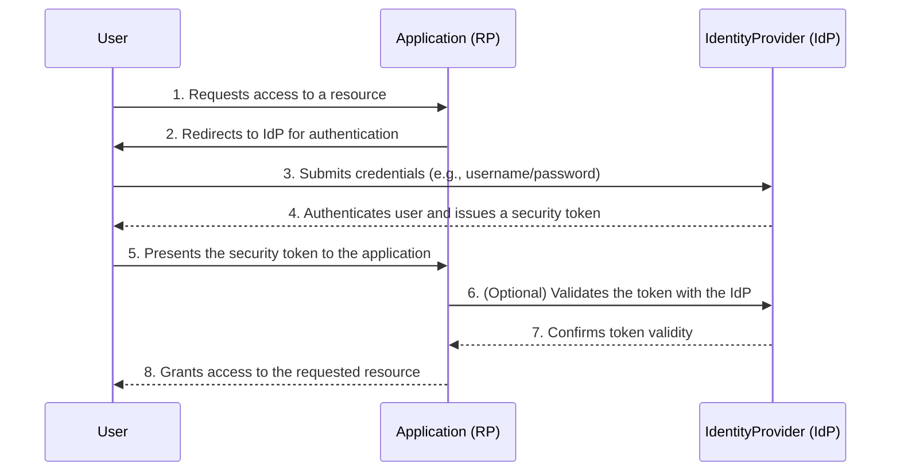

# Federated Identity Pattern

The **Federated Identity** pattern is a security design pattern that delegates authentication from a single application to a trusted, external Identity Provider (IdP). Instead of creating and managing its own user accounts, the application (known as a Relying Party) outsources the user verification process. This simplifies development, centralizes user management, and improves the user experience by enabling Single Sign-On (SSO) across multiple applications.

The core principle is to establish a trust relationship between the application and the IdP. When a user wants to log in, the application redirects them to the IdP. The user authenticates with the IdP, which then provides the application with a security token containing the user's identity information.

## How it Works

The authentication flow involves three main actors: the user (principal), the application (Relying Party or RP), and the Identity Provider (IdP).

*Description: The diagram illustrates the federated authentication flow. The application offloads the login process to a trusted Identity Provider, which validates the user's credentials and returns a security token that the application can trust.*

## Key Concepts and Components

*   **Principal (User)**: The user attempting to access the application.
*   **Relying Party (RP)**: The application or service that requires authentication. It trusts the IdP to verify the user's identity.
*   **Identity Provider (IdP)**: The service responsible for managing user identities, authenticating users, and issuing security tokens. Examples include Azure Active Directory, Google Identity, Okta, or Auth0.
*   **Security Token**: A piece of data, typically signed and/or encrypted, that asserts the user's identity and may contain additional attributes (claims). Common token formats are SAML assertions and [[jwt|JSON Web Tokens (JWT)]].
*   **Trust Relationship**: A pre-configured agreement between the RP and the IdP. The RP trusts tokens issued by the IdP, and the IdP is configured to issue tokens for that specific RP.

## Common Protocols

Federated identity is implemented using standard protocols that define how the RP and IdP communicate.

*   **SAML (Security Assertion Markup Language)**: An XML-based open standard for exchanging authentication and authorization data. It is widely used in enterprise environments for Single Sign-On (SSO).
*   **OAuth**: An open standard for access delegation, commonly used to grant websites or applications access to their information on other websites but without giving them the passwords. It is not an authentication protocol itself but is often used in conjunction with one.
*   **OpenID Connect (OIDC)**: A simple identity layer built on top of the OAuth 2.0 protocol. It allows clients to verify the identity of the end-user based on the authentication performed by an Authorization Server, as well as to obtain basic profile information about the end-user in an interoperable and REST-like manner.

## Issues and Considerations

*   **Trust and Security**: The entire model relies on the security of the Identity Provider. If the IdP is compromised, all relying applications are at risk. The communication channel between the RP and IdP must be secured (e.g., using TLS).
*   **Token Validation**: The RP must rigorously validate every incoming token to ensure it was issued by the correct IdP, has not been tampered with, and has not expired. This includes checking the signature, issuer, audience, and expiration time.
*   **Complexity**: Setting up the trust relationship and handling the different protocol flows can be complex. Developers must be familiar with the chosen protocol and its security implications.
*   **Single Point of Failure**: If the IdP becomes unavailable, users will be unable to log in to any of the relying applications. High availability for the IdP is critical.
*   **User Privacy**: The IdP has access to information about which applications the user is accessing. Both the IdP and RP must handle user data in accordance with privacy regulations.
*   **Session Management**: The application is still responsible for managing the user's session after the initial authentication. Logging out can be complex (e.g., Single Log-Out), as it may require invalidating the session at the RP, the IdP, and potentially other RPs.

## Use Cases

*   **Single Sign-On (SSO)**: Allowing users to log in once and access multiple independent applications without re-authenticating. This is the most common use case.
*   **Social Logins**: Enabling users to sign in to an application using their existing accounts from social media platforms like Google, Facebook, or Twitter.
*   **Enterprise Federation**: In a corporate environment, allowing employees to use their primary company credentials to access third-party SaaS applications (e.g., Salesforce, Slack).
*   **Multi-tenant Applications**: In a SaaS application serving multiple organizations, each tenant can federate with its own IdP.

## Related Patterns

*   **[[api-gateway|API Gateway]]**: An API gateway can act as the Relying Party, enforcing authentication for downstream services by validating tokens before forwarding requests.
*   **[[valet-key|Valet Key Pattern]]**: This pattern can be used to provide clients with a temporary, limited-permission token to access a specific resource, often after being authenticated via a federated identity flow.

## Resources & links

### Articles

1.  **[Federated Identity pattern - Microsoft Azure](https://learn.microsoft.com/en-us/azure/architecture/patterns/federated-identity)**

    The official documentation from Microsoft's Azure Architecture Center. It provides a comprehensive overview of the pattern, detailing the problem it solves, the solution, and key considerations for implementation. It covers the core concepts of delegating authentication to an external IdP and how it simplifies user management.

2.  **[Design Patterns for Cloud: Federated Identity Pattern - Medium](https://kasunkodagoda.medium.com/design-patterns-for-cloud-federated-identity-pattern-a8e0b2a24dcb)**

    This article provides a clear explanation of the Federated Identity pattern in the context of cloud environments. It explains how the pattern works by separating the application from the identity provider, thereby improving security and user experience through Single Sign-On (SSO). The author discusses the benefits, such as reduced administrative overhead, and the importance of the trust relationship between the service provider and the identity provider.
