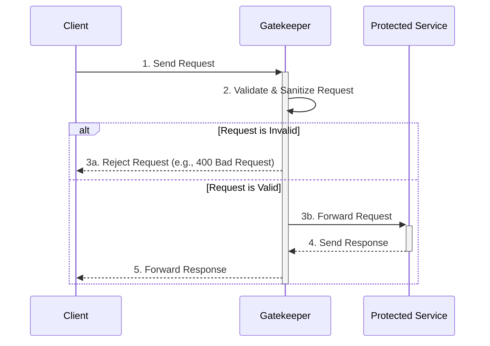

# Gatekeeper Pattern

The **Gatekeeper** pattern is a specialized implementation of the [[posa#Proxy|Proxy]] pattern where a dedicated, hardened component acts as a single entry point to protect a backend application or service. This component, the Gatekeeper, intercepts all incoming requests, performs validation and sanitization, and then forwards valid requests to the protected service. It functions as a security broker, providing an additional layer of defense and reducing the system's attack surface.

The primary goal is to isolate sensitive services from direct client access. By channeling all traffic through the Gatekeeper, security policies can be enforced consistently, and potentially malicious requests can be filtered out before they reach the core application.

## How it Works

The Gatekeeper is placed between the client and the protected service. It can be deployed as a reverse proxy, an [[api-gateway|API Gateway]], or even a [[sidecar|Sidecar]] in a [[microservices]] architecture. All inbound traffic is directed to the Gatekeeper, which is the only component publicly exposed.

*Description: This sequence diagram shows the Gatekeeper intercepting a client request. It first validates and sanitizes the request. If the request is invalid, it is rejected immediately. If valid, the Gatekeeper forwards it to the protected service, which processes it and returns a response through the Gatekeeper.*

## Key Responsibilities of a Gatekeeper

A Gatekeeper is more than just a simple [[posa#Proxy|proxy]]. Its responsibilities are focused on security enforcement:

*   **Request Validation & Sanitization**: It inspects incoming requests for malformed data, unexpected values, or signs of an attack (e.g., SQL injection, cross-site scripting). It ensures that only well-formed requests are passed on.
*   **Authentication & Authorization**: It can take on the role of authenticating the client, often by validating tokens or credentials. This offloads the security burden from the backend service. It may integrate with a [[federated-identity|Federated Identity]] provider.
*   **[[rate-limiting|Rate Limiting]] & [[throttling|Throttling]]**: It protects the backend service from denial-of-service (DoS) attacks or excessive load by limiting the number of requests a client can make in a given time period.
*   **[[communication-protocol|Protocol]] Translation**: It can accept requests in one protocol (e.g., HTTP/2) and forward them to the backend service using another (e.g., HTTP/1.1).
*   **Centralized [[monitoring|Logging & Auditing]]**: It provides a single point to log all incoming requests, including those that are blocked, which is invaluable for security auditing and threat detection.

## Gatekeeper vs. API Gateway vs. Facade

While these patterns have overlapping functionalities, their primary intent differs:

| Pattern | Primary Focus |
| :--- | :--- |
| **Gatekeeper** | **Security**. Its main purpose is to protect the backend service by validating and sanitizing requests. |
| API Gateway | **Management & Routing**. Its focus is on routing, composition, and managing APIs (e.g., versioning, monetization). It often includes security features, but protection is a secondary concern to management. |
| **Proxy** | **Intermediation & Control**. Its goal is to provide a surrogate or placeholder for another object to control access to it, add functionality, or simplify its use. |
| Facade | **Simplification**. Its goal is to provide a simplified, high-level interface over a complex subsystem, without a primary focus on security. |

A Gatekeeper is a specialized role. An API Gateway can *act* as a Gatekeeper if it is configured with a strong security focus.

## Issues and Considerations

*   **Single Point of Failure**: Like any centralized component, the Gatekeeper can become a single point of failure. It must be designed for high availability and resiliency.
*   **Performance Bottleneck**: Since all traffic passes through the Gatekeeper, it can become a performance bottleneck if not scaled correctly. Its validation logic must be highly efficient.
*   **Complexity**: Introducing a Gatekeeper adds another component to the architecture that needs to be deployed, managed, and monitored.
*   **Security Risk**: If the Gatekeeper itself is compromised, the entire system is at risk. It must be a hardened and minimal component to reduce its own attack surface.

## Use Cases

*   **Protecting Legacy Applications**: Placing a Gatekeeper in front of a legacy system that is difficult to modify can add a modern security layer without changing the application's code.
*   **[[microservices|Microservices]] Security**: In a microservices architecture, a Gatekeeper (often in the form of an [[api-gateway|API Gateway]] or a [[sidecar|Sidecar]] proxy) can provide a consistent security enforcement point for all services.
*   **Web Application Firewalls (WAF)**: A WAF is a concrete implementation of the Gatekeeper pattern, specifically designed to protect web applications from common vulnerabilities.

## Related Patterns

*   **[[api-gateway|API Gateway]]**: An API Gateway often implements the Gatekeeper pattern as one of its core responsibilities.
*   **[[sidecar|Sidecar]]**: In a service mesh, the sidecar proxy attached to each service instance acts as a distributed Gatekeeper, handling security for inter-service communication.
*   **[[valet-key|Valet Key Pattern]]**: The Gatekeeper can be the component that authenticates a client and then issues a Valet Key for direct, limited access to a specific resource.

---

## Resources & links

### Articles

1.  **[Gatekeeper pattern - Microsoft Azure](https://learn.microsoft.com/en-us/azure/architecture/patterns/gatekeeper)**

    The official documentation from Microsoft's Azure Architecture Center. It provides a thorough explanation of how to use a dedicated host to validate and sanitize requests, thereby limiting the attack surface and protecting backend services. The article covers implementation details, security considerations, and high-availability design.

2.  **[Cloud Design Patterns, Part 2: The Gatekeeper Security Pattern - DZone](https://dzone.com/articles/cloud-design-patterns-part-2-the-gatekeeper-securi)**

    This article presents the Gatekeeper pattern as a crucial element for securing cloud applications. It emphasizes decoupling the public endpoint from the core services and offloading security validation to a dedicated component. The author discusses the benefits of this approach, such as improved security and isolation, and provides practical advice on implementation.