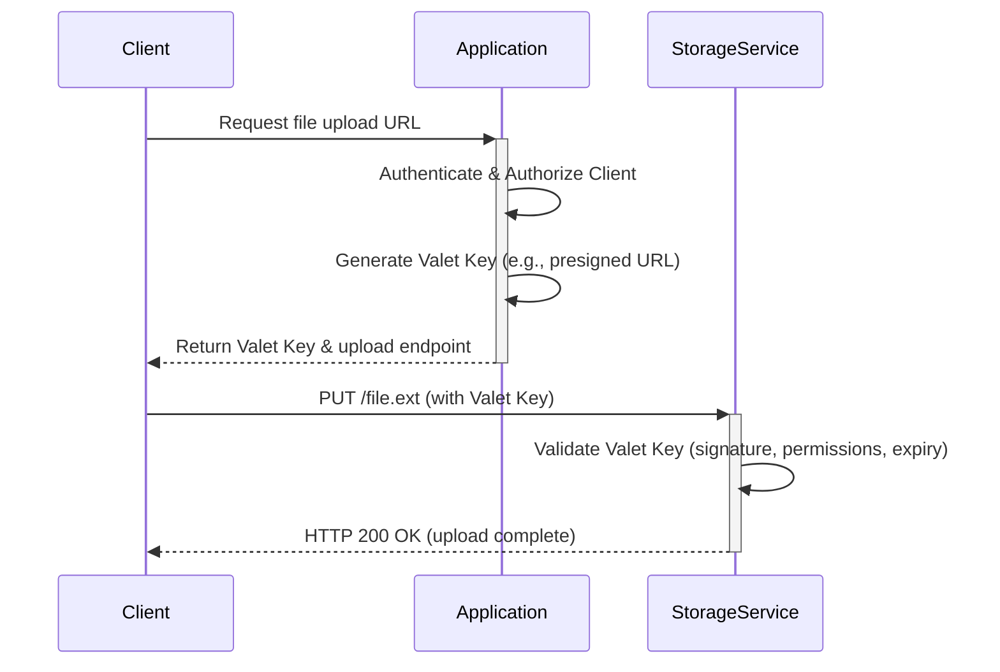

The **Valet Key** pattern involves providing a client with a temporary, restricted-access token (a "key") that grants direct access to a specific resource. This approach allows the application to offload data transfer operations to the underlying storage or messaging service, enhancing performance, scalability, and cost-efficiency.

The application acts as the "valet," authenticating the client and issuing a key with fine-grained permissions (e.g., read-only, write-only), a specific scope (e.g., a single file), and a limited lifetime.

## How It Works

The interaction flow typically involves three parties: the client, the application (acting as a token service), and the resource provider (e.g., cloud storage).

1.  **Client Request**: The client requests access to a resource from the application (e.g., "I need to upload `profile.jpg`").
2.  **Authentication & Authorization**: The application authenticates the client and verifies that it has the necessary permissions for the requested operation.
3.  **Token Generation**: The application generates a short-lived token (the valet key) with specific constraints (e.g., permission to upload a file named `profile.jpg` to a specific bucket within the next 5 minutes).
4.  **Token Issuance**: The application returns the valet key and the resource URI to the client.
5.  **Direct Access**: The client uses the token to interact directly with the resource provider, which validates the token and permits the operation. The application server is no longer in the data path.

### Sequence Diagram

This diagram illustrates the process of a client obtaining a key to upload a file directly to a storage service.

## Use Cases

This pattern is highly effective in scenarios involving:

-   **Large File Uploads/Downloads**: Offloading the transfer of large media files (videos, images, backups) from the application server to a [[static-content-hosting|storage service]].
-   **Browser-Based Clients**: Allowing a web browser to directly and securely fetch or push data to cloud storage, reducing server load.
-   **Constrained Application Resources**: In environments where application servers have limited network bandwidth or compute capacity, such as IoT devices or small virtual machines.
-   **Queue-Based Operations**: Granting a component temporary access to send or receive messages from a specific [[message-queue]].

## Benefits

The Valet Key pattern acts as an **enabler**, unlocking the core benefits of patterns like [[static-content-hosting]] for private or user-specific data. Without it, an application would be forced to proxy data, negating those advantages.

-   **Enables Performance & Scalability**: By removing the application server from the data transfer path, the pattern offloads all CPU, memory, and I/O load associated with the transfer to the storage service. This frees the application to handle more business-critical requests and allows the data transfer portion to scale massively using the cloud provider's infrastructure.
-   **Unlocks Cost-Effectiveness**: It directly reduces operational costs by eliminating the need to pay for data transfer bandwidth and compute time on the application server (which would be required for proxying). The cost shifts to the cloud storage provider's bandwidth, which is typically more economical.
-   **Enhanced Security**: While enabling direct access, the pattern maintains strong security. The application retains full control over authentication and authorization, issuing keys that are narrowly scoped (e.g., a specific file) and short-lived (e.g., valid for 5 minutes), which minimizes the risk of a compromised key.

## Considerations and Trade-offs

-   **Token Management**: The application must have a secure and robust mechanism for generating, issuing, and managing tokens, often involving [[hashing-algorithms|hashing algorithms]] for [[data-integrity|integrity]] and security.
-   **Security Policy**: The permissions granted by the key must be as restrictive as possible (Principle of Least Privilege). A read-only key should be issued if the client only needs to download a file.
-   **Validation**: The application may need to perform post-operation validation. For example, after a file upload, the application might run a virus scan or check metadata. This often requires a notification mechanism from the storage service (e.g., webhooks, queue messages).
-   **Clock Skew**: The expiration of tokens is time-sensitive. Clock differences between the token-issuing service and the resource provider can lead to premature or delayed invalidation.
-   **Client-Side Complexity**: The client must be capable of handling the two-step process: first obtaining the key, then using it for the data transfer.

## Related Patterns

-   **[[static-content-hosting]]**: The Valet Key pattern is the mechanism that often enables secure and efficient static content hosting.
-   **[[cdn]]**: A valet key can grant access to a resource that is served through a Content Delivery Network.
-   **[[gateway-patterns|Gateway]]**: An [[api-gateway]] can act as the "valet," generating and returning keys to clients.
-   **[[federated-identity]]**: Can be used as the authentication mechanism before the application issues the valet key.

---

## Resources & Links

### Articles

1.  **[Valet Key pattern - Azure Architecture Center | Microsoft Learn](https://learn.microsoft.com/en-us/azure/architecture/patterns/valet-key)**
    The official Microsoft documentation for the pattern. It provides a detailed explanation of the problem, the solution, and key considerations when implementing it in a cloud environment.

2.  **[Valet Key Design Pattern for Direct Data Access | by David Mosyan | Medium](https://medium.com/@dmosyan/valet-ket-design-pattern-for-direct-data-access-cc0a6c523a2b)**
    A clear, concise article explaining the pattern's goal of reducing server load by providing clients with temporary, direct access to data storage.

### Videos

1.  **[3 Security Patterns | System Design Interview | Federated Identity, Gatekeeper, Valet Key - YouTube](https://www.youtube.com/watch?v=VtG05JdHyMM)**
    This video explains the Valet Key pattern in the context of a system design interview, comparing it with two other important security patterns: Federated Identity and Gatekeeper.
