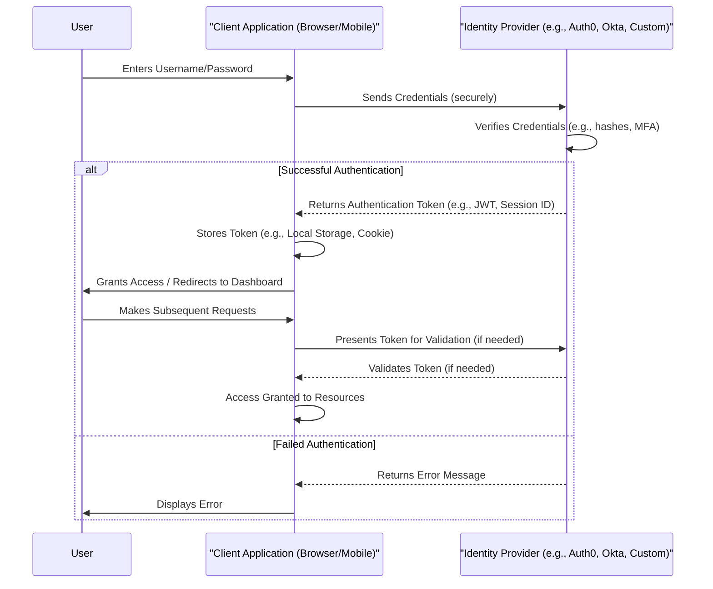

--- 
title: Authentication
tags:
  - security
  - authentication
  - authorization
  - identity-management
  - access-control
date: 2025-11-01
---

# Authentication: Verifying Digital Identities

Authentication is the fundamental process of verifying the identity of a user, system, or entity. It confirms that someone or something is, in fact, who or what it claims to be. This critical security measure acts as the first line of defense, ensuring that only legitimate and verified entities can proceed to access resources or perform actions within a system. It is distinct from authorization, which determines *what* an authenticated entity is permitted to do.

## Key Concepts in Authentication

Understanding the core terminology is essential for designing robust authentication systems:

*   **Identity:** A unique representation of a user, application, or device within a system. This could be a username, an email address, a client ID, or a device ID.
*   **Credentials:** The secret or verifiable information used to prove an identity. Common credentials include passwords, PINs, biometric data (fingerprints, facial scans), digital certificates, or cryptographic keys.

*   **Factors of Authentication:** These categorize the different types of evidence used to verify an identity, enhancing security when combined:
    *   **Something you know:** (e.g., password, PIN, secret question answer)
    *   **Something you have:** (e.g., physical token, smart card, mobile phone with an authenticator app)
    *   **Something you are:** (e.g., fingerprint, facial recognition, voice print)
*   **Multi-Factor Authentication (MFA):** A security enhancement that requires a user to provide two or more distinct factors of authentication from different categories to verify their identity. This significantly increases security by making it much harder for an unauthorized person to gain access, even if one factor is compromised.
*   **Single Sign-On (SSO):** An authentication scheme that allows a user to log in with a single set of credentials to gain access to multiple related but independent software systems. SSO improves user experience and reduces password fatigue, while centralizing identity management.

## Typical Authentication Flow

A common web application authentication flow involves a user providing credentials to an application, which then verifies them with an identity provider.

*Description: This sequence diagram illustrates a typical authentication flow where a user provides credentials to a client application, which then communicates with an Identity Provider to verify the user's identity and issue an authentication token for subsequent access.*

## Common Authentication Strategies

The choice of authentication strategy is pivotal and depends on various factors, including the application's security requirements, user experience goals, scalability needs, and the type of system being secured.

### Basic HTTP Authentication

A simple authentication scheme built into the HTTP protocol.
*   **Mechanism:** The client sends a username and password in the `Authorization` header with each request. The credentials are combined as `username:password` and then Base64-encoded.
*   **Considerations:** It is not secure over plain HTTP as the credentials can be easily decoded. It should only ever be used over a secure (HTTPS) connection. It is stateless but requires sending credentials with every request.

### Cookie-Based Authentication (Session-Based)

A stateful authentication method traditionally used by web browsers.
*   **Mechanism:** After a user logs in, the server creates a session, stores the session ID in a database, and sends the session ID back to the client in a cookie. The browser automatically includes this cookie in all subsequent requests to the same domain. The server then validates the session ID against its session store.
*   **Considerations:** Stateful by nature, which can be a challenge for horizontal scaling. It is vulnerable to Cross-Site Request Forgery (CSRF) attacks, requiring mitigation strategies (e.g., anti-CSRF tokens).

### Password-Based Authentication

The most traditional and widely adopted method, where users provide a username and a secret password.
*   **Mechanism:** The system compares the provided password (after [[hashing-algorithms|hashing]] and salting) with a securely stored hash of the user's actual password.
*   **Considerations:** Requires robust password policies (complexity, length), secure storage (never plain text), and protection against common attacks like brute-force and credential stuffing. [[hashing-algorithms|Password hashing functions]] like Bcrypt, Scrypt, or Argon2 are crucial here.

### Token-Based Authentication

A modern and scalable approach, particularly suited for distributed systems and APIs.
*   **Mechanism:** After initial authentication (e.g., with a username/password), the server issues a cryptographic token (e.g., a [[jwt|JSON Web Token - JWT]]) to the client. The client then includes this token with subsequent requests to prove its identity without re-sending credentials. Tokens are often stateless on the server side, improving scalability.
*   **Examples:** [[jwt|JSON Web Tokens (JWT)]], session tokens.

### API Key Authentication

A simpler form of authentication, typically used for identifying calling applications rather than end-users.
*   **Mechanism:** A unique, secret key is provided with each request to identify the client application.
*   **Considerations:** Less secure for user authentication due to lack of user-specific context and often static nature. More suitable for service-to-service communication, rate limiting, or identifying public API consumers.

### OAuth (Open Authorization) and OpenID Connect (OIDC)

These are often used together but serve distinct purposes.
*   **OAuth:** An open standard for **authorization** (access delegation). It allows a user to grant a third-party application limited access to their resources on another service (e.g., allowing an app to access your Google Photos without giving it your Google password).
*   **OpenID Connect (OIDC):** An identity layer built on top of the OAuth 2.0 protocol. OIDC enables clients to verify the identity of the end-user based on the authentication performed by an Authorization Server, as well as to obtain basic profile information about the end-user. It is primarily for **authentication**.

### Certificate-Based Authentication

Leverages [[pki|Public Key Infrastructure]] for strong, mutual authentication.
*   **Mechanism:** Both the client and server present digital certificates to each other, issued by a trusted Certificate Authority (CA). These certificates contain public keys and identity information, allowing cryptographic verification of each party's identity.
*   **Use Cases:** Often used in enterprise environments, machine-to-machine communication, VPNs, and for securing web servers (TLS/SSL).

### Biometric Authentication

Utilizes unique biological characteristics for identity verification.
*   **Mechanism:** Users authenticate using physical attributes like fingerprints, facial recognition, iris scans, or voice prints.
*   **Considerations:** Offers convenience and can be highly secure, but raises privacy concerns and challenges related to storage and revocation of biometric templates.

## Related Concepts

*   [[authorization|Authorization]]: The crucial next step after authentication, determining access rights.
*   [[hashing-algorithms|Hashing Algorithms]]: Essential for secure password storage.
*   [[pki|Public Key Infrastructure (PKI)]]: Forms the basis for certificate-based authentication.
*   [[owasp|OWASP]]: Addresses authentication failures as a critical web application security risk.
*   [[identity-management|Identity Management]]: The broader discipline encompassing authentication, authorization, and user provisioning.

---

## Resources & Links

### Articles

1.  **[What is Authentication? Definition and uses - Auth0](https://auth0.com/intro-to-iam/what-is-authentication)**
    This article defines authentication as the process of verifying a user's identity, primarily through credentials such as usernames and passwords. It categorizes authentication factors into "something you know," "something you have," and "something you are," and discusses the progression from single-factor to multi-factor and passwordless authentication, emphasizing security best practices.

2.  **[The Authentication Strategies - Medium](https://medium.com/@vitorbritto/the-authentication-strategies-71b6cf796c54)**
    This article delves into various authentication strategies, including Basic, Session-Based, Token-Based (specifically [[jwt|JSON Web Tokens or JWT]]), OAuth, and Single Sign-On (SSO). For each strategy, it outlines its operational mechanism, typical use cases, and the respective benefits and drawbacks, offering a broad perspective on contemporary authentication approaches.